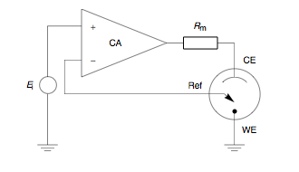
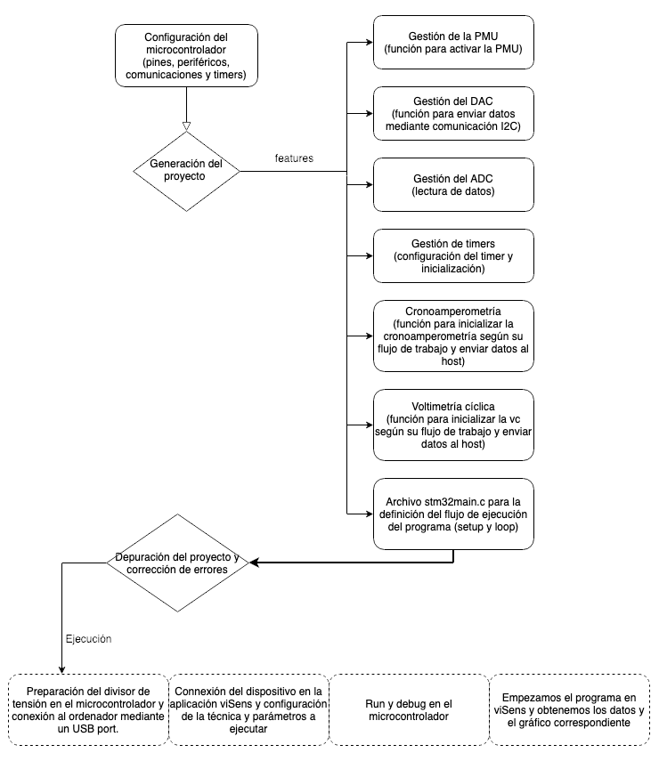
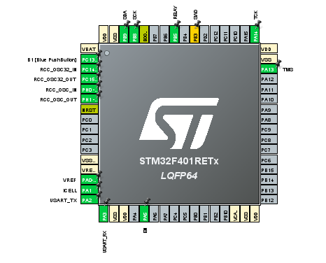
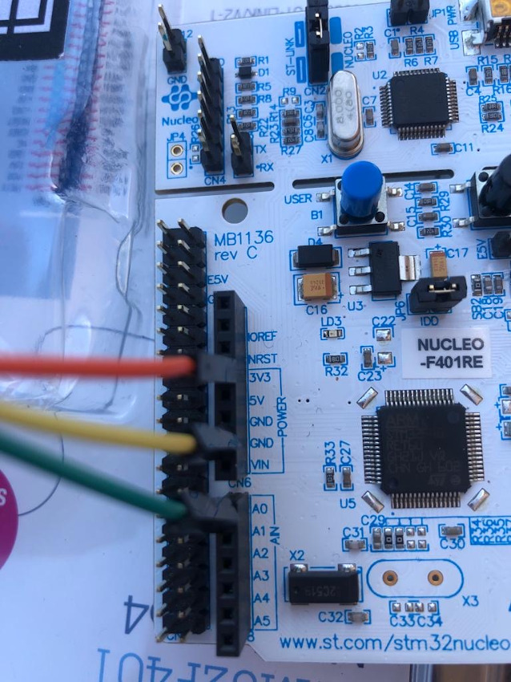

> The MASB-POT-S project is designed to perform electrochemical measurements in a cell and analyze analyte properties. It is a project carried out with a STM32 EVB microcontroller and using the STM32cubeIDE platform. This article contains the definition of the project as well as the results obtained and clarifications necessary to understand it.

**Table of Contents**

- [Introduction](#INTRODUCTION)

- [Flowchart](#FLOW-DIAGRAM)

- [Results](#RESULTS-OBTAINED)

- [Conclusions](#CONCLUSIONS)

### INTRODUCTION

---

This project aims to program a potentiostat for the realization of chronoamperometry and cyclic voltammetry of an electrochemical cell. To do this, the STM32CubeIde program has been used to configure the microcontroller and program the necessary instructions to carry out the measurements.

The microcontroller must communicate with the potentiostat and the computer to receive and send the voltage and current values, and then they must be represented in a graph using an application that can be connected to the STM32CubeIde platform (viSens-S). In this way, we can see the results of cyclic voltmeter or chronoamperometry.

A three electrode **electrochemical cell** contains the working electrode (WE) that applies the desired potential to the cell, the reference electrode (RE) that acts as a reference in the measurement since it has a known potential to measure the WE potential and a last electrode called an auxiliary electrode (AE) which is used to balance the reaction in the WE.

The **potentiostat** allows to control the three electrodes of the electrochemical cell by controlling the potential difference in one of them, in two or in all three. Below we can see the diagram of a potentiostat which can control the potential difference in one, two or more working electrodes, with the help of a reference electrode and an auxiliary electrode. For more information on the operation of the potentiostats, you can consult the following [link](https://quimica.laguia2000.com/conceptos-basicos/potenciostato).

Although due to the circumstances experienced in recent months with the Covid-19 it has not been possible, the approach was to use a sample of potassium ferricinide at different concentrations and a potassium chloride buffer.

The two measurements that are performed, cyclic voltammetry and chronoamperometry, are very important techniques in electrochemistry to study electrocatalytic reactions or properties.

**Cyclic Voltammetry** is based on making a triangular sweep of potential. To perform it, a potential difference is applied between the working electrode (WE) and the reference electrode (RE) of the electrochemical cell. The applied potential changes until reaching the desired one and once it arrives it changes direction while measuring the current provided by the cell. The number of times the triangular potential sweep is performed is determined by the desired number of cycles. This technique provides information on the chemical and physical behavior of the system. For more information, see the following [link](<https://chem.libretexts.org/Bookshelves/Analytical_Chemistry/Supplemental_Modules_(Analytical_Chemistry)/Instrumental_Analysis/Cyclic_Voltammetry>).

**Chronoamperometry** consists of applying a step signal to the WE potential and measure the current passing through the cell as a function of time. It allows us to quantify the concentration of the analyte from its activity. It is a much simpler process in which only a harmless initial potential is set and extended until the reaction occurs. For more information, you can consult [here](https://es.scribd.com/document/264324581/CRONOAMPEROMETRIA).

On a technical level, the git infrastructure has been used to execute the work. Git has helped us to work in parallel creating specific branches for each `feature/functionality` and controlling the project settings from the ` develop` branch. Git has allowed us to avoid compilation errors when working with different members at the same time. It is worth mentioning that in case of modifying the project configuration after the creation of a branch, a `git rebase` must be carried out so that the configuration is applied to the branch. Once the functionalities are finished, through the GitHub `merge` functions the whole project has been brought together to be evaluated and uploaded to the` master` branch in good condition.

### FLOWCHART

---

The execution of the project can be summarized in the following flow chart:

The different functionalities have been developed in individual branches to be later united in the project. The project is developed in STM32cubeIDE and therefore the functions of the [HAL library](https://www.st.com/resource/en/user_manual/dm00105879-description-of-stm32f4-hal-and-ll -drivers-stmicroelectronics.pdf) have been used .

The configuration of the microcontroller can be seen in the following figure where we see all the connections that are necessary to carry out the project.

The main components of the project are described below:

1. PMU

The Power Management Unit (PMU) is located in the front-end module of the potentiostat and its function is to supply the entire front-end of the potentiostat. To communicate with it, the PA5 pin of the microcontroller, which has been called EN, has been configured as a GPIO_INPUT digital output. This pin enables (1) and disables the PMU (0) using the GPIO_WritePin function. As by default this is disabled to prevent the front end from consuming current, a function has been programmed that will take the EN pin to high when the program is started, enabling the PMU.

> It is also worth noting the use of the Relay that allows us to control the communication between the front-end and the sensor; when the relay is open communication is available, if it is closed no. We control it using a GPIO pin of the microcontroller controlled as the PMU via `WritePin`.

2. Timers

The timers of the microcontroller allow us to repeat an action with a certain frequency or after a period of time. In this case, timer 2 of the microcontroller has been implemented to control the measurements of the cyclic voltammetry and the croamperometry.

The function that has been implemented allows changing the timer period and therefore the frequency between samples based on the parameters indicated for each measurement.

3. ADC

The ADC of the microcontroller allows us to read the data of the cell through an input of the microcontroller. It allows us to pass the analog measurements of both voltage and current made by the potentiostat in the electrochemical cell to digital data. The signals are converted to unipolar signals to be read. To read the current we use a transimpedance amplifier with a resistance of 10kOhm.

> ADC communication is asynchronous configured with a 115200 8 bit boud rate, no parity, and a stop bit using a microcontroller USART.

4. DAC

Our project has a configured DAC that is responsible for writing the desired potential in the electrochemical cell. The DAC converts the signal that is digital to analog to be able to be written in the cell. The DAC plays a very important role because it allows us to interact with the cell and define the initial potential that allows us to start the processes. The communication of the DAC used, [MCP4725](https://pdf1.alldatasheet.com/datasheet-pdf/view/233449/MICROCHIP/MCP4725.html), is done through I2C, that is, through the synchronous communication of the microcontroller. The DAC has a converter stage that creates a bipolar signal and gives us the range of positive and negative voltages that we can use.

5. Cyclic Voltammetry

In our case, the microcontroller measures the voltage of the electrochemical cell using the ADC and then adds / subtracts parameters to it until it reaches or exceeds a certain potential. This last process is repeated three times in each cycle since first a voltage called eBegin is set to the cell, then increments and decrements are applied until reaching eVertex1, eVertex2 and finally returning to eBegin. The period between the samples of the cell that the ADC reads is determined by two parameters (Ts = eStep / scanRate).

To get the program to run when this time has passed, the configured timer of the microcontroller with its corresponding callback has been used.

6. Chronoamperometry

In chronoamperometry we set the cell voltage that we want using the DAC, we leave the time necessary for the sample using the timer and we read the cell data for voltage and current using the ADC. Samples are taken until the sampling time ends.

> All data sending is done using the COBS communication protocol. This allows us to read the data in a clear and error-free way using `0x00` as the term chart. What we do using the protocol is to convert our data series into another encoded one in which all the `0x00` (term chart) are first removed and the number of packets between` 0x00` and `0x00` and the content of them are written . In our project we have a function that decodes messages and another that encodes them and allows us to work with the protocol.

### RESULTS OBTAINED

---

As mentioned, due to the situation in which we encountered the COVID-19 pandemic, we have not had access to the laboratory and we have not been able to test our code with a potentiometer and an electrochemical cell.

In this case, to check the operation of the code, the viSens-S program has been used, which allows us to carry out the two measurements with the data that it receives from the microcontroller, both the cyclic voltammetry and the chronoamperometry and obtain the data obtained both in graph and in table format.

By having a potentiostat that was provided to us before we found ourselves in this situation, we have been able to adapt it to make a voltage divider and connect it to the analog inputs of the microcontroller as seen in the image below:

The final result is not as expected since we have not been able to connect to the viSense application for reasons that we have not been able to resolve. The code compiles without errors but it doesn't seem to send data to the application.

### CONCLUSIONS

---

In this course we have learned how to work with a microcontroller from turning an LED on and off to carrying out a project to make electrochemical measurements. The theoretical part has also been worked to understand the importance of microcontrollers and the presence they have in any device we think of. Interruptions, timers, signal converters, synchronous and asynchronous communications, etc. have been understood. Using Arduino at the beginning of the course has helped us understand how the instructions that the microcontroller receives are structured. Arduino does not have specific libraries for microcontrollers and the codes are simpler. For this reason, the STM32cubeIDE platform and the entire HAL library have been used to carry out the projects. The evolution of the course has allowed us to develop this project.

Apart from all the instructions and tasks of the microcontroller we have also introduced ourselves to the use of git. Git is a very good tool for doing work and above all, for doing group work. It allows us to upload files as versions that are stored in the repository and can be rescued later. We can see what the other team members are doing and ask them to review our files. GitHub is the interface with the remote repository where, apart from uploading the files, we can also see them and join them with others. In short, it is a tool that we will probably use other times because it has shown us a different way of working in a team that is quite efficient.

Although it has not been possible to work with some real components due to the lack of mobility to go to the laboratory, this project has served to stimulate us and seek alternative resources to understand the components, as well as to better understand the datasheet of some such as the DAC. external to the microcontroller.

The project has been difficult for us in some parts, especially when it comes to reproducing the workflows of cyclic voltammetry and chronoamperometry and introducing timers in them.

To finish, the assessment of the subject that we do is very positive since we have been able to introduce ourselves a little to a part of the more computerized and programming electronics that we were totally unaware of.
