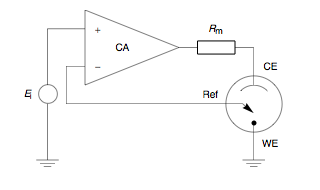
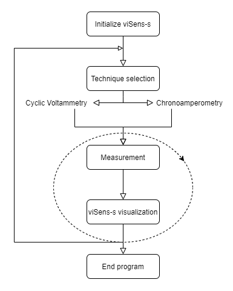
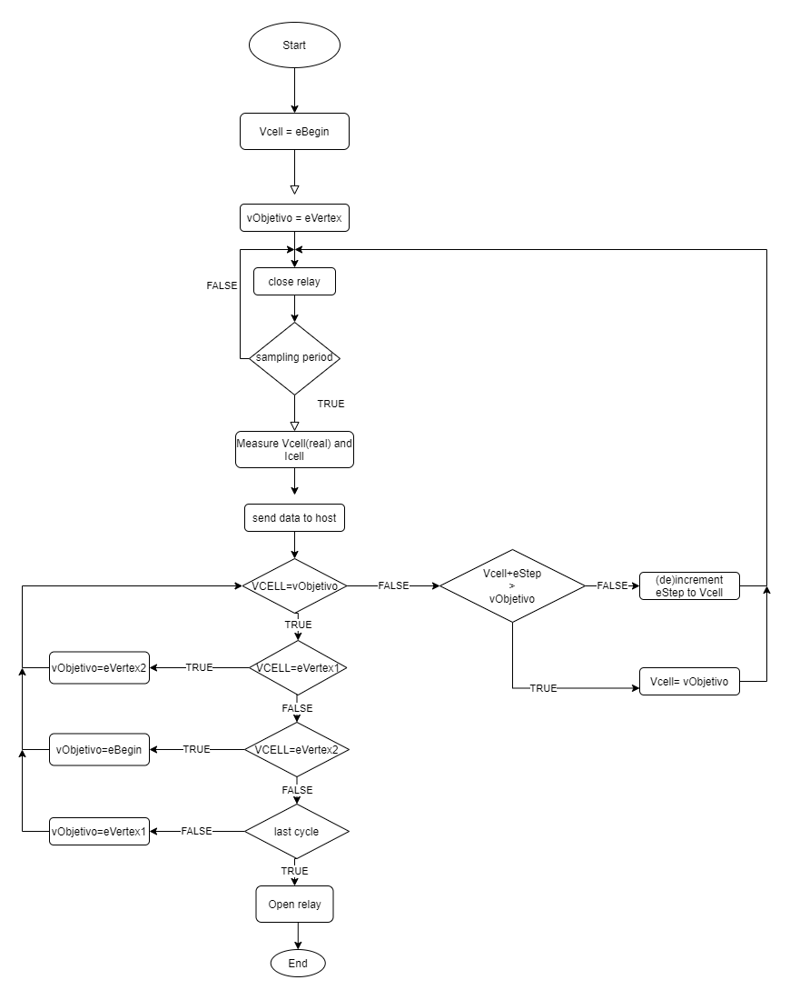
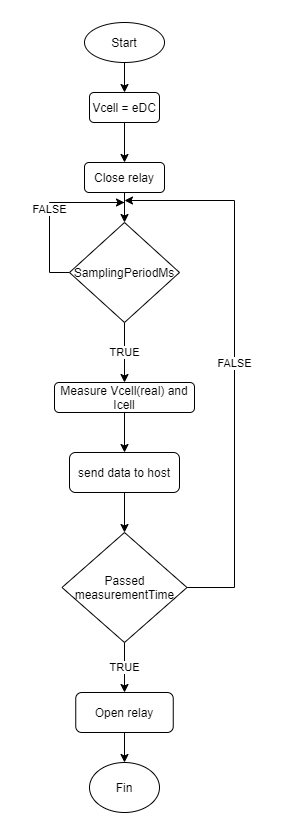

#### What is a potentiostat?

A [potentiostat](#https://ieeexplore-ieee-org.sire.ub.edu/document/5236124) is the electronic hardware required to monitor and control electrochemical reactions; used to measure the capacitance variations at an electrode/solution interface with recognition elements on the surface of the working electrode.

The potentiostat utilizes three-electrodes: a) the working electrode (WE), which serves as a surface on with the electrochemical reaction takes place; b) the reference electrode (RE), used to measure the potential at the WE, and c) the auxiliary electrode (AUX), which supplies the needed current required for the electrochemical reaction at the WE.

> Potentiostat Schematic. [[Source](https://en.wikipedia.org/wiki/Potentiostat)]

Two important electrochemical techniques that can be applied using a potentiostat are cyclic voltammetry and chronoamperometry.

#### Cyclic Voltammetry

[Cyclic Voltammetry](#https://pubs.acs.org/doi/10.1021/acs.jchemed.7b00361) (CV) is a electrochemical technique commonly employed to investigate the reduction and oxidation processes of molecular species. It is [performed](<https://chem.libretexts.org/Bookshelves/Analytical_Chemistry/Supplemental_Modules_(Analytical_Chemistry)/Instrumental_Analysis/Cyclic_Voltammetry#:~:text=Cyclic%20Voltammetry%20(CV)%20is%20an,and%20measuring%20the%20resulting%20current.>) by cycling the potential of a working electrode, and measuring the resulting current. The potential of the WE is measured against a RE which maintains a constant potential, and it is performed starting from greater potential and ending at a lower potential, to later perform the reverse scan. This performance is repeated during a specific number of cycles.

A CV system consists of an electrolysis cell, a potentiostat, a current-to-voltage converter, and a data acquisition system.

#### Chronoamperometry

[Chronoamperometry](#https://www.sciencedirect.com/topics/chemistry/chronoamperometry) is a time-dependent technique where a square-wave potential is applied to the working electrode. The current of the electrode, measured as a function of time, fluctuates according to the diffusion of an analyte from the bulk solution toward the sensor surface. It is a sensitive technique which does not require labeling of the analyte or bioreceptor.

## Content

- [Introduction](#potentiostat-project)
  - [What is a potentiostat?](#what-is-a-potentiostat)
  - [Cyclic Voltammetry](#cyclic-voltammetry)
  - [Chronoamperometry](#chronoamperometry)
- [Objective](#objective)
- [Project development](#Project-development)
  - [Workflow](#workflow)
  - [How does it work?](#How-does-it-work)
  - [Flow diagrams](#flow-diagrams)
- [Results](#results)
- [Conclusions](#conclusions)

## Objective

The aim of this project is to perform two types of electrochemical measures: a cyclic voltammetry and a chronoamperometry.

From this general objectives, different goals can be summed up:

<ul>
  <li>Review the literature to learn basic concepts related to potentiostat</li>
  <li>
    Programming a microcontroller using STM32CubeIDE platform to perform a
    cyclic voltammetry and a chronoamperometry{" "}
  </li>
</ul>{" "}

## Project development

### Workflow

The workflow is similar as in other projects developed in this subject.

From the **master** branch, the repository is cloned and a **develop** branch is created. Then, for every functionality, a branch named **feature/---** , where --- is the name of the functionality, is created. If a correction needs to be made, a branch named **hotfix/--** will be created.

Finally, all codes from all **feature** branches will be merged with **develop** in order to do a **Pull request** to **master**.

### How does it work?

For this project, the [viSens-S](#https://github.com/Albert-Alvarez/viSens-S/releases/tag/v0.1.0) software is used as a host, which will perform as a master. In its user-interface all parameters that will be send to the microcontroller (slave) are set. To do so, the COBS coding protocol is followed using `0x00` as a `term char`. Once all instructions have been sent, the program communicates with a DAC (MPC4725) via I2C bus and it fixes a cell tension.

Using the microcontroller's ADC, a VADC is read. This voltage is equal as the voltage of the RE and can be used to calculate the voltage of the cell (VCELL) using:

  

To obtain the cell current, a transimpedance amplifier with a RTIA of 10kΩ is used.

Each module is defined to obtain a global visualization of the system:

###### Power Management Unit (PMU)

PMU feeds the front-end and by default is disabled in order to not use current until the maximum consumption is defined by the USB port. Once this consumption is defined, the microcontroller will be feed.

###### Relay

The relay is in charge of open or close the circuit between the front end and the sensor. When the relay is open there's no electrical connection and when it closes, the electrochemical sensor is connected to the front-end.

###### Potentiostat

The potentiostat is used to polarize the electrochemical cell to VCELL and measure the flowing current. It uses a DAC, ADC and TIA.

### Flow Diagram

The following flow diagram explain the execution of the program at different levels:

##### Main application

In the following flow the interaction between the user and the viSense-S application is showed.

##### Microcontroller

The flow diagram below shows how the microcontroller operates depending on the instruction received:

##### Cyclic voltammetry

The following flow explains the operation of the microcontroller if a cyclic voltammetry has to be performed.

As explained before, when performing a cyclic voltammetry, a voltage sweep is to be performed. This is done by applying a starting tension `eBegin` that is then increased or decrease until achieving `eVertex1` or `eVertex2` by adding (or subtracting) `eSteps`. Finally, another sweep in order to return to `eBegin` is done. This corresponds to a cycle and it will be done as many times as `cycles` states.

##### Chronoamperometry

Finally, the following diagram shows the behavior of the microcontroller when a chronoamperometry has to be done.

For this technique, the tension Vcell is set and stays constant for the time indicated in `measurementTime`. The sample is acquired following the period indicated in `samplingPeriodMs`.

## Results

Due to the [COVID-19](#https://covid19.who.int/) situation, in which the project has been carried out, the codes programmed during the project haven't been tested and a proof of concept couldn't be performed.

## Conclusions

With this project, a sum up of all the contents seen in the MASB subject are reviewed and putted into practice.

Thanks to this project and this subject, we have learned about timers, ADCs, DACs using I2C serial communication, COBS, and a large etc., but most important, we've learned how to work in group using Git and GitHub.
