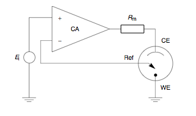
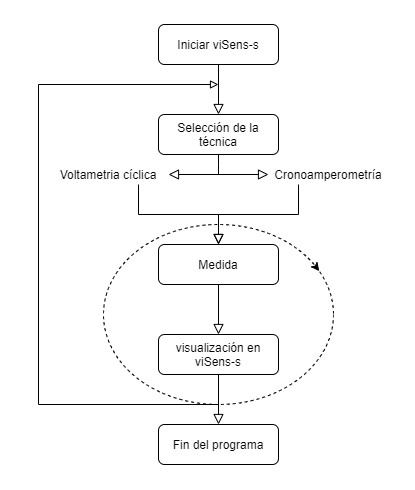
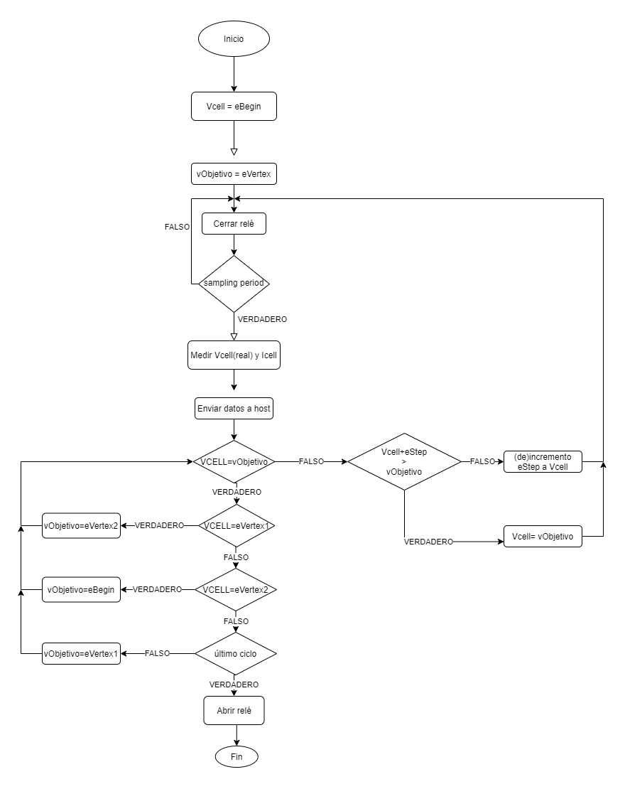
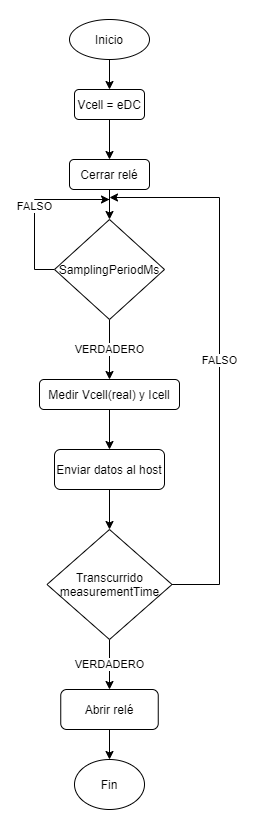

## ¿Qué es un potenciostato?

Un [potenciostato](https://doi.org/10.1109/MWSCAS.2009.5236124) es un _hardware_ electrónico requerido para controlar y monitorizar reacciones electroquímicas, usado para medir las variaciones de la capacitancia en una interfaz electrodo/solución con elementos de reconocimiento en la superficie del _working electrode_.

El potenciostato utiliza tres electrodos:

1. _Working electrode_ (WE) utilizado como superficie donde se lleva a cabo la reacción electroquímica.
1. _Reference electrode_ (RE) utilizado para medir el potencial en WE.
1. Electrodo auxiliar (AUX) responsable de administrar la corriente requerida por la reacción electroquímica en el WE.

Entre las técnicas electroquímicas utilizadas en un potenciostato destacan le voltametría cíclica y la cronoamperometría.

## Voltammetría Cíclica

La [voltametría cíclica](https://pubs.acs.org/doi/10.1021/acs.jchemed.7b00361) (CV) es una técnica electroquímica utilizada normalmente para la investigar los procesos de oxidación-reducción de especies moleculares. La [medición](<https://chem.libretexts.org/Bookshelves/Analytical_Chemistry/Supplemental_Modules_(Analytical_Chemistry)/Instrumental_Analysis/Cyclic_Voltammetry#:~:text=Cyclic%20Voltammetry%20(CV)%20is%20an,and%20measuring%20the%20resulting%20current>) se realiza ciclando el potencial del _working electrode_ y midiendo la corriente resultante. El potencial del WE se mide con respecto a RE el cual mantiene un potencial constante y se va desde un potencial mayor a un potencial menor, para luego realizar un escaneo inverso. Este procedimiento se repite durante un número específico de ciclos.

Un sistema de voltametría cíclica consiste en una celda electrolítica, un potenciostato, un conversor de corriente a voltaje y un sistema de adquisición de datos.

## Cronoamperometría

Una [cronoamperometría](https://www.sciencedirect.com/topics/chemistry/chronoamperometry) es una técnica dependiente del tiempo donde una señal cuadrada de potencial es aplicada al _working electrode_. La corriente del electrodo (medida en función del tiempo) fluctúa según la difusión de un analito desde la _bulk solution_ hacia el sensor de la superficie. Se trata de una técnica sensible que no requiere una identificación del analito o bioreceptor.

## Contenido

- [Introducción](#qué-es-un-potenciostato)
- [Objetivos](#objetivos)
- [Desarrollo del proyecto](#desarrollo-del-proyecto)
- [Resultados](#resultados)
- [Conclusiones](#conclusiones)

## Objetivos

El propósito de este proyecto es realizar dos tipos de medidas electroquímicas: una voltametría cíclica y una cronoamperometría.

A partir de esto, diferentes objetivos pueden ser extraídos:

- Revisar la literatura disponible para aprender conceptos básicos relacionados con el potenciostato.
- Programar un microcontrolador mediante la plataforma STM32CubeIDE para realizar una voltammetría cíclica y una cronoamperometría.

## Desarrollo del proyecto

### _Workflow_

El _workflow_ seguido para este proyecto es similar al utilizado en proyectos anteriores de esta asignatura.

A partir de la rama **master**, el repositorio remoto se clona y, a continuación, se crea la rama **develop**. De esta rama, una nueva rama **feature/---** será creada
para cada funcionalidad ("---" siendo el nombre de dicha función). Si es necesario realizar alguna corrección se creará una nueva rama con el nombre **hotfix/---**.

Una vez completos, los códigos de las ramas **feature** se unirán a la rama **develop** para finalmente hacer un **Pull request** a la rama **master**.

### ¿Cómo funciona?

Para este proyecto, se utilizará el software [viSens-S](https://github.com/Albert-Alvarez/viSens-S/releases/tag/v0.1.0) como _host_. Este _host_ funcionará como _master_ y en él se realizará la configuración de los parámetros que serán enviados al microcontrolador (_slave_) siguiendo el protocolo de codificación [COBS](https://en.wikipedia.org/wiki/Consistent_Overhead_Byte_Stuffing) con `0x00` como `term char`.

Una vez recibidas las instrucciones pertinentes, el programa enviará la tensión de celda establecida a través de un DAC modelo [MPC4725](http://ww1.microchip.com/downloads/en/DeviceDoc/22039d.pdf) con comunicación sincrónica I2C. A la vez, con el ADC del microcontrolador se leerá una tensión VADC correspondiente a la tensión del RE VREF a partir de la cual se podrá obtener la tensión de la celda VCELL según la siguiente fórmula:

$$
V_\textrm{CELL}=\left( 1.65-V_\textrm{ADC}\right)
$$

También se obtendrá la corriente que pasa a través de a celda gracias a un amplificador de transimpedancia (TIA) con una resistencia de 10 k&#8486;.

A continuación, se detallan los diferentes módulos utilizados:

##### _Power Management Unit_ (PMU)

La unidad de gestión de potencia se encarga de alimentar el _front-end_ y por defecto se encuentra deshabilitada evitando que este consuma corriente hasta que se determine un consumo máximo por el controlador USB del ordenador. Una vez este consumo esté definido, el microcontrolador será alimentado.

##### Relé

El relé es el encargado de abrir y cerrar el circuito establecido entre en el _front end_ y el sensor. Si el relé está abierto, no habrá conexión eléctrica entre los circuitos y, cuando se cierre, el sensor quedará conectado al _front-end_.

##### Potenciostato

El potenciostato se encarga de polarizar la celda electroquímica a una tensión VCELL y de medir la corriente circulante (ICELL). Esto se consigue a través de la gestión del DAC, el ADC y el amplificador transimpedancia.

### Flujos de operación

A continuación se detallan los flujos de ejecución a diferentes niveles:

##### Aplicación principal

En el siguiente flujo se aprecia la interacción del usuario con la aplicación viSense-S y la aplicación en general.

##### Microcontrolador

A continuación, se detalla el flujo correspondiente al microcontrolador según la instrucción que recibe del _host_.

##### Voltammetría cíclica

En el siguiente flujo, se detalla el funcionamiento del microcontrolador a la hora de realizar una voltammtría cíclica:

Como se ha explicado anteriormente, en una voltametría cíclica se realiza un barrido en tensión sobre la celda electroquímica. Esto lo realizamos aplicando para empezar
una tensión `eBegin` (a través del DAC) la cual va aumentando o disminuyendo mediante `eStep` hasta llegar a `eVertex1` o `eVertex2` (si partimos de `eVertex1`). Finalmente, se hace un barrido a `eBegin`. Esto se corresponde a un ciclo y se realizarán tantos ciclos como se indique en `cycles`.

##### Cronoamperometría

Finalmente, en el siguiente flujo, el funcionamiento del microcontrolador cuando realiza una cronoamperometría queda detallado:

En esta técnica se fija una tensión constante (VCELL) durante el tiempo indicado en `measurementTime`. La muestra se toma según el periodo indicado en `samplingPeriodMs`.

## Resultados

A causa de la situación actual causada por la [COVID-19](https://covid19.who.int/), los códigos creados durante este proyecto no han podido ser testeados y por tanto
no se ha podido realizar una prueba de concepto.

## Conclusiones

Con este proyecto se han podido revisar todos los contenidos estudiados en la asignatura MASB y se han podido poner en práctica. Gracias a este proyecto y a la asignatura, hemos podido aprender sobre _timers_, el uso de ADCs, DACs a través de la comunicación en serie I2C y sobre la codificación COBS entre otras cosas. Además, hemos tenido la oportunidad de aprender cómo llevar trabajos en grupo a través de Git y GitHub.
