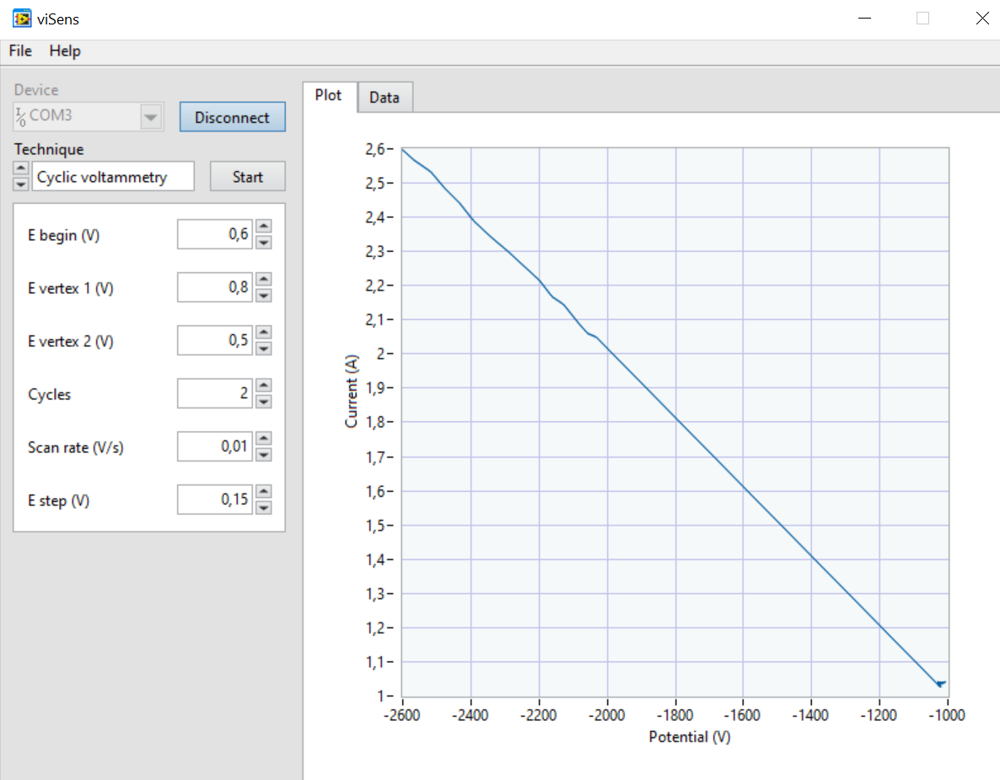

This report consists of the description of the **final project** carried out for the subject of _Microcontrollers for biomedical applications and systems_ of the **Biomedical Engineering** degree from the University of Barcelona.

The work carried out has been to develop a **programming project** for a **potentiostat** to perform cyclic voltammetries and chronoamperometries to a sample of potassium ferrocyanide (K4 [Fe (CN) 6]) in potassium chloride (KCl) at different concentrations.

The project has been developed by programming the STM32 Nucleo-F401RE evaluation board from STMicroelectronics. Based on the STM32CubeIDE environment, it has been done in pairs, following a **team workflow**. The tool used has been Git, a free and open source Version Control System. The files and the project itself have been posted on GitHub through the use of Git.

This project has been developed during the **2020 spring**, during the **Sars-Cov-2** pandemic. Therefore, certain aspects of the project have been **limited** by the **impossibility of developing face-to-face work**, as indicated below.

### Potentiostat

A potentiostat is an **electronic device** required to **control a three-electrode cell** for **electrochemical experiments**. These three electrodes are the reference electrode REF, the working electrode WE and the auxiliary electrode AUX (or counter-electrode). The two main functions of a potentiostat are:

- **Control the potential difference** between the reference and working electrodes without polarizing the reference electrode (preventing current from passing and thus preventing its degradation).

- **Measure the current intensity** flowing between the working and auxiliary electrodes (cell current).

The potentiostat used in this project consists of a _front-end_ that has been specifically designed for the subject and a _back-end_ that consists of the _Evaluation Board_ (EVB) NUCLEO-F401RE from STMicroelectronics.

  

### Cyclic voltammetry

A [Cyclic Voltamperommetry (CV)](https://pubs.acs.org/doi/10.1021/acs.jchemed.7b00361), better known as **cyclic voltammetry**, is a type of **potentiodynamic electrochemical measurement** that is generally used to study the electrochemical properties of an analyte in a solution or of a molecule absorbed on an electrode. The basic operation of a cyclic voltammetry is to **apply a variable potential** in an electrochemical cell and **measure the current that the cell provides**. The potential between the working and the reference electrode varies over time until it reaches a maximum value and then the same process is repeated in reverse, until the initial potential value is reached. This process is called a **triangular potential sweep** and is repeated for a set number of **cycles**. The current measured in the cell is represented as a function of the applied voltage, in the form of a _cyclic voltamogram_.

### Chronoamperometry

A [Chronoamperometry (CA)](https://www.sciencedirect.com/topics/chemistry/chronoamperometry) is an **electrochemical technique** that is used to study the kinetics of chemical reactions and characteristic diffusion and absorption processes of biological species in an electrochemical cell. This process consists of **providing a step signal** at the working electrode and **measuring the current** coming from the sample. The cell current, measured as a function of time, fluctuates according to the diffusion of an analyte from the solution, thus **quantifying the concentration of the analyte of interest**. Chronoamperometry can therefore be used to measure the dependency between current and time for the controlled diffusion process that occurs at an electrode, which varies with the analyte concentration. One of its advantages is that it is a sensitive technique that does not require labeling of the analyte or bioreceptor.

It is a widely used method in electrochemistry, due to its relative ease of implementation and analysis, which is applied in many studies independently or together with other electrochemical techniques, such as CV.

### Objectives

- Program a portable potentiostat.
- Communicate with the viSens-S application installed with the host or computer using the MASB-COMM-S protocol.
- Perform a cyclic voltammetry.
- Perform a chronoamperometry.

## Contents

- [Introduction](#masb-pot-s-project)

  - [Potentiostat](#potentiostat)

  * [Cyclic Voltammetry](#cyclic-voltammetry)
  * [Chronoamperometry](#chronoamperometry)
  * [Objectives](#objectives)

- [Git Workflow](#git-workflow)

* [Project](#project)
  - [Flowchart](#flowchart)
  - [Desktop application for the host: viSens-S](#desktop-application-for-the-host-visens-s)
* [Results](#results)

- [Conclusion](#conclusion)

### Git Workflow

The tool used to develop the project has been [Git], a **version control software** ([VCS]) that allows **managing the changes** of different files and **developing teamwork** coordinating the modification of shared files. The final project has been uploaded to the **GitHub** platform, which allows **saving the history of projects** using the Git version control system. In this way, the versions of this project have been saved both in a local and public repository.

The workflow used in the project has been based on the creation of different branches, each one dedicated to a different potentiostat function:

- **Master branch:** branch that contains the complete and functional production code.
- **Develop branch:** branch that contains the grouping of all the developments of the team members. In this branch the correct operation of all the elements that have been transferred in this branch is validated. Once finished, it is transferred into the master branch, where the final product is presented. In this branch, `.ioc` has been configured and the code has been initialized.
- **Hotfix/\*\*\*:** branch that allows the correction of a bug or undesired behavior and that is transferred in the develop branch.
- **Feature/\*\*\*:** branches: branches that contain the individual development of a functionality. Asterisks are replaced by the descriptive term of the functionality developed in that branch. This project has been divided into the following branches:
  - _feature/ADC_: branch for the management of ADCs.
  - _feature/CA_Management_: branch for the management of the chronoamperometry.
  - _feature/CV_Management_ : branch for the management of the cyclic voltammetry.
  - _feature/DAC_: branch for the management of the DAC.
  - _feature/PMU_: branch for the _Power Management Unit_ management.
  - _feature/Setup_Lool_Management_ : branch for the creation of the `setup` y `loop` functions and modification of the `main` function.
  - _feature/timers_: branch for the management of timers.

All the transfer of finished branches to the develop branch have been done through _Pull requests_, where the other team member has always been put as a reviewer to ensure that agreement with the proposed changes.

These developments have been divided equally among the members of the work. Due to the **Sars-Cov-2** pandemic, all meetings, both with the team and the supervisor, have been held in person. The code structure as well as the variables and functions to be used have been decided by the team through virtual sessions. The correction of the latest unwanted behaviors has been done through the use of _Skype_ and its _screen sharing_ functionality. Finally, doubts about the project have been resolved with the supervisor through various virtual meetings, through _Skype for Business_.

### Project

It is a very complete project, with management of a DAC, ADCs, timers, a power module, a relay, with I2C communication and UART communication, as well as the management of the two electrochemical measurements. The different functionalities have been developed in functions implemented in different .c code files with their respective headers. These functions are called when necessary. The main program has been developed in a separate file, called `stm32main.c`, in which the `setup` and `loop` functions have been created to imitate the operation of Arduino and avoid modifying the `main.c` file.

Below we will detail the use of each of the functionalities and present the flow diagrams of the most complex functionalities, including the main dynamics of the program.

**_Power Management Unit (PMU)_**

This is the power management unit and it is responsible for supplying power to the front end. It is disabled by default to avoid the current consumption of the front end before the EVB negotiates the maximum consumption with the USB controller of the computer. When the microcontroller is powered, the PMU is enabled. This is done by raising the `EN` pin to its high level, which has been configured as a digital output, as soon as the program is started in the microcontroller.

PMU management has been done through the use of a function, which is called in the `setup`. The `HAL_GPIO_WritePin` function is implemented in this function.

**Relay**

The potentiostat integrates a relay, which is responsible for opening and closing the circuit between the front-end and the electrochemical sensor. By default, the relay must be open so that these two modules are not electrically connected. When performing a measurement, the relay must be closed and when it is finished, it must be opened again. This is done using the `RELAY pin`, which has also been configured as a **digital output**.

Relay management is not done through a file with a separate function. It is implemented directly using the `HAL_GPIO_WritePin` function within the functions that manage the CV and CA.

**_DAC_**

Once the parameters of the electrochemical measurement have been chosen, the VCELL **voltage** must be **fixed** in the cell. This is done through the use of a **Digital Analog Converter (DAC)**, which can generate an output voltage from 0 to 4V. At the DAC output, a stage has been added to obtain a bipolar signal of -4 to 4V to be able to polarize the cell with positive and negative voltages. The correspondence that has been used between the desired cell voltage VCELL and the output voltage of the DAC VDAC is as follows:

  

For this application, the DAC used is the **MCP4725**, from _Microchip_. The microcontroller communicates with the DAC through **I2C communication**. Their specifications are in the following [data sheet](https://www.sparkfun.com/datasheets/BreakoutBoards/MCP4725.pdf).

DAC management has been developed in a separate `dac.c` file, along with its `dac.h` header. A function has been implemented in this file. It integrates:

- **Conversion** of the _double_ type voltage to _uint16_t_ from the **DAC resolution**.
- **Division** of the two data bytes (corresponding to the voltage) following the order specified in the DAC data sheet (**first MSB**).
- **Sending** the data with the DAC **address** specified by **I2C communication**.

**_ADCs_**

This application requires the use of an **Analog Digital Converter (ADC)** to know the polarization voltage of the real cell, because although we control it, we cannot take it as known. The correspondence between the ADC VADC input voltage and the VCELL cell voltage is as follows:

  

The current passing through the cell is also read through the ADC, with the following correspondence:

  

The two VADC voltages used to obtain the value of VCELL and ICELL come from the `VREF` and `ICELL` pins, which have been configured as **analog inputs**. Its management has been implemented in a file with a separate header. Two functions have been implemented in the `adc.c` file, one for the acquisition of the signal coming from `VREF` and the other for the one coming from `ICELL`. These are called from the CV and CA functions when it is necessary. Since the microcontroller only has one ADC, _scan mode_ has been used to read the analog signal from two different pins non-simultaneously. For the acquisition of the analog signals, the functions `HAL_ADC_Start`, `HAL_ADC_PollForConversion` and `HAL_ADC_GetValue` have been used.

**_Communication with the host_**

The parameters for performing the electrochemical measurements are indicated through a **computer application**, as explained in detail afterwards. Communication between the microcontroller and the computer, the host, is done using **asynchronous serial communication** with 115200 8N1 configuration. Communication is encoded using the [COBS](http://www.stuartcheshire.org/papers/COBSforToN.pdf) protocol (**Consistent Overhead Byte Stuffing**), due to its **simplicity and low overhead**, using the `0x00` character as term char. When the microcontroller is instructed to start an electrochemical measurement, it must be started immediately. There exist three instructions, which are presented in the following table.

Communication has been managed through another .c file and its header, called `masb_comm_s.c` and `masb_comm_s.h`

| Value |  Instruction  | Description                                                    |
| :---: | :-----------: | :------------------------------------------------------------- |
| 0x01  | START_CV_MEAS | It sends the parameters of a cyclic voltammetry and starts it. |
| 0x02  | START_CA_MEAS | It sends the parameters of a chronoamperometry and starts it.  |
| 0x03  |   STOP_MEAS   | Stops the measurement in progress.                             |

**_Timers_**

A microcontroller timer has been used to accurately control the time between sample and sample. Two functions have been implemented in a `timers.c` file, one for the CV sampling period and another one for the CA. The timer is preconfigured using STM32MX and, in the functions, the timer period is changed to make it a function of the time sent by the host. Also, in that file, the timer interrupt is implemented, which changes the state of a flag variable called `wait` to `TRUE`. When this change is made, the CV and CA functions will carry out the appropriate steps and measures, which are indicated in the flow diagrams that will be seen later

Finally, the following table shows a summary of the pin configuration used for the project.

| Pin |   Alias   |         Type         | Description                                                                                          |
| :-: | :-------: | :------------------: | :--------------------------------------------------------------------------------------------------- |
| PA0 |   VREF    |     Analog input     | Absolute tension of the _Reference Electrode (RE)_ VREF used to measure VCELL. |
| PA1 |   ICELL   |     Analog input     | Output tension from TIA used to measure ICELL.                                            |
| PB8 |    SCK    | I2C (SCK) | SCK signal of the I2C. The I2C bus, controls the DAC of the del _front-end_.   |
| PB9 |    SDA    | I2C (SDA) | SDA signal of the I2C. The I2C bus controls the DAC of the del _front-end_.    |
| PA5 |    EN     |    Analog output     | Disable/Enable signal of the PMU. `0`: PMU disabled. `1`: PMU enabled.                           |
| PB5 |   RELAY   |    Analog output     | Relay control signal.  `0`: Open relay. `1`: Closed relay.                                       |
| PA2 | USART2_TX |        USART         | Asynchronous serial communication signal for communication with the host.                            |

#### Flowchart

In this section the flow diagrams of the main operation of the application and of the two functionalities that perform the CV and CA measurements are presented.

  

> Flow corresponding to the user's operation with the device and the desktop application installed on the _host_.

  

> Flow corresponding to the operation of the microcontroller depending on the instruction received.

  

> Flow corresponding to the operation of the microcontroller when performing a cyclic voltammetry.

  

> Flow corresponding to the operation of the microcontroller when performing a chronoamperometry.

In these last diagrams Vcell and Vcell (real) are mentioned. The real one refers to the voltage obtained with the ADC, that is, the actual voltage applied to the cell. On the other hand, Vcell refers to the voltage that is set with the DAC.

#### Desktop application for the host: viSens-S

Due to **Sars-Cov-2**, the **programmed potentiostat could not be tested in the laboratory**, with real samples. Even so, **the validity of the developed code has been tested**, thanks to the use of the **desktop application viSens-S**. This has been developed by the supervisor (and client).

This application allows **choosing the data of the electrochemical measurements** and **transmitting the data** from the computer to the microcontroller, using asynchronous serial communication (UART). Then, it **plots the data** sent by the microcontroller after the measurement has been made and also **lists it** in a table.

Its operation is explained in the following video.

### Results

As previously stated, due to the pandemic caused by **Sars-Cov-2**, the code created for the potentiostat operation could not be tested in the laboratory. Anyway, tests could be done using the viSens-S application, using our STM32 Nucleo-F401RE from STMicroelectronics with a potentiometer. A voltage divider has been made, connecting the terminal variable to the defined analog inputs. Below you can see a picture of the connection.

  

It must be taken into account that in order to carry out the test, comments to the code related to the DAC have been put, since, as we did not have the physical component, the microcontroller would freeze and the program would not work.

The following images show the data obtained with the potentiometer connected to the microcontroller through the viSens-S application. These tests have served to **verify the operation of the code implemented for the two techniques discussed (cyclic voltammetry and chronoamperometry) and the connection between the host (microcontroller) and the desktop application (viSens-S).**

  

> Example of graphic representation of chronoamperometry results with the viSens-S application.

  

> Example of data obtained from a chronoamperometry with the viSens-S application.

  

> Example of graphic representation of cyclic voltammetry results with the viSens-S application.

  

> Example of data obtained from a cyclic voltammetry with the viSens-S application.

### Conclusion

The **programming of a potentiostat** has been developed for the realization of _cyclic voltammetries_ and _chronoamperometries_. The project has been based on the programming of the microcontroller of the **STM32 Nucleo-F401RE** evaluation board from STMicroelectronics, by using the **STM32CubeIde** environment. The **Git** tool and the **GitHub** platform have been used to coordinate the work, which has been developed as a team.

In this project, basic knowledge on the subject has been used for the programming of microcontrollers, which has been acquired throughout the course. Peripherals such as **timers** have been used with their **interruptions**, as well as **GPIOs**, synchronous serial communication (**I2C**) and asynchronous (**UART**), **DACs** and **ADCs**. A **data encoding protocol** has also been used.

This project concludes the subject of _Microcontrollers for biomedical applications and systems_, combining the aspects learned throughout the semester. In one semester, the course has allowed us to **get a taste of the vast world of microcontroller programming** in a very **practical** way, without forgetting the **fundamental theoretical aspects** and has awakened the authors of this project a **deep interest to continue learning** the insides of these tiny intelligent systems such as microcontrollers and the fields around them.
