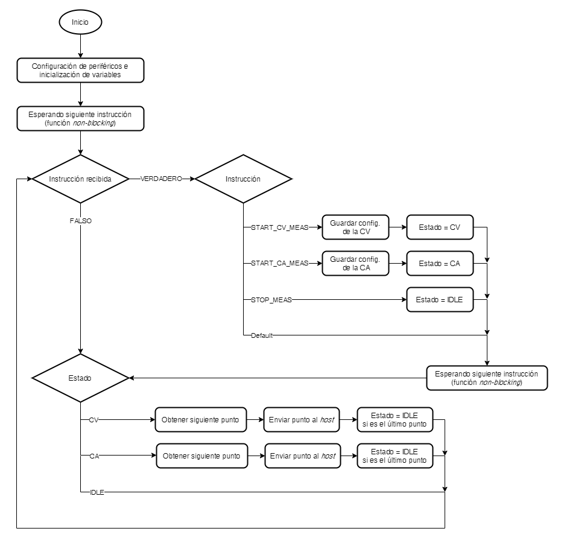
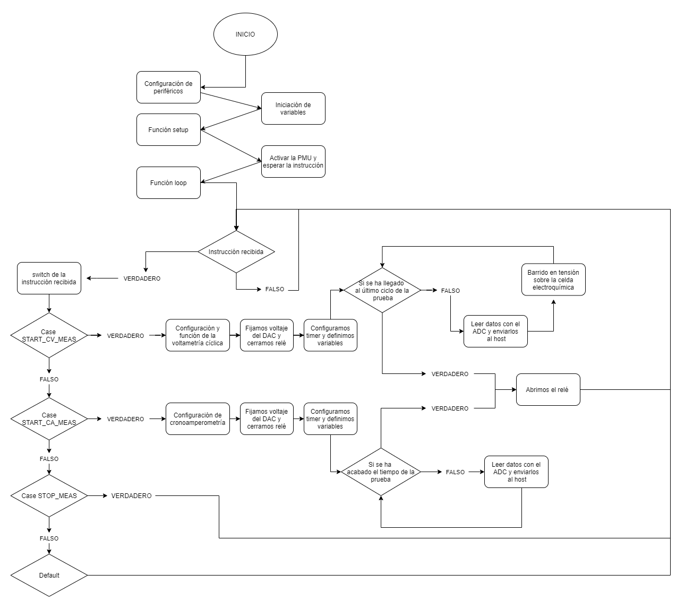

En este documento se encuentran los contenidos necesarios para realizar y entender este proyecto que ha consistido en la configuración de un microcontrolador para realizar pruebas electroquímicas usando un potenciostato. A partir del trabajo realizado, se pueden realizar de forma automatizada cronoamperometrías y voltametrías cíclicas.

## Contenidos

- [Introducción](#introducción)
- [Objetivos](#objetivos)
- [Desarrollo del proyecto](#desarrollo-del-proyecto)
- [Resultados obtenidos](#resultados-obtenidos)
- [Conclusiones](#conclusiones)
- [Referencias](#referencias)

## Introducción

Este proyecto ha sido desarrollado en la asignatura optativa de Microcontroladores para Aplicaciones y Sistemas Biomédicos de cuarto de Ingeniera Biomédica de la Universitat de Barcelona. Este trabajo ha sido realizado por el grupo BigProblemWeCantWalk formado por Carlos Maimó y Carles Bada.

En este apartado de la introducción hay una breve descripción de las técnicas usadas para desarrollar este proyecto. Es necesario comprender cómo funcionan las técnicas electroquímicas que se pueden hacer con un potenciostato, para poder desarrollar sistemas de control automatizado para ellas.

### Potenciostato

Un potenciostato es un tipo de circuito utilizado para hacer mediciones electroquímicas. Se trata de un dispositivo muy usado en el mundo de la medicina en el diseño y desarrollo de biosensores, como los detectores de glucosa, por ejemplo. Está formado por tres electrodos: el _counter electrode_ (CE), el _working electrode_ (WE) y el _reference electrode_ (RE). También consta de un amplificador de gran amplificación y gran impedancia para fijar el voltaje de trabajo, y de un amplificador de transimpedancia a la salida para medir las variaciones en la intensidad del corriente dentro de la celda electroquímica [[1]](https://www.sciencedirect.com/book/9780124165564). En la figura 1 podemos ver un ejemplo del circuito del potenciostato.

![Esquemático básico de un potenciostato <a href="http://www.customsensorsolutions.com/ap-pstat.html" target="_blank" rel="noopener noreferrer nofollow">[2]</a>.](assets/Img/potentiostat.png)

Este tipo de dispositivos son muy usados para el desarrollo de sensores médicos y _points-of-care_, ya que tienen la capacidad de detectar cambios de concentración muy pequeños, es decir, tienen una sensibilidad muy grande y los hace ideales para hacer mediciones de concentraciones biológicas del organismo. Las dos principales mediciones que podemos hacer con un potenciostato son la cronoamperometría (CA) y la voltametría cíclica (CV), que ahora veremos en qué se basan, qué resultados obtienen y cómo se deben hacer.

### Cronoamperometría

La cronoamperometría es una técnica de medición dependiente de tiempo en la que se aplica un determinado potencial usando una señal cuadrada en el _working electrode_. La corriente en la celda electroquímica, medida en función del tiempo, fluctúa acorde a la difusión en función de la concentración de un analito en la solución [[3]](https://www.sciencedirect.com/book/9780128029930). Así pues, estudiando la relación entre corriente y tiempo se puede determinar la concentración de un determinado analito en una solución sin necesidad de ningún etiquetado.
![Esquema de una cronoamperometría <a href="https://en.wikipedia.org/wiki/Chronoamperometry" target="_blank" rel="noopener noreferrer nofollow">[4]</a>.](assets/Img/crono.png)

### Voltametría cíclica

La voltametría cíclica, por otra parte, es una técnica electroquímica muy utilizada que puede ser útil para obtener información cualitativa y cuantitativa de las reacciones electroquímicas, como la cinemática, mecanismos de reacción, procesos electrocatalíticos, la reversibilidad de las reacciones y más parámetros. Durante la medición, el potencial del WE es medido respecto al RE, y el potencial es forzado entre dos límites. Al mismo tiempo, también se mide la corriente pasando por la celda que es dependiente del potencial aplicado [[5]](https://www.sciencedirect.com/book/9780444536884). La señal correspondiente a una redox se tiene una forma donde el pico de arriba marca la oxidación de la solución y el pico inferior indica su reducción. También se puede usar esta técnica para hacer estudios redox sobre la superficie del WE.

![Esquema de una cronoamperometría <a href="https://www.sciencedirect.com/book/9780444536884" target="_blank" rel="noopener noreferrer nofollow">[5]</a>.](assets/Img/ciclic.png)

### _Hardware_

Para poder implementar este tipo de mediciones dentro de un sensor es muy importante poder automatizar la configuración y el desarrollo de la medición mediante un dispositivo electrónico. Para ello, la utilización de microcontroladores es ideal y facilita mucho la aplicación de test utilizando este tipo de equipos. Un microcontrolador es un circuito integrado que funciona como un pequeño ordenador que incluye sistemas para controlar elementos de entrada y de salida. También incluye un procesador y memoria para poder guardar el programa que debe ejecutar y sus variables. La función de un microcontrolador es automatizar procesos y procesar información.

Hay muchos tipos de microcontroladores que se pueden usar para automatizar procesos, Arduino y RasperryPi son las marcas más conocidas, en este proyecto se utilizara el STM32F401 Nucleo-64 de la marca STM. En este [link](https://www.st.com/resource/en/user_manual/dm00105823-stm32-nucleo-64-boards-mb1136-stmicroelectronics.pdf) se encuentra la documentación relativa de esta placa. Se programará mediante el uso del software [STM32CubeIDE](https://www.st.com/resource/en/data_brief/stm32cubeide.pdf).

![Imagen del microcontrolador empleado <a href="https://www.mouser.es/ProductDetail/STMicroelectronics/NUCLEO-F401RE?qs=fK8dlpkaUMvGeToFJ6rzdA==" target="_blank" rel="noopener noreferrer nofollow">[6]</a>.](assets/Img/placa.png)

### Git y GitHub

Para desarrollar aplicaciones mediante el uso de microcontroladores es necesario programar la placa para que esta realice las funciones deseadas. Para realizar proyectos basados en el desarrollo de código en equipo, existen dos herramientas muy útiles que serán usadas en este proyecto: Git y GitHub. Git es un programa de código abierto y gratuito que ofrece herramientas para desarrollar proyectos de cualquier tamaño y envergadura. Usando Git se pueden crear distintas líneas de trabajo independientes dentro del mismo proyecto para poder tener ramas de desarrollo, de test y operativas. De este modo se puede trabajar en el desarrollo en equipo de un mismo proyecto. Además permite guardar versiones de las modificaciones realizar por, en caso de necesidad, poder recuperar versiones anteriores de un mismo documento [[7]](https://git-scm.com/about).

GitHub, por otro lado, es una aplicación gratuita para la gestión de repositorios Git. Dispone de una interfaz web para tener acceso y control de las distintas colaboraciones y desarrollos del proyecto, incluyendo la opción de jerarquización de equipos, donde es necesaria la comprobación y aceptación por un _project manager_ de las modificaciones realizadas por un desarrollador antes que se pueda unir el nuevo código, al programa principal. Otra forma de trabajar que ofrece GitHub es el _forking_ que consiste en adquirir el código de otro proyecto para poder desarrollar cualquier usuario. Esta opción promociona el desarrollo cooperativo, y además, con la aprobación del gestor del proyecto, se pueden compartir las modificaciones realizadas por un usuario [[8]](https://techcrunch.com/2012/07/14/what-exactly-is-github-anyway/).

## Objetivos

El objetivo de este proyecto es la implementación de un microcontrolador para gestionar un potenciostato. El microcontrolador debe ser capaz de poner en marcha, configurar, realizar cronoamperometrías y voltametrías cíclicas y enviar los resultados obtenidos a través de la información recibida por una aplicación de control externa.

El programa desarrollado debe tener la siguiente estructura y ser capaz de realizar las funciones descritas en el siguiente diagrama de flujos:

## Desarrollo del proyecto

Para desarrollar este proyecto, nuestro equipo formado por Carlos Maimó y Carles Bada, ha trabajado en equipo para realizar la configuración necesaria de todo el programa. La descripción del proceso que se ha realizado a lo largo del proyecto se encuentra en el siguiente diagrama de flujo.

El _workflow_ que se ha seguido para desarrollar los distintos archivos es el de la documentación, donde las funcionalidades se desarrollan individualmente en las distintas ramas feature/**\*\*\***, y se agrupan en la rama develop, de manera que podemos comprobar si tenemos fallos o no. Para corregir dichos fallos, se usan las ramas hotfix/**\*\*\***. Una vez corregidos todos los errores, se pasa el proyecto a la rama master, desde donde lo verá el cliente. Especificando más en este proceso, vamos a explicar cómo hemos aplicado este _workflow_ a nuestro proyecto.

Primeramente, cada miembro nos repartimos distintas funcionalidades, siempre compartiendo nuestro progreso mutuamente, donde las hemos agrupado en tres ramas feature:

- **Feature/CAconf.** En esta rama hemos llevado a cabo el desarrollo de la configuración del DAC, la configuración de los Timers y también hemos hecho la función del comportamiento de la cronoamperometría siguiendo el diagrama de flujo de la documentación.
- **Feature/CVconf.** En esta rama hemos llevado a cabo la configuración del conversor ADC y el funcionamiento de la voltametría cíclica, también siguiendo su respectivo diagrama de flujo

En estas ramas feature/CAconf y feature/CVconf, para poder montar después el funcionamiento global del proyecto con un código más legible e interpretativo, hemos creado funciones para cada configuración/uso anteriormente mencionado. Estas son:

- **SendVoltageToDac():** esta función se encarga de configurar el DAC (Digital to Analog Converter) para poder fijar el valor de tensión deseado en VCell. Con el uso de esta función se hace la conversión de voltaje al valor real requerido por el DAC, en este caso el voltaje por 4096/4. Después este valor se manda al DAC mediante una comunicación I2C.
- **ADC_function():** esta función es la que se encarga de la lectura de los pines analógicos durante las mediciones y la reconstrucción del paquete de datos para poder ser enviado posteriormente. En primer lugar activa el ADC (Analog to Digital Converter) y hace la conversión de la medición del voltaje. Posteriormente guarda el valor de la medición y hace la transformación inversa que el DAC. Después, calcula el valor de VCell y ICell para juntamente al punto de medición y al tiempo transcurrido, montar una estructura de datos, que es la que envía.
- **Clock_configuration():** esta función se utiliza para poder configurar automáticamente el _timer_ con el periodo requerido por el usuario. Se hace mediante la conversión del periodo en milisegundos a tics del reloj. Posteriormente, inicializa el _timer_ con el determinado período con las interrupciones activadas.
- **Cyclic_voltammetryManagement():** esta función es la que se encarga de gestionar la configuración y desarrollo de la voltametría cíclica. En primer lugar, extrae los valores contenidos dentro del paquete de datos que configuran esta medición. Posteriormente fija el valor del DAC con el valor que defina el usuario y activa el relé que cierra el circuito del sensor electroquímico. Después configura el _timer_ con el periodo requerido y empieza el análisis. Mediante el control de la lectura del voltaje de la celda, va determinando distintos objetivos de voltaje al que debe llegar la celda en cada ciclo. Esto se hace mediante el incremento o decremento de la tensión fijada en la celda. Cuando se encuentra en el último ciclo cambia el estado a IDLE y cierra el relé.
- **ChronoamperometryManagement():** esta función tiene el mismo funcionamiento que la anterior, pero en este caso, el tiempo de medición no viene determinado por el número de ciclos, sino por el tiempo requerido por el usuario. En función de este tiempo y del periodo de medición, se calcula el número de puntos necesarios para completar el análisis. Cuando el número de puntos es el indicado, cambia en estado a IDLE y cierra el relé.

**Feature/mainconf.** En esta rama, con las anteriores funciones creadas por nosotros y las funciones que ya venían creadas, hemos construido el funcionamiento del proyecto. Para ello, hemos creado las funciones setup() y loop() en el archivo loop.c. Estas dos funciones las creamos aquí pero después las usamos en el main.c, con esto conseguimos agrupar el comportamiento del microcontrolador en dos funciones y también modificamos lo menos posible el main.c. Además, se ha creado la función interrupt_management(). Aquí explicaremos estas tres funciones:

- **setup():** esta función es la que se ejecuta justo al activar el programa. Consta únicamente de dos pasos: encender la PMU que alimenta el sistema, y ejecutar la función de esperar un paquete de datos del _host_.
- **loop():** esta es la función que se encarga del orden general del programa. Espera a que se reciba algún paquete, y cuando este se recibe, determina de qué función se trata, obtiene los demás datos recibidos y ejecuta la configuración de la medición requerida.
- **interrupt_management():** esta función se ejecuta cada vez que se activa la interrupción del _timer_. En primer lugar, cada vez que se activa determina en qué estado se encuentra el programa, si haciendo una CA, una CV o si está en IDLE, es decir, en la última medición. Si se encuentra en CA, o en CV hace la ejecuta la medición del ADC y manda esta información al _host_. En el caso que el estado sea IDLE para el reloj para así terminar la medición.

Procediendo con el _workflow_, hemos hecho un _pull request_ de las tres ramas feature a la rama develop. Aquí es donde hemos podido ver realmente los errores que teníamos, cuando juntamos todos los archivos. De manera que hemos empezado a revisar los fallos y a solucionarlos con las ramas hotfix/\*\*. Algunos de estos errores han derivado del procedimiento individual en las ramas feature (variables de nombre distinto, nombres de funciones, includes, etc), otros venían de cómo debíamos declarar las variables o en que archivo lo teníamos que hacer, y unos cuantos han sido de mejora al ver que algún trozo de código no daba errores pero podría optimizarse más.

Cuando hemos conseguido el código sin errores de compilación podemos pasarlo a la rama master.

## Resultados obtenidos

Para poder comprobar la funcionalidad del programa desarrollado, se nos ha proporcionado una aplicación, llamada viSense (con un videotutorial de este [link](https://www.youtube.com/watch?v=UkXToFs8g6Y)), con el que se realiza la configuración del tipo de medida a realizar, la comunicación con la placa del microcontrolador y la visualización de los resultados obtenidos.

La mejor forma de probar la funcionalidad del programa sería haciéndolo funcionar en un experimento con todos los dispositivos conectados, poniendo el potenciostato en una disolución con distintas concentraciones. Debido a los acontecimientos generados por la Covid-19, ha sido imposible realizar este test en el laboratorio. Así pues, para poder comprobar la funcionalidad del programa, se ha conectado un potenciómetro en forma de divisor de tensor en la entrada analógica simulando una señal.

Los resultados obtenidos, no han sido buenos. La comunicación entre la aplicación y la placa no ha sido realizada con éxito, debido a que cuando se mandaba una petición de análisis desde la aplicación, el microcontrolador no recibía ningún paquete de datos, y por lo tanto no se activaba. Se ha repetido este proceso cambiando los puertos USB y el resultado ha sido el mismo en todos los intentos. Aun así, consideramos que los resultados serían positivos si la comunicación funcionase.

## Conclusiones

Este proyecto nos ha servido para plasmar en un programa efectivo los distintos conocimientos que hemos ido adquiriendo con el paso de los meses de la asignatura. Hemos relacionado configuraciones de placa, lectura de pines, tipos de comunicación, relaciones entre funciones, configuración y uso de _timers_ con interrupciones, y mucho más. Hemos adquirido más conocimiento sobre el uso de Git y GitHub para desarrollar programas en equipo de forma cómoda y útil, y además a distancia debido al Covid-19.

El resultado de esta asignatura ha sido muy satisfactorio, ya que hemos podido adquirir las bases para poder desarrollar nuestros propios proyectos de equipos médicos con microcontroladores. El mundo del _software_ y _hardware_ es muy importante en nuestro ámbito de estudio, pero tampoco es fácil de aprender si no tienes unas buenas bases. Una vez echa esta asignatura, no somos unos genios de la programación y del _hardware_, pero sí que hemos aprendido como hacer proyectos sencillos. Pero lo que es más importante es que ahora sabemos cómo buscar la información y los recursos necesarios para, con tiempo y dedicación, poder realizar toda clase de desarrollos.
