Este proyecto ha sido desarrollado en la asignatura de **Microcontroladores para Aplicaciones y Sistemas Biomédicos** de Ingeniera Biomédica de la Universitat de Barcelona (UB). Ha sido realizado por el grupo **BlauGrana**, formado por Julia Meca y Raimon Casamitjana, y con la ayuda de su profesor Albert Álvarez, a quien le estamos muy agradecidos.

En este documento se encuentran los contenidos necesarios para realizar y entender este proyecto que ha consistido en la configuración de un microcontrolador para realizar pruebas electroquímicas usando un potenciostato. A partir del trabajo realizado, se pueden realizar de forma automatizada cronoamperometías y voltametrías cíclicas.

## Contenidos

- [Introducción](#introducción)
- [Objetivos](#objetivos)
- [Software y hardware](#software-y-hardware)
- [Módulos del _front-end_](#módulos-del-front-end)
- [Git y GitHub](#git-y-github)
- [Procedimiento](#procedimiento)
- [Resultados](#resultados)
- [Conclusiones](#conclusiones)

## Introducción

Dentro del equipo Blaugrana, Júlia Meca y Raimon Casamitjana han realizado el proyecto documentado en este _report_. Este se encuentra desarrollado en el marco del último curso de Ingeniería Biomédica, en la asignatura de Microcontroladores para Aplicaciones y Sistemas Biomédicos. En pocas palabras, el proyecto se basa en la programación de un potenciostato. Más específicamente, este está formado por un _front-end_ propiamente diseñado para su uso en el proyecto, así como un _back-end_ compuesto por la placa de evaluación **NUCLEO-F410RE de STMelectronics**.

### Potenciostato

El potenciostato es un instrumento muy usado en experimentos electroquímicos tales como potenciometrías, un método analítico que mide la diferencia de potencial entre electrodos sumergidos en una solución. En estos experimentos, se requiere una fuente de diferencia de potencial constante: el potenciostato, el cual controla el voltaje en uno o más **electrodos de trabajo** con ayuda de un **electrodo de referencia** y un **electrodo auxiliar**.

Los electrodos deben estar en contacto directo con la sustancia a analizar, pero no deben interferir en el proceso químico, ya que si no, el examen no sería válido. Además, el tamaño de los electrodos afecta la cantidad de corriente que los atraviesa así que debe ser diseñado meticulosamente.

Respecto a su funcionamiento, el potenciostato se encarga de medir y controlar el potencial de la celda electroquímica, detectando los cambios en su resistencia (R) y variando la intensidad de la corriente administrada (I) al sistema de acuerdo con estas fluctuaciones, consiguiendo que la diferencia de potencial se mantenga constante.

### Cronoamperometría

La cronoamperometría (CA) [[1]](https://upcommons.upc.edu/bitstream/handle/2099.1/4861/06_Annexos.pdf?sequence=7&isAllowed=yhttps://es.xcv.wiki/wiki/Chronoamperometry) es un tipo de medición electroquímica. Se basa en someter a un electrodo de trabajo a un cambio de potencial instantáneo comúnmente mediante una señal escalón. De esta forma, se puede estudiar la respuesta de la corriente o intensidad de la celda electroquímica durante el tiempo.

Esta técnica es usada de forma habitual para la obtención de una actividad determinada de una especie biológica dada la cuantificación de un analito de interés en forma de una señal de intensidad [[2]](https://es.xcv.wiki/wiki/Chronoamperometry).

Primero, se mantiene la celda a un potencial en el cual ningún proceso faradaico ocurra para que, cuando se aplique un potencial determinado, ocurra la una reacción de oxidación-reducción de las especies electroactivas presentes en la disolución. De esta forma, se obtiene finalmente circulando una intensidad determinada. Una cronoamperometría corresponde a una figura tal como la siguiente en la que, después de una aplicación de voltaje en forma de señal escalón, se evalúa la corriente durante el tiempo:

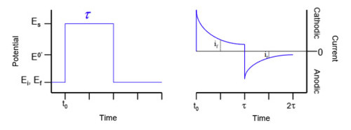

Además, mediante esta técnica no se requiere etiquetado del compuesto a caracterizar.

### Voltamperometría cíclica

La voltamperometría (CV) [[3]](https://www.cio.mx/invest_13/gpom/archivos/Taller%20_CaracterizacionEQ_sesion2.pdf) es una técnica electroquímica que consiste en aplicar un potencial eléctrico a un electrodo de trabajo, el cual se encuentra sumergido en una disolución que contiene una especie electroactiva y se mide la intensidad de corriente (I) que circula por dicho electrodo.

La voltamperometria ciclica, en cambio, se utiliza para estudiar mecanismos de reacción como los procesos redox. La variación de potencial en un electrodo estacionario es provocada por una señal de forma triangular que se invierte y vuelve a su valor original, dando lugar a la forma típica de la CV.

En la gráfica, la corriente eléctrica se sitúa en el eje vertical y el voltaje (que se aplica a la celda electroquímica), al eje horizontal. Se realiza un barrido del voltaje que hace que la reacción de electrolisis cambie constantemente de dirección.

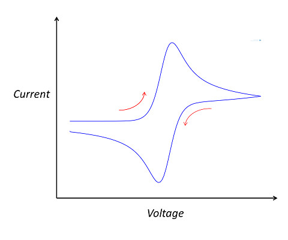

## Objetivos

El objetivo del proyecto es la obtención de medidas de concentración en muestras de **ferricianuro de potasio** a diferentes concentraciones en un _buffer_ de **cloruro de potasio**. Estas mediciones electroquímicas están basadas en los 2 tipos previamente descritos: la cronoamperometría y la voltametría cíclica.

Por lo tanto, los objetivos se pueden resumir en los siguientes puntos:

- Programar un potenciostato mediante la placa STM-32 Núcleo 64.
- Realizar una medición mediante una voltametría cíclica.
- Realizar una medición mediante una cronoamperometría.
- Controlar la unidad de alimentación, _power management unit_ (PMU) del módulo del _front-end._
- Comunicarse con la aplicación **viSens-S** mediante el protocolo [**MASB-COMM-S**](https://github.com/Biomedical-Electronics/masb-pot-s-blaugrana/blob/master/Docs/protocolo-de-comunicacion.md).

Además, ciertos requerimientos específicos tienen que ser cumplidos para la correcta implementación. Por lo que corresponde a la PMU, esta debe ser iniciada al inicio de la medición y no volverse a deshabilitar. Por otra parte, la comunicación debe ser realizada con el _host_ mediante una **comunicación asíncrona con configuración 115200 8N1**. Los tipos de configuración así como sus parámetros y significado, se pueden encontrar en este enlace. La codificación de la información debe también ser realizada en **COBS**, donde el carácter 0x00 implica la finalización del mensaje a enviar. Por lo que corresponde al microcontrolador y su función, este debe actuar de esclavo del master, y atender a las instrucciones sobre las mediciones a realizar reflejados en el protocolo [MASB-COMM-S](https://github.com/Biomedical-Electronics/masb-pot-s-blaugrana/blob/master/Docs/protocolo-de-comunicacion.md). También, en el momento en el que se envíe la instrucción correspondiente, el microcontrolador debe iniciar la medición.

Otro aspecto a tener en cuenta hace referencia a cuando una medición no se esté realizando. En ese caso, el relé del circuito del _front-end_ que conecta al _Counter Electrode_ (CE) debe quedar abierto.

En cuanto a la programación en el entorno de STM en específico, esta se ha realizado de tal forma para que 2 funciones setup y loop sean creadas con el objetivo de simplificar el código y así liberar el fichero principal de ejecución `main.c`

## _Software_ y _hardware_

Como bien se ha comentado en secciones anteriores, el proyecto está basado en un _front-end_ de medición así como el _back-end_ de control. Por esta razón, tanto _hardware_ como _software_ son vitales para el desarrollo del proyecto y su adecuada programación.

Por lo que respecta al microcontrolador, su programación es de crucial importancia dado su papel imprescindible en la comunicación y control del potenciostato así como para la recepción de instrucciones de medición, datos y su pertinente envío. La placa STM32F4021 Núcleo-64 ha sido la usada para este proyecto, por lo que su programación ha sido también realizada con su _software_ pertinente en lenguaje C **STM32CubeIDE.**

La placa STM tiene incorporados ciertos periféricos, los cuales han sido usados para la realización de este proyecto. Son el caso del periférico `USART`, para la comunicación con el _host_ (la aplicación _viSens-S_), y de I2C para la comunicación con el DAC del _front-end_ a la hora de establecer su tensión de salida y polarizar la celda. También cabe destacar el uso de salidas digitales para abrir/cerrar el relé así como para activar la PMU. Finalmente, el uso del ADC del microcontrolador toma un papel protagonista a la hora de leer la tensión y determinar la corriente de la celda.

El proyecto también gira alrededor de la aplicación de escritorio _viSens-S_. Su función es la de enviar las instrucciones pertinentes para realizar las medidas, así como el recibimiento de los datos y su correspondiente visualización. Ya que las pruebas no se han podido realizar de forma directa en la celda, el uso de un potenciómetro en la placa ha sido clave para poder determinar el correcto funcionamiento de la comunicación implementada y la toma de medidas. Mediante su divisor de tensión y la conexión de su terminal variable a la entrada analógica del microcontrolador, se ha podido ir comprobando el correcto funcionamiento del sistema.

## Módulos del _front-end_

En esta sección se explica en más detalle los componentes del _front-end_ del potenciostato controlado por el microcontrolador y su función. Esto es esencial para poder implementar de forma detallada la programación, y tener en cuenta algunas de las fórmulas para ciertas variables de los prototipos usados.

- **_Power Management Unit_ (PMU)**

La PMU es la unidad gestora de potencia (alimenta el _front-end_). Por defecto se encuentra deshabilitada y por lo tanto se tiene que activar de inicio. Mediante el microcontrolador deberemos habilitar su alimentación en el pin `EN`, el cual tendrá que tener un estado `HIGH`.

- **Relé**

El circuito del _front-end_ se encuentra conectado o desconectado de la celda mediante la apertura del relé. Cuando este se encuentra abierto no habrá conexión posible y, por consiguiente, no se toman medidas. Esta es su configuración por defecto. Por lo tanto, cuando una medida quiera tomarse, el relé se deberá cerrar y volver abrirse al final. Su control se encuentra en el pin `RELAY`.

- **Potenciostato**

Como ya hemos comentado anteriormente, el potenciostato es el encargado de polarizar la celda a una cierta tensión (_Vcell_) para poder leer una corriente (_Icell_).

En nuestro caso, la polarización se da mediante un DAC (_Digital to Analog Converter_) **MCP4725**. Su comunicación se da puede dar con I2C a la dirección `1100000` para determinar el voltaje a fijar. Puede generar una tensión de 0 a 4 V. Además, esta señal unipolar se encuentra seguida de una etapa para generar voltajes tanto positivos como negativos, es decir de -4 a 4 V. Es importante tener en cuenta la fórmula que relaciona la tensión de salida del DAC con la tensión de la celda _Vcell_:

$$
V_\textrm{DAC}=1.65-\frac{V_\textrm{CELL}}{2}
$$

Aun así, esta tensión no se puede dar por conocida de forma exacta. Es por esto que mediante el ADC del microcontrolador se puede leer **Vadc**, la cual es medida por el **_reference electrode (RE)_** y que posteriormente es introducida a través de un circuito que convierte la **señal bipolar** en **unipolar** de nuevo. Dada esta consideración, la tensión medida por el ADC y la de la celda se relacionan de la siguiente forma:

$$
V_\textrm{CELL}=2\left( 1.65-V_\textrm{ADC}\right)
$$

Por último, la corriente de la celda es medida gracias al uso de un **amplificador de transimpedancia (TIA),** el cual contiene una resistencia de 10 kΩ. En este caso la señal también se convierte en unipolar pasando por un conversor. Por lo tanto, la corriente se define de la siguiente forma:

$$
I_\textrm{CELL}=\frac{2\left( V_\textrm{ADC}-1.65\right)}{R_\textrm{TIA}}
$$

Todas las fórmulas expuestas anteriormente deberán usarse en el programa para poder determinar correctamente los voltajes y las corrientes fijadas y medidas en la celda.

## Git y GitHub

Para realizar proyectos basados en el desarrollo de código en equipo, existen dos herramientas muy útiles: Git y GitHub. **Git** es un sistema de control de versiones (VCS) mientras que **GitHub** es un sitio web que proporciona una infraestructura al servidor Git y da alojamiento a todos sus repositorios, así como diferentes herramientas para trabajar con ellos.

Un sistema de control de versiones es una herramienta que nos permite colaborar con otros desarrolladores o usuarios de un proyecto sin peligro de que sobrescriban el trabajo de los demás. Además, nos permite volver a versiones anteriores del código ya que, como hemos dicho, no se sobrescriben una vez guardadas.

### Ramas de desarrollo

Para trabajar de forma más organizada y no sobrescribir los archivos, es común crear versiones separadas del código (llamadas **ramas** en Git) y después fusionarla con la versión **maestra** cuando hayamos terminado de editarla. Si observamos la siguiente imagen, los nuevos cambios se probarían en las ramas `feature` y, una vez confirmada su validez, serían añadidos a la rama `develop` para, finalmente, añadirlos a la rama `master`.

Una opción comúnmente escogida, es que cada desarrollador cree su propia rama y edite el proyecto general desde esta. En el caso de nuestro proyecto, las distintas ramas han sido creadas según su funcionalidad, es decir, se creó una rama para la cronoamperometría, una rama para la voltametría cíclica, una rama para la comunicación ADC, etc. A continuación, vamos a proceder a describir cada una de estas ramas:

- **master:** en esta rama encontraremos, al finalizar el proyecto, el código a entregar. Es decir, que hasta el último día, las ramas `feature` y `develop` no van a ser fusionadas con la rama `master`.
- **develop:** a medida que las ramas `feature`, en las que iremos testeando las distintas medidas electroquímicas y comunicaciones de nuestro proyecto, vayan funcionando de manera exitosa, las iremos fusionando con la rama `develop` para integrarlas en el proyecto. Solo en el paso final, serán volcadas a la rama `master`.
- **feature/adc:** en esta rama se configura el reloj y toda la conversión analógica a digital. En estos archivos deben incorporarse todas las `librerías HAL`.
- **feature/chronoamperometry:** esta rama contiene toda la programación de la cronoamperometría, en la que se fija una tensión constante de la celda electroquímica durante un tiempo determinado y se toman las muestras.
- **feature/dac:** en esta rama, debemos configurar el DAC (_Digital to Analog Converter_) `MCP4725` mediante la dirección del dispositivo y la del esclavo, la tensión de referencia, el voltaje deseado, etc.
- **feature/stm32main:** esta rama corresponde a la operativa del microcontrolador, es decir, donde se llaman a todas las funciones (la cronoamperometría, la voltametría cíclica, las comunicaciones, etc.) para ejecutar el programa completo. Así, en esta rama, podemos encontrar las funciones “setup” y “loop” para que ejecuten las medidas de manera indefinida siempre y cuando se cumplan las condiciones preestablecidas.
- **feature/prova:** finalmente, en esta rama hemos volcado todo el código para hacer tests antes de hacer el _Pull Request_ en la rama `develop`. Ha sido otra rama de seguridad previa a la `master`.

## Procedimiento

En esta sección hablaremos sobre el funcionamiento de los programas (la cronoamperometría, la voltametría cíclica, las comunicaciones, etc.) así como sus diagramas de flujo.

Aún así, antes de ello, hablaremos de cómo conectar el potenciostato a la placa (el **_pinout_**), de cuáles son estos pines usados por el microcontrolador (_PA0, PA1, PB8_...) para el control del potenciostato, así como su tipología y descripción.

### Pinout de la STM32 Núcleo 64

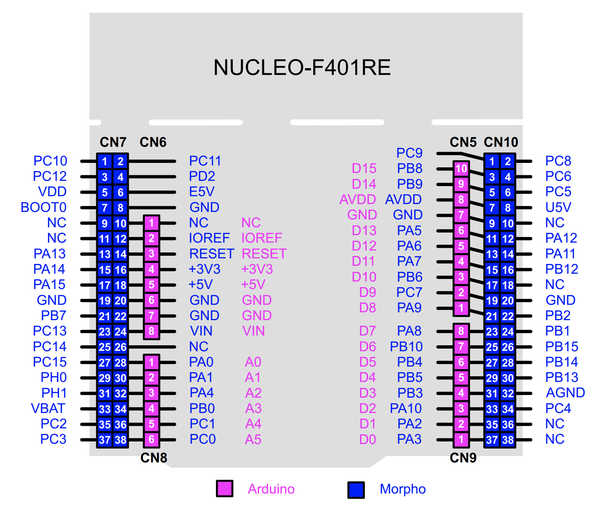

Como se puede observar en la imagen, hay muchos pines disponibles en esta placa de evaluación, pero no todos ellos son necesarios para el uso del potenciostato. Este dispositivo consta de cinco cables que debemos conectar a 5 pines de la placa. Estos son los pines analógicos de la placa **A0** y **A1**; los pines que permiten la comunicación I2C (**SCL** y **SDA**), el pin de salida digital **D4** y; por último, el pin **SCK**.

- Los pines analógicos se utilizan para medir las **tensiones de la celda electroquímica**. Por un lado, el pin PA0 se usa para medir la tensión de referencia de la celda electroquímica (**VREF**), usada para medir VCELL. Y, por otro lado, el pin PA1 representa la tensión de salida del TIA, el cual se usa para medir **ICELL**.
- Los pines PB8 y PB9 se encarga las señales _Serial Data_ (SDA) y _Serial Clock_ (SCK), para comunicar el maestro con el esclavo mediante I2C.
- El pin PA5 representa el estado de la PMU, siendo `0`: deshabilitada y `1`: habilitada.
- Finalmente, el pin PB5 representa el control del relé (el cual deja pasar, o no, la corriente). Por lo tanto puede estar abierto (`0`) o cerrado (`1`).

### Diagramas de flujo

A continuación, en esta sección, se especificará el flujo de trabajo seguido para la implementación final de la aplicación y realización de los objetivos previamente definidos.

Antes de explicar el funcionamiento del programa y para facilitar el entendimiento de los siguientes diagramas, vamos a hacer un glosario de todos los archivos existentes en `masb-pot-s-firmware`:

- En la carpeta `Core/Inc` encontraremos el _header file_ `main.h` (entre otros) y dentro de la carpeta `Inc/components`, usaremos los siguientes archivos:
  - `ad5280_driver.h`
  - `adc.h`
  - `chronoamperometry.h`
  - `cyclic_voltammetry.h`
  - `dac.h`
  - `cobs.h`
  - `formulas.h`
  - `i2c_lib.h`
  - `masb_comm_s.h`
  - `mcp4725_driver.h`
  - `stm32main.h`
- En la carpeta `Core/Src` encontraremos el _source file_ `main.c` (entre otros) y dentro de la carpeta `Src/components`, usaremos los siguientes archivos:
  - `ad5280_driver.c`
  - `adc.c`
  - `chronoamperometry.c`
  - `cyclic_voltammetry.c`
  - `dac.c`
  - `cobs.c`
  - `formulas.c`
  - `i2c_lib.c`
  - `masb_comm_s.c`
  - `mcp4725_driver.c`
  - `stm32main.c`

Ahora sí, vamos a ver la descripción del programa.

#### viSens-S y su comunicación

En referencia a la aplicación de escritorio así como el envío inicial de instrucciones y medidas tomadas, su diagrama es representado a continuación:

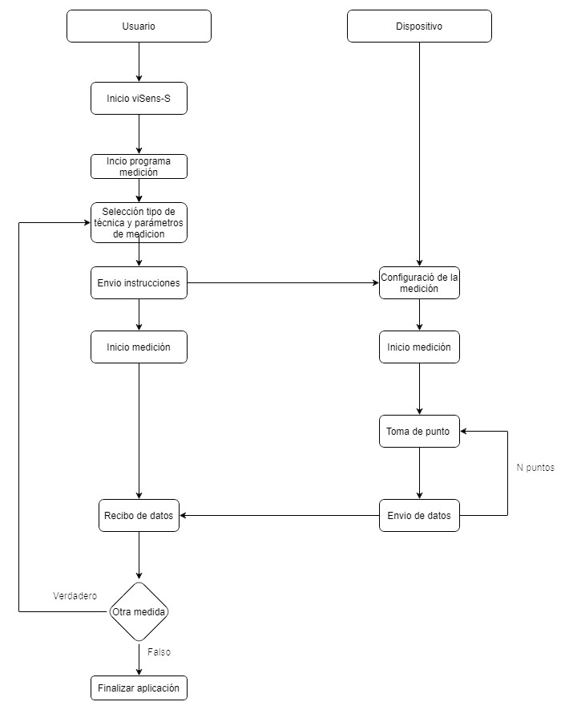

Para la implementación del flujo de trabajo representado, la comunicación asíncrona mediante **USART** así como la codificación **COBS** y el protocolo [MASB-COMM-S](https://github.com/Biomedical-Electronics/masb-pot-s-blaugrana/blob/master/Docs/protocolo-de-comunicacion.md) entre el dispositivo y la aplicación de escritorio es esencial. Por esta razón, los archivos `cobs.c` y `masb_comm_s.c` realizan esta función. El primero se encarga de la codificación/decodificación de la información, mientras que el segundo, por su lado, configura la comunicación asíncrona, el recibimiento/lectura de instrucciones de medición para almacenar sus parámetros en las debidas estructuras (mediante uniones), así como la transmisión de los datos obtenidos. Cabe destacar que estas funcionalidades ya se encontraban hechas en prácticas anteriores de la asignatura. La toma de medidas dependiendo de su técnica será expuesta de forma detallada a continuación.

#### Cronoamperometría

De forma general, la funcionalidad de la cronoamperometría puede ser representada de la siguiente forma:

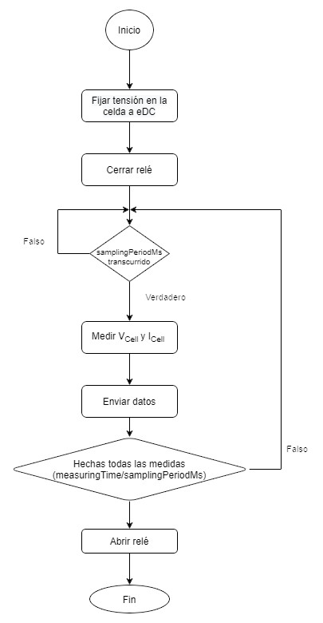

Diferentes ficheros han sido necesarios para implementar el proceso de medición mediante cronoamperometría, ahora vamos a detallar cada uno de ellos. Cabe destacar que muchos de los ficheros que se comentan en este apartado serán usados más adelante también. Por poner un ejemplo: la implementación del ADC tendrá que ser llamada tanto desde la cronoamperometría como desde la voltametría cíclica, evidentemente. Así pues, vamos a ver cuáles son estos ficheros que componen la CA:

- `chronoamperometry`: En este fichero se encuentra reflejado, en primer lugar, la obtención de las instrucciones de la medición: voltaje a fijar (`eDC`), el `sampling period`, así como el tiempo total de la medida. También se cierra el relé y se configura el _timer_ con el _sampling period_ determinado (la función **ClockSettings**, se encuentra definida en otro fichero que comentaremos a continuación). Además, se calculan el número de muestras a realizar, dados el tiempo de la medida y el _sampling period_. De esta forma, iniciamos un bucle con un contador. Se establece una variable "estado" que define qué esta midiendo el sensor, en este caso, se encuentra haciendo una cronoamperometría así que marcará `estado = CA`. Posteriormente veremos que esto es usado por el _timer_. Finalmente, al acabar la medida el relé se abre.

- `adc`: este fichero tiene dos funciones principales, la propia **conversión ADC** para la medición, y la **configuración del _timer_** para que la interrupción se dé según la frecuencia enviada por el usuario. Estas funcionalidades son llamadas y usadas tanto en la cronoamperometría como en la voltametría cíclica.

  - `ADC_measure()`: esta función es la encargada de inicializar el ADC para la medición de **Vcell** y **Icell**. Para ello se debe tener en cuenta los bits del ADC (12, en este caso) así como el voltaje de referencia (3.3 V) para poder determinar los valores medidos. Finalmente, los parámetros medidos juntamente con el punto al que corresponde y el tiempo es guardado en una estructura para ser enviado.
  - `ClockSettings()`: esta función se encarga de determinar el periodo de muestreo en el _timer_ para que, mediante este, siempre que la interrupción ocurra en el _sampling period_ determinado en las instrucciones, se haga una medida.

- `dac`: en este fichero se encuentran definidas las funciones de _setup_ para inicializar el DAC dada su dirección en I2C. También se define la función **sendVoltage()**, en la que se introduce el voltaje a determinar en la celda y que, además, calcula el voltaje a enviar por el DAC para ello. Estas funcionalidades también deberán ser usada y llamadas en la **voltametría cíclica.**

#### Voltametría Cíclica

La funcionalidad de la voltametría se encuentra resumida en el diagrama de flujo superior. Igual que con el caso anterior, el uso del fichero ADC como el del DAC son esenciales para medir y fijar los voltajes. En especial para la voltametría, encontramos el fichero de `cyclic_voltammetry`, el cual implementa el flujo de la figura.

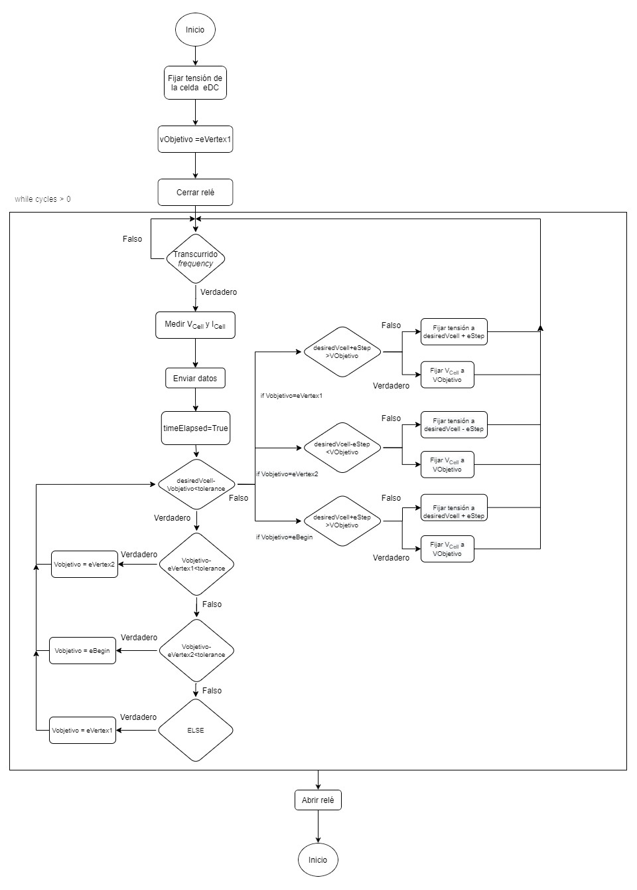

Primero de todo, la obtención de las instrucciones de la medición: voltaje a fijar (`eBegin`), los distintos vértices de la señal de voltaje, los ciclos a realizar, así como el `scanRate` (la variación de la tensión en la celda con el tiempo) y el `eStep` (incremento/decremento entre distintos puntos consecutivos). Posteriormente mediante la siguiente formula del periodo de muestreo se determina, para ser introducida en la función **ClockSettings()** previamente comentada para realizar las pertinentes mediciones. El programa se ejecuta siempre y cuando los ciclos a realizar no hayan finalizado (es decir, siempre que los ciclos > 0) y cada vez que salte la interrupción dado el periodo de muestreo. Primero se determina si el voltaje ha llegado a uno de los vértices, de ser así, el siguiente objetivo de la señal voltaje a enviar a la celda es el vértice consecutivo. De no haberse llegado al vértice objetivo, un cierto decremento o incremento (dependiendo en qué vértice nos encontremos) es aplicado a la señal voltaje enviada a la celda hasta llegarse a dicho objetivo. En caso de llegarse y pasarse de este, el propio objetivo es aplicado a la celda. Cabe destacar que en este flujo se considera siempre que eVertex2 < eBegin < eVertex1 para realizar los pertinentes incrementos y decrementos, por lo tanto distinta configuración a esta no resultaría en buenas medidas. Finalmente, al acabar la medida el relé se abre. Igual que con la cronoamperometría, el estado mientras se realizan las mediciones se define como CV, para que cuando salte la interrupción las pertinentes mediciones de esta técnica se den. Esto se verá en más detalle a continuación con la implementación en el fichero **stm32main.**

#### Microcontrolador

En el fichero `stm32main` se encuentra el funcionamiento del microcontrolador para determinar, según la instrucción recibida, la medición con la técnica correspondiente. Primero de todo, los periféricos son iniciados (tales como la comunicación I2C) así como las salidas GPIO para poder configurar los módulos del _front-end_ como la PMU. El DAC también se configura (el cual tiene una función generada en el fichero `dac`: **setup_DAC () )** así como el potenciómetro para determinar el valor de su resistencia. Finalmente, el microcontrolador se mantiene a la espera de recibir una instrucción por parte del _host_.

Según el comando recibido del protocolo de comunicación MASB-COMM-S, la medición correspondiente se realiza. Primero de todo, los parámetros de la medición son extraídos para ser guardados en las correspondientes estructuras, para, finalmente, ejecutar el flujo de cada medición. Por cada técnica, el estado CA para la cronoamperometría así como CV para la voltametría cíclica se definen. Estos son usados en la interrupción del _timer_, en la cual se determina en qué estado se encuentra la medición y la realiza para ser enviada al _host_. Además, el count es incrementado cada vez que una medida es tomada para así numerar los puntos. De esta forma se va realizando la técnica correspondiente hasta que esta finalice y otra sea recibida.

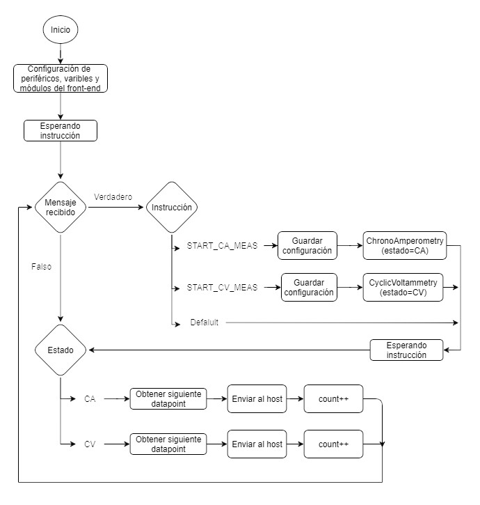

## Resultados

Ya realizada la implementación de todo el programa, era hora de saber su funcionamiento real.

### Tests iniciales

Antes de todo, se testeó con el circuito representado en la figura siguiente:

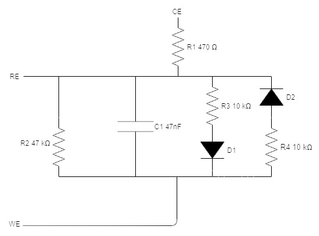

Tanto la cronoamperometría como la voltametría cíclica demostraron realizar unas medidas correspondientes a lo esperado. Los resultados para esta primera prueba se pueden ver a continuación:

#### Cronoamperometría

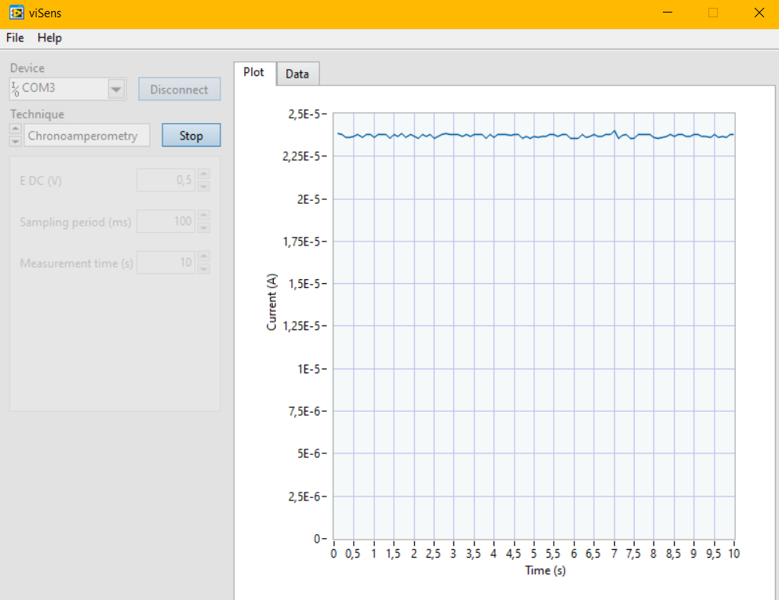

#### Voltametría Cíclica

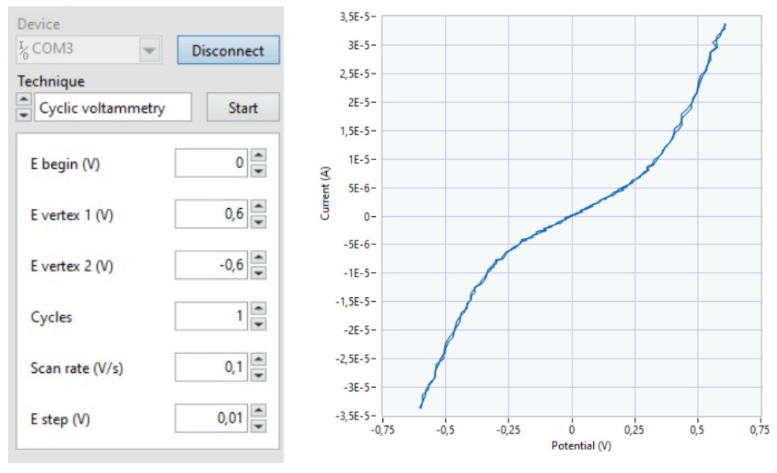

### Prueba final

Sin embargo, el objetivo final del proyecto es poder realizar las distintas técnicas para realizar mediciones en muestras de **ferricianuro de potasio** a diferentes concentraciones en un **buffer de cloruro de potasio.** Específicamente, **1 mM y 5 mM** fueron usados para las pruebas.

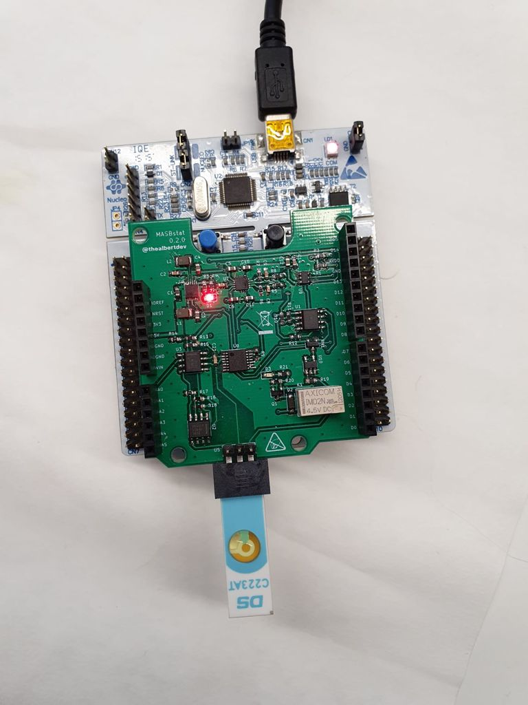

En la figura superior se puede observar la placa del microcontrolador juntamente acoplada con el chip donde se depositan las muestras para poder ser medidas con la implementación realizada.

Los resultados obtenidos en **viSens-S** con respecto a los parámetros definidos en cronoamperometría fueron los siguientes, tanto para 1 mM como 5 mM.

#### Cronoamperometría

|      Parámetros      | Valor |
| :------------------: | :---: |
|       E DC (V)       | 0.15  |
| Sampling period (ms) |  20   |
| Measurement time (s) |  10   |

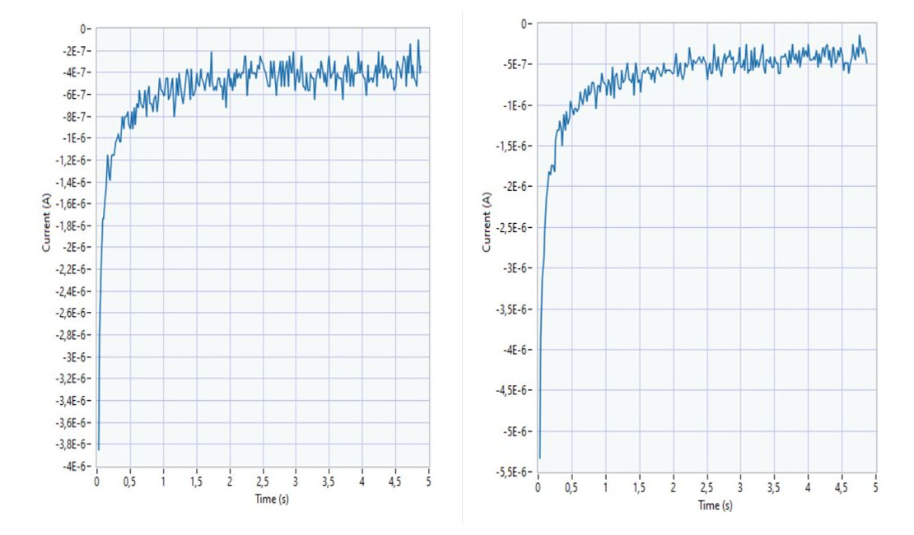

Para observar de forma más visual sus diferencias (dadas las distintas concentraciones usadas), se han superpuesto las dos gráficas:

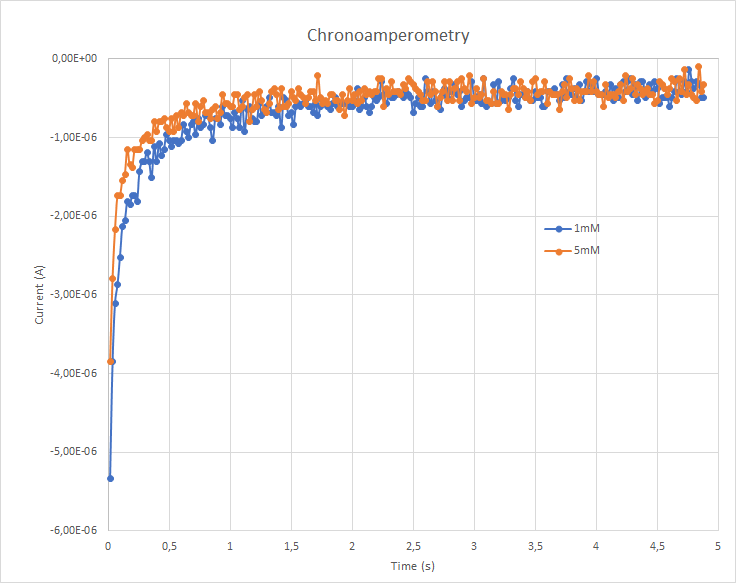

En la gráfica superior puede observarse el distinto comportamiento dados los mismos parámetros de medición en caso de tener distintas concentraciones en la muestra.

#### Voltametría Cíclica

De la misma forma, se realizaron las medidas con la voltametría cíclica, obteniendo los siguiente resultados con la aplicación viSens-s:

|   Parámetros    | Valor |
| :-------------: | :---: |
|   E begin (V)   |  0.7  |
| E vertex 1 (V)  |  0.8  |
| E vertex 2 (V)  | -0.1  |
|     Cycles      |   4   |
| Scan rate (V/s) |  0,1  |
|   E step (V)    | 0,01  |

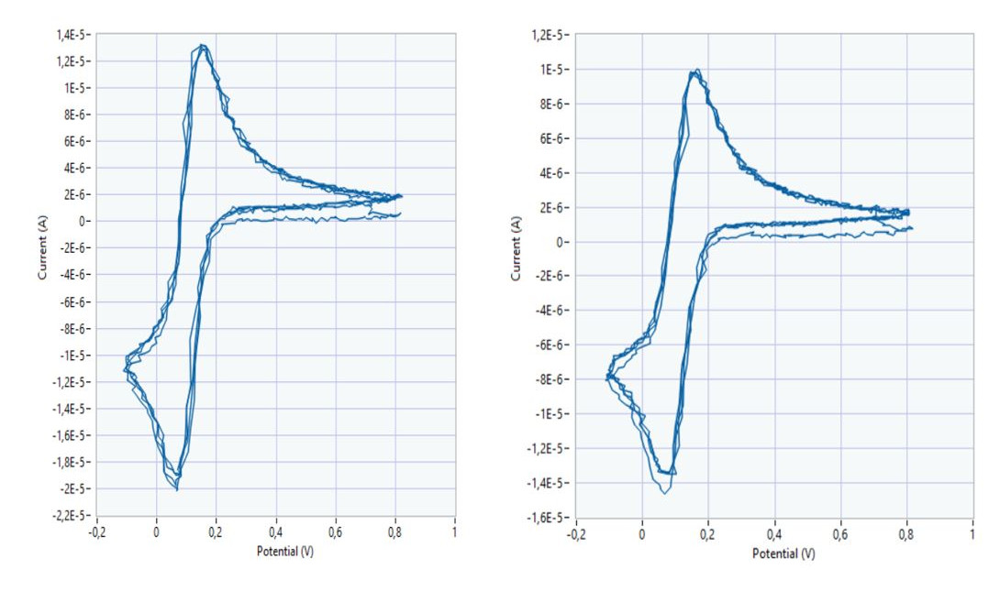

Otra vez, para poder determinar las diferencias de forma clara con las distintas concentraciones, se han superpuesto las gráficas:

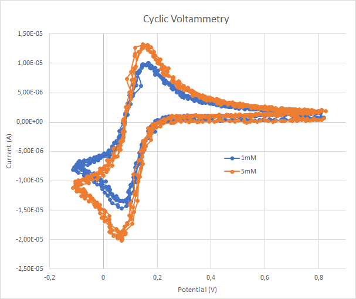

Dados estos resultados, se puede confirmar el buen funcionamiento del microcontrolador y su comunicación para poder realizar las dos técnicas electroquímicas.

## Conclusiones

Con la finalización de este proyecto, podemos concluir que se ha podido realizar de manera satisfactoria 2 técnicas de medición electroquímicas mediante un potenciostato controlado por el microcontrolador: la cronoamperometría y la voltametría cíclica. Para ello, se ha necesitado implementar y entender el funcionamiento de los distintos periféricos de la placa tales como los _timers_ y sus interrupciones, la comunicación USART y I2C, además del ADC. Es también importante destacar el papel del protocolo MASB-COMM-S juntamente con la codificación de los mensajes mediante COBS. También, el uso de Git y GitHub ha sido esencial para realizar las tareas de forma ágil, paralela y complementaria.

Respecto a la asignatura, en ella se ha podido adquirir las bases del funcionamiento de los microcontroladores y su programación tanto en Arduino como a nivel de registros. Esto se ha dado de forma muy progresiva, yendo primero a implementaciones sencillas como la simple activación de un LED, hasta la comunicación entre dispositivos con mensajes codificados a través de sus periféricos. Además, no solo se ha aprendido sobre los microcontroladores, sino que también se ha podido extraer la información esencial de _datasheets_ para nuestros proyectos de ingeniería además de adoptar una nueva forma de trabajo en nuestros desarrollos con la herramienta de Git.
