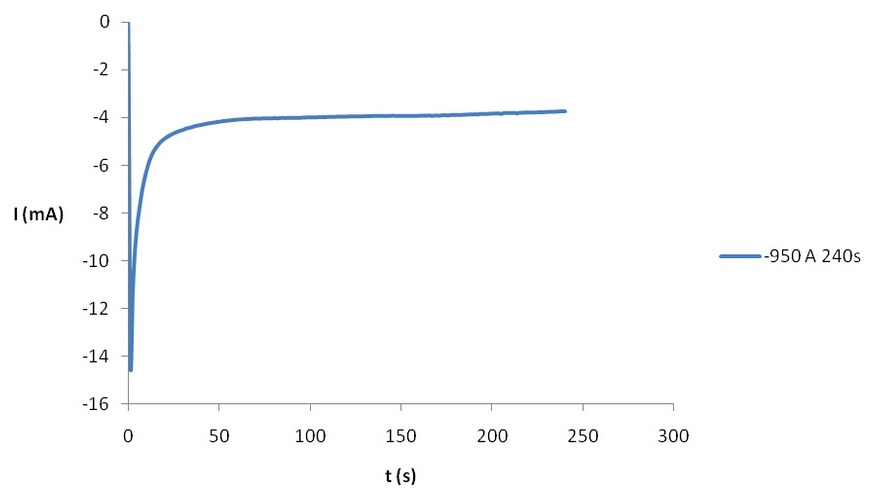

## Introduction

This project has consisted of the configuration and programming of a microcontroller to perform electrochemical measurements, such as chronoamperometry and cyclic voltammetry automatically by means of a potentiostat. It has been developed with the aim of achieving and consolidating all the knowledge seen and worked in the subject of Microcontrollers for Biomedical Applications and Systems. The authors of this work are Bruna Martín Català and Maria Mor Basart (see Figure 1 and Figure 2).

**_Figure 1._** Bruna Martín Català

**_Figure 2._** Maria Mor Basart

## Table of Contents

1. Introduction
   - Potentiostat
   - Cyclic Voltammetry
   - Chronoamperometry
   - Git and GitHub
2. Objectives
3. Project development
   - _Workflow_ of the cyclic voltammetry
   - _Workflow_ of the chronoamperometry
4. Results
5. Conclusions
6. References

### Potentiostat

This project is based on the programming of a potentiostat consisting of a front-end and a back-end based on the Evaluation Board (EVB) NUCLEO F401RE from STMicroelectronics. A potentiostat is an electronic device generally consisting of three electrodes and is used for electrochemical measurements and experiments. The system consists such that the working electrode must be maintained at a constant potential with respect to the reference electrode by adjusting the current at the auxiliary electrode [1]. Thus, the potentiostat must bias the electrochemical cell to a voltage Vcell and read the current Icell flowing through it. To set the Vcell voltage, we have the DAC MCP4725, whose I2C address is `1100000`. This model can generate an output voltage from 0 to 4 V, but a stage has been added to convert this signal to a bipolar signal from - 4 to 4 V to be able to bias to both positive and negative voltages [2]. The potentiostat used for this project can be seen represented in the following schematic (see Figure 3).

**_Figure 3._** Potentiostat used scheme.

### Cyclic Voltammetry

_Cyclic Voltammetry_ (CV) is an electrochemical measurement where information on the current of an analyte is obtained by changing the potential. These studies aim to study the reactivity in the half-cell of an analyte by controlling the potential of an electrode while measuring the resulting current [3]. Three electrodes are required for this purpose:
The working electrode (WE): it is in contact with the analyte and induces the potential. The reference electrode (RE): has a known potential so that the potential difference between it and the WE can be measured.Auxiliary electrode (CE): supplies the necessary current to maintain a constant WE.
This measurement is made by means of what is called a triangular sweep because the potential between the WE and the RE varies until it reaches an established one and then changes direction, and so on for a certain number of cycles. Below is an example of a graph obtained from cyclic voltammetry of the comparison of Sn redissolution in the modified Pt/Sn electrodes (see Figure 4).

**_Figure 4._** Exemplification of the results obtained in a cyclic voltammetry.

### Chronoamperometry

_Chronoamperometry_ (CA) consists of the study of the variation of the current response with time as a function of the control of a potentiostat. The working electrode, which is in contact with the electrolyte, is subjected to a constant change of potential from an initial to a final value for a given time [4]. The following image shows an example of a graph of a chronoamperometry in a H 2 SO 4 /ACN/CuSO 4 solution (see Figure 5).

**_Figure 5._** Exemplification of the results obtained in a cronoamperometry.

Thus, these two electrochemical measurements are the ones we will perform on two samples of _potassium ferricyanide_ at concentrations of 1 mM and 5 mM _potassium chloride_.

### Git and GitHub

This project is based on team code development. For this there are some tools that can facilitate version control among team members: Git and GitHub. Git is a very powerful open source code version control tool. A complete version history can be kept and it allows us to move in a very agile way through all the code revisions. In addition, it has a branching system that allows a correct organization and the realization of projects that converge in a main project, which allow testing codes before joining them [5].

For our project, four branches have been developed:

- `Develop`: where all the final tested code will be put together.
- `feature/crono`: for chronoamperometry
- `feature/volta`: for voltammetry
- `feature/setup`: to configure all the initial pins.

Although there are two branches for chronoamperometry and cyclic voltammetry, it should be noted that the correct and final code for both was done directly in the `develop` branch due to a technical glitch.

As for GitHub, it is a free application that allows you to manage Git repositories and contains a web interface to easily access and control the different versions of code.

## Objectives

The objectives of this project are as follows:

- To program a portable potentiostat.
- Control the Power Management Unit (PMU) of the potentiostat front-end module.
- Communicate with the viSens-S application installed with the host or computer through the MASB-COMM-S protocol.
- Perform cyclic voltammetry.
- Perform chronoamperometry.

## Project Development

### _Workflow_ of the cyclic voltammetry

First, we define and set the values of the following variables:

- `tomarPunto_CV` = `TRUE`
- We defined the `RTIA` resistance of 10,000 Ω.
- We set the cell voltage `Vcell` to `eBegin` that we get from the `cvConfiguration`.
- We set `vObjectivo` to `eVertex1`
- We obtain the `eStep` and `scanRate` from the `cvConfiguration` and define the period between samples, dividing both parameters.
- We define and initialize the `cycles` variable to 0.

We close the relay and, in case the number of cycles has not exceeded the one set in the `cvConfiguration` and the sampling period has elapsed, we start the `Vcell` and `Icell` measurements and send the obtained values to the _host_.

To start these measurements, we have used the boolean `tomarPunto_CV` in a conditional _if_, so that if this variable is `TRUE`, we will start these measurements. Right after the conditional we will change the value of the variable from `TRUE` to `FALSE`, which to make the next measurement will return to `TRUE` using one of the functions defined at the end of the _chronoamperometry_ code.

What we do from now on is a triangular sweep. We will start by applying an `eBegin` voltage to the cell and apply `eStep` increments or decrements to this voltage until we reach the voltage of `eVertex1` and, once we reach this, we will do the same until we reach the value of `eVertex2`. Once we reach this, we will do another sweep until we reach `eBegin`. All this process corresponds to a cycle, which we will have to repeat as many times as indicated by the cycles on the `cvConfiguration` .

The following image shows the aforementioned process (see Figure 6).

  

**_Figure 6_**. Flowchart followed to program the microcontroller when performing cyclic voltammetry.

### _Workflow_ of the chronoamperometry

For chronoamperometry we must also define some variables:

- `tomarPunto` = `FALSE`.
- `RTIA` = `50,000 Ω
- Set `Vcell` to `eDC` which we get from the `caConfiguration`.
- Set `sampling_period` and `measurement_time` to the same parameters of `caConfiguration`.
- We define the `counter` and `point` variables and initialize them to 0 and 1 respectively.

In this case we close the relay and take a first measurement of `Vcell` and `Icell`, which will later be sent to the _host_.

Next, the `counter` and `point` variables will sum the `sampling_period` and one unit, respectively, since we will have taken a sample. That is, the `counter` indicates the number of samples and the `sampling_period` the time each sample takes.

Once the first sample has been taken, in case the `counter` has not reached the `measurement_time`, we will continue taking samples, which will be sent to the _host_.

Finally, when the _timer_ reaches the `measurement_time`, we will have taken all the measurements and the relay will open.

Below is a schematic of the previously explained work flow for a better understanding (see _Figure_ _7_).

  

**_Figure 7_**. Flowchart followed to program the microcontroller when performing chronoamperometry.

## Results

This section shows the results obtained when testing the project in the potentiostat with two samples of _potassium ferricyanide_ at concentrations of 1mM and 5mM of _potassium chloride_.

For this purpose, we went to the Biomedical Engineering laboratory of the physics faculty of the University of Barcelona, where we were given the potentiostat, a sensor and the solutions, and where we were able to assemble everything (see _Figure 8_).

**_Figure 8._** Potentiostat connected with the sample of the solution in the sensor.

We first proceeded to perform cyclic voltammetry using the viSens-S program. However, the cyclic voltammetry did not work. Only the first measurement was taken, which is insufficient.

Next, chronoamperometry was performed with the same program and the following values:

- E DC (V): 0'15
- Sampling period (ms): 20
- Measurement time (ms): 10

On this occasion it was possible to visualize the results, although in the case of the 1 mM potassium chloride concentration sample, the current values were inverted, as can be seen in the following image (see _Figure 9_).

**_Figure 9_**. Chronoamperometry with 1 mM solution.

In the case of the following sample, the results are satisfactory, as can be seen in the following graph (see _Figure 10_).

**_Figure 10_**. Chronoamperometry with 5 mM dilution

## Conclusions

The potentiostat is an instrument widely used in electrochemical experiments and is key in the world of biomedical engineering to measure different concentrations of relevant substances that allow us to determine the level of health of an individual. This project allows us to have a first contact with the programming of a microcontroller for this instrument and, also, allows us to use the knowledge obtained throughout all the practicals performed in this subject.

Considering that the rest of the practices were about different aspects of programming a microcontroller individually and this practice integrates most of them, this project has presented several difficulties and complications. Especially when creating different code files for each of the features and running them together and also when using GitHub to access and modify the files shared with the partner.

Regarding the subject, we believe that the knowledge we have learnt will be very useful for our professional career, especially those related to the use of Git and GitHub to carry out code projects with future colleagues. In addition, it is also useful to have had this first contact with microcontroller programming which, despite our level of programming not being very advanced, has allowed us to introduce us to this useful area in order to enter the field of medical sensors.

## References

[1] [https://es.wikipedia.org/wiki/Potenciostato](https://www.google.com/url?q=https://es.wikipedia.org/wiki/Potenciostato&sa=D&source=editors&ust=1624208705621000&usg=AOvVaw05UpdH_ahg-zy-24YGOW2n)

[2] [https://github.com/Biomedical-Electronics/masb-pot-s-bm](https://www.google.com/url?q=https://github.com/Biomedical-Electronics/masb-pot-s-bm&sa=D&source=editors&ust=1624208714921000&usg=AOvVaw0hWntd790pF9gZvt45flmM)

[3] [https://es.wikipedia.org/wiki/Voltamperometr%C3%ADa#Sistema_de_tres_electrodos](https://www.google.com/url?q=https://es.wikipedia.org/wiki/Voltamperometr%C3%ADa%23Sistema_de_tres_electrodos&sa=D&source=editors&ust=1624211407232000&usg=AOvVaw0lqDA2zvza8hxYA-c0lx4b)

[4] [https://upcommons.upc.edu/bitstream/handle/2099.1/4861/06_Annexos.pdf?sequence=7&isAllowed=y](https://www.google.com/url?q=https://upcommons.upc.edu/bitstream/handle/2099.1/4861/06_Annexos.pdf?sequence%3D7%26isAllowed%3Dy&sa=D&source=editors&ust=1624211803222000&usg=AOvVaw1ESU1PXWi45ylYpIO4lmqh)

[5] [https://openwebinars.net/blog/que-es-git-y-para-que-sirve/](https://www.google.com/url?q=https://openwebinars.net/blog/que-es-git-y-para-que-sirve/&sa=D&source=editors&ust=1624217383894000&usg=AOvVaw0EpRCnOOUK7OXn_9Q4WeWS)
