This document details the programming of a portable potentiostat to be able to perform two types of electrochemical measurements:
cyclic voltammetry and chronoamperometry. In this project the **control** of a potentiostat has been carried out through a **microcontroller**.
The microcontroller is a very useful tool that will allow us to connect the potentiostat to a **computer** that will act as a user interface
so that it can make changes to the system and at the same time view the results. The specific objectives are described in the next section.

## Contents

- [Introduction](#introduction)
- [Objectives](#objectives)
- [Design](#design)
- [Results](#results)
  - [Cyclic Voltammetry of Diodes](#cyclic-voltammetry-of-diodes)
  - [Diode Chronoamperometry](#diode-chronoamperometry)
  - [Cyclic voltammetry of a compound](#cyclic-voltammetry-electrochemical-test)
  - [Chronoamperometry of a compound](#chronoamperometry-electrochemical-test)
- [Conclusions](#conclusions)

## Introduction

With advances in miniaturization it is possible to design complex **SoC** (Systems-on-Chip) in confined spaces, and obtain portable devices with a great
impact on health care. For this, biopotenciostats are one of the most important parts that make up a **biosensor**. This controls a cell composed of three electrodes:
the **working electrode** (WE), **the reference electrode** (RE), and an **auxiliary electrode** (AUX). The circuit maintains the potential of the working electrode at
a constant level with respect to the potential of the reference electrode, by adjusting the current at the auxiliary electrode.

This component is essential for those **electrochemical studies** with three-electrode systems used in the study of redox reactions and other chemical phenomena.

One of these electrochemical measurements is **Cyclic Voltammetry** (CV), a type of potentiodynamic measurement, that is, where a variable potential is applied to an
electrochemical cell. On the other hand, the current that this cell provides is measured and plotted against the applied voltage. The potential is measured between the
working electrode and the reference electrode, while the current is measured between the working and auxiliary electrode. The electrode potential increases linearly as
a **function of time** in **cyclic phases** until it reaches a value and changes direction. This mechanism is called **triangular sweep** of potential and can be seen
represented in the following figure [1](assets/triangular-excitation-CV.png). The rate of voltage change over time during each of these phases is known as **scan rate** (V / s).

  <a href="assets/triangular-excitation-CV.png">
    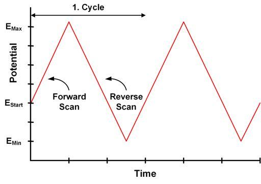
  </a>

The other measure involved in this project is **Chronoamperometry** (CA). In this, a **step signal** is applied, raising the potential value to such a degree that a redox
reaction occurs. And then, the **variation of the response** of the current is measured as a function of **time**.

In order to understand the project, the components of the _e-Reader_ circuit (_PMU_, _Front-End_, Microcontroller and display unit) of the potentiostat will be briefly explained. This explanation
will be accompanied by a schematic of the _Front-End_ circuit. In this diagram, neither the power supply nor the sensor is detailed, in our case the sensor is a three electrodes.
As we can see in the following figure the **PMU** extracts power from the source and converts it into the control and voltage supply signals. At the same time the
**_Front-end_** get the measurements. The output voltage of the _Front-end_ is processed by the **microcontroller** and is sent to the **LabView _viSens-S_** interface,
on our computers.

The _Front-end_ is responsible of stabilizing the voltage difference between the electrodes of the electrochemical cell and reading/processing the output signal.
The regulation voltage (VLDO) feeds the analog components of the _Front-end_. As we see in the circuit, the first amplifier is an Op-Amp that is used as a control.
This provides the sensor with the VIN, adjusted with a voltage divider (R1 and R2). We also find a buffer amplifier. We use this to isolate. The VOCV
is controlled by the microcontroller's ADC and applied to CE (in the cell) for reference. At the moment of taking the sample, the switch closes.
And the TIA (transimpedance amplifier) generates the output signal, through the R TIA, which is proportional to the current in the cell [1].

  

## Objectives

- Main: To program a portable potentiostat.
- Check the Power Management Unit (PMU) of the potentiostat front-end module.
- Send and receive data from the potentiostat.
- Get timer signals to control tempos.
- Generate interruptions in the sequence of actions.
- Convert analog signals into digital and vice versa.
- Communicate with the viSens-S application installed with the host or computer using the MASB-COMM-S protocol.
- Test the cyclic voltammetry.
- Test the chronoamperometry.
- Implement the branching policy for version control.

## Design

For each functionality described, a microcontroller tool has been configured:

- **USART**: allows to receive / send data through the enabled ports.

  <a href="assets/USART.png">
    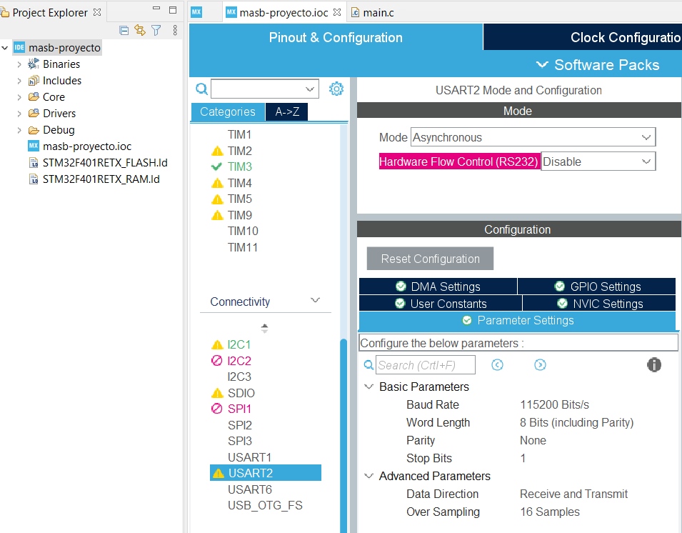
  </a>

We select _asynchronous mode_ in the `Mode` field and at the bottom we select the **communication parameters**: _baud rate_, _data bits_, _parity_, _number of stop bits_ and _oversampling_ (we leave it in 16 samples).

- **I2C**: information transmission protocol.

  <a href="assets/I2C.png">
    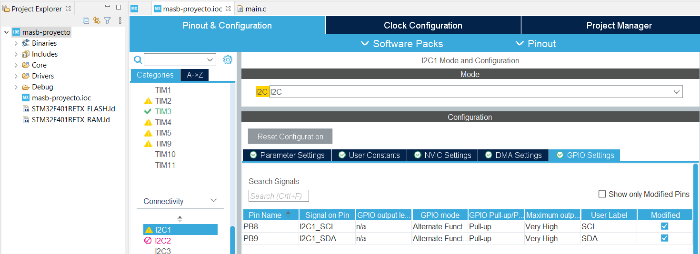
  </a>

We will assign to PB8 and PB9 the functions I2C_SCL (Serial Clock) and I2C_SDA (Serial Data) respectively.

- **TIMERS**: clocks that generate interruptions every certain units of time.
  

    <a href="assets/TIMERS.png">
      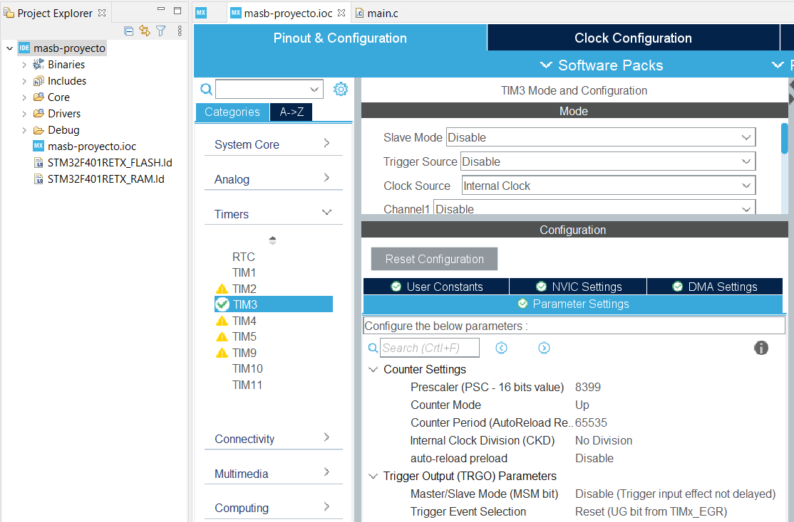
    </a>
  

If the timer operates with a frequency of 84 MHz as indicated in the _Clock Configuration_, we have to let the timer count up to 84,000,000 for 1 second to pass.
In the _Counter Period_ field we can only write a number of maximum 16 bits (which is equivalent to a maximum of 65,535). The alternative is to lower the frequency
of the _timer_ but without touching the clock (APB2). To avoid having to modify the prescaler, we take a frequency of a 1 ms divisor period. With a prescaler of 8,399,
you get a clock frequency of 10 kHz. In other words, each timer increment is 0.1 ms. As we have said, the _Counter Period_ is 16 bits (in the case of TIM3). Therefore,
it can be counted from 0 to 65.535 seconds with a resolution of 0.1 ms.

Once the period has been configured, in the _NVIC Settings_ tab of the same configuration form, we enable the _TIM3 global interrupt_ interrupt.

In another section, we will see how we configure the _timer_ for each electrochemical test by using formulas that contain values determined by the user, such as the
_sampling rate_.

- **ADC and GPIO**: programmable input / output pins. The inputs are analog and the outputs digital.

  <a href="assets/analog_input.png">
    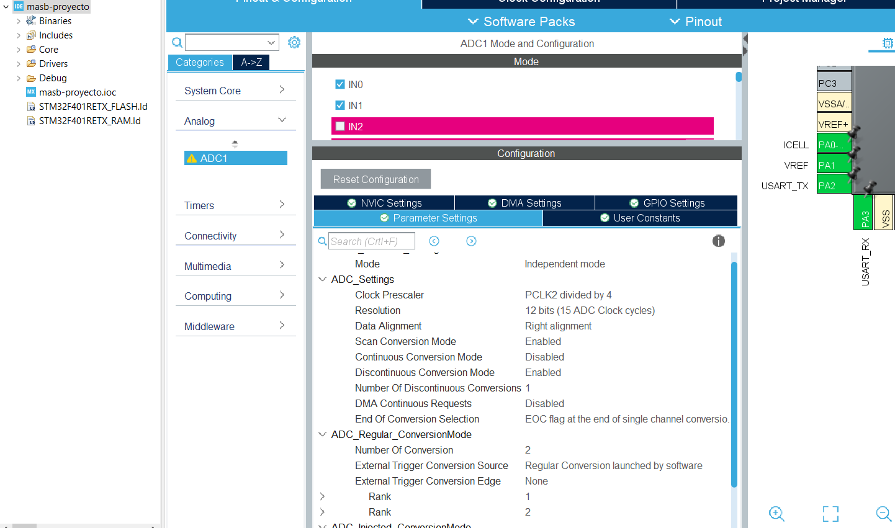
  </a>

For the analog inputs we use the ADC. Analog-to-Digital Converter is a fundamental peripheral that converts a DC voltage signal to a digital signal by performing a
discretization and quantization of the continuous signal. A single ADC can convert the signal from each of its channels by alternating between them.
For example, the ADC1*IN0 nomenclature indicates that it is channel 0 of ADC 1. The \_HAL* libraries allow us to operate the ADC and obtain the resulting value.

The digital outputs are configured as follows:

  <a href="assets/GPIO_output.png">
    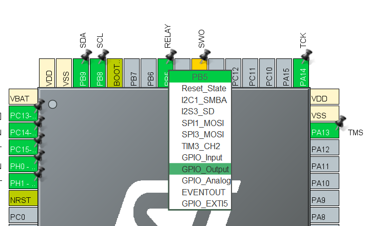
  </a>

And making use of the _HAL_ libraries we control them.

## Code-Operatives

The following diagrams show the operations of the cyclic voltammetry, chronoamperometry and main script of the stm32:

- CA_firstMeasure function of the chronoamperometry:

  <a href="assets/CA_firstMeasure_english.png">
    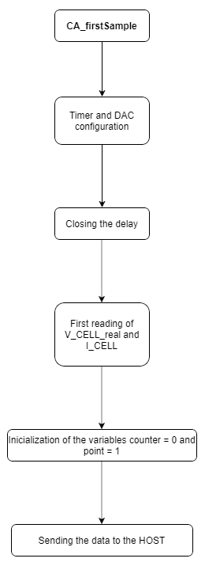
  </a>

- CA_testing function of the chronoamperometry:

  <a href="assets/CA_testing_english.png">
    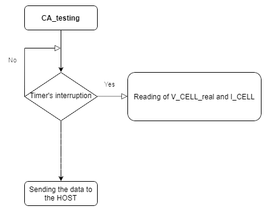
  </a>

- CV_firstMeasure function of the voltammetry:

  <a href="assets/CV_firstMeasure_english.png">
    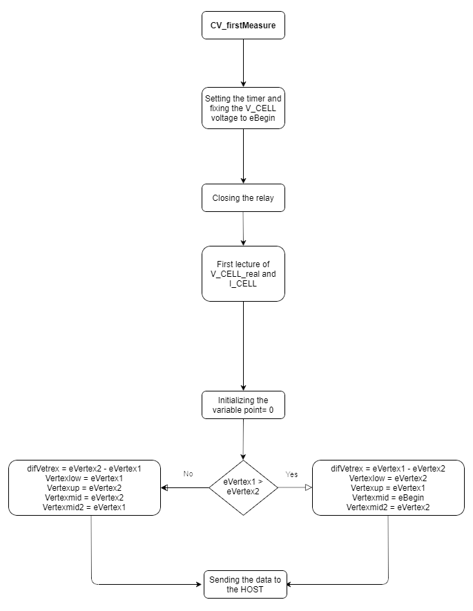
  </a>

- CV_testing function of the voltammetry:

  <a href="assets/CV_testing_english.png">
    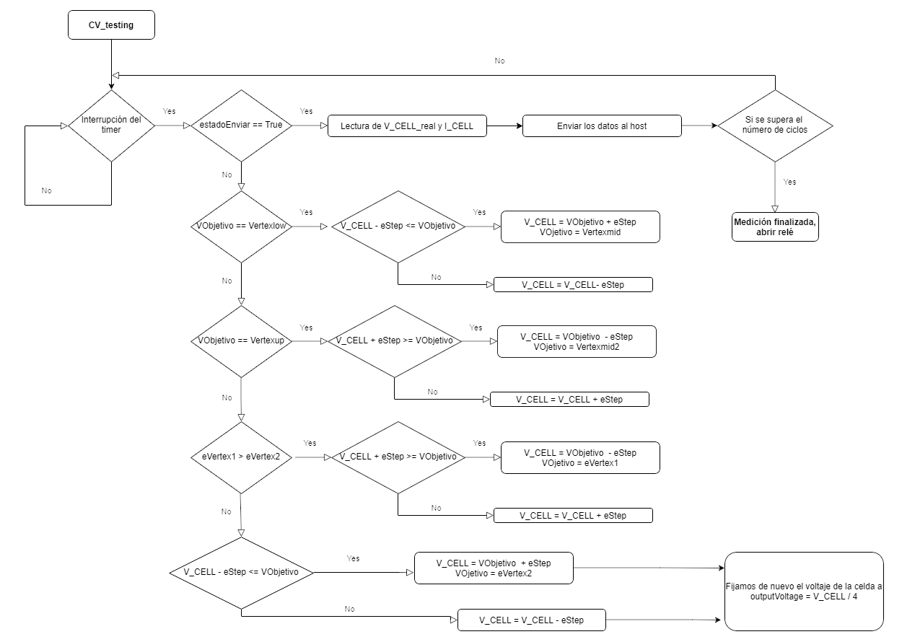
  </a>

- setup function from stm32.main script:

  <a href="assets/setup_ingles.png">
    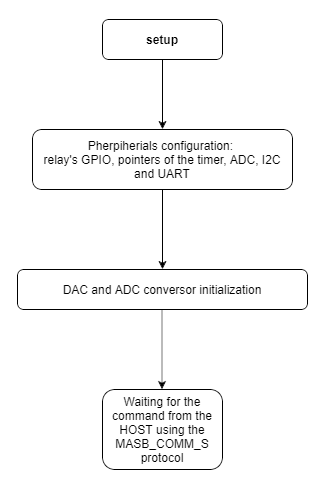
  </a>

- Loop function of the stm32.main script:

  <a href="assets/loop_english.png">
    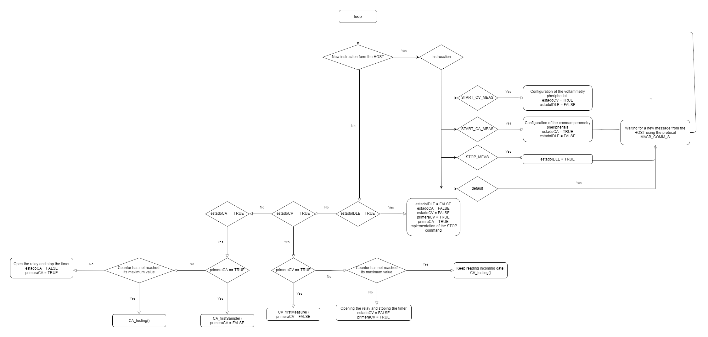
  </a>

## Results

Two tests have been carried out in different sessions. In the first, the system was tested with the following diode configuration:

  <a href="assets/circuit_diode.png">
    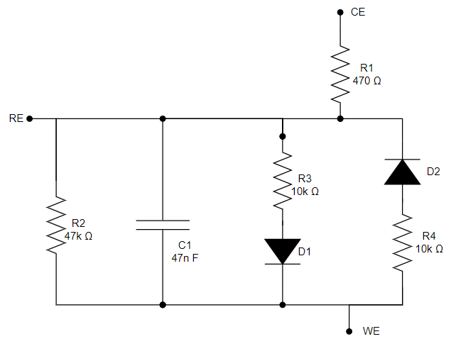
  </a>

In the following image, you can see the _setup_ of the day of the first test:

  <a href="assets/TEST1.jpeg">
    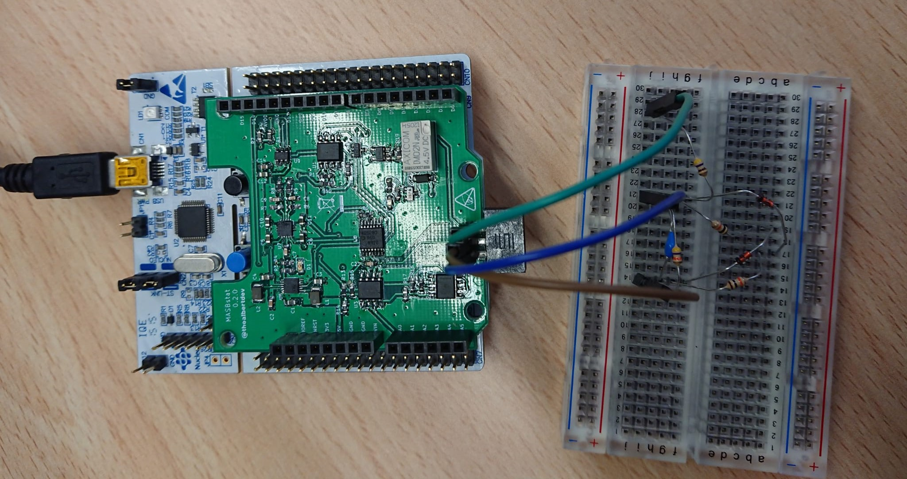
  </a>

### Cyclic Voltammetry of Diodes

The values entered by the user are read in the following table:

| Variable |  Value   |
| :------: | :------: |
|  eBegin  |  0.25 V  |
| eVertex1 |  0.5 V   |
| eVertex2 |  -0.5 V  |
|  cycles  |    2     |
| scanRate | 0.01 V/s |
|  eStep   | 0.005 V  |

<a href="assets/diode_CV_1.png">
  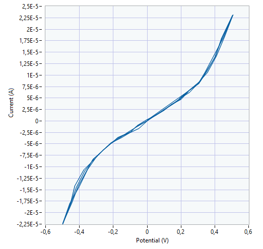
</a>

The new functionality that allows a value for vertex 2 greater than that of vertex 1 has been found to work.

<a href="assets/diode_CV_2.png">
  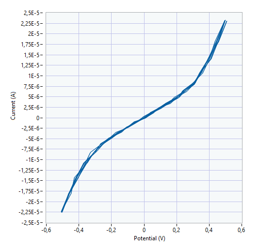
</a>

### Diode Chronoamperometry

The values entered by the user are read in the following table:

|     Variable     | Value |
| :--------------: | :---: |
|       eDC        | 0.3 V |
| samplingPeriodMs | 10 ms |
| measurementTime  | 120 s |

<a href="assets/diode_CA.png">
  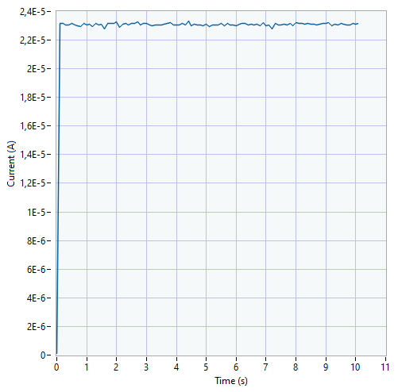
</a>

The results of the second test are shown below. In the following image we can see the _setup_.

  <a href="assets/TEST2.jpeg">
    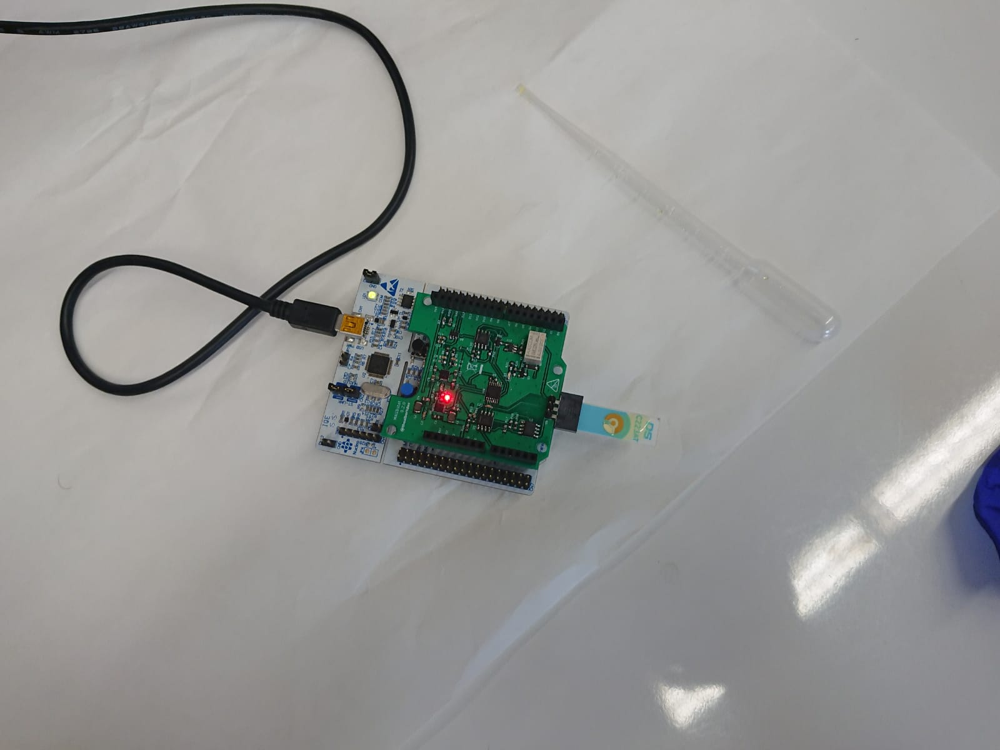
  </a>

### Cyclic Voltammetry: Electrochemical Test Finally, the device has been validated
by making measurements with a potassium ferricyanide sample at different concentrations
in a potassium chloride buffer. The values entered by the user are read in the following
table:

| Variable |  Value   |
| :------: | :------: |
|  eBegin  |  0.0 V   |
| eVertex1 |  0.6 V   |
| eVertex2 |  -0.6 V  |
|  cycles  |    2     |
| scanRate | 0.01 V/s |
|  eStep   | 0.005 V  |

For the 1mM buffer concentration:

<a href="assets/CV1.png">
  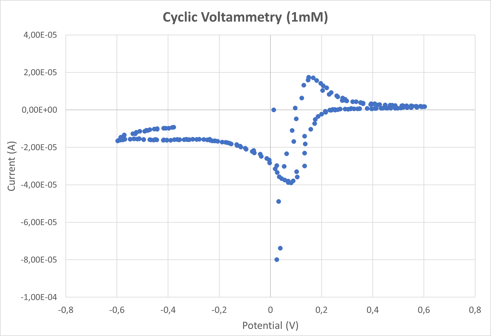
</a>

For the 5mM buffer concentration:

<a href="assets/CV5.png">
  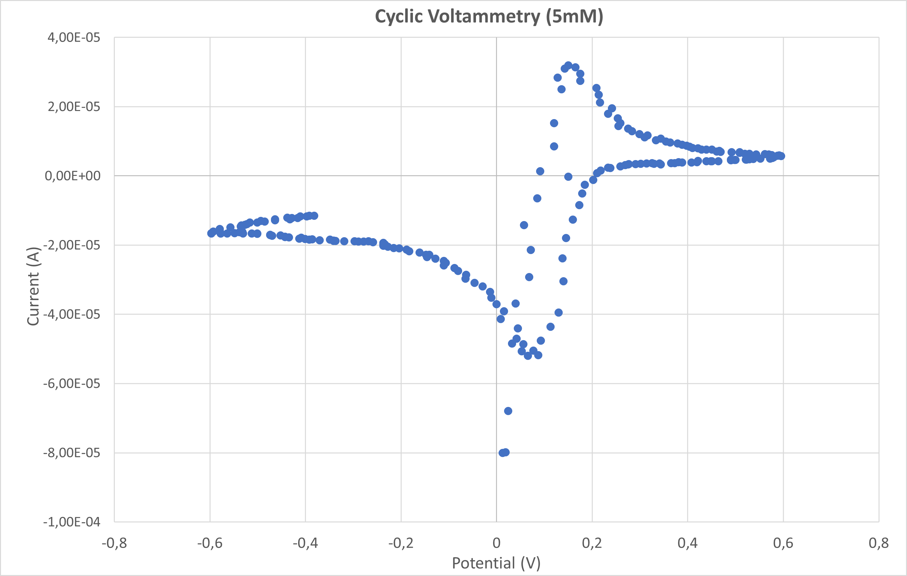
</a>

### Chronoamperometry: Electrochemical Test

The values entered by the user are read in the following table:
|Variable| Value
|:--------------------: |:-------------:
|eDC |0.150 V
|samplingPeriodMs | 20 ms
|measurementTime | 10 s

For the 1mM buffer concentration:

<a href="assets/CA1.png">
  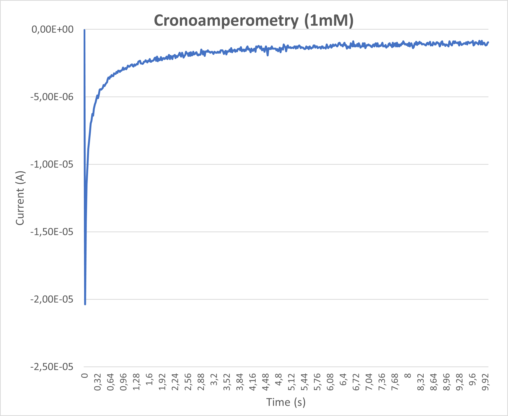
</a>

For the 5mM buffer concentration:

<a href="assets/CA5.png">
  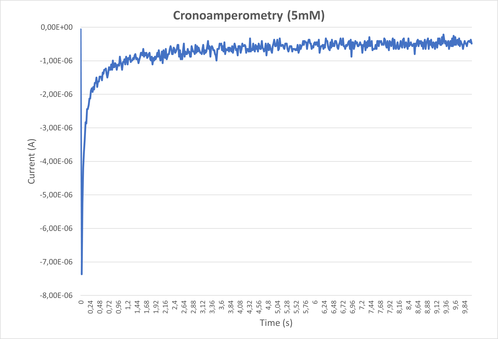
</a>

## Conclusions

## References

1. Y. Montes-Cebrián, A. Álvarez-Carulla, J. Colomer-Farrarons, M. Puig-Vidal, and P. L. Miribel-Català, “Self-powered portable electronic reader for point-of-care amperometric measurements,” Sensors (Switzerland), vol. 19, no. 17, p. 3715, Sep. 2019, doi: 10.3390/s19173715.
