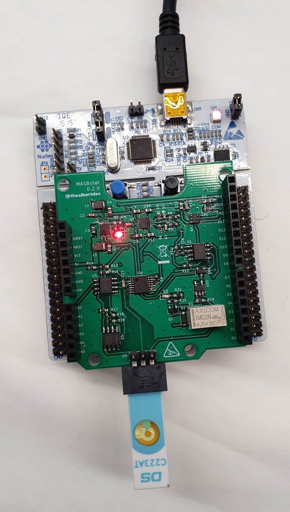

This project consists on the programming of a potentiostat formed by a _front-end_ previously designed by Albert Álvarez, and a _back-end_ based on the _Evaluation Board_ (EVB) NUCLEO-F401RE of STMicroelectronics. This configuration is going to be used for electrochemical testing,

The group that has developed this project is called `ecologiques` and is composed by **Maria Penon** and **Helena Riesco**.

  

  

> Figure 1. Maria Penon and Helena Riesco.

## Index

- [MASB-POT-S Project](#masb-pot-s-project)
  - [Introduction](#introduction)
    - [Potenciostat](#Potenciostat)
    - [Cyclic voltammetry](#cyclic-voltammetry)
    - [Chronoamperometry](#Chronoamperometry)
  - [Objetives](#objetives)
  - [Materials](#Materials)
    - [Evaluation board](#Evaluation-board)
    - [Git and GitHub](#Git-and-GitHub)
  - [Final application](#final-application)
    - [Implemented workflow](#implemented-workflow)
      - [feature/chronoamperomety](#feature/chronoamperomety)
      - [feature/cyclic_voltammetry](#feature/cyclic-voltammetry)
  - [Obtained results](#Obtained-results)
    - [Chronoamperometry](#chronoamperometry)
    - [Cyclic voltammetry](#cyclic-voltammetry)
  - [Conclusions](#conclusions)
    - [Project](#project)
    - [Subject](#subject)
  - [References](#References)

## Introduction

### Potenciostat

A potentiostat is a necessary electronic devise to control a three electrode cell for an electro analytic experiment. The system works by maintaining the working electrode potential at a constant level respect to the reference electrode potential using adjustments of the current in the auxiliary electrode. This means that it is the responsible for polarizing the cell at a voltage VCELL and a current ICELL that goes through it. To establish VCELL, a DAC model MCP4725 with I2C direction `1100000` is going to be used since it allows the generation of an output voltage between 0 to 4V [1]. In Figure 2 a basic electrical circuit of a potentiostat can be seen.

  

> Figure 2. Basic electrical circuit of a potentiostat [2].

This type of devices are often used in the field of medical sensors since they have high sensitivity.

The main goal of such device is that, once it has been programmed and at the will of a user, it can be used to make two electrochemical readings: the **cyclic voltammetry** and a **chronoamperometry**

It's the correct function of these two types of measures that is the main goal of this project.

### Cyclic voltammetry

A cyclic voltammetry is an electrochemical technique of great importance in which an input potential is inserted which value is modified between two fixed values (_Ei_ y _Ef_) and the corresponding current values are obtained.

The potential sweep is performed in the working electrode in a triangular manner. The slop of this variation corresponds to the sweeping velocity.

This technique is of great utility, specially in studies of _redox_ processes, electrocatalitic properties, etc. Three different electrodes are used, a _Working electrode (WE)_, _Reference electrode (RE)_ and _Auxiliary electrode (AE)_ or _Counter electrode (CE)_.

- WE - Corresponds to the electrode that has contact with the analyte, applies the desired voltage in a controlled manner.
- RE - It should have a known potential which acts as a reference to be able to measure the WE potential.
- AE - The necessary current passes through to equilibrate the observed current in the WE.

In figure 3, an example of the graphs obtained from a cyclic voltammetry can be seen.

  

> Figure 3. a) Waveform of the entry voltage to a cyclic voltammetry vs time b) example of a graph of the output current vs voltage [3].

### Chronoamperometry

A chronoamperometry is an electrochemical technique which transduces the activity of the biological species in an electrochemical cell to a current signal which quantifies the concentration of the interest analyte. In this technique a step signal is applied and the current through the cell is measured as a function of time. One of the advantages of this technique is that it does not require the identification of the analyte or biorreceptor. The experiment starts by maintaining the cell to a potential in which there is no faradaic process going on. Then, the potential is elevated to a value in which a redox reaction takes place. In figure an example of a potential vs time graph can be seen.

  

> Figure 4. Input waveform to the chronoamperometry vs time

## Objetives

The objectives of this project can be summarized in the following points.

- Program a portable potentiostat.
- Control the _Power Management Unit_ (PMU) of the _front-end_ module of the potentiostat.
- Communicate with the viSens-S installed application with the _host_ or computer by the MASB-COMM-S protocol.
- Perform a cyclic voltammetry.
- Perform a chronoamperometry.

## Materials

As it has been commented before, the materials that are going to be used are:

### Evaluation board

STM32 Nucleo-F401RE of STMicroelectronics, Figure 5.

  

> Figure 5. NUCLEO-F401RE of STMicroelectronics [4].

This EVB has been used as it offers a lot of advantages to improve and simplify the code creating process. This is like this as it integrates in the EVB itself the _debugger_ (electronic circuitry necessary to program the micro controller) and exposes all the micro controller pins in a way which facilitates the connections with the external elements during the prototyping phase, which has been taken advantage of during this project. During the creation of the work [the microcontroller _datasheet_](https://www.st.com/resource/en/datasheet/stm32f401re.pdf), the [microcontroller family reference manual](https://www.st.com/resource/en/reference_manual/dm00096844.pdf) and the [HAL library user manual (_Hardware Abstraction Layer_)](https://www.st.com/resource/en/user_manual/dm00105879.pdf) have been consulted . This last document has been used to search the HAL libraries to used them in the STM32Cube IDE environment, which has been the program used to code.

### Git and GitHub

Git is an open code program and free which offers tools to develop project of whatever size. It allows for the creation of independent working lines within the same project in order to have development branches, test branches and operative branches. Thanks to this program it has been possible to work in the development in the project as a team, as it allows saving versions of the modifications performed in order to be able to restore previous versions of the same document [5].

GitHub, is a free app for the management of Git repositories. It has a web interface in order to have access and control to the different collaborations and developments of the project, including the hierarchy of teams, where the approval of the modifications performed by a developer from a project manager is necessary before the new code can be merged into the main program. In this way, only the content that has been made sure that it works can be added and controlled [6].

## Final application

### Implemented workflow

This project has been implemented via the use of two individual branches (following the format feature/descriptive-name-branch) which have then been added to the develop branch. Once it has been run and the errors have been fixed, the files have been passed to the master branch for the client's visualization.

> Firstly, performing the implementation in different branches for its later incorporation into the develop branch was tried, however, different problems with the merge were encountered when all the structures and code had already been developed.
>
> The most automatic way to solve it, as we already new the different codes worked, was to create only two branches for the merge with develop.

The two branches created are `feature/chronoamperometry` and `feature/cyclic-voltammetry`. In the first one, all the management of the chronoamperometry has been done while in the second the cyclic voltammetry has been implemented.

The management of the rest of the components (DAC, ADC, comunicación serie, _Timers_, relay and PMU) have been performed directly in each of these two main branches.

In this way, the workflow of the app is the following:

#### feature/chronoamperomety

Firstly, the branch `feature/chronoamperomety` was initialized and the structures setup and loop were created in a file inside the components directory, `stm32main.c`. In Figures 6, 7 and 8, the workflows of this file can be observed.

  

> Figure 6. General structure of the file stm32main.c

In the two following figures, the functioning of the functions `setup()`and `loop()` are detailed.

  

> Figure 7. Structure of the function `setup()`.

  

> Figure 8. Structure of the `loop()` function.

Once finished this file, the file `chronoamperometry.c` has been created and also its respective header `chronoamperometry.h`. In the following figure, Figure 9, its implementation can be seen in a workflow.

  

> Figure 9. General structure of the file `chronoamperometry.c`

It can be seen that the file `chronoamperometry.c` does not have a specially complex structure, this changes when we analyze the branch `feature/cyclic_voltammetry ` and the corresponding files.

#### feature/cyclic_voltammetry

In the case of this branch, only the files `cyclic_voltammetry.c` and `cyclic_voltammetry.h` have been created. In the following workflow, figure 10, it can be seen the general code functionality and in Figure 11 the more specific code can be seen.

> The timer function of the chronoamperometry has been used for the `mesura_punt` counter.

  

> Figure 10. General structure of the file `cyclic_voltammetry.c`.

  

> Figure 11. Structure of the file `cyclic_voltammetry.c`.

It can be seen that the difficulty has increased exponentially if we compare the work flows of the two `feature` branches, this is due to the complexity inherent to the voltammetry calculation.

## Obtained results

To be able to test the functionality of the developed program without having the sample and the DAC, the program viSense has been used (with a video tutorial in this [link](https://www.youtube.com/watch?v=UkXToFs8g6Y)), with which the measurement to perform can be configured and also the communication with the micro controller board can be done as well as the visualization of the results obtained.

To solve the problem of not having the dissolution, a potentiometer has been connected in the form of a tension divisor connected to the analog input, simulating in this way a signal was simulated.

  

> Figure 12. Obtained results with the chronoamperometry before the experimental test.

  

> Figure 13. Obtained results with the cyclic voltammetry before the experimental test.

The results have been correct, the data has been sent, the received signal with the correct timers and an acceptable sensibility have been obtained. Both the chronoamperometry and the cyclic voltammetry have been carried out correctly. Therefore, a test in the laboratory has been made. The sensor, Figure 14, has been validated with [Potassium ferricyanide](https://en.wikipedia.org/wiki/Potassium_ferricyanide) at different concentrations (1mM and 5mM) with a [buffer](https://en.wikipedia.org/wiki/Buffer_solution) of [Potassium chloride](https://en.wikipedia.org/wiki/Potassium_chloride). It can be appreciated how the electronics designed by Dr. Álvarez is connected to the STM32 Nucleo-F401RE de STMicroelectronics, and with a test trip to add the potassium ferricyanide in the bottom part of the device.

  

> Figure 14. Electronics used.

### Chronoamperometry

The obtained results with the experimental measurement of the chronoamperometry can be seen in the graphs below.

  

> Figure 15. Chronoamperometry obtained with the measurement of potassium ferricyanide at different concentrations.

### Cyclic voltammetry

Finally, the obtained results with the experimental measurement of the cyclic voltammetry can be seen in the graphs below.

  

> Figure 16. Cyclic voltammetry obtained with the measurement of potassium ferricyanide at different concentrations.

## Conclusions

### Project

This project has served as a way of using the different concepts acquired and to develop a code for a medical application. We have been able to apply the concepts learnt about how to configure a board, how to properly read PINs, types of communications, use of timers and their configuration, relationship between functions, and much more. Above all, we have acquired further knowledge about the use of Git and Github to develop programs in teams, which will be extremely useful in our future. Finally, it has given us tools to interpret data sheets and know how to find the needed information to adapt in different situations.

### Subject

This subject has allowed us the bases to, not only develop our own projects for medical purposes using micro controllers, but it has also taught us new ways to work on the same project simultaneously in teams.

Even though the knowledge obtained is only the bases of micro processing programming, it has allowed us to open a door in a booming field.

## References

[1] Potentiostat - an overview | ScienceDirect Topics. (2021). Retrieved 21 May 2021, from https://www.sciencedirect.com/topics/engineering/potentiostat.

[2] Chhorn, S., & Teeramongkonrasmee, A. (2018). A Portable USB-controlled Potentiostat for Paper-based Electrochemical Applications. _2018 15th International Conference on Electrical Engineering/Electronics, Computer, Telecommunications and Information Technology (ECTI-CON)_, 321-324.

[3] An Electrochemical Potentiostat Interface for Mobile Devices: Enabling Remote Medical Diagnostics. (2021). Retrieved 2 June 2021, from https://arxiv.org/ftp/arxiv/papers/1509/1509.08591.pdf.

[4] NUCLEO-F401RE STMicroelectronics | Mouser España. (2021). Retrieved 2 June 2021, from https://www.mouser.es/ProductDetail/STMicroelectronics/NUCLEO-F401RE?qs=fK8dlpkaUMvGeToFJ6rzdA==.

[5] About - Git. Available at: https://git-scm.com/about.

[6] What Exactly Is GitHub Anyway? | TechCrunch. Available at: https://techcrunch.com/2012/07/14/what-exactly-is-github-anyway/.
