## **Introduction**

This project consists of the programming of a [potentiostate](https://en.wikipedia.org/wiki/Potentiostat) with the aim of characterizing a sample of [potassium ferrocyanide](https://en.wikipedia.org/wiki/Potassium_ferricyanide)([Fe(CN)6]3) to different contentrations on a potassium chloride [buffer](<https://chem.libretexts.org/Bookshelves/Physical_and_Theoretical_Chemistry_Textbook_Maps/Supplemental_Modules_(Physical_and_Theoretical_Chemistry)/Acids_and_Bases/Buffers>).

The main function of a potentiotate is to control a [electrochemical cell](https://en.wikipedia.org/wiki/Electrochemical_cell) or 3-eletrode cell, so that it controls the potential differentiating between one or more working electrodes (WE) combined with a reference electrode and an auxiliary electrode.

Specifically, in this project we will program a potentiostrate to obtain the intensity and voltage measurements detected in our electrochemical cell from **two** different techniques: chronoamperometry [(CA)](#CA) and cyclic voltammetry [(VC)](#CV).

### **Cyclic voltammetry**

This is an [electrochemical technique](<https://chem.libretexts.org/Bookshelves/Analytical_Chemistry/Supplemental_Modules_(Analytical_Chemistry)/Instrumental_Analysis/Cyclic_Voltammetry>) is mainly used to characterize reduction-oxidation processes, electrocatalytic properties and study of reaction intermediates.

To do this, cyclic voltammetry is based on applying a potential sweep between 2 voltages fixed before the start of the measurement, the cutting potentials ( _eVertex1_ and _eVertex2_). This potential is initialized to a predefined voltage (_eBegin_) and varies linearly by a fixed amount (_eStep_) until it reaches the first cutoff potential. Then he went in the direction until he reached the second. Obtaining a triangular sweep that repeats a number of specific cycles. This can be plotled by obtaining temporally equidistant measurements each scanRate.

### **Chronoamperometry**

The second electrochemical technique we have used for measurement is chronoamperometry. This technique is based on the study of the current variation in our WE over time.

To do this, the WE is introduced to the solution to be characterized and a constant potential is applied (_eDC_). Then a step signal is applied that will suddenly vary the potential producing a large voltage peak. Then, the potassium ferrocyanide will enter an oxidation process, reducing the tension until it is finally stabilized. In this way you can measure the current that passes through a cell in a given period of time.

## **Table of Contents**

- [Introduction](#introduction)
  - [Cyclic voltammetry](#cyclic-voltammetry)
  - [Chronoamperometry](#chronoamperometry)
- [Objectives](#objectives)
- [Materials](#materials)
- [Final Application](#final-application)
- [Results](#results)
  - [Cyclic Voltammetry Results](#cyclic-voltammetry-results)
  - [Results Chronoamperometry](#chronoamperometry-results)
- [Conclusions](#conclusions)

## **Objectives**

The realization of our project has occurred having, at all times, the purpose of achieving the following objectives:

- Apply the knowledge obtained for the programming in C of the potentiotate for the 2 electrochemical techniques that you want to carry out in a ferrocyanide sample
  potassium (K4[Fe(CN)6]) in potassium chloride (KCl) at different concentrations.
- Set control of the _Power Management Unit_ [PMU](#PMU).
- Communication with the ViSens application using the MASB-COMM-S protocol, coded in COBS.

## **Materials**

The following describes the set of materials that have been used during the project:

- Potentiostate, used to establish voltage differences. This has a specific _front-end_ so that the user can modify the entry manually.
- NUCLEO-F401RE Evaluation Board (EVB), which will process the _inputs_ of the potentiostratate (_back-end_).
- Programming software. To program the electrochemical techniques in our BLS, we have used the programming environment [STM32CubeIDE](https://www.st.com/en/development-tools/stm32cubeide.html), which uses the C/C++ lunguaje
- For the measurement of electrochemical techniques has been used the application [ViSens](https://github.com/Albert-Alvarez/viSens-S/releases/tag/v0.2.0), which allows us to perform both an AC and a VC.

## **Final application**

The following flowchart corresponds to the final operation of the developed application.

<a href="assets/FlujoFinal.png">
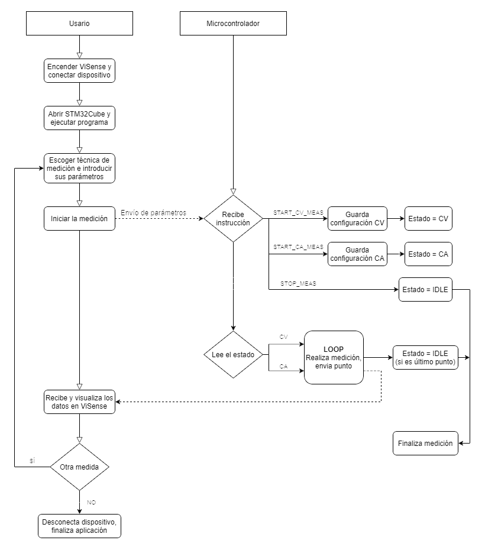
</a>

The steps that the user must follow to be able to perform the two types of electrochemical measurements with the potentiotate are as follows:
First you need to open the ViSense program and connect the device to the corresponding computer port.
Once this is done, you have to run the STM32Cube program to be able to measure with the potentiotate.
You can now choose the desired measurement type (voltammetry or chronoamperometry), set the various desired parameters, and start the measurement.
Once the measurement starts, a signal is sent to the microcontroller, which receives the instruction corresponding to the type of measurement chosen, performs the measurement and sends the different points in time until it finishes or the user stops it. At the end, the user can choose to perform another measurement, or simply disconnect the device and stop the programs.

The flowcharts corresponding to cyclic voltammetry and chronoamperometry can be seen below.

<a href="assets/Volta.png">
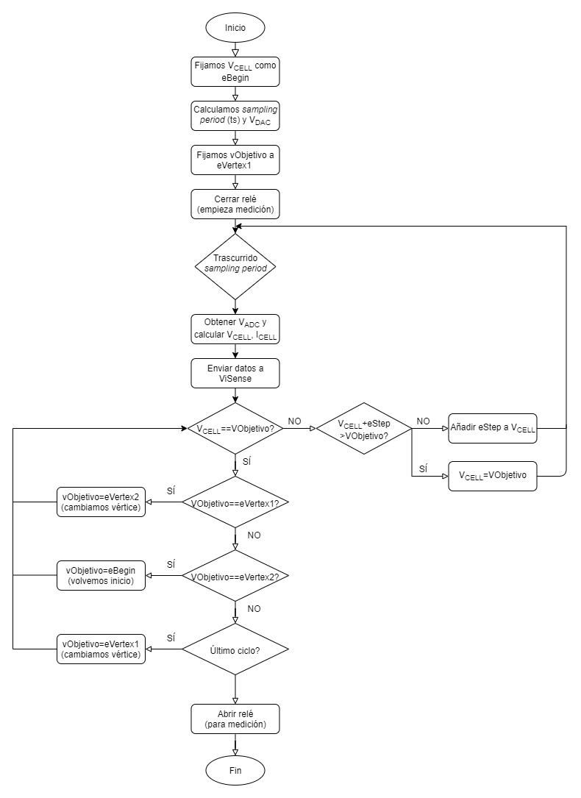
</a>

In the voltametry a tension sweep is performed on the electrochemical cell. To do this, you start from 'eBegin' and increase the value in tension in 'eStep' until you reach 'eVertex1'. Once we reach the first vertex, we change the target to reach the second vertex, also applying an 'eStep' difference in each measurement. When we have reached the second vertex, we return to 'eBegin', completing a cycle of the voltammetry (and if it has more cycles, the process is repeated).

<a href="assets/Crono.png">
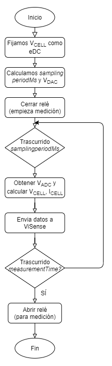
</a>

In chronoamperometry a constant voltage is fixed in the electrochemical cell for a certain time, and the corresponding results are observed.

## Results

The final results obtained can be seen below.

### **Cyclic voltammetry results**

In the first image corresponding to the cyclic voltammetry, we can see the measurement made with the potentiometer for the parameters specified to the left of the image.

<a href="assets/ResultadoVolta1.png">
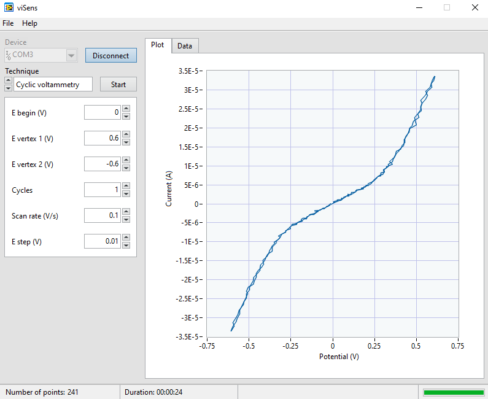
</a>

In the following images of the voltametry, we can see the same measurement but in the graph corresponding to the potential with respect to the elapsed time (you can clearly see the sweep from 'eBegin' to each vertex), and also of the current with respect to time.

<a href="assets/ResultadoVolta2.png">
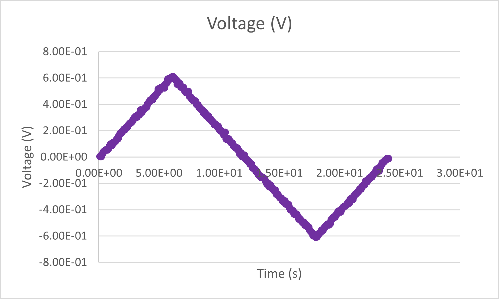
</a>

<a href="assets/ResultadoVolta3.png">
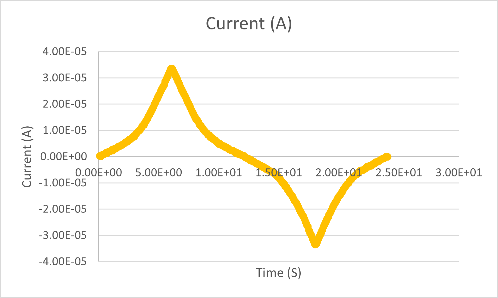
</a>

Once the tests were carried out without the sample and having seen the correct functioning of the program, we proceeded to perform the electrochemical measurements with a sample of potassium ferricyanide at different concentrations (1 mM and 5 mM). Below you can see the respective graphs resulting from the measurement (first the 1mM, and then the 5mM).

<a href="assets/ResultadosVolta1mM.png">
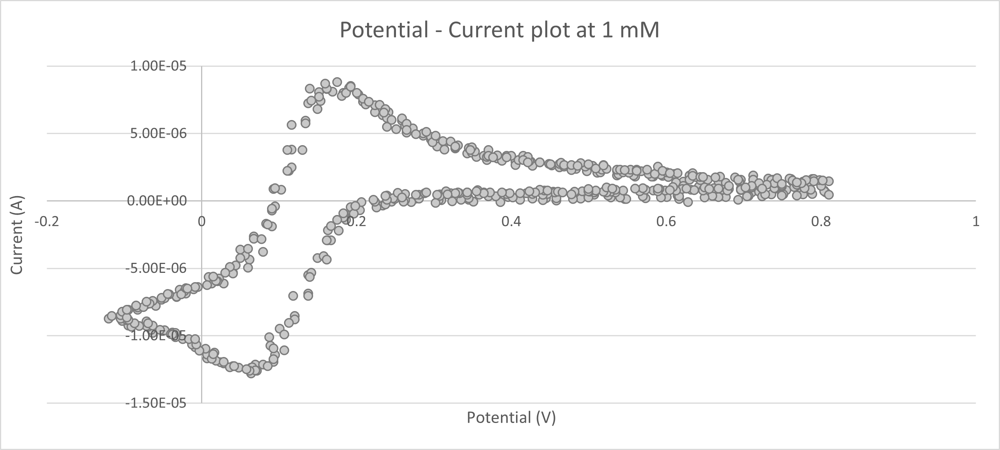
</a>

<a href="assets/ResultadosVolta5mM.png">
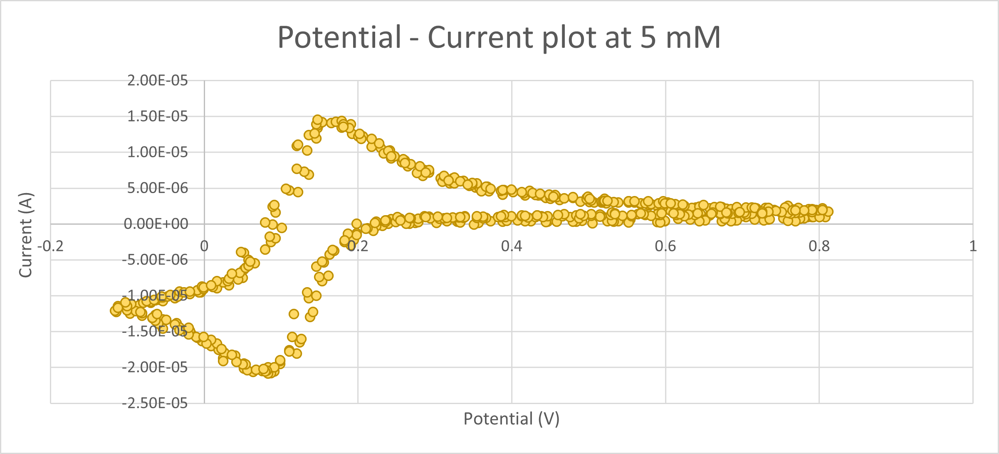
</a>

### **Chronoamperometry results**

In the following image, we can see a chronoamperometry performed with the potentiometer with the configuration that is specified to the left of the image.

<a href="assets/ResultadoCrono1.png">
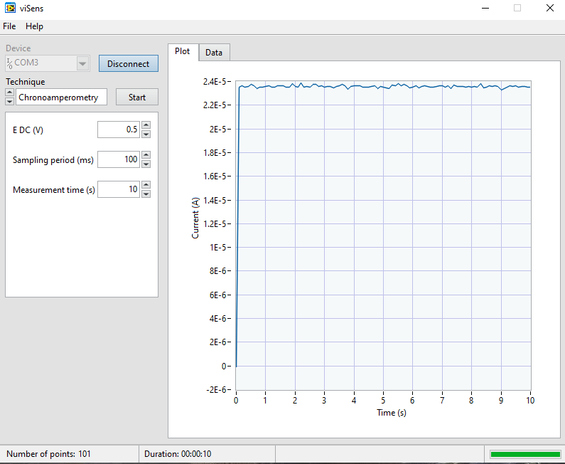
</a>

Apart from the graph with the potential with respect to the current, the graphs with the potential and the current with respect to time have also been made (you can see how the first starting point is at 0, and then a fixed value remains in the cell), which can be seen below.

<a href="assets/ResultadoCrono2.png">
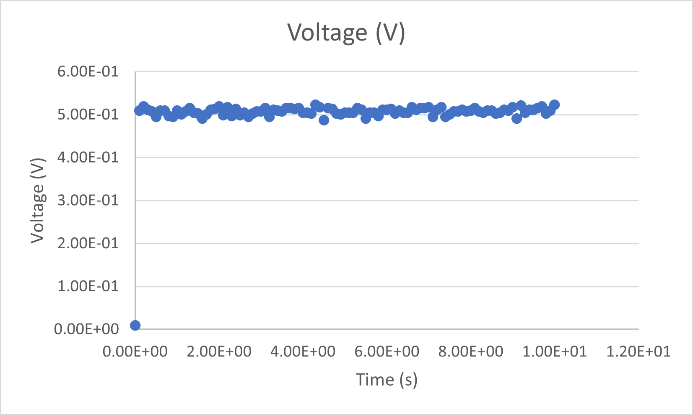
</a>

<a href="assets/ResultadoCrono3.png">
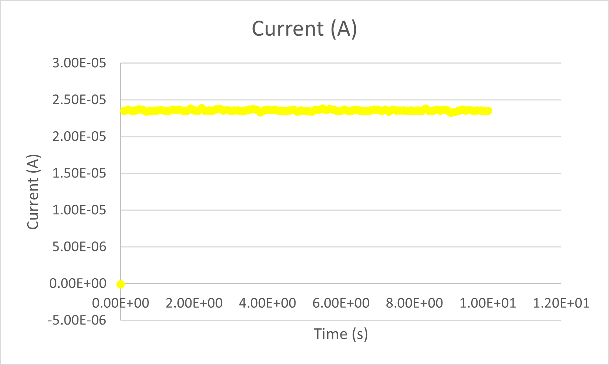
</a>

Below you can see the respective graphs resulting from the measurement of a sample of potassium ferricyaride at different concentrations (first 1mM, then 5 mM).

<a href="assets/ResultadoCrono1mM.png">
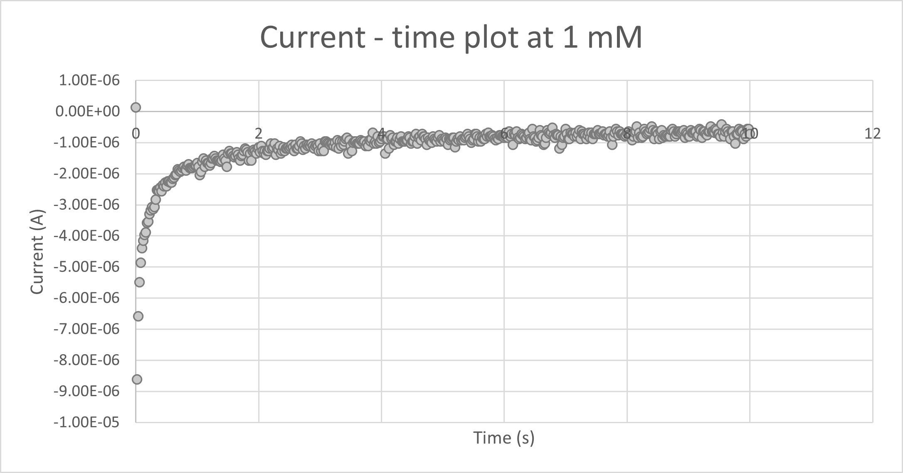
</a>

<a href="assets/ResultadoCrono5mM.png">
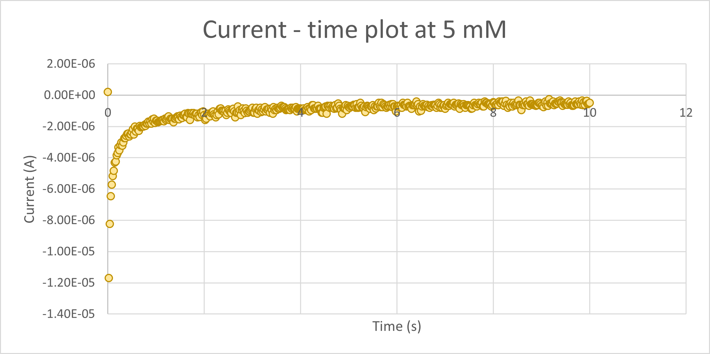
</a>

## **Conclusions**

Overall, this project has been able to programme a potentiotato in a satisfactory manner. We have obtained graphs that coincide with the morphology predicted for these 2 biochemical techniques characterizing the oxidation process of potassium ferrocyanide at concentrations of 1 and 5 mM.
On the other hand, with the completion of MASB we are very satisfied with the learning and progression we have achieved during the course, both in the introduction of important new concepts to work with a microcontroller and for the implementation of communication between different devices.
The way in which it has been proposed has allowed us an introduction to the workflow in Git in a more individualized way and above all for the coordination of the members of the group to work from home, which due to the situation in which we find ourselves is increasingly important.
For all these reasons, we believe that MASB has served as the threshold of the door to new projects where programming skills are needed in a professional environment.
