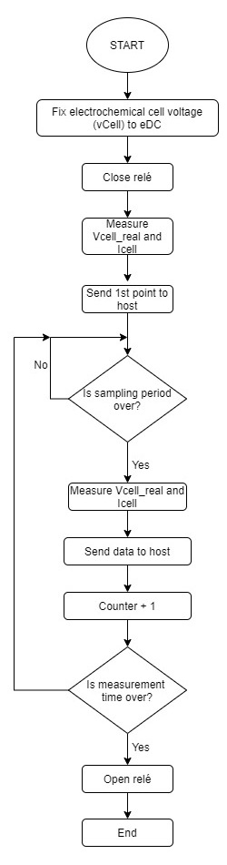

## Table of contents

- [Introduction](#)
  - [What is a potentiostat](#)
  - [Electrochemical measurements performed](#)
    - [Cyclic Voltammetry (CV)](#)
    - [Crono Amperometry (CA)](#)
- [Objetivos](#)
- [Metodology](#)
  - [Final Application](#)
    - [User-device flow chart](#)
    - [Microcontroller flow chart](#)
    - [CA flow chart](#)
    - [CV f low chart](#)
  - [Task management](#)
  - [Git repository structure](#)
- [ CA Results](#)
-
- [Conclusions](#)

# Introduction

The stated project consists in **programming a potentiostat with a EB Nucleo-F401R of STMicroelectroncs **. The purpose of this is the characterization of the concentration of various solutions of potassium ferricyanide in a potassium chloride buffer by means of potenciostate. For this, two different measurements have been programmed: a chronoamperometry (CA) and a cyclic voltammetry (CV).

First, the desired parameters as well as the type of measurement (CA / CV) must be entered in the ViSense software, specially programmed for the project. The sensor combined with the EV take the measurements and these are sent to the computer, which displays them as data or graphs in the ViSense software.

## What is a potentiostat?

A potentiostat is a device that measures and amplifies a signal from an electro-chemical reaction, allowing the concentrations of an analyte to be measured.

Any potentiostat can measure in amperometric mode, where the potential is set and the output current is observed, or potentiometric, where the current is set and the voltage is observed. In this project we are working in **amperometric ** mode, setting the cell voltage (_Vcell_) and measuring the current (_Icell_).

Typical configurations for amperometric sensors, which measure the current coming out of an electrochemical reaction, consist of a two-electrode approach, where there is a working electrode in which the reaction takes place and a reference electrode , which tracks the potential resulting from the reaction and provides the required current. However, this approach presents a problem that is based on the accumulation of charges on the reference electrode, which must have a well-known potential. To solve this problem, the configuration of three electrodes is defined:

- Working electrode (WE) : the working electrode is the one where the electro-chemical reaction takes place, changing the electrode voltage.
- Reference electrode (RE) : it is used to measure changes in the potential of the working electrode.
- Auxiliary Electrode (AE) : It supplies the current necessary for the electrochemical reaction in the working electrode.

> Electro-chemical cell, three electrode configuration.[[Source](#https://www.intechopen.com/books/state-of-the-art-in-biosensors-general-aspects/bioelectronics-for-amperometric-biosensors)]

## Electrochemical measurements performed

In the following paragraphs explain the two measurements performed in the project.

### Cyclic Voltammetry

A **Cyclic Voltammetry** is a type of potentiodynamic electrochemical measurement in which a variable potential is applied to an electrochemical cell while measuring the current that this cell provides. The potential between the working electrode (WE) and the reference electrode (RE) of the cell varies with time until it reaches a set potential value, then changes direction, performing what is called a potential triangular sweep. This process is repeated for a set number of cycles. The result is represented in a cyclic voltammogram, which represents the current through the cell versus the voltage applied to the cell. CV is a widely used technique to study the electrochemical properties of an analyte in solution. A CV provides a whole of information about the chemical and physical behavior of a system. Furthermore, different physical phenomena can be observed by performing voltammetries at different scanning speeds (modifying the rate of voltage change over time).

### Crono Amperometry

Chronoamperometry (CA) is an electrochemical technique that transduces the activity of the biomolecular species of an electrochemical cell into a current signal that quantifies the concentration of the analyte of interest. In this technique, a step signal is applied and the current through the cell is measured as a function of time. One of the advantages of this technique is that it does not require analyte or bioreceptor labeling. The experiment begins by holding the cell at a potential where no faradaic process occurs. The potential then rises to a value at which a redox reaction occurs.

## Objectives

- Program a portable potentiostat
- Check the Power Management Unit of the potentiostat front-end module
- Communicate with the _ ViSense-S _ app.
- Implementing a cyclic voltammetry.
- Implementing a chronoamperometry.

## Metodology

### Final Application

This section presents a series of flowcharts that exemplify the code programmed in STM32CUBE to implement the portable potentiostat.

#### User-device flow chart Flujo

The user must open the ** viSens.S ** desktop application and then connect to the device. Then you will select the electrochemical technique you want to perform, CV or CA, and configure the respective parameters.

<u>CA parameters:</u>

- `eDC` (_ double _): constant potential of the electrochemical cell during AC in volts.
- `samplingPeriodMs` (_ uint32_t _): time in ms between each point taken.
- `measurementTime` (_ uint32_t _): duration (in seconds) of the AC.

<u>CV parameters</u>:

- `eBegin` (_ double _): cell potential at which cyclic voltammetry starts. The potential of the electrochemical cell is taken from the start potential to the potential vertex 1. It also indicates the potential at which cyclic voltammetry will end.
- `eVertex1` (_ double _): new potential to which the cell goes once the starting potential has been set. Once the first vertex is reached, the cell goes to vertex 2.
- `eVertex2` (_ double _): potential towards which the cell goes from the vertex of potential 1. When this potential is reached, if there are more cycles, the potential returns to vertex 1. Otherwise the potential goes towards the start and end the measurement.
- `cycles` (_ uint8_t _): number of cycles of the cyclic voltammetry.
- `scanRate` (_ double _): variation of the electrochemical cell voltage over time (V / s).
- `eStep` (_ double _): increase or decrease of the cell voltage. (V)

Once the parameters have been configured, the measurement will start. The device will receive the configured parameters and will begin to take points, which it will send to the user until the measurement is finished. If you want to start a new measurement, you must restart the process, starting by selecting the corresponding technique. Otherwise the application closes.

> Flow chart of the interaction of the device and the user. [Source: readme provided by the subject].

#### Microcontroller flow chart

As soon as the microcontroller starts, it initiates its peripherals and variables. Among the configured peripherals there are:

- **Timer 3 **: to keep track of the sampling period.
- **I2C**: for communication with the digital to analog converter (DAC) and imposing the desired voltage on the cell.
- **ADC **: to read the actual value of voltage and current in the cell.

With this done, the micro waits for an instruction and, as soon as it receives one, it checks with a _switch_ if the command received is from CV or CA. By default, in case of not knowing the command, it will wait for another instruction. If CA or CV are received, the corresponding received configuration will be saved and the state of the variable "ESTAT" will change to CA or CV, respectively. It then goes on to wait for a new instruction through a non-blocking function, so the code keeps running.

The next thing the microcontroller does is to look at the value of the variable "ESTAT" through a switch, whether it is CA or CV the microcontroller will take a measurement and send that point to the host. In case that measurement is the last one, the variable "STATUS" changes to IDLE and it looks for new instructions.

If there are no new instructions, the STATUS variable is checked again.

#### CA flow chart

The chronoamperometry execution flow consists of setting the voltage of the electrochemical cell to a constant value (the eDC value configured by the user) and measuring the intensity of the cell.

To do this, after setting the potential, the relay closes. Or what is the same, the circuit between the electrochemical sensor and the front-end is closed. So it sends the first Intensity and Voltage measurements to the host and waits for the sampling period to elapse. When that time has passed, it takes a second measurement and sends the data to the host. Then the counter that keeps track of the measurement time increases, and if the measurement time is exceeded, the relay opens and the measurement ends. If the measurement time has not been exceeded, it is checked again if the sampling period has passed.

#### CV flow chart

The operating flow of cyclic voltammetry begins by setting the cell voltage (vCell) to an initial voltage value (eBegin). Then the first configured vertex is set as the target voltage and the relay closes.

As long as it is not the last cycle of the CV, it will be checked if the sampling period has passed. If not, check again that it is not the last cycle. In case it has already passed, it is checked if the target voltage is lower than that of vCell. If so, set a negative step value, and otherwise a positive step value. So see if the step added to vCell exceeds the target voltage. If it exceeds it, vCell is set to vGoal and, if not, the step is added. Then the data is sent to the host and the cell voltage is set to vCell.

If vTarget equals vCell, check if vTarget was vertex 1, vertex 2 or the initial voltage (eBegin). If it was vertex 1, vertex 2 is set as vObjective, if it was vertex 2, it is set as eBegin objective, and if it was e Begin, vertex 1 is set and the counter of cycles performed is increased.

Finally, it checks again if it is the last cycle and if it is positive the relay opens and the measurement ends.

### Task management

Taking into account the previously objectives, the work has been distributed equally between the two members who have developed the project.

Both <u>chronoamperometry</u> and <u>voltammetry</u>, in this order, have been programmed together in face-to-face meetings. Afterwards, the other tasks have been distributed as follows:

- <u>member B</u> has configured the `.ioc` file and generated the code. She has also generated the `setup ()` and `loop` functions and included them in the` main.c` file, modifying it. Finally he has been in charge of the management of the _ timers _.
- <u>MemberA</u> has been in charge of managing the _ DAC _, controlling the _ PMU _ and managing conversions with _ADC_. She has also been in charge of organizing git, structuring the different branches of the repository.

### Git repository structure

The git repository in which the project was developed followed the following branch structure:

> Estructura de ramas del repositorio git. [Fuente: propia]

- **Master **: This branch contains the final production code, whose functionality must be 100% complete.
- **Develop **: branch with collective development. In this branch, individual developments are grouped and application tests are carried out. From this branch the `.ioc` and ` main.c` files have been configured. Once working correctly, its contents are dumped into the `master` branch with a ` Pull request`.
- **feature / CA **: this branch contains the development of the chronoamperometry functionality. Both the `.h` and the` .c` files referring to the CA have been developed from this branch. Once the branch is ready, it has been dumped to the `develop` by means of a` Pull request`.
- **feature / CV2 **: This branch contains the development of the cyclic voltammetry functionality. Both the `.h` and the` .c` files referring to the CV have been developed from this branch. Once the branch is ready, it has been transferred to the `develop` branch through a `Pull request`. This branch is named `/ CV2` because a previously created branch called` feature / CV` has become unusable.
- **feature / setupLoop **: this branch contains the development of the `setup ()` and `loop ()` functions developed in the `stm32main.c` and` stm32main.h` files. Once ready, the contents of the branch have been poured into the `develop` branch via a ` Pull request`.
- **feature / readme **: from this branch the files `REPORT_ES` and` REPORT_EN` have been created and modified, which contain the reports in Spanish and English, respectively, of the project carried out. Once finished, they have been transferred to the `develop` branch through a` Pull request`.
- **hotfix / ad5280-rtia **: branch where an error has been corrected thanks to professor Albert Alvarez.

The most complicated part of the project have been the following two aspects (** FINISH !!! **):

1. The interference between equally named variables at CA and CV, and the implementation of eVertex at different positions (both positive, negative and one of each).

2. Some problems have been found as for instance the first pull requests performed to the develop branche were actually made to the master because we did not pay enough attention to the refering tag. This problem was solved and the control version has been used correctly since then.

## Results

The first part of the results are the simulation results generated with a resistance-diode circuit and results are presented as follows.

## CA Results

It is visible a current in the beginning, because the analytes are yet to be reduced, when this happens the current tends to 0 as shown in the plot. The introduced parameters are as follow.

- eDC = 0.3V

- measurementTime = 10s

## CV Results

In the CV (1 microMolar) results, the graph presents the cycles side by side and not supperposed as it should be. The parameters introduced in the program are the following:

- cycles = 3

- eStep = 0,01

- Scan rate = = 0,01

- measurement time = 10s

- eBegin=0,4/0,6/-0.6

## Conclusions

The subject of Microcotrolators for biomedical systems has given us the tools to program in C ++ programs that allow us to solve biomedical problems. The development of the back-end facet of a potentiostat that makes CronoAmperometries and Cyclic Voltometries has the purpose of electrochemically characterizing potassium ferrocyanide solutions. This project has allowed us to develop self-learning skills in programming, as well as management of programming projects in a professional way on a HAL platform.
