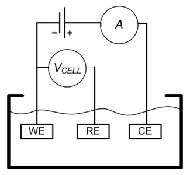
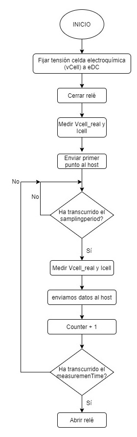
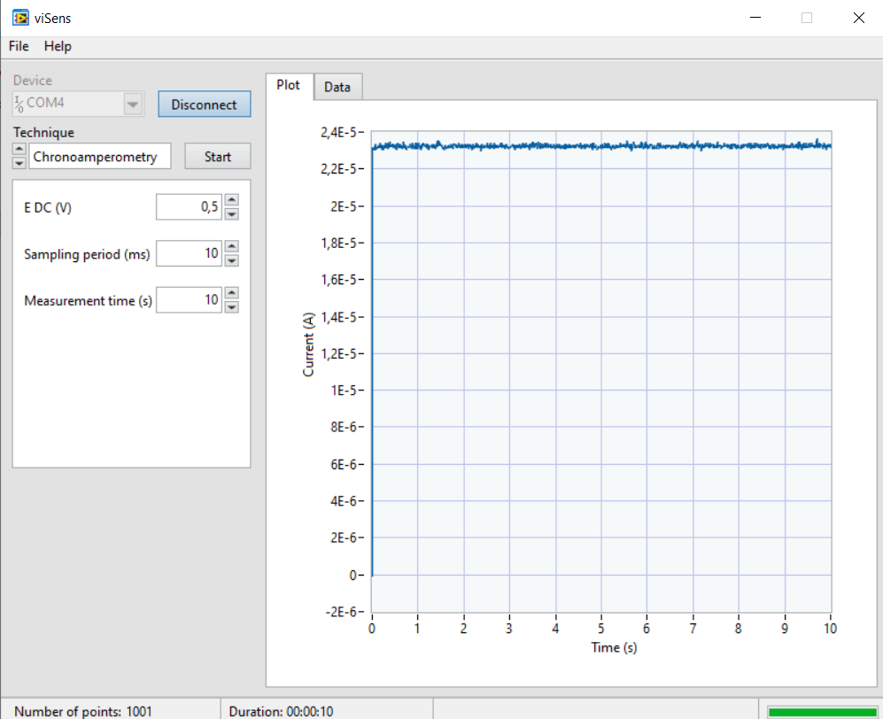
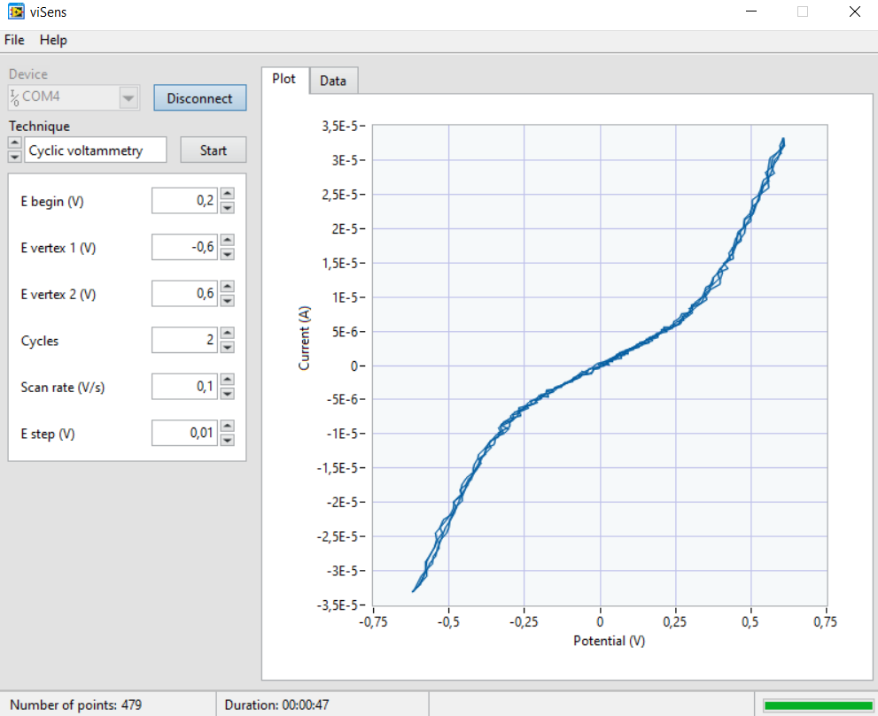
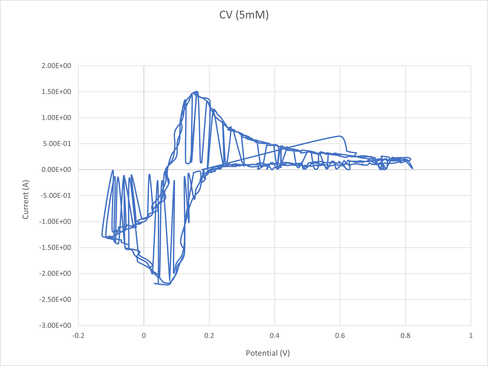
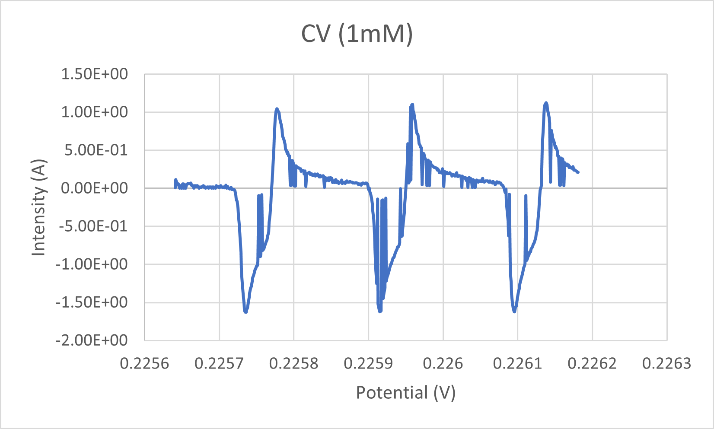

## Tabla de contenidos

- [Introducción](#introducción)
- [Objetivos](#objetivos)
- [Metodología](#metodología)
- [Resultados](#resultados)
- [Conclusiones](#conclusiones)

## Introducción

El proyecto presentado consiste en la **programación de un potenciostato a partir de la EVB Nucleo-F401R de STMicroelectroncs**. La finalidad de este es la caracterización de la concentración de varias disoluciones de ferricianuro de potasio en un tampón de cloruro de potasio por medio del potenciostato. Para ello, se han programado dos medidas: una cronoamperometría (CA) y una voltametría cíclica (CV).

Primeramente, se introducen los parámetros deseados así como el tipo de medida (CA/CV) en el _software_ viSense, programado especialmente para el proyecto. El sensor combinado con la EVB toman las medidas y estas son enviadas al ordenador, que las muestra en forma de datos o gráfica en el _software_ viSense.

### ¿Qué es un potenciostato?

Un potenciostato es un dispositivo que mide y amplifica una señal proveniente de una reacción electroquímica, permitiendo medir las concentraciones de un analito.

Un potenciostato cualquiera puede medir en modo amperométrico, donde se fija el potencial y se mira la corriente de salida, o potenciométrico, donde se fija la corriente y se mira el voltaje. En este proyecto estamos trabajando en modo **amperométrico**, fijando el voltaje de la celda (_Vcell_) y midiendo la corriente (_Icell_).

Las configuraciones típicas para sensores amperométricos, que miden la corriente que sale de una reacción electroquímica, consisten en un enfoque de dos electrodos, donde hay un electrodo de trabajo en que tiene lugar la reacción y un electrodo de referencia, que rastrea el potencial resultante de la reacción y proporciona la corriente requerida. Sin embargo, este enfoque presenta un problema que se basa en la acumulación de cargas en el electrodo de referencia, que debe tener un potencial bien conocido. Para solucionar este problema, se define la configuración de tres electrodos:

- **Electrodo de trabajo (WE):** el electrodo de trabajo es aquel donde se produce la reacción electroquímica, cambiando la tensión del electrodo.
- **Electrodo de referencia (RE):** se utiliza para medir cambios en el potencial del electrodo de trabajo.
- **Electrodo auxiliar (CE):** suministra la corriente necesaria para la reacción electroquímica en el electrodo de trabajo.

### Medidas electroquímicas realizadas

A continuación, se explica en qué consisten las dos medidas programadas en este proyecto.

#### Voltametría cíclica

Una **voltammetría cíclica** es un tipo de medición electroquímica potenciodinámica en la que se aplica un potencial variable a una celda electroquímica mientras se mide la corriente que esta celda proporciona. El potencial entre el electrodo de trabajo (WE) y el de referencia (RE) de la celda varía con el tiempo hasta que alcanza un valor potencial establecido, luego cambia de dirección, realizando lo que se denomina barrido triangular de potencial. Este proceso se repite durante un número establecido de ciclos. El resultado se representa en un voltamograma cíclico, que representa la corriente a través de la celda frente al voltaje aplicado en esta. La CV es una técnica ampliamente utilizada para estudiar las propiedades electroquímicas de un analito en una solución. Una CV proporciona gran cantidad de información sobre el comportamiento químico y físico de un sistema. Además, se pueden observar diferentes fenómenos físicos realizando voltametrías a diferentes velocidades de exploración (modificando la velocidad de cambio de voltaje con el tiempo).

#### Cronoamperometría

Una **cronoamperometría** es una técnica electroquímica que transduce la actividad de las especies biomoleculares de una celda electroquímica en una señal de corriente que cuantifica la concentración del analito de interés. En esta técnica se aplica una señal escalón y se mide la corriente a través de la celda en función del tiempo. Una de las ventajas de esta técnica es que no requiere etiquetado de analito o biorreceptor. El experimento comienza manteniendo la celda a un potencial en el que no ocurre ningún proceso faradaico. Entonces, el potencial se eleva a un valor en el cual ocurre una reacción redox.

## Objetivos

- Programar un potenciostato portable.
- Controlar la _Power Management Unit_ del módulo _front-end_ del potenciostato.
- Comunicarse con la aplicación viSense-S.
- Implementar una voltametría cíclica.
- Implementar una cronoamperometría.

## Metodología

### Aplicación final

En esta sección se presentan una serie de diagramas de flujo que ejemplifican el código programado en STM32CubeIDE para implementar el potenciostato portable.

#### Flujo del usuario con el dispositivo

El usuario deberá abrir la aplicación de escritorio **viSens-S** y seguidamente conectar con el dispositivo. Entonces seleccionará la técnica electroquímica que quiera realizar, CV o CA, y configurará los respectivos parámetros.

**Parámetros CA:**

- `eDC` (_double_): potencial constante de la celda electroquímica durante la CA en voltios.
- `samplingPeriodMs` (_uint32_t_): tiempo en ms entre cada punto tomado.
- `measurementTime` (_uint32_t_): duración (en segundos) de la CA.

**Parámetros CV:**

- `eBegin` (_double_): potencial de celda en el que se inicia la voltametría cíclica. El potencial de la celda electroquímica se lleva del potencial de inicio al vértice de potencial 1. También indica el potencial en el que finalizará la voltametría cíclica.
- `eVertex1` (_double_): nuevo potencial al que se dirige la celda una vez fijado el potencial de inicio. Una vez alcanzado el primer vértice, la celda se dirige al vértice 2.
- `eVertex2` (_double_): potencial hacia el que va la celda des del vértice de potencial 1. Cuando se llega a este potencial, si quedan más ciclos, el potencial vuelve al vértice 1. En caso contrario el potencial va hacia el de inicio y termina la medición.
- `cycles` (_uint8_t_): número de ciclos de la voltametría cíclica.
- `scanRate` (_double_): variación de la tensión de la celda electroquímica en el tiempo (V/s).
- `eStep` (_double_): incremento o decremento de la tensión de la celda (V).

Una vez configurados los parámetros iniciará la medición. El dispositivo recibirá los parámetros configurados y empezará a tomar puntos, los cuales irá enviando al usuario hasta que termine la medición. Si se quiere iniciar una nueva medida se debe reiniciar el proceso, empezando por seleccionar la técnica correspondiente. En caso contrario, se cierra la aplicación.

#### Flujo operativo del microcontrolador

En cuanto se inicia el microcontrolador, este inicia sus periféricos y variables. Entre los periféricos configurados se encuentran:

- **Timer 3:** para llevar la cuenta del _sampling period_.
- **I2C:** para la comunicación con el _digital-to-analog converter_ (DAC) e imponer el voltaje deseado en la celda.
- **ADC:** para leer el valor real de voltaje y corriente en la celda.

Con esto hecho, el micro espera una instrucción y, en cuanto recibe una, comprueba con un _switch_ si el comando recibido es de CV o CA. Por defecto, en caso de no conocer el comando, esperará otra instrucción. Si se reciben CA o CV, se guardará la configuración recibida correspondiente y cambiará el estado de la variable "ESTADO" a CA o CV, respectivamente. Seguidamente, pasa a esperar una nueva instrucción mediante una función no bloqueante, de forma que el código sigue corriendo.

Lo siguiente que hace el microcontrolador es mirar el valor de la variable "ESTADO" mediante un _switch_, tanto si es CA o CV, el microcontrolador tomará una medición y enviará ese punto al _host_. En caso de que esa medición sea la última, la variable "ESTADO" cambia a IDLE y se mira si hay nuevas instrucciones.

En caso de no haber nuevas instrucciones, vuelve a comprobarse la variable ESTADO.

#### Flujo operativo de la CA

El flujo de ejecución de la cronoamperometría consiste en fijar la tensión de la celda electroquímica a un valor constante (el valor eDC configurado por el usuario) e ir midiendo la intensidad de la celda.

Para ello, después de fijar el potencial, se cierra el relé. O lo que es lo mismo, se cierra el circuito entre el sensor electroquímico y el front-end. Entonces, envía la primera medida de I y V al _host_ y espera a que transcurra el _sampling period_. Cuando haya pasado ese tiempo, hace una segunda medida y manda los datos al _host_. Entonces el contador que lleva la cuenta del _measurement time_ incrementa, y, si se sobrepasa el _measurement time_, se abre el relé y acaba la medida. En caso que el _measurement time_ no se haya sobrepasado, se vuelve a comprobar si ha pasado el _sampling period_.

#### Flujo operativo de la CV

El flujo operativo de la voltametría cíclica empieza por fijar la tensión de la celda (Vcell) a un valor de voltaje inicial (eBegin). Entonces se establece como voltaje objetivo el primer vértice configurado y se cierra el relé.

Mientras no se trate del último ciclo de la CV, se comprobará si ha pasado el _sampling period_. En caso negativo, vuelve a comprobar que no sea el último ciclo. En caso de que ya haya pasado, se comprueba si el voltaje objetivo es menor al de Vcell. De ser así, establece un valor de _step_ negativo o, en caso contrario, un valor de _step_ positivo. Entonces mira si el _step_ sumado a Vcell sobrepasa el voltaje objetivo. Si lo sobrepasa, Vcell se establece a vObjetivo y, si no, se le añade el _step_. Entonces se mandan los datos al _host_ y se establece la tensión de la celda a Vcell.

Si vObjetivo es igual a Vcell, se mira si vObjetivo era el vértice 1, el 2 o el voltaje inicial (eBegin). Si era el vértice 1, se establece como vObjetivo el vértice 2, si era el vértice 2, se establece como objetivo eBegin, y si era eBegin se establece el vértice 1 y se aumenta el contador de ciclos realizados.

Finalmente, vuelve a mirar si es el último ciclo y en caso positivo se abre el relé y termina la medida.

### Organización de tareas

Teniendo en cuenta los objetivos mencionados, el trabajo se ha repartido equitativamente entre los dos miembros que han desarrollado el proyecto.

Tanto la \*_cronoamperometría_ como la _voltametría_, en este orden, se han programado de forma conjunta en reuniones presenciales. Después, las demás tareas se han repartido de la siguiente forma:

- El **miembro B** ha configurado el fichero `.ioc` y ha generado el código. También ha generado las funciones `setup()` y `loop` y las ha incluido en el archivo `main.c`, modificándolo. Finalmente, se ha encargado de la gestión de los _timers_.
- El **miembro A** se ha encargado de la gestión del _DAC_, del control de la _PMU_ y de gestionar las conversiones con _ADC_. También se ha encargado de la organización de Git, estructurando las distintas ramas del repositorio.

### Estructura del repositorio de Git

El repositorio Git en que se ha desarrollado el proyecto seguía la siguiente estructura de ramas:

- **master:** esta rama contiene el código final de producción, cuya funcionalidad está 100% terminada.
- **develop:** rama con el desarrollo colectivo. En esta rama van agrupándose los desarrollos individuales y se hacen las pruebas o testeos de la aplicación. Des de esta rama se han configurado los ficheros `.ioc` y `main.c`. Una vez funcionando correctamente, sus contenidos se vierten en la rama `master` con un `Pull request` definitivo.
- **feature/CA:** esta rama contiene el desarrollo de la funcionalidad de la cronoamperometría. Tanto el fichero `.h` como el `.c` referentes a la CA se han desarrollado desde esta rama. Una vez listos, la rama se ha volcado a la `develop ` mediante un `Pull request`.
- **feature/CV2:** esta rama contiene el desarrollo de la funcionalidad de la voltametría cíclica. Tanto el fichero `.h` como el `.c` referentes a la CV se han desarrollado desde esta rama. Una vez listos, la rama se ha volcado a la rama `develop ` mediante un `Pull request`. Esta rama lleva el nombre `/CV2` debido a que una rama anteriormente creada llamada `feature/CV` ha quedado inutilizada.
- **feature/setupLoop:** esta rama contiene el desarrollo de las funciones `setup()` y `loop()` desarrolladas en los archivos `stm32main.c` y `stm32main.h`. Una vez listos, el contenido de la rama se ha vertido a la rama `develop` mediante un `Pull request`.
- **feature/readme:** desde esta rama se han creado y modificado los archivos `REPORT_ES` y `REPORT_EN`, que contienen los _reports_ en castellano e inglés, respectivamente, del proyecto realizado. Una vez terminados, se han volcado a la rama `develop` mediante un `Pull request`.
- **hotfix/ad5280-rtia:** rama donde se ha corregido un error.

La parte más complicada del proyecto han sido los siguientes dos aspectos:

1. La interferencia entre variables de mismo nombre en CA y CV, y la implementación de eVertex en diferentes posiciones (ambas positivas, negativas y una de cada una).

2. Hemos encontrado algunos problemas como, por ejemplo, las primeras solicitudes de extracción realizadas a la rama de desarrollo se hicieron al _master_ porque no prestamos suficiente atención a la etiqueta de referencia. Este problema se solucionó y el control de versiones se ha utilizado correctamente desde entonces.

## Resultados

La primera parte de los resultados son los resultados de la simulación generados con un circuito de diodos de resistencia y los resultados se presentan a continuación.

## Resultados CA

En la CA se puede apreciar un pico de corriente al inicio de la reacción y disminuye a partir que el analito se reduce hasta llegar a corriente 0 A. Los parámetros introducidos en el programa son los siguientes:

- eDC = 0.3 V
- measurementTime = 10 s

## Resultados CV

En los resultados del CV (1 mM), el gráfico presenta los ciclos uno al lado de los otros y no supuestos como debería ser. Los parámetros introducidos en el programa son los siguientes:

- cycles = 3
- eStep = 0.01 V
- Scan rate = 0.01 V/s
- measurement time = 10 s
- eBegin= 0.4/0.6/0.6 V

## Conclusiones

La asignatura de Microcotroladores para Sistemas Biomédicos nos ha dado las herramientas para programar en C/C++ programas que nos permitan solucionar problemas biomédicos. El desarrollo de la faceta _back-end_ de un potenciostato que hace cronoamperometrias y voltometrías cíclicas tiene la finalidad de caracterizar electroquímicamente soluciones de ferrocianuro de potasio. Este proyecto nos ha permitido desarrollar capacidades de auto-aprendizage en programación, así como de gestión de proyectos de programación de manera profesional en una plataforma HAL.
