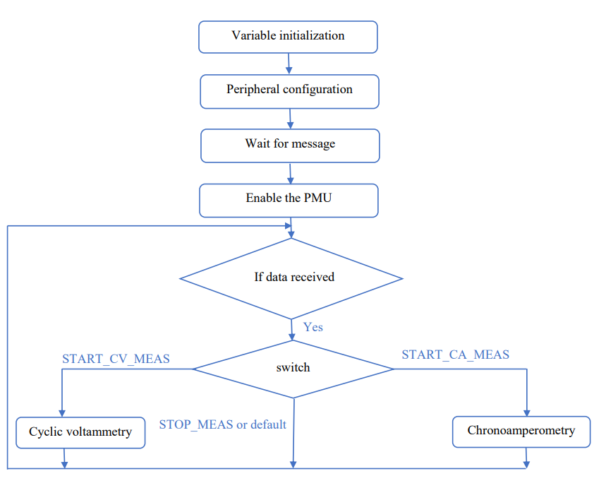

## Introduction

A potentiostat is an electronic device which controls a biosensor formed by three electrodes: the reference electrode (RE), the auxiliary (CE) and the working (WE) ones. The electrochemical processes carried out are based on oxido-reduction reactions, where electrons are transferred from one substance to another. This device allows to do voltage and current measures in an electrolytic cell, by cyclic voltammetry and cronoamperometry, respectively.

The main objective of this project is to program a potentiostat to control voltage and intensity by the two techniques mentioned previously. To do so, after its programming it will be validated.

The potentiostat consists of a front-end specifically designed for this project, and an Evaluation Board (EVB) NUCLEO-F401RE from STMicroelectronics, which acts as a back-end. Once programmed, for its subsequent validation, measurements will be made with a sample of potassium ferricyanide at different concentrations in a potassium chloride buffer.

## Contents

- [Introduction](#introduction)
- [Objectives](#objectives)
- [Flow chart and explanation of the application](#flow-chart-and-explanation-of-the-application)
  - [Cyclic voltammetry](#Cyclic-voltammetry)
  - [Chronoamperometry](#chronoamperometry)
- [Results](#results)
- [Conclusions](#conclusions)

## Objectives

The objectives to accomplish during the development of this project are detailed below:

Programming a portable potentiostat.

Control of the Power Management Unit (PMU) of the potentiostat’s front-end.

Communication with the viSens-S application, which is installed with a computer, using the MASB-COMM-S protocol.

Carrying out a cyclic voltammetry.

Carrying out a cyclic chronoamperometry.

Validation of the results by doing measurements with potassium ferricyanide in a potassium chloride buffer.

## Flow chart and explanation of the application

To carry out this project, a repository has been created in Git where the tasks performed by each of the members have been updated. The final error-free code is contained in the _master_ branch. From this, the _develop_ branch comes out, where our developments have been grouped together to be able to test them. However, each one has its _feature_ branch. In addition, we also find a _hotfix_ branch, in which a bug fix is ​​found, the rTia variable is initialized and a development formula is corrected.

The workflow diagram followed in this project is now introduced. Although each one started working in its corresponding branch, when the cyclic voltammetry and chronoamperometry functions had to be implemented, we preferred to put ideas in common at the same time.

Helena created the configuration of the .ioc file in the develop branch and, once initialized, each one started with the project separately. In addition to the .ioc file, she created the _setup_ and _loop_ functions, and generated the _stmain32main_ files, where the complete code is included. On the other hand, Marta managed the control of the PMU and the ADCs. Once we reached this point, we thought that the most efficient way to work was to do it in parallel. The configuration of the timers was the first thing we decided to implement, following with the chronoamperometry, and finishing with cyclic voltammetry. To do this, each of us thought previously in which way we would implement it on our own and then we put it in common; that is why, the commits related to these last steps are all done through Helena’s branch.

Finally, the _hotfix_ branch contains a correction to make the code run properly.

The flow chart of the designed program is explained in the following flow chart, in which reference is made to cyclic voltammetry and chronoamperometry, which will be detailed later.

  

### Cyclic voltammetry

[Cyclic voltammetry](https://en.wikipedia.org/wiki/Cyclic_voltammetry) is an electrochemical technique in which a variable potential is applied between the WE and RE electrodes and current measurements from the electrochemical cell are obtained. The variation of this voltage is obtained by doing a triangular sweep. To obtain it, a target voltage is established, and small increments or decrements are applied until reaching it. Once reached, the target voltage is changed. The new objective will depend on the one from which we come, being the order: eVertex1, eVertex2 and eBegin. Once eBegin is reached, we complete a cycle. The limits must meet the condition: eVertex2 <eBegin <eVertex1. Moroever, for our particular code, eVertex2 should be negative.

In order to reproduce this technique, the flow diagram of the designed code is depicted below:

  

### Chronoamperometry

[Chronoamperometry](https://es.xcv.wiki/wiki/Chronoamperometry) is an electrochemical technique in which a voltage step is applied to the WE electrode and the resulting current is measured in the electrochemical cell as a function of time. One of the main utilities is the detection of the interest analyte’s concentration.

  

## Results

Once the potentiostat has been programmed, the verification of its correct operation is done by means of a potentiometer. To do this, a voltage divider is made with it and the variable terminal is connected to the analog inputs. This configuration is seen below; in addition, its schematic is also added.

  

  

Once the potentiostat is programmed, the verification of its proper functioning is done by using a potentiometer. To do this, a voltage divider is made with it and the variable terminal is connected to the analog inputs. This configuration is seen below; in addition, a schematic is added.

Once this configuration is done, the back-end is connected to the computer. Through this, and by using the ViSens application, the two measurement techniques can be verified.

First of all, we see the results obtained with the cyclic voltammetry. To do this, we previously set its parameters: 2 cycles are performed between Evertex1 = 0.6V and Evertex2 = -0.6V, starting from Ebegin = 0 V.

  

The result of the chronoamperometry is shown below. In this case, the input parameters are Edc = 0.5 V, the sampling frequency and the measurement time. We see how the resulting current in the electrochemical cell is approximately 23 μA.

  

Finally, as previously presented, the project is validated in the laboratory by performing several measurements with a sample of potassium ferricyanide at two different concentrations, in a potassium chloride buffer; these concentrations were 5 mM and 1 mM. For this we have used a sensor like the one we see on the first image, where we can observe the CE, WE and RE, from left to right. This sensor is connected to the EVB and the corresponding measurements are obtained.

  

  

The obtained results are shown below.

  

  

As it can be seen in the results of the final test, the lower the concentration used, the lower the resulting current.

## Conclusions

This final project makes reference to the majority of the knowledge that has been covered in the subject: interruptions by timers, I2C synchronous communication, ADC, etc. This is what makes it a complete project, in addition to containing a context in the electrochemical field, which allows observing its operation through the final test with potassium ferrocyanide.

Once the potentiostat has been programmed and its correct operation has been verified in the laboratory, it can be said that the results have been satisfactory. Even so, a possible improvement of the code could include a "Stop" function that stops the execution of the technique before the measurement time expires, in case the user requires it.

In addition, the executed program has the limitation that the voltage sweep for cyclic voltammetry requires as a requirement that eVertex2 is less than eBegin and that eBegin is less than eVertex1.

As a general conclusion of the subject, we believe that it is quite practical and useful and that the organization of the practices allows to establish theoretical knowledge. In addition, the final project allows concentrating all the topics addressed during the course.
