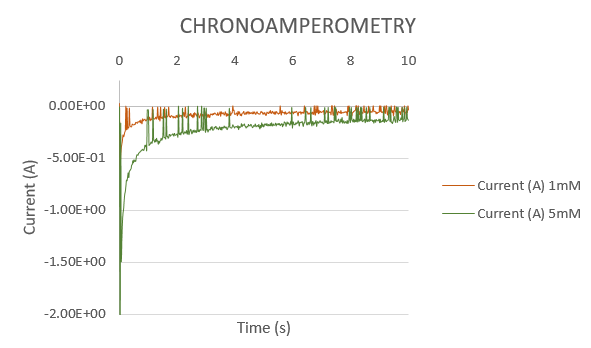
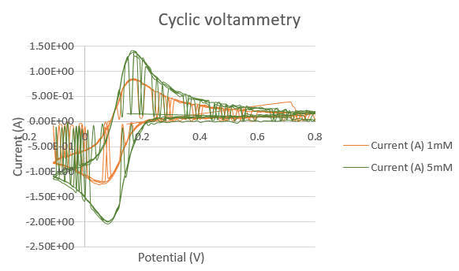

## Introducción

Un potenciostato se trata de un equipo electrónico que se encarga de controlar un biosensor formado por tres electrodos: el electrodo de referencia (RE), el auxiliar (CE) y el de trabajo (WE). Los procesos electroquímicos que se llevan a cabo se basan en reacciones de óxido-reducción, donde se transfieren electrones de una sustancia a otra. Este dispositivo permite realizar medidas de potencial e intensidad de corriente eléctrica en una celda electrolítica, mediante voltametría cíclica y cronoamperometría, respectivamente.

El objetivo de este proyecto se basa en programar un potenciostato para realizar el control de voltaje e intensidad mediante las dos técnicas comentadas anteriormente. Para ello, primero se procederá a programarlo para luego poder validarlo.

El potenciostato en cuestión consta de un _front-end_ específicamente diseñado para este proyecto, y una _Evaluation Board_ (EVB) NUCLEO-F401RE de STMicroelectronics, que actúa como _back-end_. Una vez programado, para su posterior validación, se harán mediciones con una muestra de ferricianuro de potasio a diferentes concentraciones en un tampón de cloruro de potasio.

## Contenidos

- [Introducción](#introducción)
- [Objetivos](#objetivos)
- [Diagrama de flujo y explicación de la aplicación](#diagrama-de-flujo-y-explicación-de-la-aplicación)
- [Resultados obtenidos](#resultados-obtenidos)
- [Conclusiones](#conclusiones)

## Objetivos

Los objetivos a cumplir durante la realización de este proyecto se detallan a continuación:

- Programación de un potenciostato portable.
- Control de la la _Power Management Unit_ (PMU) del módulo _front-end_ del potenciostato.
- Comunicación con la aplicación viSens-S instalada con ordenador mediante el protocolo MASB-COMM-S.
- Realización de una voltametría cíclica.
- Realización de una cronoamperometría cíclica.
- Validación de los resultados mediante medición con ferricianuro de potasio en un tampón de cloruro de potasio.

## Diagrama de flujo y explicación de la aplicación

Para llevar a cabo este proyecto, se ha creado un repositorio en Git donde se han ido actualizando las tareas realizadas por cada uno de los miembros. El código final, libre de errores, está contenido en la rama _master_. De esta, sale la rama _develop_, donde se han ido agrupando nuestros desarrollos para poder testearlos. No obstante, cada una tiene su rama _feature_. Además, también encontramos una rama _hotfix_, en la cual se encuentra una corrección de un _bug_, se inicializa la variable rTia y se corrige una fórmula del desarrollo.

El diagrama de flujo de trabajo seguido en este proyecto se introduce a continuación. A pesar de que empezamos trabajando cada una en su rama correspondiente, a la hora de implementar las funciones de voltametría cíclica y de cronoamperometría, preferimos ponerlo en común a la vez.

Helena ha sido la encargada de configurar el archivo `.ioc` del proyecto en la rama _develop_ y, una vez inicializado, cada una ha podido empezar con el proyecto por separado. Además del archivo `.ioc`, se ha encargado de crear las funciones _setup_ y _loop_, y de generar los archivos _stmain32main_, donde se incluye el código completo. Por otra parte, Marta ha gestionado el control de la PMU y de los ADCs. Una vez llegados a este punto, pensamos que la forma más eficiente de trabajar era hacerlo paralelamente. La configuración de los _timers_ fue lo primero que decidimos implementar, para luego poder proceder con la cronoamperometría, y terminar con la voltametría cíclica. Para ello, cada una pensábamos cuál era la manera en la que lo implementaríamos por separado y luego lo poníamos en común; es por eso que, los _commits_ relativos a estos últimos pasos están hechos todos a través de la rama de Helena.

Finalmente, la rama _hotfix_ contiene una corrección final para que el código funcione correctamente.

El diagrama de flujo del programa diseñado se explica en el siguiente diagrama de flujo, en el que se hace referencia a la voltametría cíclica y la cronoamperometría, que serán detalladas posteriormente.

### Voltametría cíclica

La [voltametría cíclica](https://en.wikipedia.org/wiki/Cyclic_voltammetry) es una técnica electroquímica en el que se aplica un potencial variable entre los electrodos WE y RE y se van obteniendo medidas de la corriente en la celda electroquímica. Para la variación de este voltaje, se hace un barrido triangular, es decir, se establece una tensión objetivo, y se van aplicando pequeños incrementos o decrementos hasta llegar a él. Una vez alcanzado, se cambia la tensión objetivo. El nuevo objetivo dependerá del que hemos venido anteriormente, siendo el orden: eVertex1, eVertex2 y eBegin. Una vez se alcance eBegin, habremos realizado un ciclo. Es necesario que los límites cumplan la condición: eVertex2 < eBegin < eVertex1. Además, para nuestro código en concreto, eVertex2 deberá ser negativo.

Por tal de conseguir reproducir esta técnica, se ha diseñado un código que sigue el siguiente diagrama de flujo:

### Cronoamperometría

La [cronoamperometría](https://es.xcv.wiki/wiki/Chronoamperometry) es una técnica electroquímica en la que se aplica un escalón de voltaje en el electrodo WE y se mide la corriente resultante en la celda electroquímica en función del tiempo. Una de las principales utilidades es la detección de la concentración de un analito de interés.

## Resultados obtenidos

Una vez programado el potenciostato, la comprobación de su correcto funcionamiento se hace mediante un potenciómetro. Para ello, se hace un divisor de tensión con él y el terminal variable se conecta a las entradas analógicas. Esta configuración se observa a continuación; además, también se añade su esquemático.

Una vez realizada esta configuración, se conecta el _back-end_ al ordenador. A través de este, y mediante el uso de la aplicación viSens, se pueden comprobar las dos técnicas.

En primer lugar vemos los resultados obtenidos para la voltametría cíclica. Para ello, establecemos previamente sus parámetros: se realizarán 2 ciclos entre Evertex1 = 0.6 V y Evertex2 = -0.6 V, empezando desde Ebegin = 0 V.

A continuación, se muestra el resultado de la cronoamperometría. En este caso, los parámetros de entrada son Edc = 0.5 V, la frecuencia de muestreo y el tiempo de medida. Vemos como la corriente resultante en la celda electroquímica es de 23 μA, aproximadamente.

Por último, como se ha introducido anteriormente, el proyecto realizado se valida en el laboratorio haciendo varias mediciones con una muestra de ferricianuro de potasio a dos concentraciones diferentes, en un tampón de cloruro de potasio; estas concentraciones eran 5 mM y 1 mM. Para ello, hemos usado un sensor como el que vemos en la primera foto, donde podemos observar el CE, el WE y el RE, de izquierda a derecha. Este sensor se conecta a la EVB y se obtienen las mediciones correspondientes.

Los resultados obtenidos se han exportado a Excel, y se muestran a continuación.

Como se puede apreciar en los resultados de la prueba final, la corriente obtenida en ambos casos es inferior cuanto menor es la concentración de la muestra usada.

## Conclusiones

Este proyecto final engloba la gran mayoría de los conocimientos que se han tratado en la asignatura: interrupciones por _timers_, comunicación síncrona I2C, ADC, etc. Lo que lo hace un proyecto completo, además de contener un contexto en el ámbito electroquímico, que permite observar su funcionamiento a través de la prueba final con ferrocianuro de potasio.

Una vez programado el potenciostato y verificado su correcto funcionamiento en el laboratorio, se puede decir que los resultados han sido satisfactorios. Aun así, una posible mejora del código podría ser incluir un “Stop” que parase la ejecución de la técnica antes de cumplirse el tiempo de medida, en caso de que el usuario lo requiriese.

Además, el programa ejecutado cuenta con la limitación de que el barrido de tensiones para la voltametría cíclica exige como requisito que eVertex2 sea menor que eBegin y que eBegin sea menor que eVertex1.

Como conclusión general de la asignatura, creemos que es bastante práctica y útil y que la organización de las prácticas permite asentar los conocimientos teóricos. Además, el proyecto final permite concentrar todos los temas abordados durante el curso.
