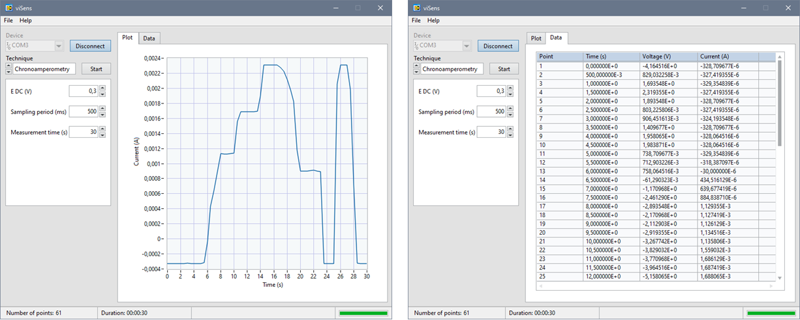
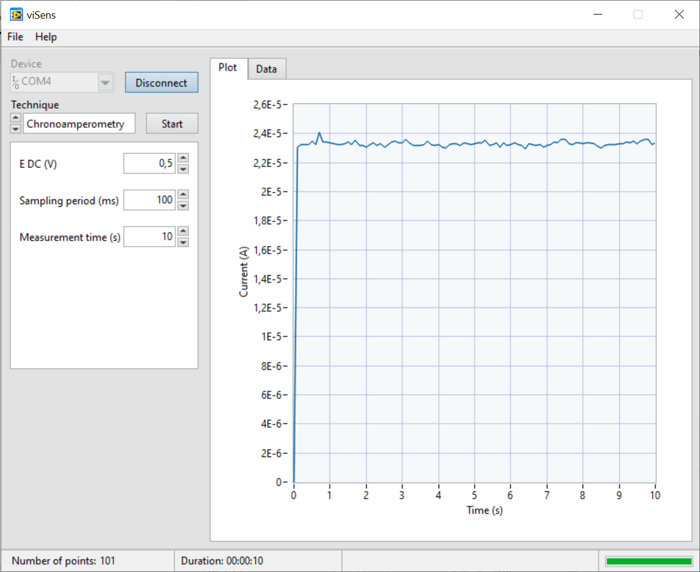
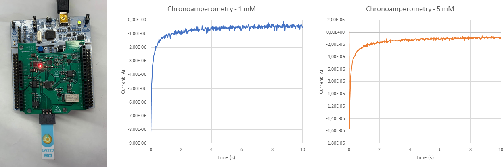
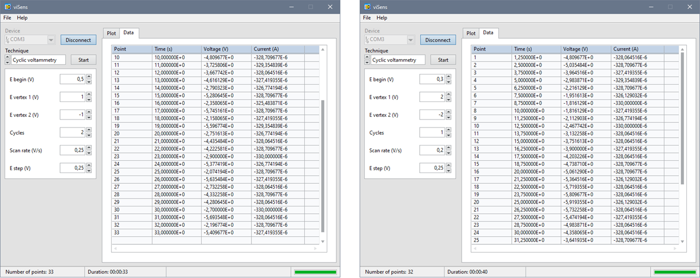

In this report, the final project of the Microcontrollers for Biomedical Applications and Systems course will be described. It consists of the programming of a potentiostat to perform two types of electrochemical measurements: chronoamperometry and cyclic voltammetry. At the end of the project, several measurements will be made to validate the project on a sample of [potassium ferricyanide](https://es.wikipedia.org/wiki/Ferricianuro_de_potasio) at different concentrations in a [potassium chloride](https://es.wikipedia.org/wiki/Cloruro_de_potasio) buffer.

The project has been developed by programming an STM32 Nucleo-F401RE board in the STM32CubeIDE programming environment. A version control of all the developed code has been carried out using Git and we have been able to store it in GitHub to share it with the rest of the team/project manager. Below you can find a brief description of all the relevant elements for the development of the project.

## Potentiostat

The potentiostat is an electronic device required to control a three-electrode cell and perform electroanalytical experiments. It is capable of measuring and controlling the potential of a cell by detecting changes in its resistance. The system works by maintaining the potential of the working electrode (WE) at a constant level with respect to the potential of the reference electrode (RE) by adjusting the current at an auxiliary electrode (CE). By applying a potential to a certain surface, the amount of electrons on its surface is reduced or increased. This causes the liquid to contain or consume electrons to compensate for this difference.

  

> Schematic of the electronics of a potentiostat. Image [source](https://es.wikipedia.org/wiki/Potenciostato).

## Chronoamperometry

[Chronoamperometry](https://en.wikipedia.org/wiki/Chronoamperometry) (CA) is an electrochemical technique in which the working electrode potential (WE) is stepped and the current resulting from the faradic processes occurring in the sample is measured. This process is based on monitoring the cell current as a function of time, which will fluctuate according to the diffusion of the analyte in solution. This will allow us to quantify the concentration of the analyte of interest. Chronoamperometry can be used to measure the dependence between current and current time for the controlled diffusion process occurring at an electrode, which varies with analyte concentration. It is a much simpler process in which only an initial potential is set, which is amplified until the reaction takes place. The response signal is an intensity-time curve. More information on this technique can be found on the following [page](https://es.scribd.com/document/264324581/CRONOAMPEROMETRIA).

  

> Image where the change in voltage generated and the shape of the response curve can be seen. As we have seen previously, the response curve is a function of current and time, while the excitation curve is a function of voltage and time. Image [source](https://en.wikipedia.org/wiki/Chronoamperometry).

## Cyclic voltammetry

[Cyclic voltammetry](<https://chem.libretexts.org/Bookshelves/Analytical_Chemistry/Supplemental_Modules_(Analytical_Chemistry)/Instrumental_Analysis/Cyclic_Voltammetry>) (CV) is a type of [electrochemical](https://en.wikipedia.org/wiki/Electrochemistry) [potentiodynamic](https://en.wikipedia.org/wiki/Voltammetry) measurement that measures the current developed in an electrochemical cell under conditions where the voltage exceeds that predicted by the Nernst equation. The CV is obtained by cycling the potential of a working electrode and measuring the resulting current. Further information on the technique can be found on the following [page](<https://chem.libretexts.org/Bookshelves/Analytical_Chemistry/Supplemental_Modules_(Analytical_Chemistry)/Instrumental_Analysis/Cyclic_Voltammetry>).

  

> Excitation signal to perform cyclic voltammetry (performing two cycles). Image [source](<https://chem.libretexts.org/Bookshelves/Analytical_Chemistry/Supplemental_Modules_(Analytical_Chemistry)/Instrumental_Analysis/Cyclic_Voltammetry>).

## viSens-S Application

To send and receive the information from the microcontroller we have used a LabVIEW application called viSens-S, which allows us to communicate with the microcontroller both to send the user's selection (AC and CV and the respective parameters) and to receive the AC or CV measurement data. Below is the GitHub repository to download the application.

## Table of Contents

- [Introduction](#Proyecto-MASB-POT-S-NOPUCMES)
  - [Potentiostat](#Potentiostat)
  - [Chronoamperometry](#Chronoamperometry)
  - [Cyclic voltammetry](#Cyclic-voltammetry)
  - [viSens-S Application](#viSens-S-Application)
- [Objectives](#Objectives)
- [Techniques to be implemented](#Techniques-to-be-implemented)
  - [Implementation Chronoamperometry](#Implementation-Chronoamperometry)
    - [Flowchart (CA)](<#Flowchart-(CA)>)
  - [Implementation Cyclic Voltammetry](#Implementation-Cyclic-Voltammetry)
    - [Flowchart (CV)](<#Flowchart-(CV)>)
  - [Application flow chart](#Application-flow-chart)
  - [Microcontroller flow diagram](#Microcontroller-flow-diagram)
- [Project development](#Project-development)
  - [Project components](#Project-components)
    - [Power Management Unit](#Power-Management-Unit)
    - [Relay](#Relay)
    - [Potentiostat and ADC](#Potentiostat-and-ADC)
  - [Microcontroller configuration](#Microcontroller-configuration)
  - [Previous functions](#Previous-functions)
  - [Function for Chronoamperometry](#Function-for-Chronoamperometry)
  - [Cyclic voltammetry function](#Cyclic-voltammetry-function)
- [Obtained results](#Obtained-results)
- [Conclusions](#Conclusions)

## Objectives

- To program a potentiostat with STM32CubeIDE.
- To carry out chronoamperometry and cyclic voltammetry.
- Configure the microcontroller to receive and understand the data sent by the application on the technique chosen by the user.
- Enable bi-directional communication between the microcontroller and the viSens-S application.
- Display the data captured through the viSens-S application.
- Perform version control with git and GitHub.

## Techniques to be implemented

### Implementation Chronoamperometry

This technique consists of applying a voltage during a certain time interval in the cell and recording the resulting current. The implementation of this technique is based on setting the voltage of the electrochemical cell to a specific value and measuring V CELL(REAL) and I CELL at different times, as shown in the flowchart. Subsequently, only the data has to be sent to the host. Each time a measurement is taken, the following information must be sent: the point where we are, the time in seconds in which the measurement is taken and, finally, the voltage and current measured, V CELL(REAL) and I CELL respectively.

#### Flowchart (CA)

The following flowchart is the one we have made for the implementation of chronoamperometry.

  

> Flowchart of the implemented function for chronoamperometry.

### Implementation Cyclic Voltammetry

Electrochemical technique, popularly used to investigate the reduction and oxidation processes of molecular species. As we have seen previously, in this technique the potential of the working electrode (WE) is varied linearly with respect to time, starting from an initial potential, until the first target potential is reached. Then, the potential is swept linearly in the opposite direction to reach the second target potential, passing through the initial potential. All of this potential variation is captured on the X-axis of a typical cyclic voltammetry figure. The Y-axis picks up the response of this system to the applied potential, through the passage of current.

  

> Typical figure of cyclic voltammetry. Image [source](https://pubs.acs.org/doi/10.1021/acs.jchemed.7b00361).

In this figure we can observe step by step the behavior of this voltammetry. In the first stage (A) we see that although the potential varies, the current remains stable. When we enter stage B, the current variation undergoes an exponential increase, due to a small potential variation. In stage C we reach the current peak, and until we reach D, we undergo an exponential decrease until we reach the first target potential (D). All this stage corresponds to the reduction process, the Fc + gains electrons (e-) becoming Fc.

From point D to point G, we sweep from the first to the second target potential in a reverse process to the one described above. In this section the oxidation process takes place. The Fc loses an electron, becoming Fc + + e-.

Finally, to understand why this occurs in such a characteristic way, we refer to the **Nernst Equation**, which describes the equilibrium between two species.

  

If we study the concrete example of ferrocenium (Fc +) and ferrocene (Fc), which is obtained by reducing an electron, we can replace the previous equation with the following one:

  

The Nernst equation provides us with a powerful way to predict the response of the system in front of a change in concentrations in the spices or a change in potential at the potential electrode. Thus, when the potential is scanned during cyclic voltammetry, the concentration of the species around the electrode varies as a function of time, according to the Nernst equation.

_[Source](https://pubs.acs.org/doi/10.1021/acs.jchemed.7b00361) of the information. Take a look for more information on this technique._

#### Flowchart (CV)

The following flow chart corresponds to the cyclic voltammetry. We can see how the flow corresponds to the previous explanation of the technique and how we are varying `vObjective` to the different vertices shown in the previous figure. Every time a measurement is made, and V CELL is increased with `eStep`, the following information must be sent: **point** where we are, **time** in seconds in which the measurement is made, and finally the **voltage** and **intensity** measured, VCELL(REAL) and ICELL respectively.

  

> Flow diagram of the implemented function for cyclic voltammetry.

### Application flow chart

The following flow shows the user's operations with the [viSens-S](https://github.com/Albert-Alvarez/viSens-S/releases/latest) application and their interaction with our device. The user will configure the application and start the measurement, and then it will be the device that will take the different points and send them to the application.

  

> Application flow chart.

### Microcontroller flow diagram

For the microcontroller flow chart, a specific diagram has been created for our code by using the [draw.io](http://draw.io/) tool.

  

Microcontroller flow diagram implemented in the project.

## Project development

For the development of the project, various branches have been created from `develop/project` for each of the functionalities we were aiming to implement. Below, a list with the different branches and their functionality is shown.

- **`develop/project`**: Configuration of the `.ioc` file and generation of the code. The configuration changes of the `main.c` and `.ioc` files were made from this branch.
- **`feature/stm32main`**: Creation and configuration of the `setup()`and `loop()` functions. In this branch we have created the _stm32main_ `header` and `source` files located in the **components** folder.
- **`feature/timer`**: Management of the ISR function that is activated when the timer completes a period. In this branch, we have created the `header` and `source` files of the _timer_ located in the **components** folder.
- **`feature/chronoamperometry`**: Chronoamperometry management. In this branch we have created the `header` and `source` files of _chronoamperometry_ located in the **components** folder.
- **`feature/voltammetry`**: Management of cyclic voltammetry. In this branch we create the `header` and `source` files of _cyclic_voltammetry_ located in the components folder.
- **`feature/prueba-crono`**: Management of the complete chronoamperometry, managing the rest of the _features_. In this branch we have gathered all the previous branches (except the voltammetry one) and configured this technique.
- **`feature/prueba-volta`**: After completing the chronoamperometry in the previous branch, the complete cyclic voltammetry management has been carried out, managing the rest of the _features_. This branch has been created from the previous branch, therefore chronoamperometry is also implemented. On this branch, we have configured and completed the voltammetry.

Lastly, several `feature/**` branches have been made where the functionalities have been tested together and the different code errors have been corrected. When the code was correct, it was implemented in the `develop / project` branch.The elaboration of the different files has been carried out mainly through video calls, so the three components of the group have been present in the different _commits_ and _pull requests_ made in the branches. Each member has made the design of each _feature_ branch theoretically and, subsequently and jointly, they have been implemented in STM32CubeIDE taking into account the theoretical design made by each member of the group.

### Project components

#### _Power Management Unit_

This component is the power management unit. It will be in charge of feeding the entire _front-end_ during the measurements. Initially, it must be disabled to avoid current consumption, and when the microcontroller negotiates with the computer a maximum consumption, this will be enabled. This unit will be controlled through the pin `EN` as seen in the configuration.

#### _Relay_

This component will be in charge of closing and opening our circuit. It works as a switch between the _front-end_ and the sensor. When the relay is opened (default state), the circuit will be open and no connection will exist (so no measurements will occur). When we want to make a measurement, we have to close the relay and later, when finished, open it again. This unit will be controlled via the `RELAY` pin.

#### _Potentiostat and ADC_

The potentiostat is responsible for polarizing the electrochemical cell to a voltage VCELLand reading the current flowing through ICELL. In addition, the ADC of the microcontroller will be used to read the real voltage that we are applying and to calculate VCELLand ICELL.

### Microcontroller configuration

| Pin | Alias |         Type         | Description                                                                                                  |
| :-: | :---: | :------------------: | :----------------------------------------------------------------------------------------------------------- |
| PA0 | VREF  |     Analog input     | Absolute voltage of the _Reference Electrode (RE)_ VREFused for the VCELL measurement. |
| PA1 | ICELL |     Analog input     | TIA output voltage used for ICELL measurement.                                                    |
| PB8 |  SCK  | I2C (SCK) | SCK signal from I^2^C. The I^2^C bus controls the _front-end_ DAC.                                           |
| PB9 |  SDA  | I2C (SDA) | SDA signal from I^2^C. The I^2^C bus controls the _front-end_ DAC.                                           |
| PA5 |  EN   |    Digital Output    | PMU disabled/enabled signal. `0`: PMU disabled. `1`: PMU enabled.                                        |
| PB5 | RELAY |    Digital Output    | Relay control signal. `0`: Relay opened. `1`: Reay closed.                                               |

> [Fuente](https://github.com/Biomedical-Electronics/masb-pot-s-nopucmes) de la tabla utilizada para configurar el microcontrolador.

### Previous functions

- **STM32main:**

In the file `stm32main.c` we have created the`setup()` and ` loop()` functions. First of all, in the `setup`, what we will do is enable the PMU, configure the I^2^C communication, the potentiometer and the DAC. On the other hand, in the `loop` function (which will be executed continuously, since it is inside the `while` loop in the `main.c` file) we find a conditional that in case of receiving a message will enter the loop . Depending on the command received, one case or another will be entered. Within each technique we find a first configuration command, which allows us to go from the hexadecimal value that the application sends and we receive, to the values of each variable that the user has configured.We do this by doing a [decoding in COBS](https://blog.mbedded.ninja/programming/serialization-formats/consistent-overhead-byte-stuffing-cobs/). Next, we configure the technique with the previously obtained values, and new values are obtained. Both functions will be specified later in the section for [Chronoamperometry](#Function-for-Chronoamperometry) and [Cyclic Voltammetry](#Function-for-Cyclic-Voltammetry).

- **Timer:**

The `timer.c` file is basically made up of the [ISR](https://en.wikipedia.org/wiki/Interrupt_handler), function when the microcontroller receives an interrupt, it stops executing the code that is currently processing and starts executing the code associated with that interruption.In our case we have used _timer 2_ (`TIM2`) which has a 32-bit counter and avoids having to configure a [prescaled](https://www.prometec.net/timers/) and use directly a period of 84,000. Within the `Callback` function, depending on the ` state` variable, we will enter one part of the code or another. In the case of chronoamperometry, the state variable will be equal to `CA`, so the measurement of chronoamperometry values will be activated (as we will see later). In the same way, if we are carrying out a voltammetry, the variable `state` will be equal to `CV`, so this measurement will be activated.

### Function for Chronoamperometry

The function development for chronoamperometry is based on the flow chart shown above. As already explained previously, in chronoamperometry, we measure the intensity of current that passes through a cell after a voltage has been fixed to it. As we are not in a perfect and ideal device, the voltage sent will have small variations. Therefore it is important to measure it in order to know the real value. This voltage is measured using the microcontroller's ADC. The measured value is obtained by isolating Vsignal from the following formula.

  

Our microcontroller has a 12-bit resolution, so the formula can be expressed as follows:

  

With Vsignal the Voltage in the cell can be computed by using the following formula shown below:

  

> Being Vsignal = VADC

And the current intensity is defined by the following formula:

  

However, VADC in VCELL is not the same as VADC in ICELL, so two different values must be measured and use the corresponding ADC~value~ for each one. After this general idea of how chronoamperometry works, let's see how it can be implemented. For this a timer interrupt, included in the timer.c, file, and two functions, found in the chronoamperometry.c file, have been used.In the interruption only one variable is controlled, that is in charge of starting the chronoamperometry measurement. The two functions are `Chronoamperometry_Config` and `Chronoamperometry_Value`. In the first, the relay is closed, the ADC and the timer are configured, the VCELLvalue is set as eDC and the request to do a chronoamperometry is sent. On the other hand, in the second function all measurements are carried out. For this, it is necessary to start detecting the total measurement time requested by the user. Then, the conversion is started, and VCELLand ICELL are measured. After that, the initial point, which corresponds to time 0, and the measured values of VCELL and ICELL are sent; and the timer is started. After this data is sent, we add a point to the `pointCA` variable. This variable is in charge of controlling the number of points requested by the user. In addition, when sending each point, and therefore fulfilling a period, a samplingPeriod will be added to the counter variable.

For the rest of the measurements it is necessary to define a while loop, which will remain active until the control variable called counter, exceeds the total measurement time configured by the user. Inside this while loop we find a conditional `if`, which is activated if the flag variable is `TRUE`. This variable is only `TRUE` if the **ISR function** of the timer is activated. In it we find once again the functions that initiate the conversion, the VCELL and ICELL measurements and their sending to the host.

### Cyclic voltammetry function

The development of this function is based on the workflow shown about how to implement a cyclic voltammetry and the voltammetry concept itself. In other words, what we are aiming is to set an initial voltage at our working electrode (`WE`). Perform an increasing voltage sweep until achieving the first potential objective (`eVertex1`). Once there, perform a decreasing voltage sweep until reaching the second voltage desired (`eVertex2`). And from there, make an increasing voltage sweep again until the initial potential is reached. This procedure will be repeated as many times as indicated by the user in the input data, when the number of cycles is specified. Every sampling rate indicated, the sensor will be activated, performing the measurement of real VCELL(REAL) and ICELL.

As a general idea, when sweeping the voltage, if the performance is the one expected, the typical characteristic curve from cyclic voltammetry will be obtained. But let’s go bit by bit, so that it will be better understood. Inside the branch created with the name **`feature/voltammetry`**, two different functions have been defined inside the **`cyclic_voltammetry.c`** file, that can be found in the following relative directory: `../Core/Src/components`.

The first function is called _Voltammetry_Config,_ aiming to be executed just one time, when the host sends the indication that a cyclic voltammetry is desired. Inside this function, relay is set to the closed state, so the required measurements can be carried through. VCELL value is set to the initial voltage desired by the user (`eBegin`) and the sampling period of the timer is defined as the quotient between `eStep` and `scanRate`.

The second function is _Voltammetry_Value_, which encompasses most of the process, where the potential sweep will be carried out and where the different measurements that will be sent to the host are taken. We start by initializing the timer, setting the VCELL, `eBegin` and the target voltage to the one desired by the user (entered as input in `eVertex1`). We also define a variable called measure as `FALSE`, this will allow us to obtain control over each time the timer is activated and performs a measurement. We close the relay and start the voltammetry. Every time the sampling period elapses, we measure VCELL and ICELL, and data is sent to the host. As long as VCELL is not equal to the defined target potential, we apply an eStep increase. We proceed in this way until we reach the target potential. Once we have reached this point, we set `eVertex2` as a new target (also defined by the user as input). We take measurements and apply eStep variations each time the sampling period elapses. Until we get to `eVertex2`, where we define `eBegin` as a target. At `eBegin`, if the number of cycles defined as input has been reached, we stop the measurement and open the relay. Otherwise we proceed to a new cycle following the same procedure described above.

## Obtained results

In order to test the microcontroller’s performance when undergoing a chronoamperometry and a cyclic voltammetry, both techniques have been tested by using a potentiometer, first; a technical validation, then; and finally using a potassium ferricyanide sample at different concentrations in a buffer solution of potassium chloride. In this chapter the different results obtained can be reviewed.

### Chronoamperometry

- _Potentiometer_

With a sampling rate of 500ms and changing the potentiometer resistance value these are the results obtained:

  

{" "}

- _Technical validation_

Sampling rate is set to 100ms, and VCELL is fixed at 0.5V. The results obtained are shown below. It is observed how current is around 2,3E-5 A.

  

- _Results using a potassium ferricyanide sample at different concentrations in a buffer solution of potassium chloride_

Finally, the final test was carried out by carrying out both measurements in a potassium ferricyanide solution at two different concentrations in a potassium chloride buffer. Next, we can see the board with which the measurements have been made and the **chronoamperometry** plots obtained. The middle graph corresponds to a 1 mM concentration and the right one to a 5 mM concentration.

  

### Cyclic voltammetry

- _Potentiometer_

It has been checked if we were sending data points properly and the timer was working as expected. In the image shown below, the different conditions for both techniques are shown, as well as the results obtained.

  

- _Technical validation_

In the same way, a technical validation of cyclic voltammetry has been carried out, establishing a starting point of 0V (`eBegin`), vertex 1 at 0.6V, vertex 2 at -0.6V and two cycles. The results obtained are the ones shown below, where it is seen how the potential arrives at really similar vertices and for both cycles the results are almost the same.

  

- _Results using a potassium ferricyanide sample at different concentrations in a buffer solution of potassium chloride_

Finally, the final test was carried out by carrying out both measurements in a potassium ferricyanide solution at two different concentrations in a potassium chloride buffer. Next, we can see the board with which the measurements have been made and the graphs of the cyclic voltammetry obtained. The middle graph corresponds to a 1 mM concentration and the right one to a 5 mM concentration. The graphs correspond to 3 cycles.

  

## Conclusions

In this project the programming of a potentiostat with STM32CubeIDE has been successfully implemented to perform the execution of a **chronoamperometry** and a **cyclic voltammetry**. To perform both techniques, the microcontroller of the _STM32 Nucleo-F401RE_ evaluation board has been configured to receive and understand the data sent by the user through the _viSens-s application_, thus allowing bidirectional communication between the microcontroller and it. The data captured in the execution of the techniques has been sent to the application, which displays both the _raw_ data and a graphical representation of the results. To allow communication between the microcontroller and the application, the information has been encoded and decoded through the **COBS** communication protocol.

In this project, we have had the opportunity to develop a large part of the knowledge acquired throughout the course for microcontroller programming. Throughout the project, various microcontroller peripherals have been used, such as _timers_ and with their respective **interrupts**, GPIOs, synchronous (I^2^C) and asynchronous (UART) serial communication and analog converters (ADCs) for performing discrete approximations.

To coordinate the work between the different members of the group, the **Git tool** and the **GitHub platform** have been used, where the development of the project has been carried out through the creation of different branches. In addition, it has also allowed us to have _control of the versions_ of our code and to be able to work in parallel developing different branches.

Finally, various tests have been carried out with both a _breadboard_ and a potentiostat to accomplish a technical verification prior to the final implementation. The different tests have had a satisfactory result and both techniques have been performed correctly.
