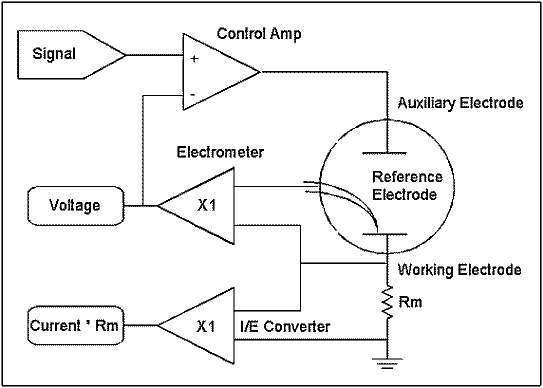
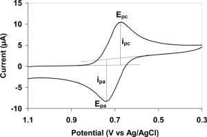
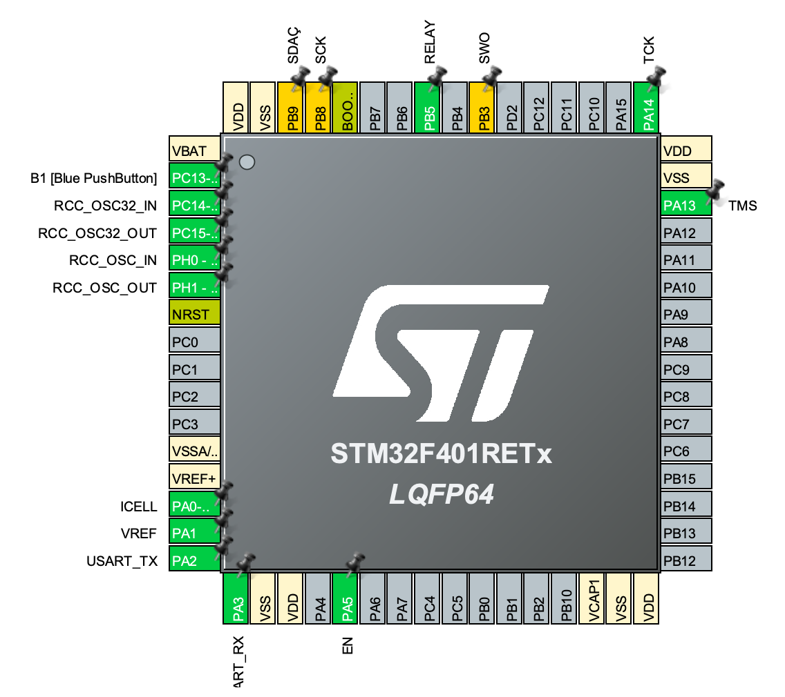
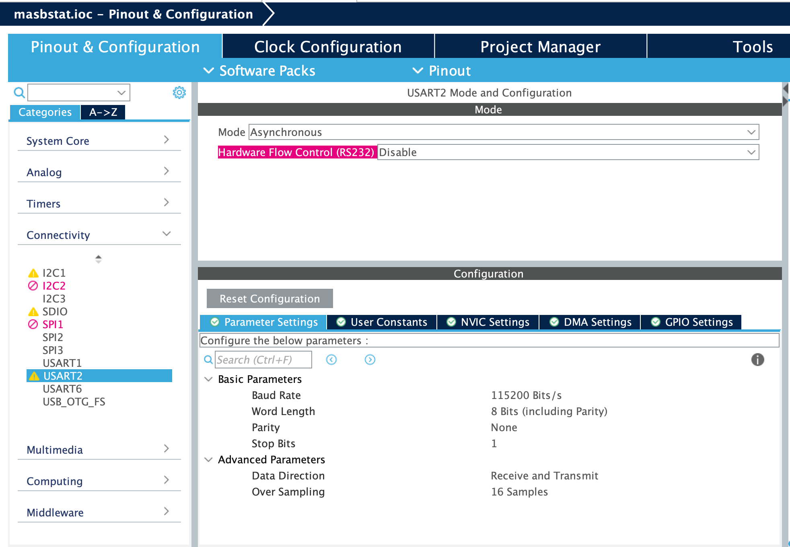
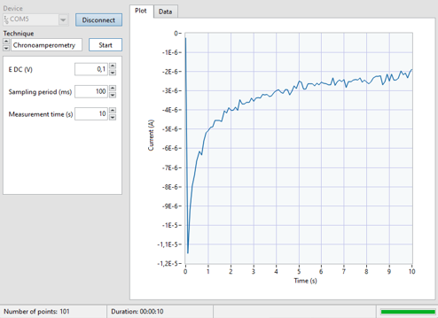

The current project, developed by the team *mireiasergio*, composed by Mireia Alibau Sánchez and Sergio Venteo Benavente, and under the tutoring of Albert Álvarez Carulla,  reviews the configuration and programming of a microcontroller meant to be used for automatic electrochemical measurements -such as chronoamperometries or cyclic voltammetries- by means of a potentiostat. It has been developed to put in practice all the knowledgment acquired during the **Microcontrollers for Biomedical Applications and Systems** course. 

The following document contains the concepts required for the development of the described applications as well all the information derived from it.

## Table of contents 

* [Introduction](#introduction)
  * [What is a potentiostat?](#what-is-a-potentiostat?)
  * [Electrochemical measurements](#electrochemical-measurements)
    * [Cyclic voltammetry](#cyclic-voltammetry)
    * [Cronoamperometry](#cronoamperometry)
  * [Git and Github](#git-and-github)
    * [Git branches](#git-branches)
* [Objectives](#objectives)
* [Methodology](#methodology)
  * [Design](#design)
      * [Evaluation Board](#evaluation-board)
      * [Structure Design](#structure-design)
    * [Workflow of the project](#workflow-of-the-project)
      * [Variables needed](#variables-needed)
      * [Flow diagrams](#flow-diagrams)
* [Results](#results)
  * [Cronoamperometry results](#cronoamperometry-results)
  * [Cyclic voltammetry results](#cyclic-voltammetry-results)
* [Conclusions](#conclusions)

# Introduction 

During the past decades, the medical field has experienced an exponential improvement, direct consecuence of technological advances. Among the different tech areas, the application of nanotechnology in medicine has lead to great improvements, overcoming challenges which were unimaginable to solve in the past.

The above-mentioned advances have enabled engineers to design miniaturized portable devices that ease the work of medical workers. As a result, greater has been the impact on the heathcare sector, developing, for instance, smaller versions of diagnostic devices. Miniaturized biosensors have been recently starting to form part of our daily lifes, representing a powerful Point-Of-Care tool. 

Potentiostats constitute one of the core elements of biosensors. In this sense, the correct development of this component is crucial for the optimal performance of the reviewed instrument. Following this line, this current project aims to construct and program a potentiostat with a EB Nucleo-F401R of STMicroelectronics.

## What is a potentiostat?

A [potentiostat](https://www.gamry.com/application-notes/instrumentation/potentiostat-fundamentals/) is a control and measuring instrument capable of reading the potential between a pair of electrodes while measuring the resulting current flow. Rather than only measuring in an **amperometric** mode -which is the above described procedure and approach implemented in this project-, it can be also set in a **potentiometric** configuration, where the current is fixed and the voltage is read. 

In the current area of interest, medicine, this device can be used fot the measuring and amplification of an electro-chemical reaction signal, enabling the concentration measurement of the analyte of interest.  

Potentiostats can be used to control two, three or four electrode configurations. Among them, the 3-electrode configuration is by far the most common, composed by: 

* Working electrode (WE): primary electrode in an electrochemical system, where the electrochemical reaction is ocurring. 
* Reference electrode (RE): characterizied by a stable electrode potential. Used as a point of reference in the electrochemical cell for the potential control and measurement of the working electrode.
* Auxiliary Electrode (AE): also known as Counter Electrode, it closes the current circuit  in the electrochemical cell.  Supplies the necessary current necessary to the working electrode.

<p align="center">
  
</p>

## Electrochemical measurements 

The potentiostat applications are wide and diverse, capable of handling with the most common electrochemical measurements. Two of them, which are also the ones performed in the current work, are **Cyclic Voltammetry (CV)** and **Chronoamperometry (CA)**.

### Cyclic voltammetry 

A [cyclic voltammetry](https://chem.libretexts.org/Bookshelves/Analytical_Chemistry/Supplemental_Modules_(Analytical_Chemistry)/Instrumental_Analysis/Cyclic_Voltammetry#:~:text=Cyclic%20Voltammetry%20can%20be%20used,the%20reversibility%20of%20a%20reaction.) is a type of potentiodynamic  measurement where a variable potential is applied to an electrochemical cell: a linearly ramping potential is applied between the working and reference electrodes. In this scenario, the potential is cycled such that the ramp is applied in one direction until it reaches a set potential value, then in reverse, forming a triangular wave. The electrical current is measured between the working and counter electrodes, result represented in a cyclic voltammogram -the current through the cell versus the voltage applied to the cell plot-. 

Cyclic voltammetry uses can be extended to different scenarios and has been widely use for the study of electrochemical processes under different conditions. Powerful information about the phisicochemical behavior of the system can be extracted, including the presence of intermediates in oxidation-reduction reactions, the reversibility of a reaction...

<p align="center">
  
</p>

### Cronoamperometry 

A [chronoamperometry](https://www.gamry.com/Framework%20Help/HTML5%20-%20Tripane%20-%20Audience%20A/Content/PE/Experimental_Techniques/Chronoamperometry/Purpose.htm) is described as an electrochemical technique characterized as a step method. As its chracterization higlights, a step signal is applied, raising the working electrode potential to a value at which a redox reaction occurs. The resulting varaition current response from faradaic processes through the cell is measured as a function of time. 

CA is used for the kinematics study of chemical reactions, diffusion processes and adsorption.

<p align="center">
  
</p>

## Git and GitHub

When facing projects involving the developento of code in teams there are tools available that can ease the work, such as **Git** and **GitHub**. **Git** is a VCS -Version Control System- whereas **GitHub** is a provider of Internet hosting for software development and version control using Git.

A Version Control System is a tool that facilitates the collaboratory work among different developers and users of a project. Furthermore, data is not overwritten and one can have access to previous code versions.

### Git branches

Aiming to organize the work and not overwrite previous code, is common to create different versions separated from the original code -the Git **branches**- and merge them with the master branch after we have finalized its editing. As seen in Figure ?, the new changes would be teste on the ```feature``` branch and, after its validity has been confirmed, add them to the ```develop``` branch to, finally, merge them to the ```master``` branch.

<p align="center">
  
</p>

Commonly, each developer creates their own branch and edits the project from it. In the case of the current project, each branch has been created according to its functionality: one branch for the chronoamperometry, one fot the DAC, etc. Thus, the following branches have been developed: 
* ```master```: branch containing the final code after merging all the created branches. Therefore, it will not be until all the created branches have been testes that they will be merged. 
* ```develop```: after the ```feature```branches have been succesfully tested, the will be merged with the ```develop``` branch. As for the final step, it will be merged with the ```master``` branch.
* ```feature/CA```: this branch contains the programming of the chronoamperometry, in which a cosntant tension of the elcotrchemical cell has been fixed for a period of time and the measurement is taken.
* ```feature/cyclyc_voltammetry```: this branch contains the programming of the cyclic voltameetry
* ```feature/DAC```: this branch contains the DAC configuration.
* ```feature/stm32```: this branch contains the microcontroller configuration, where all the develop functions are called -chronoamperometry, cyclic voltammetry...- for the excution of the complete program. In this brachn we can find the *setup* and *loop* function for the execution of the measurements always that the predefinied requirements are fulfilled.
* ```feature/adc```: this branch contains the ADC configuration.

# Objectives

The project main objective consists in the obtention of concentration measurements in samples of potassium ferrocyanide at different concentrations in a buffer of potassium chloride. These electrochemical measurements are based on the two above described electrochemical approaches: the chronoamperometry and the cyclic voltammetry. 

To do so, the primary task has been splitted in several sub-objectives, as a way of keeping track of the project development and achieving the principal goal:

* To program a portable potentiostat with the use of the **STM32 Nucleo-64 board**.
* To check the Power Management Unit (PMU) of the potentiostat front-end module.
* To communicate with the viSens-S application  with the host/computer using the MASB-COMM-S protocol.
* To implement a cyclic voltammetry.
* To implement a chronoamperometry.

Furthemore, highlight that several specific requirements have to be bore in mind for the correct project development and fulfillment of the reviewed sub-tasks.

As regards the **PMU**, it has to be initilized at the beginning and not be disabled again. 

On the other hand, the **microcontroller** needs to communicate with the host via synchronous comunications with the configuration 115200 8N1. The communication should be codified in COBS, where the character 0x00 is the term char. Regarding the microcontroller function, it has been definied to be the slave of the master -host-, answering to the instructions about the measurements to be taken as presented in the MASB-COMM-S protocol. The moment in which the corresponding instruction has been sent, the microcontroller should proceed to perform the measurement.

Another aspect to bear in mind is that, when no measurement is being taken, the front-end circuit connected to the CE should be kept open. 

In terms of programming in the STM environnment, as a way os easing the work, a function **setup** and **loop** shouls be developed. As a consequence, the principal execution file will do not require to be modified at all.

# Methodology

## Design

### Evaluation Board

**STM32 Nucleo-F401RE board** is the board used to perform the project. It allows the users to create their own prototypes for integrated applications. As we have observed during the course, its possibility of Arduino connectivity has helped the expansion of the functionality of the board. It does not require external probes since it has integrated ST-LINK/V2-1 programmer. What is more, the board is based on 32-bit RISC processors with ARM Cortex-M architecture. This structure contains a high-density instruction set and a NVIC (Nested Vector Interrupt Controller) controller that provide excellent interrupt handling capabilities.

<p align="center">
  
</p>

### Structure Design

- Configuration of ADC and GPIO

For analog inputs, we will use **ADC** _(Analog to Digital Converter)_. Thanks to this peripheral, we are able to convert a DC voltage signal into a digital one, discretizing and quantizing the DC signal. For this, we need to go to `Analog`, and configure the only ADC possible. After that, we enable the channels `INO` and `IN1`. 

<p align="center">
  
</p>

Regarding the digital outputs, we need to configure the pins following this table:

| Pin | Alias |         Type          | Description                                                                                                   |
| :-: | :---: | :------------------:  | :-------------------------------------------------------------------------------------------------------------- |
| PA1 | VREF  |       Analog input    | Absolute voltage of the _Reference Electrode (RE)_.       |
| PA0 | ICELL |       Analog input    | TIA output voltage.                                     |
| PB8 |  SCK  | I<sup>2</sup>C (SCK)  | Signal SCK of I<sup>2</sup>C.                     |
| PB9 |  SDA  | I<sup>2</sup>C (SDA)  | Signal SDA of I<sup>2</sup>C.                     |
| PA5 |  EN   |     Digital Output    | PMU (dis)enable signal.                           |
| PB5 | RELAY |     Digital Output    | Relay control signal.                                        |

We configure each digital output and we controle them with the **HAL** libraries. 

<p align="center">
  
</p>

- Timers

The **timers** are a register that act as a counter, whose value increases for each clock cycle or transition of an input signal. In our case, we will use `TIM3`. Despite the fact that the `TIM2` does not need software for its usage and configuration, we believe that it could be more complicated to configure it for this type of project. However, the sampling period would become easier to configure with the `TIM3`.

<p align="center">
  
</p>

Our timer works with a frequency of 84 MHz. This means that the timer will have to count until 84,000,000 for 1 second to pass. However, it has 16 bits, meaning that we cannot modify the _Counter Period_ to 84,000,000. To solve that problem, we will change the frequency to 10 MHz, by changing the _Prescaler_ to 8,399. Recalculating with this new frequency, we will need a _Counter Period_ of 65,535 to obtain a timer with a period of 0.1 ms.   

- UART

UART is the peripheral in charge of carrying out serial communication, in other words, recieve and send data through the enabled ports. As we have seen on the `Pinout View`, we have _PA2_ and _PA3_ as **TX** and **RX**, respectively. The only thing is that we have to select the mode _Asynchronous_. 

<p align="center">
  
</p>

- I2C

I2C is a serial communication protocol that defines the data and transfer of bits. It is a communication based on a master and different slaves. The first one has the duty of control and manage the communication defining who is speaking at each moment. Each device has its own address, the master will use it to indicate which one will recieve the data. 

<p align="center">
  
</p>

## Workflow of the project

### Variables needed 

- PMU

The Power Management Unit (PMU) is a microcontroller that governs power functions of digital platforms. In our case, we have configure a pin to communicate with it, _PA5_ named **EN**. This pin will enable and disable the PMU, supplying or not the front-end of the potentiostat. 

- Timers

The timers, as before-mentioned, act as counters, repeating an action with a certain frequency or after a period of time. The timer 3 has been configured to control the cyclic voltammetry and cronoamperometry. 

- ADC 

It allows us to convert the analog measurement into digital data. The measurement read and converted is the voltage and current from the potentiostat. 

- DAC

DAC is the variable in charge of defining the desired potential in the electrochemical cell. DAC is responsible of the interaction between the cell and define the initial potential to start the project. 

### Flow diagrams 

In this section we will see the different structure and flow of each program. 

- SETUP function from `stm32main.c`. 

<p align="center">
  
</p>

- LOOP function from `stm32main.c`. 

<p align="center">
  
</p>

- The implementation of the chronoamperometry is performed on `chrono_amperometry.c` and it is represented on this workflow. 

<p align="center">
  
</p>

- The general structure of the cyclic voltammetry can be observed on the following figure and it is specified in the code of the file `cyclic_voltammetry.c`.

<p align="center">
  
</p>

# Results

The following section aims to present the results obtained with the programmed potentiostat. The techniques above-described were tested by first performing a technical validation with a resistance-diode circuit and finally using a potassium ferricyanide sample at 1 mM in a buffer solution of potassium chloride.

<p align="center">
  
</p>  

During the test, where the potentiometer was connected to the microcontroller through the viSens-S application., we could verify the correct functioning of the code redacted for both techniques discussed as well as ensuring the correct connection  and sending and receival of data between the host -microcontroller- and the desketop application -viSens-S-.

Next, we proceed to deploy the programmed instrument in a real situation with a chemical solution. The following subsections present the obtained results.
 
## Cronoamperometry results

The obtained results with the experimental measurement of the chronoamperometry are presentend in the figure below. The parameters set can be observed in the left margin.

<p align="center">
  
</p>

## Cyclic voltammetry results

Finally, the obtained results with the experimental measurement of the cyclic voltammetry are presentend in the figure below.The parameters set can be observed in the left margin.

<p align="center">
  
</p>

# Conclusions

dddd