El presente proyecto, desarrollado por el equipo *mireiasergio*, integrado por Mireia Alibau Sánchez y Sergio Venteo Benavente, y bajo la tutoría de Albert Álvarez Carulla, reseña la configuración y programación de un microcontrolador destinado a ser usado para medidas electroquímicas automáticas -como cronoamperometrías o voltamperometrías cíclicas- por medio de un potenciostato. Ha sido desarrollado para poner en práctica todos los conocimientos adquiridos durante el curso **Microcontroladores para Aplicaciones y Sistemas Biomédicos**.

El siguiente documento contiene los conceptos necesarios para el desarrollo de las aplicaciones descritas así como toda la información derivada de este.

# Tabla de contenido

* [Introducción](#introducción)
  * [¿Qué es un potenciostato?](#qué-es-un-potenciostato)
  * [Mediciones electroquímicas](#mediciones-electroquímicas)
    * [Voltametría cíclica](#voltametría-cíclica)
    * [Cronoamperometría](#cronoamperometría)
  * [Git y Github](#git-y-github)
    * [Ramas Git](#ramas-git)
* [Objetivos](#objetivos)
* [Metodología](#metodología)
 * [Diseño](#diseño)
      * [Evaluación de la placa](#evaluación-de-la-placa)
      * [Diseño de la estructura](#diseño-de-la-estructura)
    * [Workflow del proyecto](#workflow-del-proyecto)
      * [Variables necesarias](#variables-necesarias)
      * [Diagramas de flujo](#diagramas-de-flujo)
* [Resultados](#resultados)
  * [Resultados de la cronoamperometría](#resultados-de-la-cronoamperometría)
  * [Resultados de la voltametría cíclica](#resultados-de-la-voltametría-cíclica)
* [Conclusiones](#conclusiones)

# Introducción

Durante las últimas décadas, el campo de la medicina ha experimentado una mejoría exponencial, consecuencia directa de los avances tecnológicos. Entre las diferentes áreas tecnológicas, la aplicación de la nanotecnología en la medicina ha supuesto grandes avances, superando retos que en el pasado eran inimaginables de resolver.

Los avances mencionados han permitido a los ingenieros diseñar dispositivos portátiles y miniaturizados que facilitan el trabajo de los médicos. Como resultado, destacable ha sido el impacto en el sector de la salud, desarrollando, por ejemplo, versiones más pequeñas de dispositivos de diagnóstico. Recientemente, los biosensores miniaturizados han comenzado a formar parte de nuestra vida diaria, representando un potencial instrumento para pruebas en el lugar de asistencia.

Los potenciostatos constituyen uno de los elementos centrales de los biosensores. De este modo, el correcto desarrollo de tal componente es crucial para el óptimo desempeño del instrumento esmentado. Siguiendo esta línea, el presente proyecto tiene como objetivo construir y programar un potenciostato con un EB Nucleo-F401R de STMicroelectronics.

## ¿Qué es un potenciostato?

Un [potenciostato](https://www.gamry.com/application-notes/instrumentation/potentiostat-fundamentals/) es un instrumento de control y medición capaz de leer el potencial entre un par de electrodos mientras mide el flujo de corriente resultante. Más allá de medir en un modo **amperométrico** -pues se trata del procedimiento descrito anteriormente y el método implementado en este proyecto-, también se puede programar en una configuración **potenciométrica**, donde la corriente es fija y el voltaje es leido.

En el área de interés actual, la medicina, este dispositivo puede ser usado para la medición y amplificación de una señal de reacción electroquímica, posibilitando la mensuración de la concentración del analito de interés.

Los potenciostatos se pueden emplear para controlar configuraciones de dos, tres o cuatro electrodos. Entre ellos, la configuración de 3 electrodos es la más común, compuesta por:

* Electrodo de trabajo (WE): electrodo primario en un sistema electroquímico, donde se está produciendo la reacción electroquímica.
* Electrodo de referencia (RE): caracterizado por un potencial de electrodo estable. Utilizado como punto de referencia en la celda electroquímica para el control de potencial y medición del electrodo de trabajo.
* Electrodo Auxiliar (AE): también conocido como Contraelectrodo, cierra el circuito de corriente en la celda electroquímica. Suministra la corriente necesaria al electrodo de trabajo.

<p align="center">
  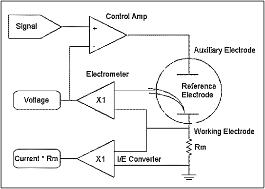
</p>

## Mediciones electroquímicas

Las aplicaciones del potenciostato son amplias y diversas, capaces de manejar las medidas electroquímicas más comunes. Dos de ellas, que también son las realizadas en el presente trabajo, son la **voltametría cíclica (CV)** y la **cronoamperometría (CA)**.

### Voltametría cíclica

Una [voltametría cíclica](https://chem.libretexts.org/Bookshelves/Analytical_Chemistry/Supplemental_Modules_(Analytical_Chemistry)/Instrumental_Analysis/Cyclic_Voltammetry#:~:text=Cyclic%20Voltammetry%20can%20be%20used,the%20reversibility%20of%20a%20reaction.) es un tipo de medición potenciodinámica en la que se aplica un potencial variable a una celda electroquímica: se aplica un potencial de rampa lineal entre los electrodos de trabajo y de referencia. En este escenario, el potencial se cicla de tal manera que la rampa se aplica en una dirección hasta que alcanza un valor de potencial establecido, luego en sentido inverso, formando una onda triangular. La corriente eléctrica se mide entre los electrodos de trabajo y contraelectrodo, resultado representado en un voltamograma cíclico -la corriente a través de la celda versus el voltaje aplicado a la celda-.

Los usos de la voltametría Cíclica pueden extenderse a diferentes escenarios y ha sido ampliamente empleado para el estudio de procesos electroquímicos bajo diferentes condiciones. Se puede extraer información de gran interés sobre el comportamiento fisicoquímico del sistema, incluyendo la presencia de intermediarios en las reacciones de oxidación-reducción, la reversibilidad de una reacción...

<p align="center">
  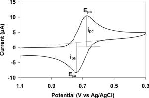
</p>

### Cronoamperometría

Una [cronoamperometría](https://www.gamry.com/Framework%20Help/HTML5%20-%20Tripane%20-%20Audience%20A/Content/PE/Experimental_Techniques/Chronoamperometry/Purpose.htm) se describe como una técnica electroquímica caracterizada como un método escalonado. Como su caracterización resalta, se aplica una señal escalonada, elevando el potencial del electrodo de trabajo a un valor en el que se produce una reacción redox. La respuesta de corriente de variación resultante de los procesos faradaicos a través de la celda se mide en función del tiempo.

La cronoamperometría se utiliza para el estudio cinemático de reacciones químicas, procesos de difusión y adsorción.

<p align="center">
  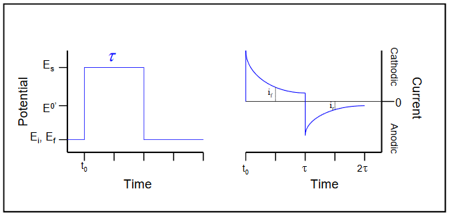
</p>

## Git y GitHub

A la hora de afrontar proyectos de desarrollo de código en equipo existen herramientas que pueden facilitar el trabajo, como **Git** y **GitHub**. **Git** es un VCS -Sistema de control de versiones- mientras que **GitHub** es un proveedor de alojamiento de Internet para el desarrollo de software y el control de versiones utilizando Git.

Un Sistema de Control de Versiones es una herramienta que facilita el trabajo colaborativo entre diferentes desarrolladores y usuarios de un proyecto. Además, los datos no se sobrescriben y se puede tener acceso a versiones de código anteriores.

### Ramas Git

Con el fin de organizar el trabajo y no sobrescribir el código anterior, es común crear diferentes versiones separadas del código original -las **ramas** de Git- y fusionarlas con la rama maestra después de haber finalizado su edición. Como se ve en la Figura ?, los nuevos cambios serían testeados en la rama ```feature``` y, una vez confirmada su validez, se añadirían a la rama ```develop``` para, finalmente, fusionarlos a la rama ```master```.

<p align="center">
  
</p>

Comúnmente, cada desarrollador crea su propia rama y edita el proyecto desde ella. En el caso del proyecto actual, se ha creado cada rama según su funcionalidad: una rama para la cronoamperometría, otra para el DAC, etc. Así pues, se han desarrollado las siguientes ramas:
* ```master```: rama que contiene el código final después de fusionar todas las ramas creadas. Por tanto, no será hasta que todas las ramas creadas hayan sido testeadas que se fusionarán.
* ```develop```: después de que las ramas ```feature``` hayan sido probadas con éxito, se fusionarán con la rama ```develop```. En cuanto al paso final, se fusionará con la rama ```master```.
* ```feature/CA```: esta rama contiene la programación de la cronoamperometría, en la cual se ha fijado una tensión constante de la celda elcotrquímica por un período de tiempo y se toma la medida.
* ```feature/cyclyc_voltammetry```: esta rama contiene la programación de la voltametría cíclica
* ```feature/stm32```: esta rama contiene la configuración del microcontrolador, donde se denominan todas las funciones desarrolladas -cronoamperometría, voltamperometría cíclica...- para la ejecución del programa completo. En esta rama podemos encontrar la función *setup* y *loop* para la ejecución de las medidas siempre que se cumplan los requisitos predefinidos.
* ```feature/ADC```: esta rama contiene la configuración del ADC.
* ```feature/PMU```: esta rama contiene la configuración del PMU.
* ```feature/timer```: esta rama contiene la configuración del timer.


# Objetivos

El objetivo principal del proyecto consiste en la obtención de medidas de concentración en muestras de ferrocianuro de potasio a diferentes concentraciones en un tampón de cloruro de potasio. Estas mediciones electroquímicas se basan en los dos enfoques electroquímicos descritos anteriormente: la cronoamperometría y la voltametría cíclica.

Para ello, la tarea principal se ha separado en varios subobjetivos, como una forma de llevar un seguimiento del desarrollo del proyecto y lograr la meta principal:

* Programar un potenciostato portátil con el uso de la **placa STM32 Nucleo-64**.
* Verificar la Unidad de administración de energía (PMU) del módulo frontal del potenciostato.
* Comunicarse con la aplicación viSens-S con el host/ordenador usando el protocolo MASB-COMM-S.
* Implementar una voltametría cíclica.
* Implementar una cronoamperometría.

Además, destacar que se deben tener en cuenta varios requisitos específicos para el correcto desarrollo del proyecto y el cumplimiento de las subtareas descritas.

En cuanto a la **PMU**, se tiene que inicializar al principio y no volver a deshabilitarse.

Por otro lado, el **microcontrolador** necesita comunicarse con el host a través de comunicaciones síncronas con la configuración 115200 8N1. La comunicación debe codificarse en COBS, donde el carácter 0x00 es el término char. En cuanto a la función del microcontrolador, se ha definido que sea el esclavo del maestro -host-, respondiendo a las instrucciones sobre las medidas a tomar presentadas en el protocolo MASB-COMM-S. En el momento en que se haya enviado la instrucción correspondiente, el microcontrolador deberá proceder a realizar la medida.

Otro aspecto a tener en cuenta es que, cuando no se esté realizando ninguna medida, se debe mantener abierto el circuito frontal conectado al CE.

En cuanto a la programación en el entorno STM, como una forma de facilitar el trabajo, se debe desarrollar una función **setup** y **loop**. En consecuencia, no será necesario modificar el archivo de ejecución principal.

# Metodología

## Diseño

### Evaluación de la placa

La placa STM32 Nucleo-F401RE es la placa utilizada para realizar el proyecto. Permite a los usuarios crear sus propios prototipos para aplicaciones integradas. Como hemos observado durante el curso, su posibilidad de conectividad con Arduino ha ayudado a la ampliación de la funcionalidad de la placa. No requiere sondas externas ya que lleva integrado el programador ST-LINK/V2-1. Además, la placa está basada en procesadores RISC de 32 bits con arquitectura ARM Cortex-M. Esta estructura contiene un conjunto de instrucciones de alta densidad y un controlador NVIC que proporciona excelentes capacidades de manejo de interrupciones.

<p align="center">
  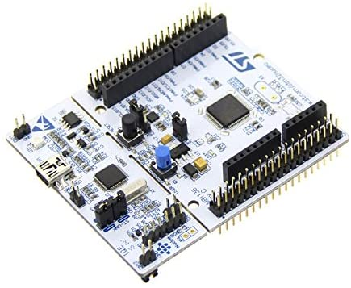
</p>

### Diseño de la estructura

- Configuración de ADC y GPIO

Para las entradas analógicas, usaremos **ADC** _(Convertidor analógico a digital)_. Gracias a este periférico, somos capaces de convertir una señal de tensión DC en una digital, discretizando y cuantificando la señal DC. Para esto, debemos ir a `Analog` y configurar el único ADC posible. Después de eso, habilitamos los canales `INO` e `IN1`.

<p align="center">
  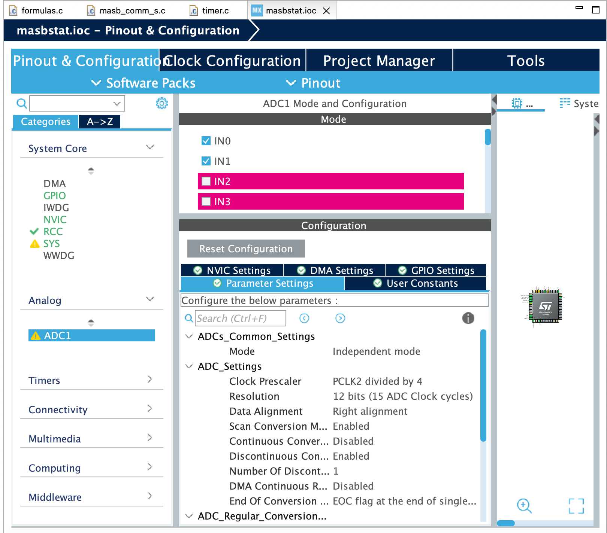
</p>

En cuanto a las salidas digitales, debemos configurar los pines siguiendo esta tabla:

| Pin | Alias |         Tipo          | Descripción                                                                                                   |
| :-: | :---: | :------------------:  | :-------------------------------------------------------------------------------------------------------------- |
| PA1 | VREF  |       Entrada analógica    | Tensión absoluta del _Electrodo de Referencia (RE)_.     |
| PA0 | ICELL |       Entrada analogica    | Voltaje de salida TIA.                                     |
| PB8 |  SCK  | I<sup>2</sup>C (SCK)  | Señal SCK de I<sup>2</sup>C.                     |
| PB9 |  SDA  | I<sup>2</sup>C (SDA)  | Señal SDA de I<sup>2</sup>C.                     |
| PA5 |  EN   |     Salida digital    | Señal de (des)habilitación de PMU.                         |
| PB5 | RELAY |     Salida digital    | Señal de control de relé.                                       |

Configuramos cada salida digital y las controlamos con las bibliotecas **HAL**.

<p align="center">
  
</p>

> **Figura**: Configuración de los pines GPIO.  

- Timers

Los **temporizadores** son un registro que actúa como contador, cuyo valor aumenta por cada ciclo de reloj o transición de una señal de entrada. En nuestro caso, usaremos `TIM3`. A pesar de que el `TIM2` no necesita software para su uso y configuración, creemos que podría ser más complicado de configurar para este tipo de proyectos. Sin embargo, el período de muestreo sería más fácil de configurar con `TIM3`.

<p align="center">
  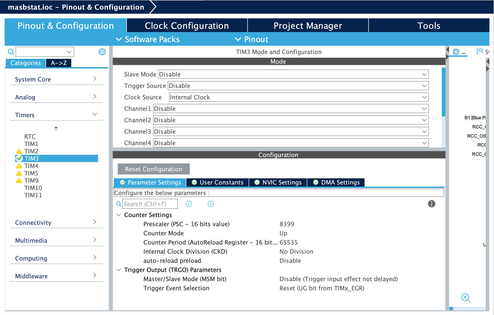
</p>

Nuestro temporizador funciona con una frecuencia de 84 MHz. Esto significa que el temporizador tendrá que contar hasta 84 000 000 para que pase 1 segundo. Sin embargo, nuestro temporizador tiene 16 bits, lo que significa que no podemos modificar el _Período del contador_ a 84,000,000. Para solucionar ese problema, cambiaremos la frecuencia a 10 MHz, cambiando el _Presclaer_ a 8.399. Recalculando con esta nueva frecuencia, necesitaremos un _Contador de Periodo_ de 65.535 para obtener un temporizador con un periodo de 0,1 ms.


- UART

UART es el periférico encargado de realizar la comunicación serial, es decir, recibir y enviar datos a través de los puertos habilitados. Como hemos visto en `Pinout View`, tenemos _PA2_ y _PA3_ como **TX** y **RX**, respectivamente. Lo único es que tenemos que seleccionar el modo _Asíncrono_.

<p align="center">
  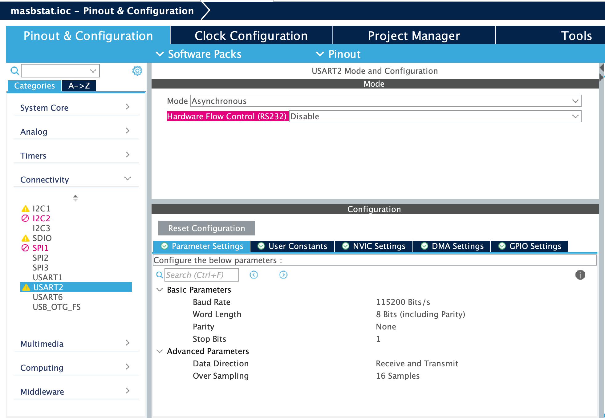
</p>

- I2C

I2C es un protocolo de comunicación en serie que define los datos y la transferencia de bits. Es una comunicación basada en un maestro y diferentes esclavos. El primero tiene la función de controlar y gestionar la comunicación definiendo quién habla en cada momento. Cada dispositivo tiene su propia dirección, el maestro la usará para indicar cuál recibirá los datos.

<p align="center">
  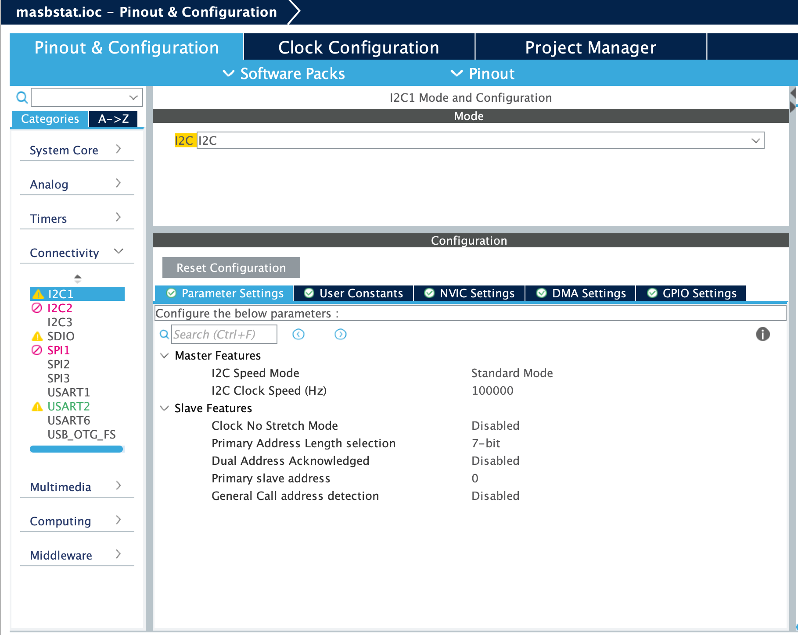
</p>

## Workflow del proyecto

### Variables necesarias 

- PMU

La Unidad de administración de energía (PMU) es un microcontrolador que gobierna las funciones de energía de las plataformas digitales. En nuestro caso, hemos configurado un pin para comunicarse con él, _PA5_ llamado **EN**. Este pin habilitará y deshabilitará la PMU, alimentando o no el front-end del potenciostato.

- Timers

Los temporizadores, como se mencionó anteriormente, actúan como contadores, repitiendo una acción con cierta frecuencia o después de un período de tiempo. El temporizador 3 ha sido configurado para controlar la voltammetría cíclica y la cronoamperometría.

- ADC 

Nos permite convertir la medida analógica en datos digitales. La medida leída y convertida es el voltaje y la corriente del potenciostato.

- DAC

DAC es la variable encargada de definir el potencial deseado en la celda electroquímica. DAC es responsable en la interacción entre la célula y define el potencial inicial para iniciar el proyecto. 

### Diagramas de flujo

En esta sección veremos la diferente estructura y flujo de los principales programas.

- Función SETUP de `stm32main.c`. 

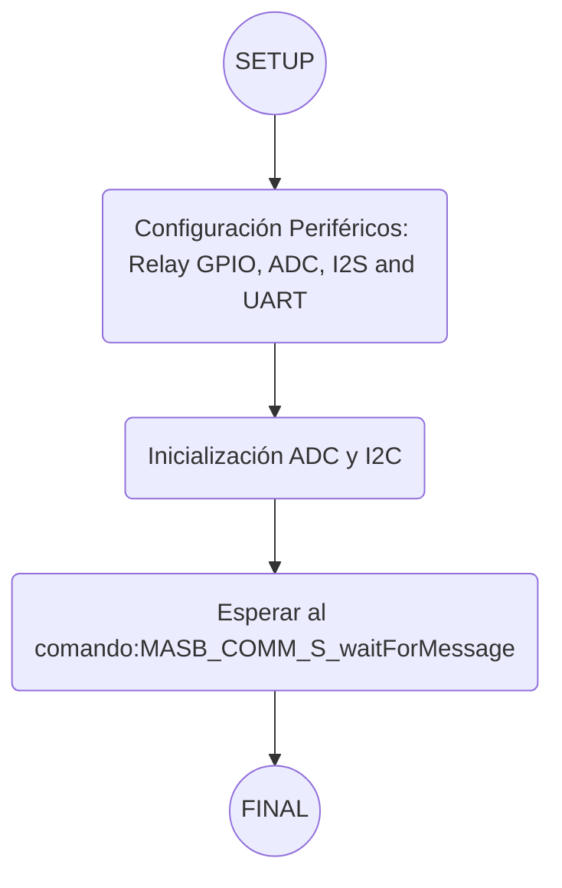

- Función LOOP de `stm32main.c`. 

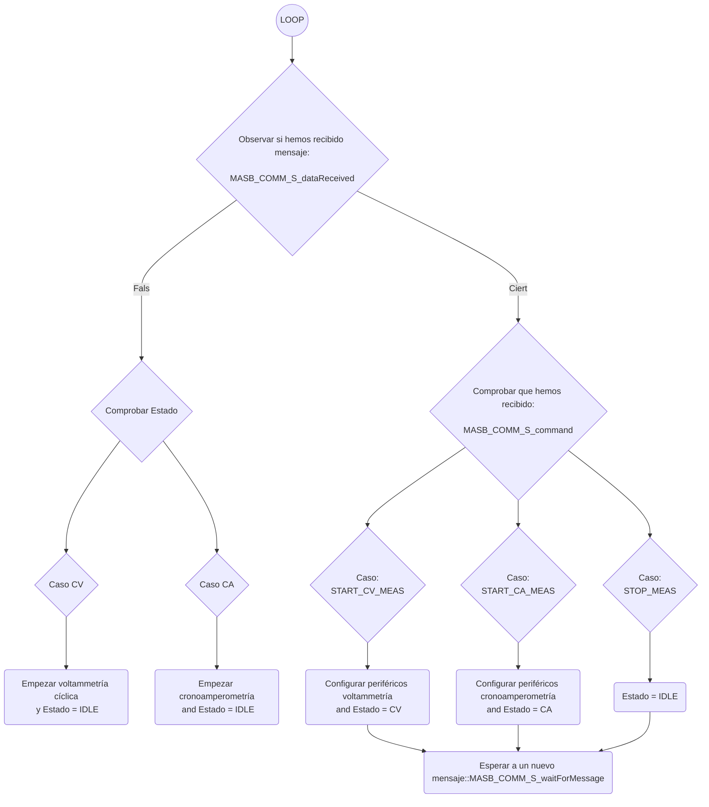
- La implementación de la cronoamperometría se realiza en `chrono_amperometry.c` y se representa en este flujo de trabajo.

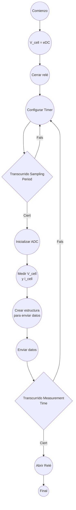

- La estructura general de la voltametría cíclica se puede observar en la siguiente figura y se especifica en el código del archivo `cyclic_voltammetry.c`.

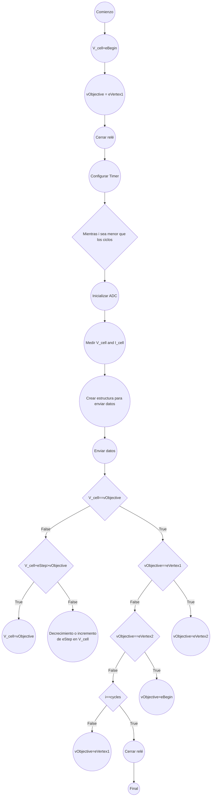

# Resultados

La siguiente sección tiene como objetivo presentar los resultados obtenidos con el potenciostato programado. Las técnicas descritas anteriormente se probaron realizando primero una validación técnica con un circuito de resistencia-diodo y finalmente utilizando una muestra de ferricianuro de potasio a 1 mM en una solución tampón de cloruro de potasio.

<p align="center">
  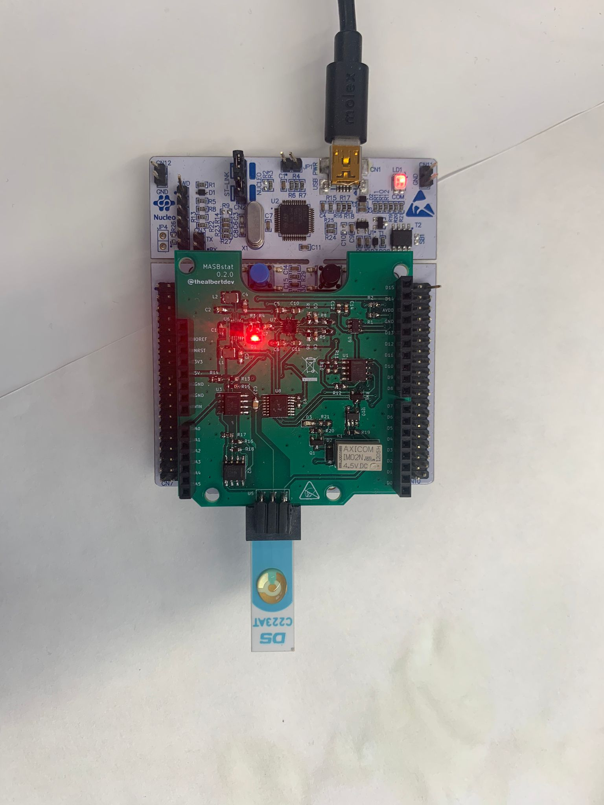
</p>  


Durante la prueba, donde se conectó el potenciómetro al microcontrolador a través de la aplicación viSens-S, pudimos verificar el correcto funcionamiento del código redactado para ambas técnicas comentadas así como asegurar la correcta conexión y envío y recepción de datos entre el host -microcontrolador- y la aplicación de escritorio -viSens-S-.

A continuación, procedemos a usar el instrumento programado en una situación real con una solución química. Las siguientes subsecciones presentan los resultados obtenidos.
 
## Resultados de la cronoamperometría

Los resultados obtenidos con la medida experimental de la cronoamperometría se presentan en la siguiente figura. Los parámetros configurados se pueden observar en el margen izquierdo.

<p align="center">
  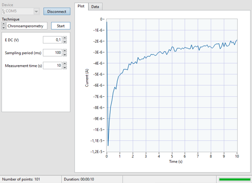
</p>

## Resultados de la voltametría cíclica

Finalmente, los resultados obtenidos con la medida experimental de la voltametría cíclica se presentan en la siguiente figura. Los parámetros establecidos se pueden observar en el margen izquierdo.

<p align="center">
  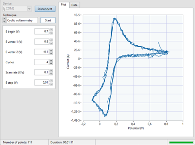
</p>

# Conclusiones

En este proyecto se ha realizado la programación de un potenciostato, obteniendo una implementación exitosa para obtener la cronoamperometría y la voltamperometría cíclica de una solución de ferricianuro de potasio a diferentes concentraciones en un tampón de cloruro de potasio. Para lograr eso, tenemos que hacer la programación en una _Placa de evaluación STM32 Nucleo-F401RE_. La configuración de éste ha sido fundamental para realizar la programación posterior. Durante el curso, hemos aprendido acerca de los microcontroladores y diferentes periféricos estudiados fueron utilizados en este proyecto para el correcto funcionamiento del programa.

Además, hemos utilizado GitHub para desarrollar el proyecto de forma sincrónica con nuestro socio. Hemos podido controlar la evolución del proyecto y diferentes ramas se han utilizado para desarrollarlo. Finalmente, se han realizado diferentes pruebas para asegurar el correcto funcionamiento del proyecto.
