This project has been carried out in the subject of Microcontrollers for Biomedical Applications and Systems of the Degree in Biomedical Engineering at the University of Barcelona (UB) and has been developed by the students Jan Elliot González Álvarez and Eduard Ruiz Munné.

The objective of the project was to develop an algorithm within a microcontroller capable of **controlling and performing chemical tests using a potentiostat**. Through a system of seven instructions and the configuration of different parameters through a graphical interface (viSens-S) developed in LabView. This project includes carrying out chronoamperometry and cyclic voltammetry to measure different chemical solutions.a

### Table of Contents

- [Introduction](#introduction)
     - [Chronoamperometry](#chronoamperometry)
     - [Cyclic voltammetry](#cyclic-voltammetry)
     - [Potentiostat](#potentiostat)
- [Objectives](#objectives)
- [Material and methods](#material-and-methods)
     - [STM32F401 Nucleo-64](#stm32f401-nucleo-64)
     - [STM32Cube IDE](#stm32cube-ide)
     - [LabView](#labview)
     - [Git and Github](#git-and-github)
     - [Front end modules](#front-end-modules)
- [Operation Flows](#operation-flows)
- [Results](#results)
- [Conclusions](#conclusions)

## Introduction

The system controlled by graphical interface in LabView allows to carry out chronoamperometry and cyclic voltammetry with a potentiostat through the **setting of different parameters**.

Using C programming in the **STM32Cube environment**, a STM32F401 Nucleo-64 board has been programmed that allows chemical tests to be carried out for later use in laboratories. The axis of the project is a microcontroller capable of receiving parameters and sending the measured data to a graphical interface that is displayed on the computer screen.

### Chronoamperometry

It is an electrochemical technique that consists of an electrode that receives a quadratic potential and is capable of measuring the processes that occur in this electrode as **[a time-varying current](https://en.wikipedia.org/wiki/Chronoamperometry)**.

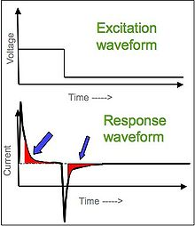

> **Chronoamperometry:** excitation signal and system response signal.

The variation of the current with time varies depending on the diffusion of the analyte on the surface of the sensor. Concentration is also a [determining factor](https://www.sciencedirect.com/science/article/pii/B9780128029930000046) in the resulting values.

It is one of the most used techniques in electrochemistry due to its simplicity.

### Cyclic voltammetry

In cyclic voltammetry, the potential at the *working electrode* increases linearly with time, repeating the process several times. Finally, the current in the electrode is plotted as a function of the applied potential, obtaining a **[cyclic graph](https://en.wikipedia.org/wiki/Cyclic_voltammetry)**.

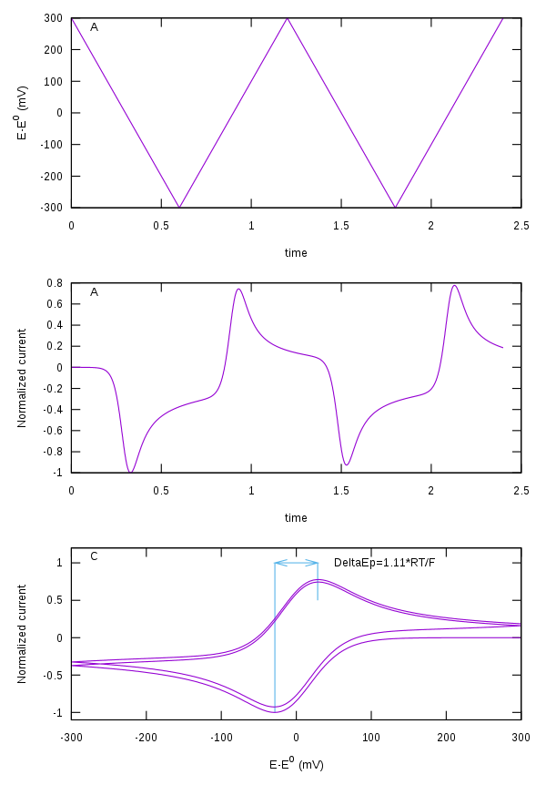

> **Cyclic voltammetry:** graph of a cyclic voltammetry and acquisition process.

This test is performed to study the **electrochemical properties** of the analyte to be studied and that is in contact with the electrode.

Like other voltammetry techniques, it uses a total of three electrodes to measure the signal:

- **Working electrode**: responsible for measuring the signal.
- **Reference electrode**: serves as a reference for the working electrode to measure the potential. It has already known potential.
- **Counter electrode**: used to measure the current of the working electrode.

### Potentiostat

It is a device to control a **three-electrode** cell (those named in [cyclic voltammetry](#cyclic-voltammetry)) to perform electrochemical tests on analytes.

The front-end pins of the potentiostat that interact with the microcontroller are:

| Pin | Aliases | Type | Description |
| :-: | :---: | :------------------: | :-------------------------------------------------------------------------------------------------------------- |
| PA0 | FVREF | Analog input | Absolute voltage of the _Reference Electrode (RE)_ VREF used for the measurement of VCELL. |
| PA1 | ICELL | Analog input | TIA output voltage used for ICELL measurement. |
| PB8 | SCK | I2C (SCK) | SCK signal from the I2C. With the I2C bus the DAC of the _front-end_ is controlled. |
| PB9 | SDA | I2C (SDA) | SDA signal from the I2C. With the I2C bus the DAC of the _front-end_ is controlled. |
| PA5 | ON | digital output | PMU (dis)enable signal. `0`: PMU disabled. `1`: PMU enabled. |
| PB5 | RELAYS | digital output | Relay control signal. `0`: Relay open. `1`: Relay closed. |

> Table with the pins contained in the [script](https://github.com/Biomedical-Electronics/masbstat-vitinha-team) of the project.

## Objectives

The project consists of programming a microcontroller to develop the following functions:

- Receive via COBS serial communication to indicate the test to be carried out (Control via instruction set).
- Receive through COBS serial communication to adjust the test parameters.
- Calculation of the chronoamperometry using the measured values.
- Calculation of cyclic voltammetry using the measured values.
- Sending of the calculated values for their representation in a graphical interface through the MASB-COMM-S protocol.
- Control of the sampling frequency through the ADC, timers and interruptions.
- Graphical representation of the signal obtained in a graphical interface designed with LabView.
- Evaluation of the prototype with a buffer sample of potassium chloride.

## Material and methods

For the elaboration of the project the following materials have been required:

### STM32F401 Nucleo-64

It is a [board](https://docs.rs-online.com/2f7f/0900766b81440071.pdf) that allows **flexible testing** both on Arduino and at **register level**. It contains basic elements for testing such as an LED, a reset button and a user button, configurable ADCs and a relatively simple system to program in a microcontroller for educational, professional or entertainment use.

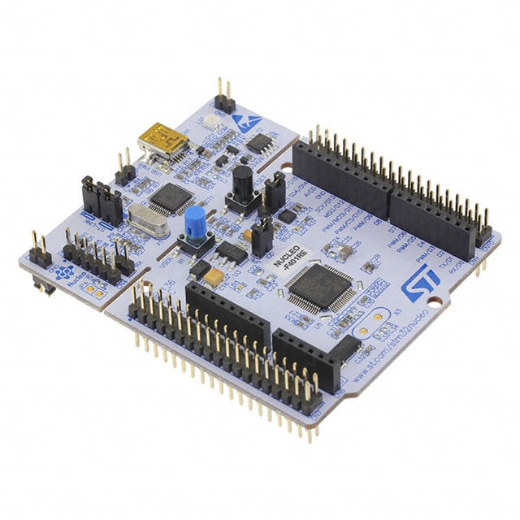

> **STM32F401 Nucleo-64:** board with which the project was made.

### STM32Cube IDE

[STM32Cube](https://www.st.com/en/development-tools/stm32cubeide.html) is an IDE used to easily program STM32 boards at register level in **C/C++ language**. It is a software that includes the **HAL libraries** (Hardware Abstraction Layer) and allows portability between different elements of STM32.

One of the advantages, apart from including the [HAL libraries](https://www.st.com/resource/en/user_manual/dm00105879-description-of-stm32f4-hal-and-ll-drivers-stmicroelectronics.pdf) it is the ability to configure the parameters of the microcontroller graphically (without programming) and subsequently generate the code automatically. It also allows you to compile and debug the application to find possible errors in the code more easily.

### LabView

LabView is a block-based graphical programming system that enables quick and easy testing by **creating interfaces** related to adjustable internal blocks. It also allows connectivity with other programming languages ​​to add new functions to those already pre-established by the [software](https://www.ni.com/es-es/shop/labview.html).

For this project, the application **[viSens-S](https://github.com/Albert-Alvarez/viSens-S/releases/tag/v0.2.1)** has been used, developed with LabView and which allows connecting with a device and perform a chronoamperometry or cyclic voltammetry by adjusting different parameters graphically while the results are represented in a graph or a table can be accessed with the data received from the microcontroller (with the possibility of being exported). In the following video you can see how it works.

### Git and GitHub

[Git](https://git-scm.com) is a free, open source system used to allow **version control** of projects, which makes it really easy to maintain and scale a project when it is a lot of encrypted files. It allows registering different versions of a document at the same time combining the work of different people who share the same repository through the use of connecting branches.

[GitHub](https://github.com) is a collaborative development platform that allows you to store projects that use Git version control. This interactive platform allows you to store projects in the cloud and has added more features to get the most out of it. Each project can be viewed as a web page, Markdown scripts can be viewed and interacted with, it acts as a social network with profiles and forums. As well as adding project management features like Kanban and timelines.

> Git workflow, with different branches each responsible for performing its function.

In this project, Git has been used with the following branches to organize the changes between the team and simulate the workflow of a company specialized in software development:

- **Branch *master*:** This is the main branch that contains all the **code in production** and can be used by the end user.
- **Branch *develop*:** contains the development of the project by attaching each feature to this branch. It is the previous step to the master branch but it may contain errors that must be corrected.
- **Branch *feature*:** these are small branches where each **application feature** is developed individually to organize the modifications and avoid the editing of shared documents between different features.
    - **feature/instruction-set**: development of configurable parameters with *cases* to choose the test to be carried out. Elaboration of the *script* `stm32main` where the different functions are called.
    - **feature/chronoamperometry**: chronoamperometry programming. Algorithm that measures the current and returns it as a function of time so that viSens-S can plot it on the front-end of the application.
    - **feature/cyclic-voltammetry**: cyclic voltammetry programming. Development of the algorithm responsible for measuring the current and voltage and sending the signal to viSens-S so that it can be plotted.
- **Branch *hotfix*:** This is the branch that allows correcting errors or *bugs* that the application may contain.

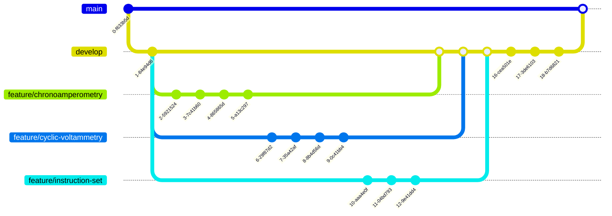

> Diagram with the different branches of the Git workflow. The number of *commits* is indicative, not all are shown to avoid a scheme with too much detail.

### Front End Modules

The front end of the board is made up of different elements that make up the potentiostat and that are connected to the microcontroller to perform the different electrochemical tests and control the microcontroller.

- **Power Management Unit (PMU)**

It is the element responsible for resetting the control, controlling the clock and controlling the state of the microcontroller (open or off). It is responsible for managing the **front-end power supply** and must be turned on at the very beginning since it is turned off by default. Once turned on, a 500ms delay is added to ensure that all the components are well powered before continuing with the execution of the code.

- **Relay**

Regulates the connection of the front-end with the board. This element **controls the start and end of the measurement**. When it is open (default state) the signal is not measured, however, when it is closed, measurements can be made. For this reason, it will be essential at the beginning of each process to close the relay (its closure is perceived by a small *click* noise) and open once the measurement is finished. Its control is done with the previously named `RELAY` pin by graphically modifying the `.ioc` file.

- **Potentiostat**

The potentiostat is responsible for **polarizing the electrochemical cell** at a voltage VCELL and reading the current flowing through it ICELL. The polarization to the desired voltage is carried out with a DAC model MCP4725 with address I2C `1100000`.

The DAC generates a 0 to 4V output but a system has been added capable of converting it to a -4 to 4V bipolar signal to have both positive and negative voltages.

Although we provide the voltage, we cannot take it for granted and it is necessary to use the ADC to measure the voltage that corresponds to VREF although it requires a prior transformation to a unipolar signal. With this voltage VREF we can obtain VCELL which is the one of our interest.

To finally measure the current, a TIA amplifier (50 kΩ resistor) is used prior to another unipolar signal transformation module. The `formulas` library, already available in the project, allows you to calculate the real stresses in order to represent them in the graphs.

## Operation Flows

The following diagrams serve as a representation of the **operation flows** of the microcontroller, the internal algorithms and their operation to carry out both tests for the electrochemical measurement of the buffer.

### App

In the application flow there is an **interaction between the user and the microcontroller** through the viSens-S application in an interactive way, where the user can indicate the measurement parameters and receive the data measured by the microcontroller that will later be viewed through the app. The following diagram shows the application in detail:

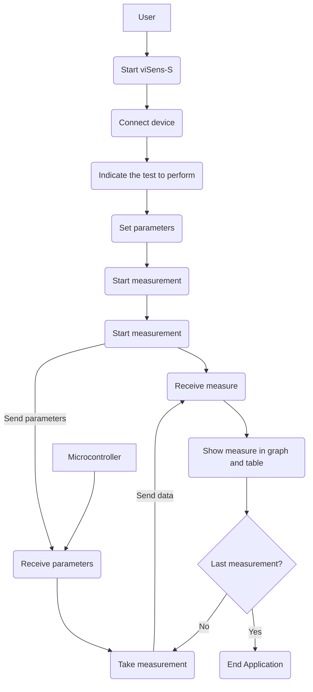

First, the viSens-S application must be started and the device must be connected, in this case the NUCLEO-F401RE microcontroller. Once connected, the electrochemical technique (chronoamperometry and cyclic voltammetry) is chosen and the parameters are configured. The `Start` button allows you to start the measurement, where the microcontroller will take the data and send it to the application via serial communication. The process of sending signals will be carried out until the measurement ends, where the application will stop.

### Microcontroller

The microcontroller has a workflow based on the received message, which must process and activate different functions. The following diagram shows how the microcontroller works.

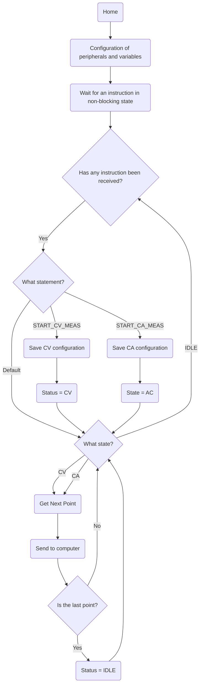

First, the peripherals are configured and the different microcontroller variables are started, waiting to receive an instruction. When an instruction is received, it can be of three types:

- **Chronoamperometry**: when it receives `START_CA_MEAS` it saves the chronoamperometry configuration and changes the status variable to CA. In this way, the chronoamperometry will only be executed when the state of the variable is AC.
- **Cyclic voltammetry**: when it receives `START_CV_MEAS`, it proceeds to perform the last function of the chronoamperometry but changing the state to CV.
- **By default**: if none of the above is received, the microcontroller will not perform any function and will wait to receive a new instruction.

Measurements are taken until the last measurement point is reached, where the status is changed to IDLE, so that the measurement is stopped and the device remains waiting to receive another instruction to perform the same procedure again.

### Chronoamperometry

The chronoamperometry test has its own particular internal operation that must be configured:

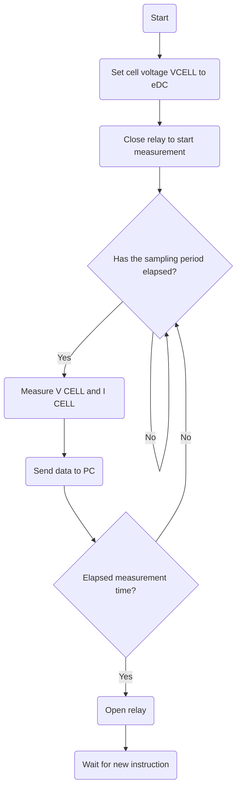

First, the electrochemical cell voltage is set to eDC, which is received by the microcontroller through serial communication and adjusted by the user in the viSens-S application. The relay is closed, which is open by default, and each time an interruption occurs (adjusting the measurement period received from the user parameters), a measurement of VCELL and I is performed. CELL that is sent to the application. This process occurs repeatedly in a previously determined period and, once the total indicated time has elapsed, the relay opens to end the measurement.

### Cyclic voltammetry

The cyclic voltammetry test has its own particular internal workings that must be configured:

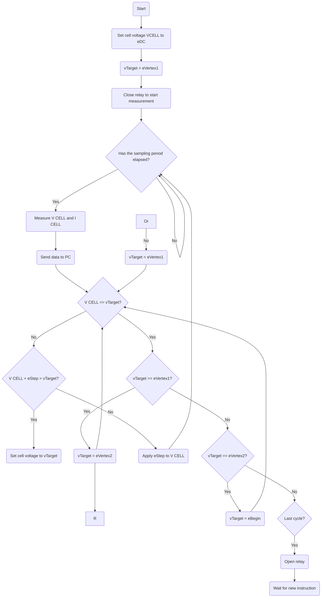

In cyclic voltammetry, firstly, the potential of the cell and that of vertex 1 are fixed. Subsequently, the relay is closed and each sampling period (fixed by interruptions) is measured the voltage and current of the cell that are sent to the host. Once the potential reaches the target, it is checked if it corresponds to the different vertices, if not, the vTarget is set to the indicated vertex until reaching the last cycle where the relay opens and the measurement ends.

## Results

This section is divided into two sections, the results obtained through the test tests that receive the signal that circulates through an electrical circuit and the results obtained in the final test with a potassium chloride buffer.

### Tests

For the test tests, the microcontroller has been connected to the following electronic circuit:

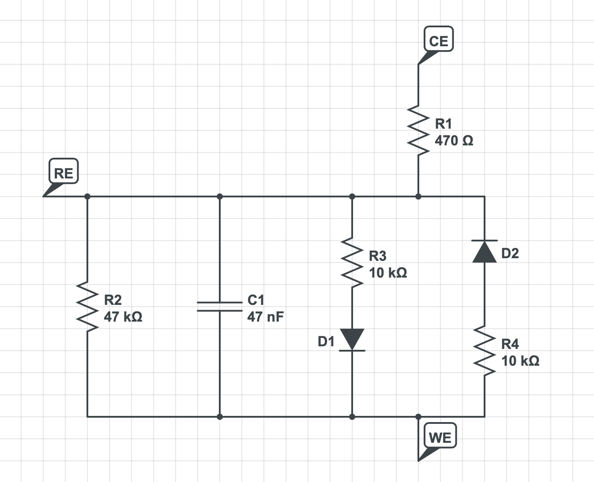

The results obtained were a noisy and stable signal for the chronoamperometry, with a mean greater than 0 (indicating the correct operation of the electrical circuit). In the case of cyclic voltammetry, the graph was cyclic reaching a fixed maximum and minimum.

### Results with potassium chloride buffer

The evaluation of the project was done using the program developed in the microcontroller with a sample of potassium chloride buffer at two different concentrations. Through the viSens-S the different parameters were configured, they were received by the microcontroller that sent the values ​​of time and current for the chronoamperometric, and of potential and current for the cyclic voltammetry.

**Cyclic voltammetry**

Cyclic voltammetry was performed with the following parameters:

|Parameter|Value|
|-|-|
|E begin (V)|0.7|
|E vertex 1 (V)|0.5|
|E vertex 2 (V)|0.3|
|Cycles|4|
|Scan rate|0.1|
|E-step (V)|0.01|

Obtaining the following result for the 1mM buffer sample:

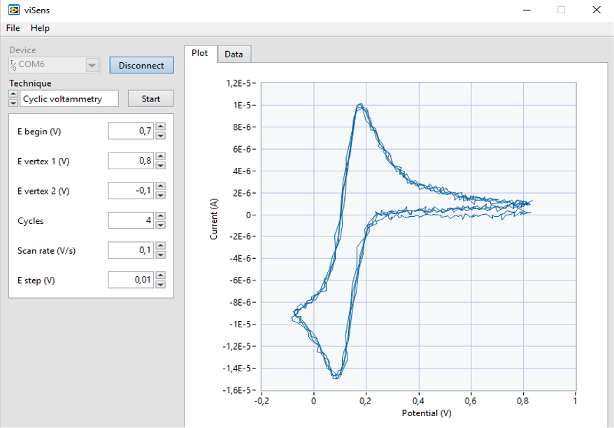

> Cyclic voltammetry for a 1mM buffer solution

Combining the results of the 1mM and 5mM samples, the result obtained was the following:

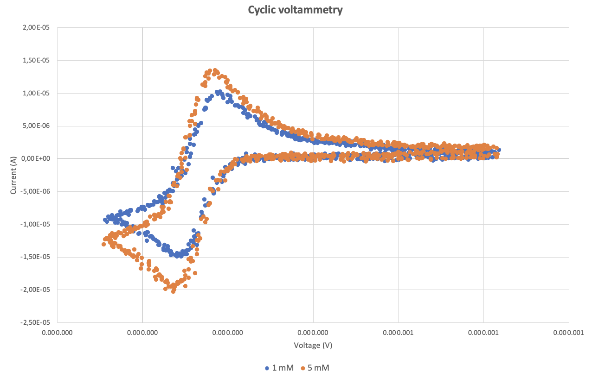

> Cyclic voltammetry for the same solution with two different concentrations: 1mM and 5mM.

As can be seen, the 5 mM concentration has a higher current peak for the same potential. This test, therefore, allows us to identify the concentration of a solution in a simple way, where for the same potentials there will be current variations.

**Chronoamperometry**

For the chronoamperometry, the following parameters were sent from the computer to the microcontroller:

|Parameter|Value|
|-|-|
|EDC (V)|0.1|
|Sampling period (ms)|100|
|Measurement time(s)|10|

The results obtained for a 1mM buffer solution were as follows:

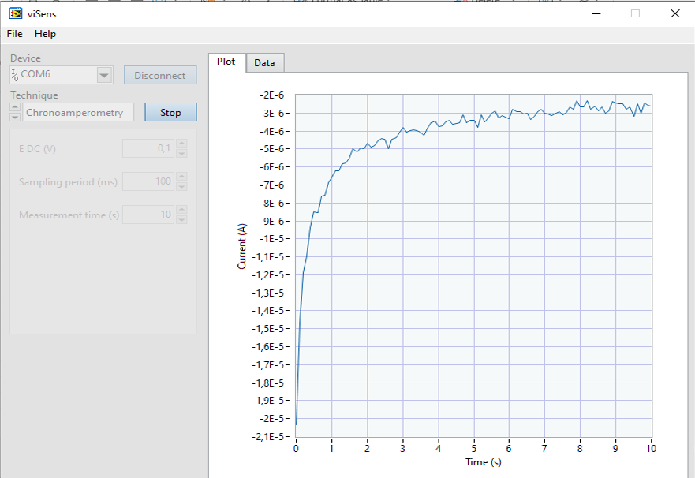

> Chronoamperometry for a 1mM buffer solution

Combining the results of both solutions with different concentrations, the result obtained was the following:

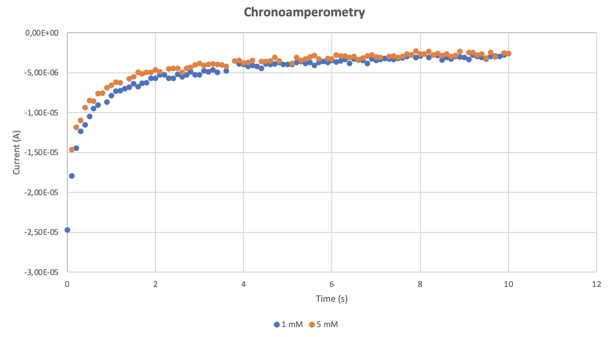

The higher the concentration, the more negative current values ​​are obtained, especially in the first moments. Over time it stabilizes at very similar values ​​for both currents.

## Conclusions

During the MASB subject, the necessary knowledge for programming a microcontroller for a possible commercial use in a simple application has been acquired. Basic knowledge of C and Git has been acquired, in addition to working with a team workflow with different responsibilities. During the development of different activities and practical projects, knowledge in the use of timers, interruptions, ADCs and different types of serial communication (COBS and I2C) have been consolidated.

In the project, all the knowledge acquired during the 8 previous sessions has been put into practice and a potentiostat has been developed to carry out electrochemical tests in different solutions. More specifically, the chronoamperometry and cyclic voltammetry tests, which were configured through an application interface in LabView. The microcontroller was in charge of reading the instructions received through serial communication, executing the desired test and sending the data back to the interface to be viewed by the user.

As a final conclusion, the subject has been very practical to acquire knowledge in software development, more specifically in microcontrollers, in a totally practical way for its consolidation and application in future projects. The degree of satisfaction is very high, exceeding the expectations prior to its completion.