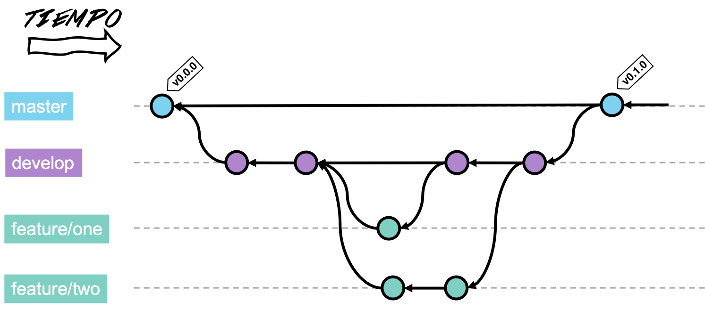
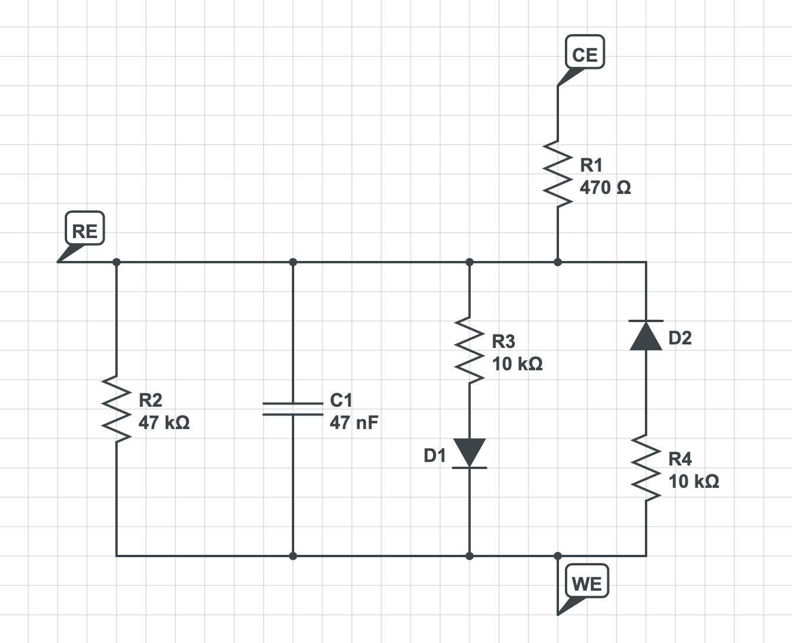
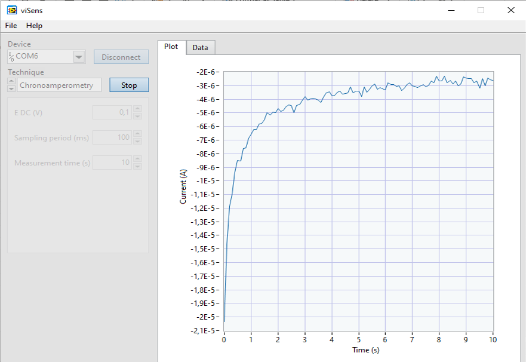

Este proyecto se ha realizado en la asignatura de Microcontroladores para Aplicaciones y Sistemas Biomédicos del grado de Ingeniería Biomédica en la Universidad de Barcelona (UB) y ha sido desarrollado por los alumnos Jan Elliot González Álvarez y Eduard Ruiz Munné.

El objetivo del proyecto consistía en el desarrollo de un algoritmo dentro de un microcontrolador capaz de **controlar y realizar pruebas químicas usando un potenciostato**. Mediante un sistema de set de instrucciones y la configuración de distintos parámetros a través de una interfaz gráfica (viSens-S) desarrollada en LabView. Este proyecto incluye la realización de cronoamperometrías y voltametrías cíclicas para medir distintas soluciones químicas.

### Tabla de contenidos

- [Introducción](#introducción)
    - [Cronoamperometría](#cronomaperometría)
    - [Voltametría cíclica](#voltametría-cíclica)
    - [Potenciostato](#potenciostato)
- [Objetivos](#objetivos)
- [Material y métodos](#material-y-métodos)
    - [STM32F401 Nucleo-64](#stm32f401-nucleo-64)
    - [STM32Cube IDE](#stm32cube-ide)
    - [LabView](#labview)
    - [Git and Github](#git-and-github)
    - [Componentes del Front end](#componentes-del-front-end)
- [Flujos de operación](#flujos-de-operación)
- [Resultados](#resultados)
- [Conclusiones](#conclusiones)

## Introducción

El sistema controlado mediante interfaz gráfica en LabView permite realizar cronoamperometrías y voltametrías cíclicas con un potenciostato mediante la **configuración de distintos parámetros**.

Mediante programación en C en el **entorno STM32Cube** se ha programado una placa STM32F401 Nucleo-64 que permite realizar pruebas químicas para su posterior uso en laboratorios. El eje del proyecto es un microcontrolador capaz de recibir parámetros y enviar los datos medidos a una interfaz gráfica que se muestre en la pantalla del ordenador.

### Cronomaperometría

Se trata de una técnica electroquímica que consiste en un electrodo es que recibe una potencial cuadrático y es capaz de medir los procesos que ocurren en este electrodo como **[una corriente variante en el tiempo](https://en.wikipedia.org/wiki/Chronoamperometry)**.

> **Cronoamperometría:** señal de excitación y señal de respuesta del sistema.

La variación de la corriente con el tiempo varía en función de la difusión del analito sobre la superfície del sensor. La concentración, además, es un [factor determinante](https://www.sciencedirect.com/science/article/pii/B9780128029930000046) en los valores resultantes.

Se trata de una de las técnicas más utilizadas en electroquímica por su sencillez.

### Voltametría cíclica

En la voltametría cíclica, el potencial en el *working electrode* se aumenta de forma lineal con el tiempo, repitiendo el proceso en distintas ocasiones. Finalmente, se representa la corriente en el electrodo en función del potencial aplicado, obteniendo una **[gráfica cíclica](https://en.wikipedia.org/wiki/Cyclic_voltammetry)**.

> **Voltametría cíclica:** gráfico de una voltametría cíclica y proceso de adquisición.

Esta prueba, se realiza para estudiar las **propiedades electroquímicas** del analíto a estudiar y que está en contacto con el electrodo.

Como otras técnicas de voltametría, utiliza un total de tres electrodos para medir la señal:

- ***Working electrode***: el responsable de medir la señal.
- **Electrodo de referencia**: sirve como referencia para el *working electrode* para medir el potencial. Tiene un potencial ya conocido.
- ***Counter electrode***: sirve para medir la corriente del *working electrode*.

### Potenciostato

Se trata de un dispositivo para controlar una celda de **tres electrodos** (los nombrados en la [voltametría cíclica](#voltametría-cíclica)) para ejecutar pruebas electroquímicas en analitos.

Los pines del front-end del potenciostato que interaccionan con el microcontrolador son:

| Pin | Alias |         Tipo         | Descripción                                                                                                     |
| :-: | :---: | :------------------: | :-------------------------------------------------------------------------------------------------------------- |
| PA0 | VREF  |  Entrada analógica   | Tensión absoluta del _Reference Electrode (RE)_ VREF utilizada para la medición de VCELL. |
| PA1 | ICELL |  Entrada analógica   | Tensión de salida del TIA utilizada para la medición de ICELL.                                       |
| PB8 |  SCK  | I2C (SCK) | Señal SCK del I2C. Con el bus I2C se controla el DAC del _front-end_.                     |
| PB9 |  SDA  | I2C (SDA) | Señal SDA del I2C. Con el bus I2C se controla el DAC del _front-end_.                     |
| PA5 |  EN   |    Salida digital    | Señal de (des)habilitación de la PMU. `0`: PMU deshabilitada. `1`: PMU habilitada.                           |
| PB5 | RELAY |    Salida digital    | Señal de control del relé. `0`: Relé abierto. `1`: Relé cerrado.                                             |

> Tabla con los pines contenida en el [guión](https://github.com/Biomedical-Electronics/masbstat-vitinha-team) del proyecto.

## Objetivos

El proyecto consiste en la programación de un microcontrolador para desarrollar las siguientes funciones:

- Recibo mediante comunicación serie COBS para indicar la prueba a realizar (Control mediante set de instrucciones).
- Recibo mediante comunicación serie COBS para ajustar los parámetros de las pruebas.
- Cálculo de la cronoamperometría mediante los valores medidos.
- Cálculo de la voltametría cíclica mediante los valores medidos.
- Envío de los valores calculados para su representación en una interfaz gráfica mediante el protocolo MASB-COMM-S.
- Control de la frecuencia de muestreo mediante el ADC, timers e interrupciones.
- Representación gráfica de la señal obtenida en una interfaz gráfica diseñada con LabView.
- Evaluación del prototipo con una muestra tampón de cloruro de potasio.

## Material y métodos

Para la elaboración del proyecto se han requerido los siguientes materiales:

### STM32F401 Nucleo-64

Se trata de una [placa](https://docs.rs-online.com/2f7f/0900766b81440071.pdf) que permite realizar **pruebas de forma flexible** tanto en Arduino como a **nivel de registros**. Contiene elementos básicos para realizar pruebas como un LED, un botón para resetear y otro de usuario, ADCs configurables y un sistema relativamente sencillo para programar en un microcontrolador para uso educativo, profesional o como entretenimiento.

> **STM32F401 Nucleo-64:** placa con la que se ha realizado el proyecto.

### STM32Cube IDE

[STM32Cube](https://www.st.com/en/development-tools/stm32cubeide.html) es un IDE usado para programar placas STM32 de forma sencilla a nivel de registros en **lenguaje C/C++**. Se trata de un software que incluye las **librerías HAL** (Hardware Abstraction Layer) y permite la portabilidad entre distintos elementos de STM32.

Una de las ventajas, aparte de incluir las [librerías HAL](https://www.st.com/resource/en/user_manual/dm00105879-description-of-stm32f4-hal-and-ll-drivers-stmicroelectronics.pdf) es la capacidad para configurar los parámetros del microcontrolador de forma gráfica (sin programar) y posteriormente generar el código de forma automática. Además permite compilar y debuggear la aplicación para encontrar posibles errores en el código de forma más sencilla.

### LabView

LabView es un sistema de programación gráfica mediante bloques que permite realizar pruebas de forma sencilla y rápida mediante la **creación de interfaces** relacionadas con bloques internos ajustables. Además permite connectividad con otros lenguajes de programación para añadir nuevas funcionas a las ya preestablecidas por el [software](https://www.ni.com/es-es/shop/labview.html).

Para este proyecto se ha utilizado la aplicación **[viSens-S](https://github.com/Albert-Alvarez/viSens-S/releases/tag/v0.2.1)** elaborada con LabView y que permite connectarse con un dispositivo y realizar una cronoamperometría o voltametría cíclica ajustando distintos parámetros de forma gráfica mientras se representan los resultados en un gráfico o se puede acceder a una tabla con los datos recibidos del microcontrolador (con la posibilidad de ser exportada). En el siguiente video de puede ver su funcionamiento.

### Git and GitHub

[Git](https://git-scm.com) es un sistema gratuito de código abierto que se utiliza para permitir el **control de versiones** de proyectos, lo que hace que sea realmente sencillo mantener y escalar un proyecto cuando se trata de una gran cantidad de archivos codificados. Permite registrar diferentes versiones de un documento al mismo tiempo que combina el trabajo de diferentes personas que comparten un mismo repositorio mediante el uso de ramas que se van conectando.

[GitHub](https://github.com) es una plataforma de desarrollo colaborativo que permite almacenar proyectos que utilizan el control de versiones de Git. Esta plataforma interactiva permite almacenar proyectos en la nube y ha añadido más funcionalidades para sacarle el máximo partido. Cada proyecto se puede ver como una página web, los scripts de Markdown se pueden visualizar e interactuar con ellos, actúa como una red social con perfiles y foros. Además de agregar funciones de gestión de proyectos como Kanban y líneas de tiempo.

> Flujo de trabajo de Git, con distintas ramas encargadas de realizar cada una su función.

En este proyecto se ha utilizado Git con las siguientes ramas para organizar los cambios entre el equipo y simular el flujo de trabajo de una empresa especializada en desarrollo de software:

- **Rama *master*:** se trata de la rama principal que contiene todo el **código en producción** y que puede ser usado por el usuario final.
- **Rama *develop*:** contiene el desarrollo del proyecto mediante la unión de cada prestación a esta rama. Es el paso previo a la rama master pero puede contener errores que se deben corregir.
- **Rama *feature*:** se trata de pequeñas ramas donde se desarrolla de forma individual cada **prestación de la aplicación** para organizar las modificaciones y evitar la edición de documentos compartidos entre distintas características.
    - **feature/instruction-set**: desarrollo de los parámetros configurables con *cases* para elegir la prueba que se desea realizar. Elaboración del *script* `stm32main` donde se llama a las distintas funciones.
    - **feature/chronoamperometry**: programación de la cronoamperometría. Algoritmo que mide el corriente y lo devuelve en función del tiempo para que el viSens-S pueda plotearlo en el front-end de la aplicación.
    - **feature/cyclic-voltammetry**: programación de la voltametría cíclica. Elaboración del algoritmo responsable de medir el corriente y el voltaje y de enviar la señal al viSens-S para que pueda ser ploteada.
- **Rama *hotfix*:** se trata de la rama que permite corregir errores o *bugs* que pueda contener la aplicación.

> Esquema con las distintas ramas del workflow de Git. El número de *commits* es orientativo, no se muestran todos para evitar un esquema con demasiado detalle.

### Módulos del front-end

El front end de la placa está compuesto por distintos elementos que componen el potenciostato y que están conectados al microcontrolador para realizar las distintas pruebas electroquímicas y controlar el microcontrolador.

- **Power Management Unit (PMU)**

Se trata del elemento responsable de resetear el control, controlar el reloj y control del estado del microcontrolador (abierto o apagado). Se encarga de gestionar la **alimentación del front-end** y debe encenderse al inicio del todo ya que por defecto se encuentra apagado. Una vez encendido se le añade un delay de 500ms para asegurar que todos los componentes están bien alimentados antes de proseguir con la ejecución del código.

- **Relé**

Regula la connexión del front-end con la placa. Mediante este elemento **se controla el inicio y final de la medida**. Cuando se encuentra abierto (estado por defecto) no se mide la señal, sin embargo al cerrarse se pueden realizar medidas. Por este motivo será esencial al inicio de cada proceso cerrar el relé (se percibe su cierre mediante un pequeño ruido de *click*) y abrir una vez finalizada la medida. Su control se realiza con el pin `RELAY` previamente nombrado mediante la modificación gráfica del archivo `.ioc`.

- **Potenciostato**

El potenciostato es el responsable de **polarizar la celda electroquímica** a una tensión VCELL y leer la corriente que circula por ella ICELL. La polarización a la tensión deseada se realiza con un DAC modelo MCP4725 con dirección I2C `1100000`.

El DAC genera una salida de 0 a 4V pero se le ha añadido un sistema capaz de convertirlo en una señal bipolar de -4 a 4V para tener tanto voltajes positivos como negativos.

Aunque le proporcionemos la tensión, no la podemos dar por conocida y es necesario utilizar el ADC para medir la tensión que corresponde a VREF aunque require de una transformación a señal unipolar previa. Con esta tensión VREF podemos obtener VCELL que es la de nuestro interés.

Para medir finalmente el corriente, un amplificador TIA (resistencia de 50 kΩ) se utiliza previo a otro módulo de transformación a señal unipolar. La librería `formulas` ya disponible en el proyecto, permite calcular las tensiones reales para poderla representar en los gráficos.

## Flujos de operación

Los siguientes esquemas sirven de representación de los **flujos de operaciones** del microcontrolador, los algoritmos internos y su funcionamiento para realizar ambas pruebas para la medida electroquímica del tampón.

### Aplicación

En el flujo de la aplicación se produce una **interacción entre el usuario y el microcontrolador** mediante la aplicación viSens-S de forma interactiva, donde el usuario puede indicar los parámetros de medida y recibir los datos medidos por el microcontrolador que posteriormente serán visualizados mediante la aplicación. El diagrama siguiente muestra en detalle la aplicación:

Primeramente se debe iniciar la aplicación viSens-S y se debe conectar el dispositivo, en este caso el microcontrolador NUCLEO-F401RE. Una vez conectado, se elige la técnica electroquímica (cronoamperometría y voltametría cíclica) y se configuran los parámetros. El botón `Start` permite iniciar la medida, donde el microcontrolador tomará los datos y los enviará a la aplicación mediante comunicación serie. El proceso de envío de señales se realizará hasta que finalice la medición, donde se parará la aplicación.

### Microcontrolador

El microcontrolador tiene un flujo de trabajo en función del mensaje recibido, que deberá procesar y activar distintas funciones. El siguiente esquema indica como es el funcionamiento del microcontrolador.

En primer momento se configuran los periféricos y se inician las distintas variables del microcontrolador a la espera de recibir una instrucción. Cuando se recibe una instrucción, puede ser de tres tipos:

- **Cronoamperometría**: cuando recibe `START_CA_MEAS` guarda la configuración de la cronoamperometría y cambia la variable estado a CA. De esta forma, la cronoamperometría sólo se ejecutará cuando el estado de la variable sea CA.
- **Voltametría cíclica**: cuando recibe `START_CV_MEAS` procede a realizar la última función que la cronoamperometría pero cambiando el estado a CV.
- **Por defecto**: en caso de que ninguno de los anteriores sea recibido, el microcontrolador no realizará ninguna función y restará a la espera de recibir una nueva instrucción.

Se realiza la toma de medidas hasta que llega al último punto de medida que se cambia el estado a IDLE, de forma que se para la medida y el dispositivo resta a la espera de recibir otra instrucción para realizar el mismo procedimiento otra vez.

### Cronoamperometría

La prueba de cronoamperometría tiene su funcionamiento interno particular que debe configurarse:

En primer lugar se fija la tensión de la celda electroquímica a eDC que es recibida por el microcontrolador mediante la comunicación serie y ajustada por el usuario en la aplicación viSens-S. Se cierra el relé, que por defecto está abierto y cada vez que ocurre una interrupción (ajustando el periodo de medida recibido de los parámetros del usuario) se realiza una medida del VCELL y el ICELL que se envía a la aplicación. Este proceso se produce de forma repetida en un periodo determinado previamente y, una vez transcurrido el tiempo total indicado, se abre el relé para finalizar con la medición.

### Voltametría cíclica

La prueba de voltametría cíclica tiene su funcionamiento interno particular que debe configurarse:

En la voltametría cíclica, en primer lugar se fija el potencial de la celda y el del vértice 1. Posteriormente se cierra el relé y se mide cada periodo de sampleo (fijado mediante interrupciones) el voltaje y la intensida de la celda que son enviadas al host. Una vez el potencial alcanza el de objetivose comprueba si se corresponde con los distintos vértices, sino se configura el vObjetivo al vértice indicado hasta llegar al último ciclo donde se abre el relé y se finaliza la medida.

## Resultados

Este apartado se divide en dos secciones, los resultados obtenidos mediante los tests de prueba y que reciben la señal que circula por un circuito eléctrico y los resultados obtenidos en la prueba final con un tampón de cloruro de potasio.

### Tests de prueba

Para los tests de prueba se ha conectado el microcontrolador al siguiente circuito electrónico:

Los resultados obtenidos fueron una señal ruidosa y estable para la cronoamperometría, con una media superior a 0 (indicando el correcto funcionamiento del circuito eléctrico). En el caso de la voltametría cíclica, el gráfico era cíclico llegando a un máximo y un mínimo fijos.

### Resultados con tampón de cloruro de potasio

La evaluación del proyecto se hizo utilizando el programa desarrollado en el microcontrolador con una muestra de tampón de cloruro de potasio a dos concentraciones distintas. Mediante el viSens-S se configuraban los distintos parámetros, eran recibidos por el microcontrolador que enviaba los valores de tiempo y corriente para la cronoamperometríca, y de potencial y corriente para la voltametría cíclica.

**Voltametría cíclica**

La voltametría cíclica se realizó con los siguientes parámetros:

|Parámetro|Valor|
|-|-|
|E begin (V)|0,7|
|E vertex 1 (V)|0,5|
|E vertex 2 (V)|0,3|
|Cycles|4|
|Scan rate|0,1|
|E step (V)|0,01|

Obteniendo el siguiente resultado para la muestra tampón de 1mM:

> Voltametría cíclica para una solución de tampón de 1mM

Combinando los resultados de la muestra de 1mM y la de 5mM, el resultado obtenido fue el siguiente:

> Voltametría cíclica para una misma solución con dos concentraciones distintas: 1mM y 5mM.

Como se puede observar, la concentración de 5 mM tiene un pico más elevado de corriente para un mismo potencial. Esta prueba, por lo tanto, nos permite identificar la concentración de una solución de forma sencilla, donde para mismos potenciales habrá variaciones de corriente.

**Cronoamperometría**

Para la cronoamperometría, los siguientes parámetros eran enviados desde el ordenador al microcontrolador:

|Parametro|Valor|
|-|-|
|E DC (V)|0,1|
|Sampling period (ms)|100|
|Measurement time (s)|10|

Los resultados obtenidos para una solución de 1mM de tampón fueron los siguientes:

> Cronoamperometría para una solución de tampón de 1mM

Combinando los resultados de ambas soluciones con distintas concentraciones, el resultado obtenido fue el siguiente:

A mayor concentración, valores más negativos de corriente son obtenidos, sobretodo en los primeros instantes. Con el paso del tiempo se estabiliza en valores muy parecidos para ambas corrientes.

## Conclusiones

Durante la asignatura de MASB se han adquirido los conocimientos necesarios para la programación de un microcontrolador para un posible uso comercial en una aplicación sencilla. Se han adquirido conocimientos básicos de C y Git, además de trabajar con un flujo de trabajo en equipo con distintas responsabilidades. Durante el desarrollo de distintas actividades y proyectos prácticos se han consolidado los conocimientos en el uso de timers, interrupciones, ADCs y distintos tipos de comunicación serie (COBS y I2C).

En el proyecto se han puesto en práctica todos los conocimientos adquiridos durante las 8 sesiones previas y se ha desarrollado un potenciostato para la realización de pruebas electroquímicas en distintas soluciones. Más concretamente las pruebas de cronoamperometría y voltametría cíclica, que eran configuradas mediante una interfaz de una aplicación en LabView. El microcontrolador se encargaba de leer las instrucciones recibidas mediante comunicación serie, ejecutar la prueba deseada y enviar los datos nuevamente a la interfaz para que fueran visualizados por el usuario.

Como conclusión final, la asignatura ha resultado muy práctica para adquirir conocimientos en el desarrollo de software, más concretamente en el de microcontroladores, de forma totalmente práctica para su consolidación y aplicación en futuros proyectos. El grado de satisfacción es muy elevado, superando con las expectativas previas a su realización.