# Content

- [Introduction](#Intro)
  - [Potentiostat](#Potentiostat)
  - [Cyclic voltammetry](#VC)
  - [Chronoamperometry](#CA)
- [MASB-POT-S Project](#Project)
  - [Objectives](#Obj)
  - [viSens-S Application](#Visens)
  - [Pinout](#Pin)
  - [Project Components](#PC)
  - [MASB-COMM-S communication protocol](#prot)
  - [Timers](#timers)
  - [Flowcharts](#FC)
  - [Project Development](#development)
  - [Testing phase](#testing)
- [Results](#results)
- [Conclusions](#conclusions)
- [References](#references)

# Introduction 

In this report, the Biomedical Engineering students from University of Barcelona [Rubén Cuervo](https://www.linkedin.com/in/rubencn/) and [Pere Pena](https://www.linkedin.com/in/pere-pena-puj%C3%B3s-02a7621ba/) will be presenting the final project of the subject _Microcontrollers for Biomedical Applications and Systems_ carried out during the spring of 2022.

This work, entitled **Programming a potentiostat**, consists of programming a STM32 Nucleo-F401RE board in the `STM32CubeIDE` environment for the creation of a potentiostat capable of performing two types of crucial electrochemical measurements in the field of biomedical sensors: **cyclic voltammetry** and **chronoamperometry**. More specifically, we present all the technical details of its programming as well as its validation stage using a sample of potassium ferrocyanide (K4[Fe(CN)6]) in a potassium chloride (KCl) buffer at different concentrations. For its creation, a version control has been performed by the members of the team through GitHub, also providing the final result in [open virtual repository](https://github.com/Biomedical-Electronics/masbstat-arvak) format for its complete replication.

## Potentiostat 

A potentiostat is the key electronic _hardware_ to control a cell with three electrodes (reference (RE), working (WE) and auxiliary (CE)) in order to execute most electroanalytical experiments, such as Cyclic Voltammetry or Chronoamperometry [[1]](#references). To achieve this, each of the electrodes has the following functionalities:
- **Working electrode:** Place where the electrochemical reaction is taking place.
- **Reference electrode:** Monitors the potential of the solution.
- **Auxiliary Electrode:** Supplies the necessary current to balance the electrical flow created in the working electrode.
In this way, the device controls the voltage between the working and reference electrodes by adjusting the current flowing in the auxiliary electrode to extract relevant information from the chemical sample that we introduce.
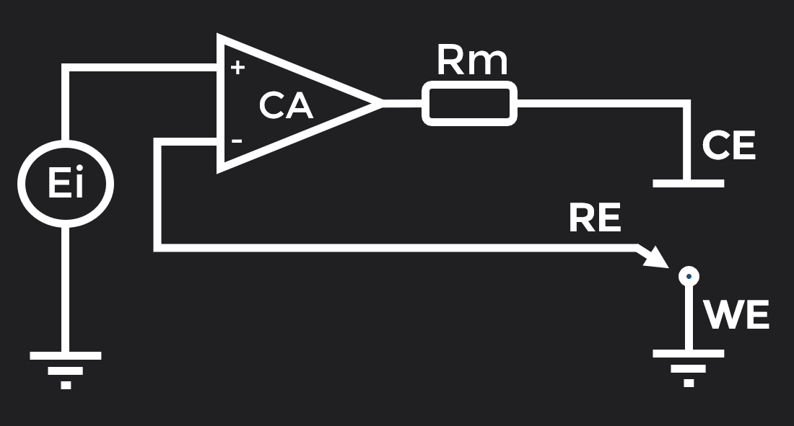

For this project, the potentiostat was created using a printed circuit (_PCB_) that works coupled to the STM32 Nucleo-F401RE board to perform electrochemical measurements.

## Cyclic voltammetry 

**Cyclic Voltammetry (CV)** is one of the most popular and widely used electrochemical measurements, especially to investigate oxidation and reduction processes. During this test, a **time-varying potential** is applied between WE and RE while **current** is measured across WE [[2]](#references). More specifically, the sweep takes place between two known voltage extremes (vertex), first varying the potential value until reaching the first extreme and then repeating the process in reverse until reaching the other extreme. This sweep from vertex to vertex can be performed for a number of cycles determined to obtain the desired information.

The result is represented in a **cyclic voltammogram**, where the **x-axis** shows the applied potential (E), since it is the variable that we impose on the system, while in the **y-axis** the resulting intensity (i) is represented. In **Fig. 2** you can see an example of a Cyclic Voltagram.

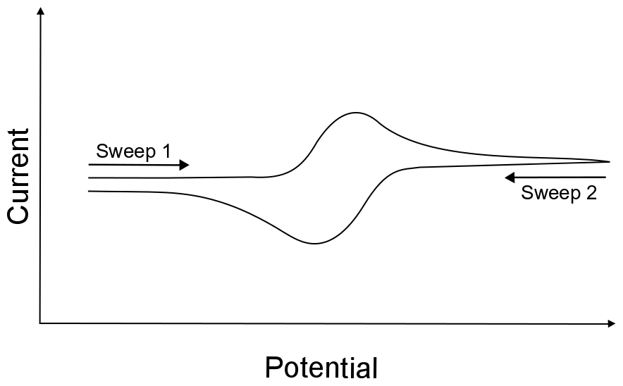

## Chronoamperometry 

**Chronoamperometry (CA)** is another of the most used electrochemical measurements, especially to know the composition and diffusive behavior of the analyte of interest placed in the cell. During this test, a **step potential** is applied on the WE while **current** is measured in the cell for a certain period of time [[3]](#references). To obtain a good result, this step signal should change the state of the cell from a stable situation to a situation where faradaic processes (charge transfers at its interface) occur.

The result is plotted on a graph, where the **x-axis** shows the elapsed time (t), and the **y-axis** shows the resulting intensity (i). In **Fig. 3** you can see an example of this test with the voltage step applied at its side.

# MASB-POT-S Project 

## Objectives 

The objectives of the **MASB-POT-S project** are:
- Programming a portable potentiostat using the `STM32CubeIDE` programming environment.
- Check all the components of the _front-end_ module of the potentiostat.
- Communicate with the viSens-S application installed with the _host_ or computer through the MASB-COMM-S protocol.
- Test our system by performing a cyclic voltammetry.
- Test our system by performing a chronoamperometry.

## viSens-S application 

In order to select which electrochemical test to perform, in addition to showing the results obtained during them, the viSens-S application was utilized. viSens-s is a program created entirely with LabVIEW that allows to:
- Select the port where our STM32 Nucleo-F401RE board is connected.
- Select the technique to perform (cyclic voltammetry or chronoamperometry)
- Within cyclic voltammetry, be able to determine:
  * `eBegin:` cell potential at which cyclic voltammetry starts and ends.
  * `eVertex1:` potential that the electrochemical cell drives to from the starting potential.
  * `eVertex2:` potential to which the electrochemical cell is directed from the vertex of potential 1 (second extreme). Its continuation depends on whether the established number of cycles has been reached or not.
  * `cycles:` number of cycles of the cyclic voltammetry.
  * `scanRate:` variation of the electrochemical cell voltage over time (V/s).
  * `eStep:` increase/decrease of the voltage between two consecutive points (V).
- Within chronoamperometry, be able to determine:
  * `eDC:` constant potential (step) of the electrochemical cell during chronoamperometry (V).
  * `samplingPeriodMs:` time in milliseconds between samples.
  * `measurementTime:` chronoamperometry duration in seconds.

All this is achieved with the graphical interface shown in **Fig. 4**.

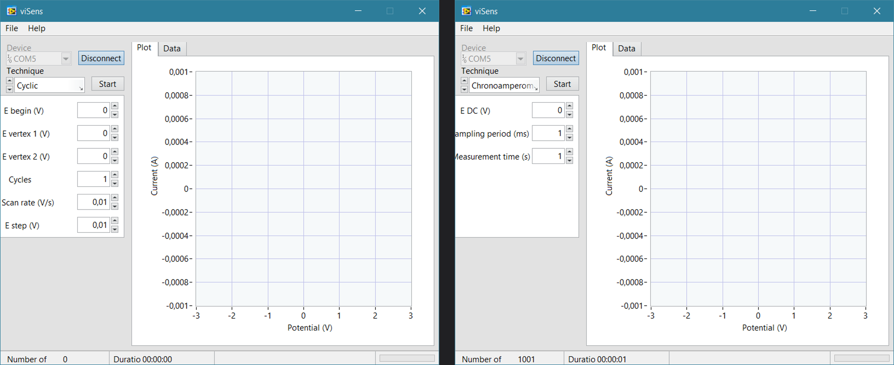

## Pinout 

To interact correctly with the front-end (_PCB_) of the potentiostat, the pins used were the following:

| Pin | Alias | Type | Description|
| :-: | :---: | :-: | :-|
| PA0 | FVREF | Analog input | Absolute voltage of the (RE) VREF used for the measurement of VCELL.|
| PA1 | ICELL | Analog input | TIA output voltage used for ICELL measurement.|
| PB8 | SCK | I2C (SCK) | SCK signal from the I2C.|
| PB9 | SDA | I2C (SDA) | SDA signal from the I2C.|
| PA5 | ON | digital output | PMU (dis)enable signal. `0`: PMU disabled. `1`: PMU enabled.|
| PB5 | RELAYS | digital output | Relay control signal. `0`: Relay open. `1`: Relay closed.|

## Components of the project 

The modules of the _PCB_ that we needed to program with the microcontroller so that the measurements were taken accurately were:

### Power Management Unit (PMU)

The **PMU** is responsible for **powering** the entire front-end. By default, it starts disabled so that the circuit does not consume current until the EVB is connected to our computer. When this happens, its pin will be swithced to high level and we will wait 500 ms to ensure that all the components of the device are properly powered. To check if it is on or off, it can be observed by means of a light indicator (LED) that will iluminate red when it is enabled.

During this project, its management has been done in the `initialize_PMU()` function of the `PMU.c` document that is called in **setup**.

### Relay

The relay is responsible for opening and closing the circuit between the front-end and the electrochemical sensor where the measurements will be made. In this way, when the relay is open, there is no electrical connection between the sensor and the front-end and when it is closed, there is. Its opening/closing will also be accompanied by an LED that will light up green in addition to the characteristic sound of a relay status change.

During this project, its management has been done using the HAL function `HAL_GPIO_WritePin()` before (*SET*) and after (*RESET*) the measurements were made.

### Potentiostat

In the MASB-POT-S project, a DAC (*Digital Analog Converter*) with I2C communication was used to replicate the potentiostat to set the VCELL voltage. This could produce an output voltage of 0 to 4 V, which is converted from -4 to 4 V by placing an additional stage.

To read the voltage and current values ​​in the cell, the ADC (*Analog Digital Converter*) of the microcontroller was used. For the voltage, the tension present in the reference electrode (RE) is read and for the current, a TIA (*Transimpedance Amplifier*) with a resistance of 50 kΩ is used. This reading would provide us with the VADC and IADC values, which must be converted using the formulas found in the `formulas.c` file (more specifically in the `calculateVrefVoltage` and `calculateIcellCurrent` functions) to obtain the voltage and current values in the cell (VCELL and ICELL respectively).

## Communication protocol MASB-COMM-S 

To perform the communication between the *master* (viSens-S) and the *slave* (device) we follow a protocol where the encoding and decoding of messages are carried out following the [COBS](http://www.stuartcheshire.org/papers/COBSforToN.pdf) (Consistent Overhead Byte Stuffing) algorithm , having as term char the value 0x00 and where the bytes of the values ​​sent are sent in *little endian* notation. Also, the command bytes used are as follows:

| Value | Instruction | Description |
| :---: | :-----------: | :---------------------------------------------------------- |
| 0x01 | START_CV_MEAS | It provides the parameters of a cyclic voltammetry and starts it. |
| 0x02 | START_CA_MEAS | It provides the parameters of a chronoamperometry and starts it. |

The packages of *bytes* sent are formed by the command (previous table) followed by a series of auxiliary *bytes* (parameters). When the *slave* communicates with the *master*, the parameters are those necessary to make the graphs of the measurements:
- `point:` identification number of the point.
- `timeMs:` milliseconds elapsed since the start of the measurement.
- `voltage:` VCELL in volts.
- `current:` ICELL in amperes.

While when the *master* communicates with the *slave*, the parameters are those mentioned in the section [Application viSens-S](#Visens).

## Timers 

To ensure that the measurements were done accurately following the values ​​sent by the *host*, timer 3 was used, preconfigured through STM32MX. More specifically, in the `timers.c` file, 2 functions were created to be able to operate with it:
- `initialize_timer: ` We configure timer 3 of the microcontroller with the sampling period indicated by the *host* through the `__HAL_TIM_SET_AUTORELOAD` function, where this value is multiplied by 10 to convert it into seconds taking into account the default frequency (10 KHz). For better understanding, go to the [code](https://github.com/Biomedical-Electronics/masbstat-arvak). Later, we initialize it with the `__HAL_TIM_SET_COUNTER` and `HAL_TIM_Base_Start_IT` functions.
- `HAL_TIM_PeriodElapsedCallback:` Once the determined sampling period has elapsed, the action of measuring VCELL and ICELL of the ADC would be performed automatically (thus making the measurements accurately).

## Flowcharts 

Once all the main points to program the potentiostat have been commented, we will show the flowcharts that exemplify how the main sections of our code work.

### Microcontroller

The first flowchart shows the general operation of the microcontroller to read and execute the instructions.

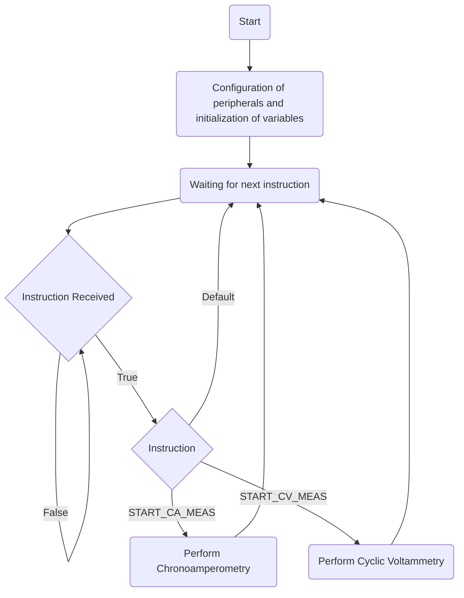

### Cyclic Voltammetry

Subsequently, we show the detailed flowchart of the code that allows performing cyclic voltammetry.

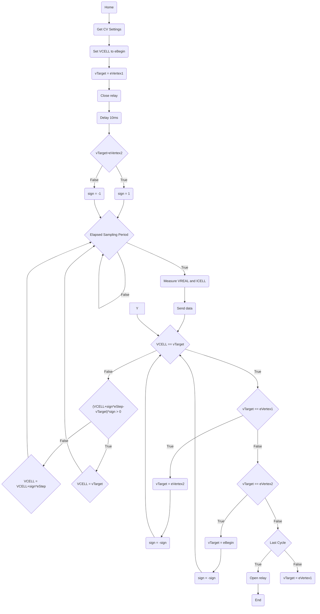

Two important points to note are that we have added an additional delay of 10 ms when closing the relay to avoid reading a null value right at the beginning of the test and the implementation of the handling of the case in which `eVertex1 < eBegin < eVertex2` (beginning the test in reverse direction). Moreover, the `sampling period` mentioned in the flowchart can be found using: $ts=\frac{eStep}{scanRate}$.

### Chronoamperometry
Finally, this is the detailed flowchart of the code that allows the chronoamperometry to be performed.

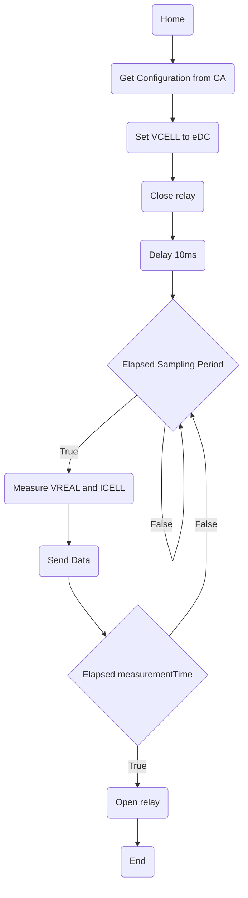
In this section we have also added an additional delay of 10 ms when closing the relay to avoid reading the value of 0 A right at the beginning of the test.

## Project development 

To achieve all the features described, our team worked using version control on GitHub. To make it possible, from the **master** branch (the initial one that we would finally use to present our project) we create the **develop** branch to fully develop our code. More specifically, we split that branch into small forks to add each feature (_feature_) as well as fix bugs in the code (_hotfix_).

- **`feature/adc`**: *ADC* configuration to read current and voltage values ​​(_Analog to digital converter_).
- **`feature/timer`**: general configuration of the *timer* of the project that will receive the sampling period and will carry out the ISR when a period is completed.
- **`feature/PMU`**: general configuration of the *Power Management Unit* to power the PCB.
- **`feature/cyclic_voltammetry`**: complete configuration of cyclic voltammetry using the previously created features (*ADC*, *timer* and *PMU*).
- **`feature/chronoamperometry`**: complete configuration of the chronoamperometry using the previously created features (*ADC*, *timer* and *PMU*).
- **`hotfix/cyclic_voltammetry`, `hotfix/timer` and `hotfix/chronoampreometry`**: branches created to correct unwanted behaviors of the *timer*, *cyclic voltammetry* and *chronoampreometry* features.
- **`feature/flow`**: configuration of the main potentiostat control code following the flow chart in the Microcontroller section.

Progressively, all the branches were joined to the development branch (**develop**), verifying that when the sections of both members of the group were joined, no errors appeared. Finally, once we had the functional code, a Pull Request was made to the main branch (**master**) to deliver it to the client. The evolution of all these branches together with the date of their completion can be seen schematically in **Fig. 5**.

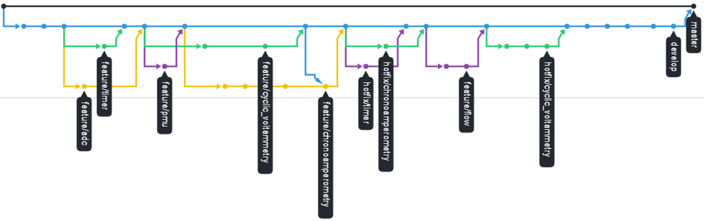

## Testing phase 

To make sure our potentiometer worked properly, we created a simple circuit that did not require placing any chemical sample in an electrode. The circuit schematic can be found in **Fig. 6** and its assembly and connection with the STM32 Nucleo-F401RE board in **Fig. 7**.

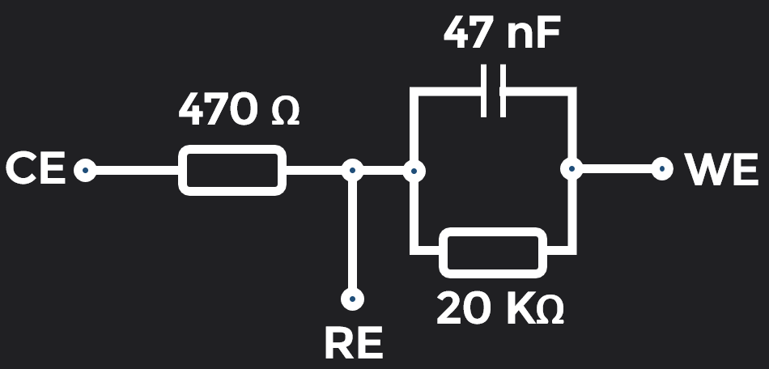
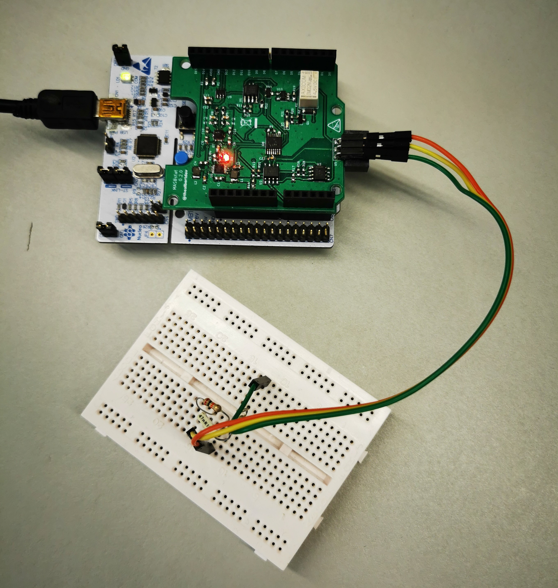

### Cyclic voltammetry

With the circuit created, for cyclic voltammetry we expected to find a **sweep between `evertex1` and `evertex2` drawing a straight line with a positive slope**. More specifically, this line would represent how the intensity rises or decays linearly depending if we move to increasing or decreasing potentials, respectively. This relationship is due to **Ohm's law**:

$$
I=\frac{V}{R}
$$

<b>Eq.1:</b> Ohm's Law

And the slope found is the inverse of the resistance.

During the work, this functionality was tested following the steps shown in the flowchart, improving all the deviations from the ideal behavior found. In **Fig. 8** the result can be observed for an initial voltage of 0.25 V, vertices of +0.5 V and -0.5 V, 2 cycles, a scanning rate of 0.1 V/s and an increase/decrease of the voltage between two consecutive points of 0.01V

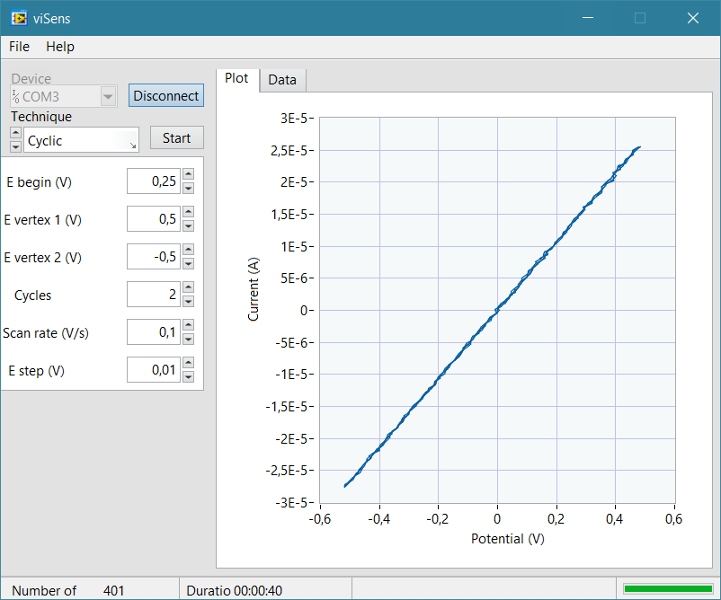

### Chronoamperometry

In chronoamperometry, also due to Ohm's Law, we expected to find a constant current resulting from the applied step voltage. This result was more easily found due to the lower difficulty of the test, and in **Fig. 9** you can find the resulting graph after performing the test with a step voltage of +0.6 V, a sampling period of 10 ms and a test time of 10 seconds.

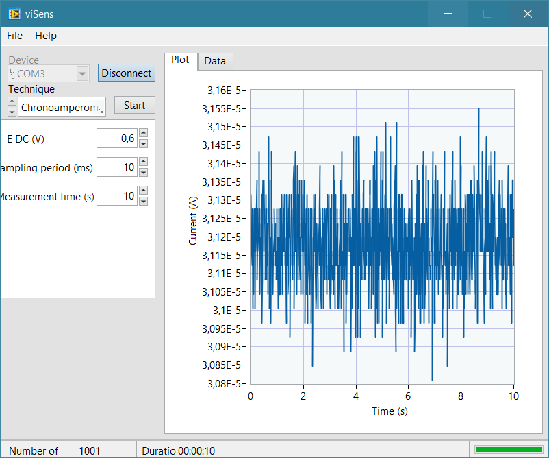

In this case, the result is a constant current at 312 mA, but due to the reduced range of the lateral scale of the viSens-S application, we find some fluctuation around that value. Even so, the test was considered valid due to the small magnitude (0.2 μA) of this variation.

# Results 

To conclude the validation of our hardware, it was tested using a sample of potassium ferrocyanide (K4[Fe(CN)6]) in a potassium chloride (KCl) buffer at different concentrations. This was done by attaching a test strip with an electrode (**Fig. 11**) to the hardware and subsequently placing the samples with 1mM and 5mM KCl buffers using a pipette (in separate strips). The test was carried out entirely in the Biomedical Engineering Laboratory of the University of Barcelona.

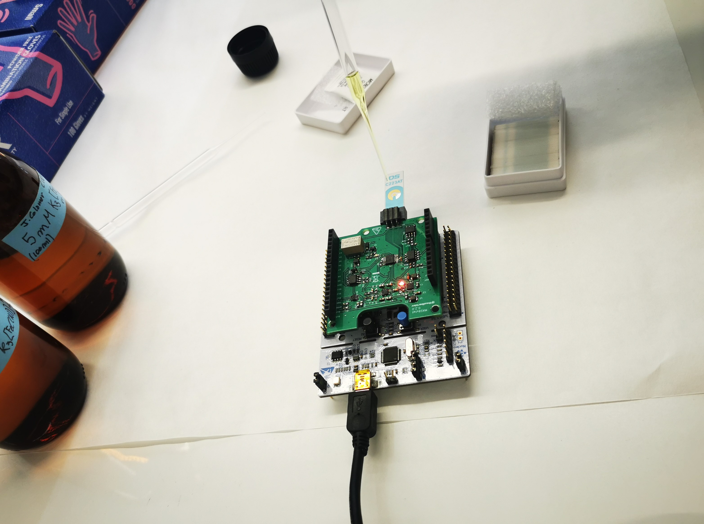
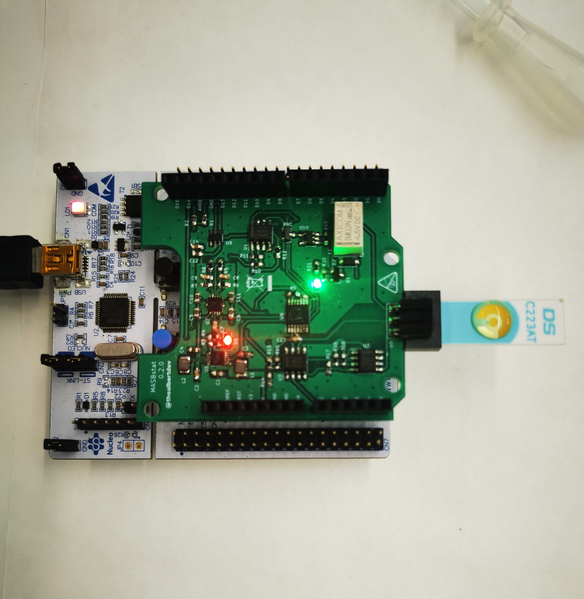

## Cyclic voltammetry

Regarding cyclic voltammetry, the measurements were taken for both cases starting the voltage at 0.7 volts and setting the vertices at 0.8 and -0.1 V. In addition, it was determined that 4 cycles needed to be performed, with a scan rate of 0.1 V/s and an increase/decrease of the voltage between two consecutive points of 0.01 V.

The results obtained can be seen in **Figures 12 and 13**, verifying that they correctly follow the form described in the introduction and that there is some variation between the samples of 1 mM and 5 mM concentration, being able to distinguish them.

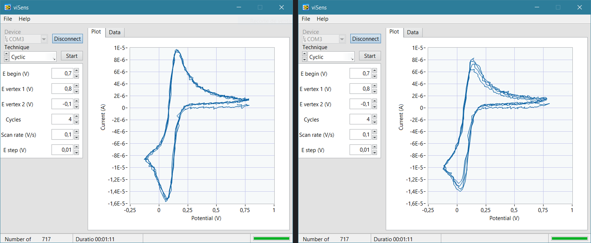
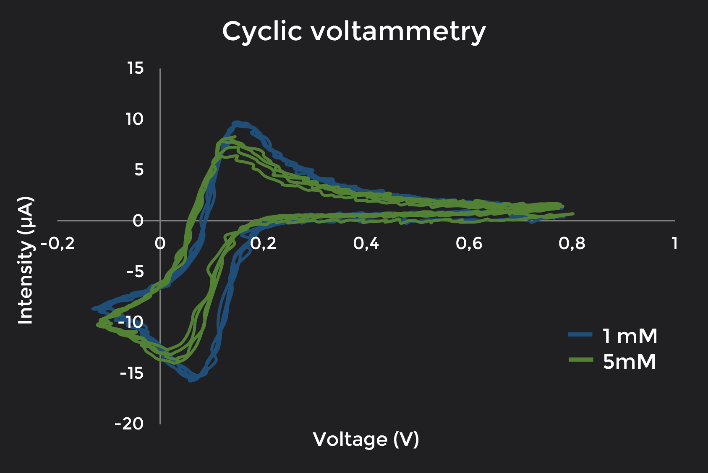

## Chronoamperometry

To perform the chronoamperometry, a step signal of 0.1 V was applied and its effect on the current was measured for 10 seconds with a period of 100 ms. The results obtained can be seen in **Figures 14 and 15**, verifying that they correctly follow the form described in the introduction and that there is some variation between the samples of 1 mM and 5 mM concentration, being able to classify them.

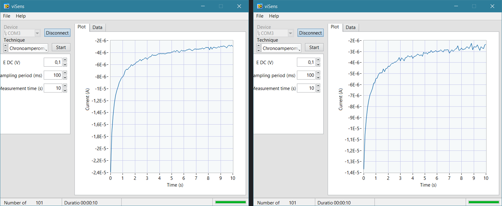
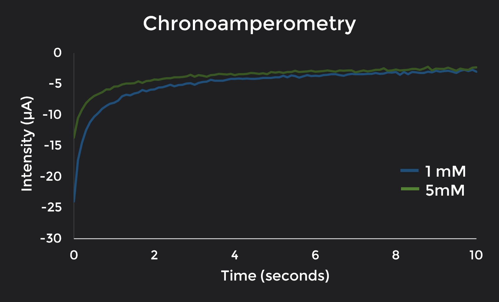

# Conclusions 

During this project, we have been able to successfully program a potentiostat to perform two of the most common electrochemical measurements in the biomedical field :chronoamperometry and cyclic voltammetry. To achieve this, all the concepts acquired in the course such as the Git workflow, interruptions, _timers_, _ADCs_ and serial communication (either I2C or _UART_) have been crucial for obtaining a solid, reliable and well-structured final result.

In addition, with Mabstat, we end the course on _Microcontrollers for Biomedical Applications and Systems_, an optional subject in Biomedical Engineering degree where we have learnt the basics of microcontroller programming both in Arduino (`C++`) and at the register level (`C`) to be able to develop our first prototypes of electronic devices that could help save lives in the future. Additionally, this course has provided us with essential elements, beyond microcontrollers, for teamwork such as Git and agile project management. We believe that these two tools will be of great help for our laboral future.

# References 

[1] Cynthia Zoski. (2007). Handbook of electrochemistry (1st ed.). Amsterdam: Elsevier.

[2] Noémie Elgrishi, Kelley J. Rountree, Brian D. McCarthy, Eric S. Rountree, Thomas T. Eisenhart, and Jillian L. (2018). A Practical Beginner's Guide to Cyclic Voltammetry. DempseyJournal of Chemical Education. 95(2), 197-206.

[3] Science Direct Topics. Chronoamperometry. [Internet] [Accessed on 06/10/2022]
Available at: https://www.sciencedirect.com/topics/chemistry/chronoamperometry

