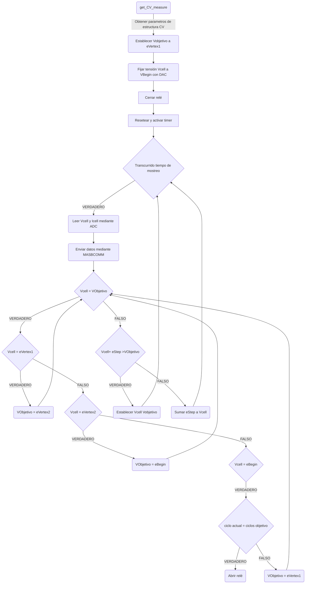
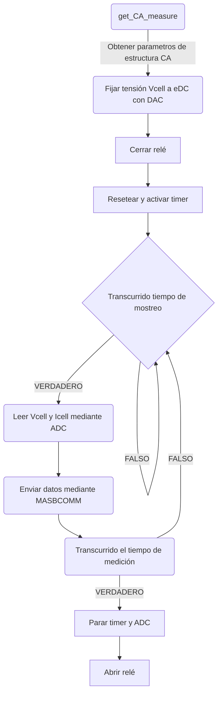

Below is a detailed description of the project carried out by two students of Biomedical Engineering at the University of Barcelona (UB) in the elective course of Microcontrollers for Biomedical Applications and Systems. Xavier Gómez Asencio and Xavier Ullastre Buscá have developed the algorithm for the STM32F401 Nucleo-64 microcontroller that allows for two different types of measurements, cyclic voltammetry and chronoamperometry, using a potentiostat. The project also includes the control of the microcontroller through a set of specific instructions and the visualization of the data obtained using ViSens-S. In the following sections, we will go into more detail on the different steps followed for the development of the project and present the results obtained. 

## Table of contents

[TOC]

## Objectives

As mentioned earlier, the main objective of the project is the programming of a potentiostat using the STM32 Nucleo-64 board and the STM32Cube IDE, for the control and acquisition of cyclic voltammetry and chronoamperometry measurements. 

For the successful completion of this project, the following subobjectives have been defined:

- Control and creation of the instruction set.
- Control of the *Power Management Unit* (PMU) of the potentiostat's *front-end* module.
- Use ADC and DAC to read and set the corresponding voltages and currents.
- Implement timers of the microcontroller to manage measurement and sampling times.
- Creation and programming of the execution flow for cyclic voltammetry.
- Creation and programming of the execution flow for chronoamperometry.
- Communicate with the viSens-S application through I2C serial communication.
- Test the proper functioning of both the code and the final application.

## Theoretical Framework

Once the objectives have been defined, this section briefly describes the main contexts related to the project in order to understand each part of it.  

### Potentiostat
A potentiostat is an electronic device used in the field of electrochemistry to control and measure electrical potentials of an electrochemical cell, an experimental device used to generate electricity through a redox reaction.

The potentiostat consists of three electrodes. Firstly, there is the working electrode, which is in direct contact with the sample or electrochemical solution being analyzed and maintains a constant potential. The second electrode is called the reference electrode and establishes the reference potential for the measurement. Finally, the auxiliary electrode completes the electrical circuit, allowing the flow of current.

This system works by maintaining the potential of the working electrode at a constant level relative to the reference electrode through the application of a control voltage or current with the auxiliary electrode. By keeping the potential between the working electrode and the reference electrode constant, the current generated in the electrochemical cell in response to that potential can be measured.

One of the main uses of the potentiostat is the application of different electrochemical measurement techniques, including cyclic voltammetry and chronoamperometry. These techniques allow obtaining information about the electrochemical properties of a sample, such as the concentration of chemical species or the kinetics of electrochemical reactions.

### Cyclic voltametry

Cyclic voltammetry (CV) is a potentiodynamic electrochemical technique commonly used to investigate the properties of a sample in solution or adsorbed molecules on the electrode by measuring the reduction potential. In a CV experiment, the potential of the working electrode is varied linearly with time, and the current is monitored through a circuit. After reaching the set potential, the potential of the working electrode is reversed in the opposite direction to return to the initial potential, generating cycles of potential ramps.

The measured current is recorded and plotted as a function of the applied voltage, resulting in a cyclic voltammogram.

In the figure above, we can see the result of a cyclic voltammetry. The two peaks correspond to the oxidation and reduction peaks of the sample. The peaks and the shapes of cyclic voltammograms can indicate reversible or irreversible electrochemical reactions, the presence of redox species, analyte concentrations, reaction kinetics, adsorption/desorption of molecules on the electrode surface, among other parameters.

### Chronoampetometry

On the other hand, chronoamperometry is an electrochemical technique used to gather information about charge transfer processes and electrochemical reactions in the sample. The principle of this technique involves setting the potential of the working electrode and monitoring the resulting current as a function of time. The current is due to faradaic processes caused by the potential step, in which electron transfer occurs.

## Materials and tools

In this section, we will explain the main hardware elements as well as the different software tools or project control used. We will also describe the main components of the microcontroller's front-end that are used for the specific application.

### STM32F401 Nucleo-64

For the realization of this project, we will use the Evaluation Board (EVB) STM32 Nucleo-F401RE from STMicroelectronics, which uses the STM32F401RET6U microcontroller from the same manufacturer. This board offers users an affordable and flexible way to test new concepts and build prototypes by choosing from the different combinations of features and power consumption offered by the microcontroller. Therefore, it is a perfect board for users to get started in the world of microcontroller development.

Below is a figure that shows the EVB and all its components and pins.

One of the advantages of this EVB is that it exposes all the pins of the microcontroller, making it easier to connect with external components during prototyping.

### STM32Cube IDE

STM32CubeIDE is an advanced C/C++ development platform with peripheral configuration, code generation, code compilation, and debugging features for STM32 microcontrollers and microprocessors. It allows for the integration of numerous existing plugins.

STM32CubeIDE combines the configuration and project creation functionalities of STM32CubeMX to provide an all-in-one tool experience, saving installation and development time. After selecting an STM32 MCU or MPU, whether it's a blank device or a pre-configured microcontroller or microprocessor, choosing a board or an example, the project is created, and initialization code is generated. At any point during development, the user can revisit the initialization and peripheral or middleware configuration and regenerate the initialization code without affecting the user's code.

### GitHub

GitHub is a collaborative development platform that allows programmers and software developers to share, collaborate, and version their source code. Acting as an online repository, GitHub provides tools and functionalities for project management, version control, and issue tracking, facilitating collaboration and teamwork.

This platform has been essential for managing the information of each branch, tracking changes made, and maintaining a complete history of the developments carried out throughout the project.

## Methods

### Workflows

Below are the flowcharts depicting the different functionalities of the microcontroller.

#### Cyclic voltametry

This flowchart illustrates the operation of the microcontroller when performing a cyclic voltammetry. The function responsible for this type of measurement is `get_CV_measure`. This function takes an input structure with various external parameters such as `eBegin`, `eVertex1`, `eVertex2`, cycle target, `scanRate`, and `eStep`. Once these parameters are obtained, the target voltage will be set to `eVertex1`, the cell voltage will be set to `VBegin`, and the relay will be closed to start the measurement. The microcontroller's timer, which controls the sampling time, will also be reset and activated.

Once these steps are completed, the microcontroller enters the measurement flow. After the sampling time has elapsed, it will read the current and cell voltage and send this data to the host using the I2C serial communication protocol established in *MASBCOMM*. After sending the data, it will check if the cell voltage is equal to the previously set target voltage.

If it is not equal, an increment of `eStep` will be applied to the cell voltage, and the process will return to the beginning, waiting to perform another measurement. It is important to note that if the resulting voltage after the increment is higher than the target voltage, the target voltage will be set as the cell voltage.

If the cell voltage is equal to the target voltage, it will check what the target voltage is. If the `VTarget` is `eVertex1`, the target voltage will be set to `eVertex2`, and the entire previous flow will be repeated with the changed `VTarget`. The same applies if the `VTarget` is `eVertex2`, but this time it will be set to `eBegin`. Finally, if the target voltage is `eBegin`, it will check if the specified number of cycles has been completed. If so, the relay will be opened, and the measurement will end. If the number of cycles has not been completed, the `VTarget` will be changed to `eVertex1`, and the entire flow will be repeated.

#### Chronoampetometry

This flowchart indicates the operation of the microcontroller when performing a chronoamperometry measurement. The function responsible for this type of measurement is `get_CA_measure`. This function takes an input structure with various external parameters such as sampling time, measurement time, and the value to set for *Vcell*. Similar to the voltammetry measurement, once these parameters are obtained, the cell voltage will be set to the specified value, and the relay will be closed to start the measurement. The microcontroller's timer, which controls both the sampling time and the total measurement time, will also be reset and activated.

Once the *timer* is activated and the relay is closed, the measurement flow will begin. The microcontroller will wait until the sampling time is completed. Afterward, it will proceed to measure the cell voltage and current, and these values, along with the corresponding time, will be sent to the host using I2C serial communication. This process will be repeated, obtaining as many data points as necessary until the measurement period is completed. At this point, the measurement loop will be exited, the relay will be opened, and both the *timers* and the ADC reading peripheral will be stopped.

### Development of the functions

For the completion of the project, we divided the different functionalities into work packages, which were developed in separate features. Once each work package was completed, a merge was performed with the `develop` branch to integrate the new changes. After all the changes were integrated into `develop`, code errors were addressed, and finally, the functionality of the potentiostat and the overall operations were tested.

Below is a list of the different work packages used, along with a brief description of each:

- `feature/stm32main`: This branch contains the code specifying the setup and loop. It is where the entire program is initialized, and instructions are read to carry out the necessary tasks.
- `feature/chronoamperometry`: This branch describes the tasks related to chronoamperometry, as previously described in the workflow.
- `feature/cyclic_voltammetry`: This branch describes the tasks related to cyclic voltammetry, as previously described in the workflow.
- `feature/ADC`: In this branch, the different ADC functions are described for use in the chronoamperometry and cyclic voltammetry functions, such as voltage and current calculation based on the signals read from specified pins.
- `feature/PMU`: In this branch, the different PMU functions are described for use in the chronoamperometry and cyclic voltammetry functions, specifically for supplying current where necessary.
- `feature/rele`: In this branch, the different relay functions are described for use in the chronoamperometry and cyclic voltammetry functions, specifically functions that describe how to open and close the relay.
- `feature/timers`: In this branch, the different timer functions are described for use in the chronoamperometry and cyclic voltammetry functions, including functions that allow us to set time periods required for the workflow of reading chronoamperometry and cyclic voltammetry.
- `hotfix/develop`: This branch resolved different errors caused by the merge of all the features into the `develop` branch.
- `hotfix/stm32main`: This branch resolved various issues related to the workflow of `stm32main.c`, among others.
- `hotfix/timers`: This branch resolved a problem related to variable declarations in the `timers.c` file.

## Results

In this section, we describe the results obtained once the program was completed. It is worth noting that although the program was considered finished, it was not functional due to the reasons described in the following subsection.

## Testing

Due to various issues that could not be identified, it was not possible to carry out testing. When attempting to connect the microcontroller to the viSens program, it displayed a blank graph, which led us to believe that there was a problem with data reception in the program. However, after a thorough review, this possibility was ruled out as it was confirmed that the program was receiving data correctly. Therefore, the problem must have originated from another source. Ultimately, it was not possible to determine the root cause of the issue, and therefore, the program could not be tested as intended.

## Conclusions

After completing the project, we can draw several conclusions about the work done:

- Undertaking a project of this magnitude is more challenging than expected. Despite a four-month preparation phase, programming a potentiostat requires a significant amount of time and effort, and complex issues can arise at different stages of the project.
- The use of Git for version control in software development projects is essential due to the convenience and traceability it provides to users.
- Despite not achieving a functional program, the experience gained from attempting such a project is remarkable, as well as the knowledge acquired throughout the different lessons of the course.