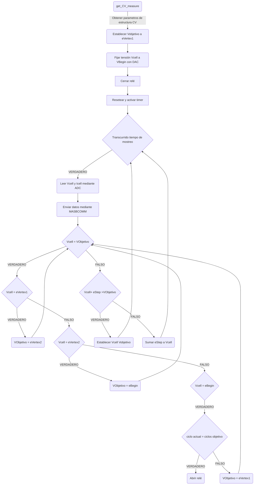
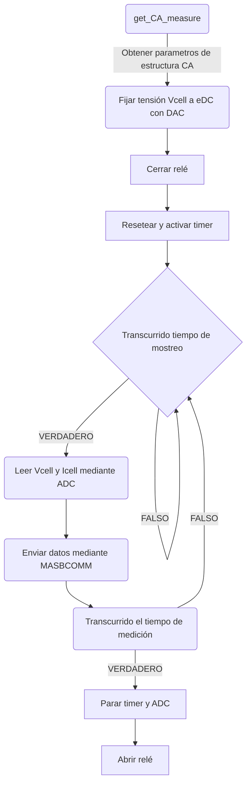

A continuación, se detalla el proyecto realizado por dos alumnos del grado de Ingeniería Biomédica de la Universidad de Barcelona (UB) en la asignatura optativa de Microcontroladores para Aplicaciones y Sistemas Biomédicos. Xavier Gómez Asencio y Xavier Ullastre Buscá, han desarrollado el algoritmo del microcontrolador STM32F401 Nucleo-64 que permite realizar dos tipos diferentes de mediciones, voltamperometría cíclica y cronoamperometría, mediante un potenciostato. El proyecto también incluye el control del microcontrolador mediante un set de instrucciones específicos así como la visualización de los datos obtenidos mediante ViSens-S. En los siguientes apartados entraremos más en detalle en los diferentes pasos seguidos para el desarrollo del proyecto y también se mostrarán los resultados obtenidos. 

## Tabla de contenidos

[TOC]

## Objetivos

Como se ha comentado anteriormente el objetivo principal del proyecto es la programación de un potenciostato mediante la placa STM32 Núcleo 64 y mediante STM32Cube IDE, para el control y obtención de voltametrías cíclicas y cronoamperometrías. 

Para la correcta realización de este proyecto se han definido los siguientes subobjetivos:
- Control y creación del set de instrucciones
- Control de la *Power Management Unit* (PMU) del módulo *front-end* del potenciostato
- Utilizar ADC y DAC para leer y fijar los Voltages e Intensidades correspondientes
- Implementar los timers del microcontrolador para gestionar el los tiempos de medición y de muestreo
- Creación y programación del flujo de ejecución para la voltametría cíclica
- Creación y programación del flujo de ejecución para la cronoamperometría
- Comunicarse con la aplicación viSens-S mediante comunicación en serie I2C
- Testear el correcto funcionamiento tanto del código como de la aplicación final

## Marco Teórico

Una vez definidos los objetivos, en esta sección se describen brevemente los principales contextos relacionados con el proyecto para poder entender cada una de las partes de este.  

### Potenciostato
Un potenciostato es un dispositivo electrónico utilizado en el mundo de la electroquímica para controlar y medir potenciales eléctricos de una celda electroquímica, dispositivo experimental para generar electricidad mediante una reacción redox. 

El potenciostato esta formado por tres electrodos. En primer lugar, el electrodo de trabajo, el cual está en contacto directo con la muestra o solución electroquímica a analizar y mantiene un potencial constante. El segundo electrodo es el llamado electrodo de referencia y establece el potencial de referencia para la medición. Finalmente, el electrodo auxiliar completa el circuito eléctrico permitiendo el flujo de corriente. 

Este sistema funciona manteniendo el potencial del electrodo de trabajo a nivel constante en relación con el electrodo de referencia mediante la aplicación de una tensión o corriente de control con el electrodo auxiliar. Al mantener constante el potencial entre el electrodo de trabajo y el de referencia, se puede medir la corriente generada en la celda electroquímica como respuesta a ese potencial. 

Uno de los principales usos del potenciostato es la aplicación de diferentes técnicas de medición electroquímica donde se incluyen la voltametría cíclica y la cronoamperometría. Estas técnicas permiten obtener información sobre las propiedades electroquímicas de una muestra como por ejemplo la concentración de especies químicas o la cinética de las reacciones electroquímicas. 

### Voltamperometría Cíclica

La voltametría cíclica (CV) es una técnica electroquímica potenciodinámica comúnmente utilizada para investigar las propiedades de una muestra en solución o de moléculas adsorbidas en el electrodo, mediante la medición del potencial de reducción. En un experimento de CV, el potencial del electrodo de trabajo se varía de forma lineal en función del tiempo y se monitorea la corriente a través de un circuito. Después de alcanzar el potencial establecido, el potencial del electrodo de trabajo se invierte en la dirección opuesta para regresar al potencial inicial, generando ciclos de rampas de potencial.

La corriente leída se registra y se grafica en función del voltaje aplicado, lo que resulta en un voltamograma cíclico.

En la figura de arriba podemos ver el resultado de una voltametría cíclica. Los dos picos corresponden a los picos de oxidación y reducción de la muestra. Los picos y las formas de los voltamograma cíclicos pueden indicar reacciones electroquímicas reversibles o irreversibles, la presencia de especies redox, la concentración de analitos, la cinética de las reacciones, la adsorción/desorción de moléculas en la superficie del electrodo, entre otros parámetros.

### Cronoamperometría

Por otro lado, la cronoamperometría es una técnica electroquímica utilizada para obtener información sobre procesos de transferencia de carga  y reacciones electroquímicas en la muestra. El principio de esta técnica consiste en establecer el potencial del electrodo de trabajo y monitorizar el corriente resultante en función del tiempo. La corriente se debe a procesos farádicos  provocados por el paso del potencial en los que hay transferencia de electrones. 

## Materiales y herramientas

En esta sección explicaremos los principales elementos de hardware, así las diferentes herramientas de software o control de proyectos utilizadas. También se describirán los principales componentes del front-end del microcontrolador utilizados para la aplicación en cuestión. 

### STM32F401 Nucleo-64

Para la realización de este proyecto utilizaremos la Placa de Evaluación (EVB) STM32 Nucleo-F401RE de STMicroelectronics, la cual usa el microcontrolador STM32F401RET6U del mismo fabricante. Esta placa ofrece a los usuarios una forma asequible y flexible de probar nuevos conceptos y construir prototipos eligiendo entre las diferentes combinaciones de prestaciones y consumo de energía que ofrece el microcontrolador. Por esto es una placa perfecta para que los usuarios pueden introducirse en el mundo desarrollo mediante microcontroladores. A continuación os presentamos una figura donde se muestra la EVB y todos sus componentes y pines. 

Una de las ventajas de esta EVB es que esta expone todos los pines del microcontrolador facilitando las conexiones con elementos externos durante el prototipaje. 

### STM32Cube IDE

STM32CubeIDE es una plataforma avanzada de desarrollo C/C++ con funciones de configuración de periféricos, generación de código, compilación de código y depuración para microcontroladores y microprocesadores STM32. QUE Permite la integración de los cientos de plugins existentes.

STM32CubeIDE integra las funcionalidades de configuración y creación de proyectos STM32 de STM32CubeMX para ofrecer una experiencia de herramienta todo en uno y ahorrar tiempo de instalación y desarrollo. Después de la selección de un vacío STM32 MCU o MPU, o preconfigurado microcontrolador o microprocesador de la selección de una placa o la selección de un ejemplo, el proyecto se crea y se genera el código de inicialización. En cualquier momento durante el desarrollo, el usuario puede volver a la inicialización y configuración de los periféricos o middleware y regenerar el código de inicialización sin impacto en el código de usuario.

### GitHub

GitHub es una plataforma de desarrollo colaborativo que permite a los programadores y desarrolladores de software compartir, colaborar y versionar su código fuente. Actuando como un repositorio en línea, GitHub proporciona herramientas y funcionalidades para la gestión de proyectos, control de versiones y seguimiento de problemas, lo que facilita la colaboración y el trabajo en equipo. 

Esta plataforma ha sido esencial para la gestionar la información de cada una de las ramas, realizar un seguimiento de los cambios realizados y mantener un historial completo de los desarrollos realizados a lo largo del proyecto. 

## Metodología

### Flujos de Trabajo

A continuación se presentan los diagramas de flujo de las diferentes funcionalidades del microcontrolador. 

#### Voltametría cíclica

Este diagrama de flujo  nos indica el funcionamiento del microcontrolador a la hora de realizar una voltametría cíclica. La función que nos permite hacer este tipo de medida es `get_CV_measure`. Esta función tendrá como input una estructura con diversos parámetros externos como el `eBegin`, `eVertex1`, `eVertex2`, objetivo de ciclos, `scanRate` y el `eStep`. Una vez obtenidos los parámetros se establecerá la variable voltaje objetivo a `eVertex1`, se fijará la tensión de celda a `VBegin` y se cerrará el relé para poder empezar la medición. También se reseteará y activará el timer del microcontrolador que controlará el tiempo de muestreo. 

Una vez completados estos pasos el microcontrolador entrará en el flujo de medición. Cuando haya trascurrido el tiempo de muestro leerá el corriente y tensión de cela  y enviará esos datos al host mediante el protocolo de comunicación en serie I2C establecido en *MASBCOMM*. Una vez enviado los datos, comprobará si el voltaje de celda es igual al voltaje objetivo establecido previamente.

 En caso negativo, aplicará un incremento de voltaje `eStep` al voltaje de celda y se volverá al principio a la espera de hacer otra medición. Es importante comentar que, si al aplicar el incremento el voltaje resultante es mayor que el voltaje objetivo, simplemente se establecerá el voltaje objetivo como voltaje de celda. 

En caso afirmativo se comprobará cual es el voltaje objetivo. Si el `VObjetivo` es eVertex1 se establecerá el voltaje objetivo como `eVertex2` y se volverá a repetir todo el flujo anterior pero con el `VObjetivo` cambiado. Lo mismo pasará en el caso de que `VObjetivo` sea `eVertex2`, pero, estableciendo `VObjetivo` como `eBegin`. Finalmente si el voltaje objetivo es `eBegin` se comprobará si se han completado el número de ciclos establecidos. Si es así se cerrará el relé y se terminará la medición. Si aun no se ha cumplido el número de ciclos establecido, se cambiará `Vobjetivo` a `eVertex1` y volverá a repetirse todo este flujo. 

#### Cronoamperometría

Este diagrama de flujo  nos indica el funcionamiento del microcontrolador a la hora de realizar una voltamperometría. La función que nos permite hacer este tipo de medida es `get_CA_measure`. Esta función tendrá como input una estructura con diversos parámetros externos como el tiempo de muestreo, el tiempo de medición y el valor a establecer para *Vcell*. Igual que en la medición de la voltametría, una vez obtenidos los parámetros se fijará la tensión de celda al valor establecido y se cerrará el relé para poder empezar la medición. También se reseteará y activará el *timer* del microcontrolador que controlará tanto el tiempo de muestreo como el tiempo total de la medida.
Una vez encendido el *timer* y cerrado el relé se empezará con el flujo de medida. El microcontrolador estará esperando hasta que se complete el tiempo de muestreo. Una vez completado este se procederá a hacer la medida de la tensión y corriente de celda y se enviarán estos valores y el tiempo correspondiente al host mediante comunicación en serie I2C. Este proceso se irá repitiendo obteniendo tantos puntos como sea necesario hasta que se haya completado el periodo de medición. En este momento se saldrá del bucle de medición, se abrirá el relé y se pararán tanto los *timers* como el periférico encargado de hacer la lectura ADC.

### Desarrollo de las funciones

Para la realización del trabajo nos hemos dividido las diferentes funcionalidades en paquetes de trabajo que hemos ido desarrollando en features diferentes. Una vez finalizado cada paquete de trabajo se hacía un merge con la rama develop para integrar los nuevos cambios. Una vez todos los cambios han sido integrados en la develop se ha han solucionado los errores de código presentes y finalmente se ha testeado el funcionamiento del potenciostato y del conjunto de operaciones. 

A continuación se presenta una lista con los diferentes paquetes de trabajo utilizados y una breve descripción de cada uno de ellos. 

- `feature/stm32main`: Esta es la rama que contendra el codigo donde se especifica que hace el setup y el loop. Es aqui donde se inicializa el programa entero, y donde se leen las intrucciones para llevar a cabo las tareas necesarias.
- ``feature/chronoamperometry``: En esta rama se describen las tareas a realizar respecto a la cronoamperometria, vease, su flujo de trabajo descrito anteriormente.
- ``feature/cyclic_voltametry``: En esta rama se describen las tareas a realizar respecto a la voltametria ciclica, vease, su flujo de trabajo descrito anteriormente.
- ``feature/ADC``: En esta rama, las diferentes funciones del ADC son descritas para su uso en las ramas de las funciones de cronoamperometira y coltameria ciclica, como por ejemplo, el calculo de voltaje y corriente a partir de las señales leidas en los pines determinados.
- ``feature/PMU``: En esta rama, las diferentes funciones del PMU son descritas para su uso en las ramas de las funciones de cronoamperometira y coltameria ciclica, mas concretamente, de dar corriente alla donde sea necesario.
- ``feature/rele``: En esta rama, las diferentes funciones del relé son descritas para su uso en las ramas de las funciones de cronoamperometira y coltameria ciclica, mas concretamente, funciones que describen como abrir y cerrar el relé.
- ``feature/timers``: En esta rama, las diferentes funciones del timer son descritas para su uso en las ramas de las funciones de cronoamperometira y coltameria ciclica, entre ellas se encuentran las funciones que nos permiten establecer periodos de tiempo, necesarios para el flujo de trabajo de lectura de la cronoamperometira y la coltameria ciclica.
- ``hotfix/develop``: En esta rama se resolvieron los diferentes errores ocasionados por el merge de todas las features en la rama `develop`.
- ``hotfix/stm32main``:En esta rama se resolvieron diferentes problemas relacionados con el flujo de trabajo del ``stm32main.c`` entre otros.
- ``hotfix/timers``: En esta rama se resolvió un problema relacionado con la declaracion de variables en el fichero `timers.c`

## Resultados

En este apartado se describen los resultados obtenidos una vez finalizado el programa. Cabe remarcar que el programa, pese haberse determinado como acabado, no era funcional, por los motivos descritos en el siguiente subapartado.

### Test

Debido a diversos problemas que no se pudieron detectar, no fue posible llevar a cabo el testeo, ya que cuando se intentaba conectar el microcontrolador al programa viSens, este motraba una gráfica en blanco cosa que nos llevó a pensar que existia un problema en la recepción de datos del programa. Pero tras una revisión exhaustiva, se desestimó esta opción ya que se confirmó que el programa recibía bien los datos, y por tanto el problema debía de originarse por otro motivo. Al final, no fue posible determinar el origen del problema, y por tanto no se pudo testear el programa como debía haberse hecho.

## Conclusiones

Una vez realizado el proyecto, podemos extraer diversas conclusiones sobre el trabajo realizado:

- Realizar un proyecto como este es de un calibre mayor al esperado. Pese a haber pasado por una preparación previa de 4 meses, programar un potenciostato requiere de mucho tiempo y esfuerzo, donde pueden aparecer problemas complicados en diferentes estadios del proyecto.
- El uso de Git para controlar versiones de un programa, y trabajar en proyectos relacionados con el desarroyo de programas es esencial debido a todas las facilidades y trazabilidad que proporciona a los usuarios.
- Pese a no haber conseguido desarroyar un programa funcional, la experiencia adquirida de haber intentado realizar un proyecto asi es sorprendente, de la misma forma que la experiencia y conocimientos adquiridos a lo largo de las diferentes lecciones de la asignatura.
