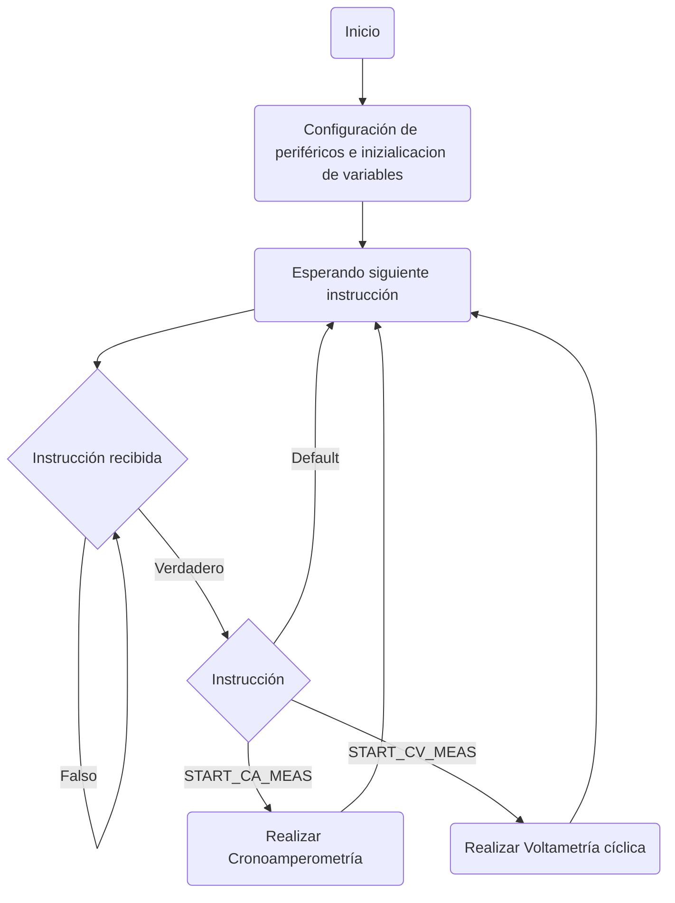
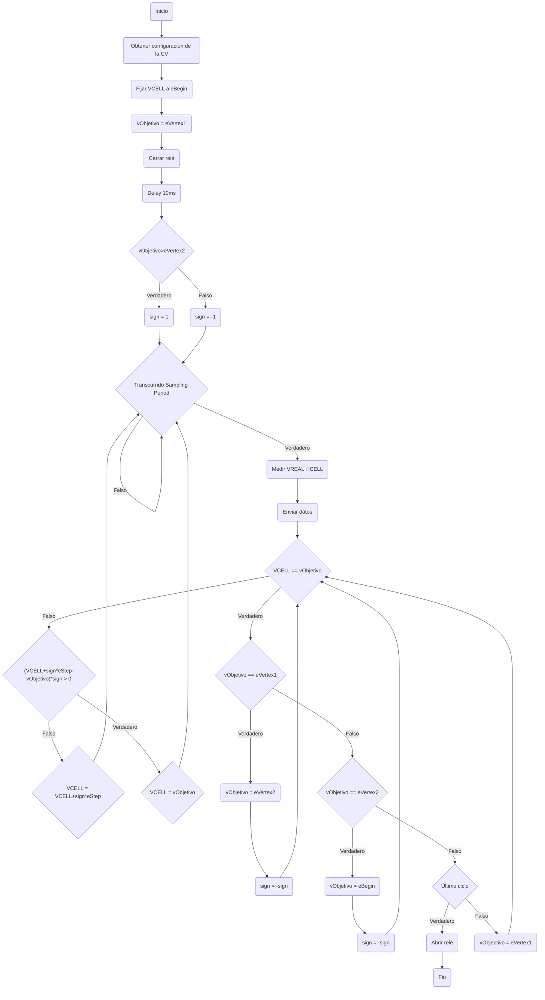
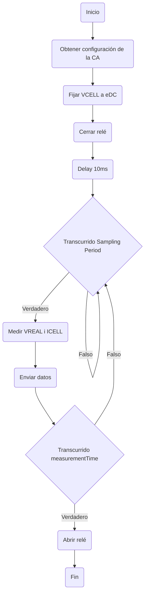
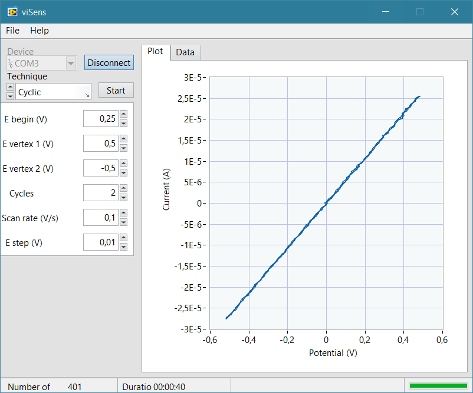
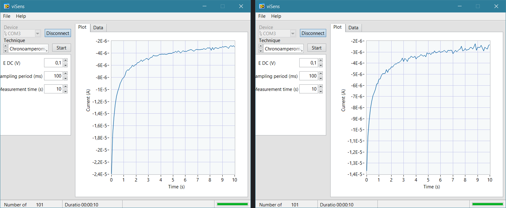
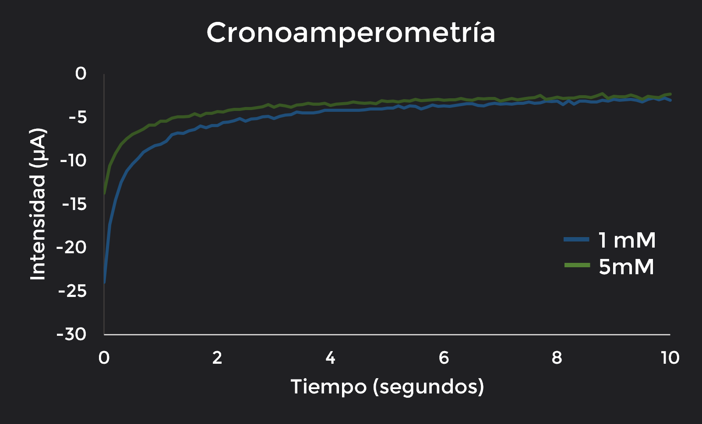

# Contenido

- [Introducción](#Intro)
  - [Potenciostato](#Potenciostato)
  - [Voltametría cíclica](#VC)
  - [Cronoamperometría](#CA)
- [Proyecto MASB-POT-S](#Proyecto)
  - [Objetivos](#Objetivos)
  - [Aplicación viSens-S](#Visens)
  - [Pinout](#Pin)
  - [Componentes del proyecto](#CP)
  - [Protocolo de comunicación MASB-COMM-S](#prot)
  - [Timers](#timers)
  - [Diagramas de flujo](#DF)
  - [Desarrollo del proyecto](#desarrollo)
  - [Fase de testing](#testing)
- [Resultados](#resultados)
- [Conclusiones](#conclusiones)
- [Referencias](#referencias)

# Introducción 

## Potenciostato 

## Voltametría cíclica 

## Cronoamperometría 

La **Cronoamperometría (CA)** es otra de las mediciones electroquímicas más usadas sobre todo para conocer la composición y el comportamiento difusivo del analito de interés colocado en la celda. Durante este test, se **aplica un potencial escalón** en el  WE  mientras **se mide la corriente** en la celda durante un cierto periodo de tiempo [[3]](#referencias). Para obtener un buen resultado, este señal escalón deberia cambiar el estado de la celda de una situación estable a una situación donde tienen lugar procesos faradaicos (transferencias de cargas en su interficie).

El resultado se representa en un gráfico, donde en el **eje x** muestra el tiempo transcurrido (t), y en el **eje y** se representa la intensidad resultante (i). En la **Fig. 3** se puede ver un ejemplo de este test con el escalón de voltaje aplicado a su lado.

# Proyecto MASB-POT-S ç

## Objetivos  

- 

## Aplicación viSens-S 

## Pinout 

Para interaccionar correctamente con el front-end (_PCB_) del potenciostato, los pines usados fueron los siguientes:

| Pin | Alias |         Tipo         | Descripción|
| :-: | :---: | :------------------: | :-------------------------------------------------------------------------------------------------------------- |
| PA0 | VREF  |  Entrada analógica   | Tensión absoluta del (RE) VREF utilizada para la medición de VCELL.|
| PA1 | ICELL |  Entrada analógica   | Tensión de salida del TIA utilizada para la medición de ICELL.|
| PB8 |  SCK  | I2C (SCK) | Señal SCK del I2C.|
| PB9 |  SDA  | I2C (SDA) | Señal SDA del I2C.|
| PA5 |  EN   |    Salida digital    | Señal de (des)habilitación de la PMU. `0`: PMU deshabilitada. `1`: PMU habilitada.|
| PB5 | RELAY |    Salida digital    | Señal de control del relé. `0`: Relé abierto. `1`: Relé cerrado.|

## Componentes del proyecto 

Los módulos de la _PCB_ que necesitabamos programar con el microcontrolador para que las medidas fueran tomadas correctamente son:

### Power Management Unit (PMU)

La **PMU** es la responsable de **alimentar** todo el front-end. Por defecto, empieza deshabilitada para que el circuito no consuma corriente hasta que la EVB sea conectada a nuestro ordenador. Cuando esto suceda, se llevará su pin a nivel alto y se esperarán 500 ms para asegurar que todos los componentes del dispositivo se encuentran correctamente alimentados. Para comprobar si está encendido o apagado, se podrá visualizar mediante un indicador lumínico (LED) que brillará de color rojo cuando esté habilitado.

Durante este proyecto, su gestión ha sido realizada en la función `initialize_PMU()` del documento `PMU.c` que es llamada en el **setup**.

### Relé

El relé se encarga de abrir y cerrar el circuito entre el front-end y el sensor electroquímico donde se realizarán las medidas. De este modo, cuando el relé está abierto, no hay conexión eléctrica entre el sensor y el front-end y cuando está cerrado si. Su apertura/clausura irá acompañada también de un LED que se iluminará de color verde además de el sonido cacterístico de cambio de estado de un relé.

Durante este proyecto, su gestión ha sido realizada usando la función de las HAL `HAL_GPIO_WritePin()` antes (*SET*) y después (*RESET*) de realizar las medidas.

### Potenciostato

En el proyecto MASB-POT-S, para replicar el potenciostato se usó un DAC (*Digital Analog Converter*) con comunicación I2C para fijar la tensión VCELL. Este, podía producir una tensión de salida de 0 a 4 V, que se convierten de -4 a 4 V colocando una etapa adicional.

Para leer los valores de voltaje y corriente en la celda, se usó el ADC (*Analog Digital Converter*) del microcontrolador. Para el voltaje, se lee la tensión presente en el electrodo de referencia (RE) y para la corriente, se usa un TIA (*Transimpedance Amplifier*) con una resistencia de 50 kΩ. Está lectura nos proporcionaría los valores VADC e IADC, que deberán ser convertidos mediante las fórmulas que se encuentran en el archivo `formulas.c` (más concretamente en las funciones `calculateVrefVoltage` y  `calculateIcellCurrent`) para obtener los valores de voltaje y corriente en la celda (VCELL e ICELL respectivamente).

## Protocolo de comunicación MASB-COMM-S 

Para realizar la comunicación entre el *master* (viSens-S) y el *slave* (dispositivo) seguimos un protocolo donde la codificación y decodificación de mensajes se realizán sguiendo el algoritmo [COBS (Consistent Overhead Byte Stuffing)](http://www.stuartcheshire.org/papers/COBSforToN.pdf), teniendo como term char el valor 0x00 y donde los bytes de los valores enviados se envían en notación *little endian*. Además, los bytes de comando usados son los siguientes:

| Valor |  Instrucción  | Descripción                                                 |
| :---: | :-----------: | :---------------------------------------------------------- |
| 0x01  | START_CV_MEAS | Pasa los parámetros de una voltametría cíclica y la inicia. |
| 0x02  | START_CA_MEAS | Pasa los parámetros de una cronoamperometría y la inicia.   |

Los paquetes de *bytes* enviados estan formados por el comando (tabla anterior) seguido de una serie de *bytes* auxiliares (parámetros). Cuando el *slave* se comunica con el *master*, los paramétros son los necesarios para realizar los gráficos de las medidas: 
- `point:` número identificativo del punto. 
- `timeMs:` milisegundos transcurridos desde el inicio de la medición. 
- `voltage:` VCELL en voltios.
- `current:` ICELL en amperios.
Mientras que cuando el *master* se comunica con el *slave*, los paramétros son los mencionados en el apartado [Aplicación viSens-S](#Visens).

## Timers  

Para conseguir que las medidas fueran realizadas con precisión siguiendo los valores enviados por el *host* se hizo uso de el timer 3 preconfigurado mediante STM32MX. Más concretamente, en el archivo `timers.c`se crearon 2 funciones para poder operar con el:
- `initialize_timer: ` Configuramos el timer 3 del microcontrolador con el sampling period incidcado por el *host* mediante la función `__HAL_TIM_SET_AUTORELOAD`, donde este valor es multiplicado por 10 para convertirlo en segundos teniendo en cuenta la frequencia por defecto (10 KHz). Para mayor comprensión, acudir al [código](https://github.com/Biomedical-Electronics/masbstat-arvak). Posteriormente, lo inicializamos con la función `__HAL_TIM_SET_COUNTER` y `HAL_TIM_Base_Start_IT`.
- `HAL_TIM_PeriodElapsedCallback:` Una vez pasado el periodo de muestreo determinado, se realizaría automaticamente la acción de medir VCELL e ICELL del ADC (realizando así las medidas con precisión).

## Diagramas de flujo 

Una vez comentados todos los puntos principales para programar el potenciostato, pasaremos a mostrar lso diagramas de flujo que ejemplifican como funcionan las secciones principales de nuestro código.

### Microcontrolador

El primer diagrama de flujo muestra la operativa general del microcontrolador para leer y ejecutar instrucciones.

### Voltametria cíclica

Posteriormente, mostramos el diagrama de flujo detallado del código que permite realizar la voltametría cíclica.

Dos puntos importantes a destacar son que hemos añadido un delay adicional de 10 ms al cerrar el relé para evitar leer un valor nulo justo al inicio de la prueba y la implementación de la gestión del caso en que `eVertex1 < eBegin < eVertex2` (empezando el test en dirección inversa). Además, el `sampling period` mencionado en el diagrama de flujo se puede encontrar usando: $ts=\frac{eStep}{scanRate}$.

### Cronoamperometría

Finalmente, este es el diagrama de flujo detallado del código que permite realizar la cronoamperometría.

En esta sección también hemos añadido un delay adicional de 10 ms al cerrar el relé para evitar leer el valor de 0 A justo al inicio de la prueba.

## Desarrollo del proyecto 

Para conseguir todas las funcionalidades descritas, nuestro equipo trabajó usando un control de versiones en GitHub. Para hacerlo posible, a partir de la rama **master** (la inicial que finalmente usariamos para presentar nuestro proyecto) creamos la rama **develop** para desarrollar enteramente nuestro código. Más concretamente, dividimos esa rama en pequeñas bifurcaciones para añadir cada funcionalidad (_feature_) asi como arreglar los errores presentes en el código (_hotfix_).

- **`feature/adc`**: configuración del *ADC* para leer los valores de corriente y voltaje (_Analog to digital converter_).
- **`feature/timer`**: configuración general del *timer* del proyecto que recibirá el periodo de muestreo y realizará la ISR cuando se complete un periodo.
- **`feature/PMU`**: configuración general de la *Power Management Unit* para alimentar a la PCB.
- **`feature/cyclic_voltammetry`**: configuración completa de la voltametría cíclica usando los features creados anteriormente (*ADC*, *timer* y *PMU*).
- **`feature/chronoamperometry`**: configuración completa de la cronoamperometrá usando los features creados anteriormente (*ADC*, *timer* y *PMU*).
- **`hotfix/cyclic_voltammetry`, `hotfix/timer` y `hotfix/chronoampreometry`**: ramas creadas para corregir los comportamientos no deseados de las funcionalidades *timer*, *voltametría cíclica* y *cronoampreometría*.
- **`feature/flow`**: configuración del código principal de control del potenciostato siguiendo el diagrama de flujo de la sección Microcontrolador.

Progresivamente, todas las ramas se fueron juntando a la de desarrollo (**develop**), comprobando que cuando se unian los trabajos de ambos miembros del grupo no aperecian errores. Finalmente, una vez teniamos el código funcional, se hizo un Pull Request a la rama principal (**master**) para entregárselo al cliente. La evolución de todas estas ramas junto con la fecha de su realización puede verse de forma esquemática en la **Fig. 5**.

## Fase de testing 

### Voltametría cíclica

Con el circuito creado, para la voltametría cíclica esperabamos encontrarnos con un **barrido entre `evertex1` y `evertex2` dibujando una recta con una pendiente positiva**. Más concretamete, esta recta representaria como la intensidad crece o decae linealmente dependiendo si nos movemos a potenciales crecientes o decrecientes respectivamente. Esta relación es debida a la **ley de Ohm**:

$$
I=\frac{V}{R}
$$

<b>Eq.1:</b>  Ley de Ohm

Y la pendiente encontrada es la inversa de la resistencia.

Durante el trabajo se fue testando esta funcionalidad siguiendo los pasos mostrados en el diagrama de flujo, mejorando todos los desvíos del comportameniento idóneo encontrados. En la **Fig. 8** se puede observar el resultado para un voltaje inicial de 0.25 V, vértices de +0.5 V y -0.5 V, 2 ciclos, una velocidad de escaneo de 0.1 V/s y un incremento/decremento de la tensión entre dos puntos consecutivos de 0.01 V.

### Cronoamperometría

# Resultados 

Para concluir la validación de nuestro hardware, este fue testado usando una muestra de ferrocianuro potásico (K4[Fe(CN)6]) en un tampón de cloruro de potasio (KCl) a diferentes concentraciones. Esto se realizó mediante la acoplación de una tira de testing con un electrodo (**Fig. 11**) al hardware y la posterior colocación de las muestras con tampones de KCl a 1 mM y 5mM usando una pipeta (en tiras independientes). El test fue realizado integramente en el laboratorio de Ingeniería Biomédica de la Universidad de Barcelona.

## Voltametría cíclica

## Cronoamperometría

Para realizar la cronoamperometría, se aplicó una señal escalón de 0.1 V y se midió su efecto en la corriente durante 10 segundos con un periodo de 100 ms. Los resultados obtenidos pueden ser vistos en las **Figuras 14 y 15**, comprobando que siguen correctamente la forma descrita en la introducción y que hay cierta variación entre las muestras de 1 mM y 5mM de concetración, pudiendo clasificarlas.

# Conclusiones 

Durante este proyecto, hemos sido capaces de programar de manera satisfactoria un potenciostato para realizar dos de las medidas electroquímicas más comunes en el ámbito biomédico (la cronoamperometría y la voltametría cíclica). Para conseguirlo, todos los conceptos adquiridos en la asignatura como el flujo de trabajo en Git, las interrupciones, los _timers_, los _ADCs_ y la comunicación serie (ya sea I2C o _UART_) han sido cruciales para obtener un resultado final sólido, fiable y bien estructurado. 

Además, con Mabstat, damos por finalizado el curso de _Microcontroladores para Aplicaciones y Sistemas Biomédicos_, una asignatura optativa de el grado de Ingeniería Biomédica dónde hemos conocido las bases de la programación de microcontroladores tanto en Arduino (`C++`) como a nivel de registro (`C`) para poder realizar en un futuro nuestros primeros prototipos de dispositivos electrónicos que podrian ayudar a salvar vidas. Adicionalmente, este curso nos ha proporcionado elementos esenciales, mas allá de los microcontroladores, para el trabajo en equipo como Git y la gestión ágil de proyectos. Creemos que estas dos herramientas seran de gran ayuda para nuestro futuro laboral.

# Referencias 

[1] Cynthia Zoski. (2007). Handbook of electrochemistry (1st ed.). Amsterdam: Elsevier.

[2] Noémie Elgrishi, Kelley J. Rountree, Brian D. McCarthy, Eric S. Rountree, Thomas T. Eisenhart, and Jillian L. (2018). A Practical Beginner’s Guide to Cyclic Voltammetry. Dempsey Journal of Chemical Education. 95 (2), 197-206.

[3] Science Direct Topics. Chronoamperometry. [Internet] [Consultado el 10/06/2022]                                       
Available at: https://www.sciencedirect.com/topics/chemistry/chronoamperometry

